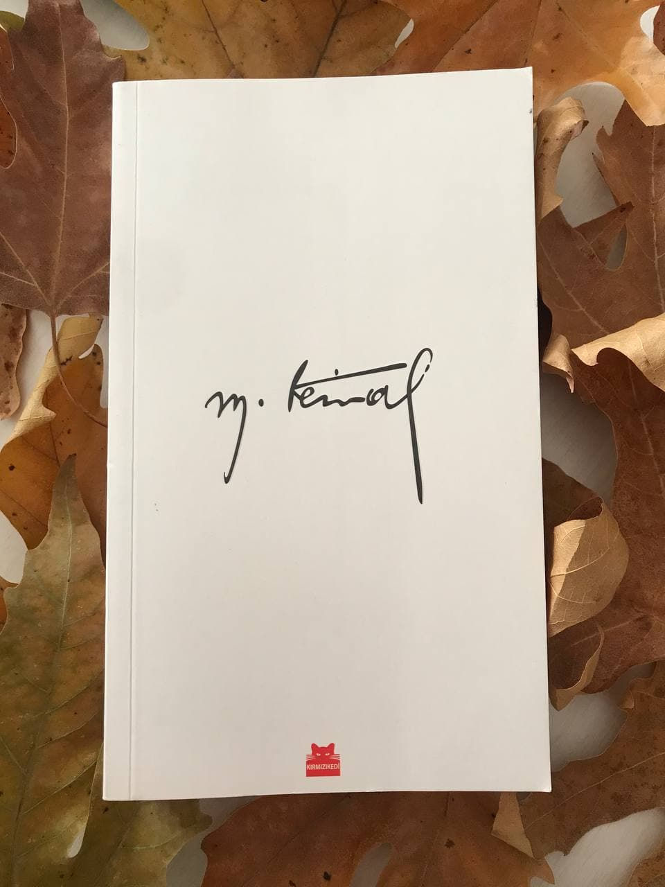
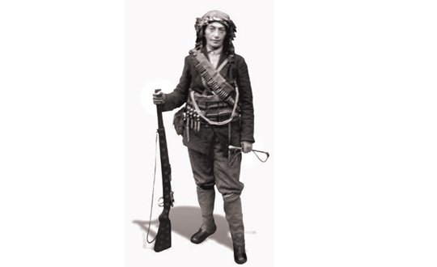

  
# Mustafa Kemal - Yılmaz Özdil
## 520 Sayfa
### 04.01.2021
  
 

  

    
     

 
 

> ***!!! "Şu anda burada yazılan özet ve alıntılar ; tamamını oluşturmuyor. Eklemeye devam edip, en kısa sürede hepsini tamamlayacağım." !!!***

____

> ***GENEL BİLGİLER***

- ***"Selanik, Büyük İskender'in kız kardeşinin adıydı." (sf.16)***

- ***`Vaveyla, İntibah, Osmanlı Tarihi, Şark Meselesi` gibi eserleri, özel kütüphanesinin başköşesindeydi. (sf.38)***

- ***"Anafartalar adı, savaşın kırılma noktasında yer alan iki köyümüzün ortak adıydı, küçük Anafarta köyü, büyük Anafarta köyü... Anafarta kelimesi, yerel ağızda 'rüzgâra karşı, çok rüzgâr alan yer' manasına geliyordu. Anafartalar Kahramanı'nın emperyalizm rüzgârına karşı durduğu yer, coğrafyanın sözlük anlamına da oturuyordu." (sf.60)***
- ***"Parfüm kullanmazdı. Sadece kolonya sürerdi. `Hasan Şevki Kolonyası'nı` tercih ederdi. Karaköyden alırdı... `Cumhuriyet'in ilk milli kolonya fabrikasıdır."` (sf.324)***
- ***Ömrü boyunca bir tek hatalı ekonomik karar almadı. Temelini attığı devlet şirketlernin yüzde 100'ü başarılı oldu. `Türkiye İş Bankası'nı 1924'te kurdu. Bir asır geçti, hâlâ Türk bankacılık sektörünün lideri.`***   ***Siyasi-askeri dehası üzerine binlerce kitap yazıldı. Ama aynı zamanda "Türkiye'nin gelmiş geçmiş en vizyoner, en isabetli girişimcisi" olduğu hiç yazılmadı.(sf.355)***
- ***Türkiye'nin ilk güzel sanatlar müzesini 1937'de Dolmabahçe Sarayı'nın Veliaht Dairesi'nde kurdurdu, bizzat açtı. (sf.412)***

____

- Hediye vermekten hoşlanırdı. (sf.310)
- Vefalıydı. (sf.313)
- Sevdiklerinin cenazesine katılmazdı, dayanamazdı. (sf.316)
- İnsanseverdi. | Kin gütmezdi. (sf.318)
- Yüreğindeki çocuğu hiç büyütmedi (sf.318)
- Gece kuşuydu. | Yorulmak nedir bilmezdi. (sf.320)
- Kimsenin önüne pijamayla çıkmazdı. Her gün çamaşır değiştirirdi. (sf.322)
- Titizdi. Kişisel bakımına büyük önem verirdi. (sf.323)
- Her fırsatta sıradan vatandaşlar gibi yürürdü. (sf.327)
- ***"Halk arasında huzursuzluk yaratır, korkutur" diyerek, güvenlik önlemlerine karşı çıkardı. Üniformalı asker-polis koruma istemezdi." (sf.327)***
- Aşçısı Mehmet Yücel'di. (sf.329)
- Sofrasını İbrahim Ergüven hazırlardı. (sf.331)
- Şoförü Sadık Kutlu'ydu. (332)
- ***Mustafa Kemal traktör kullanmayı çok severdi. Bazı günler Orman Çiftliği'nden Çankaya Köşkü'ne dönerken araziden, kendisinin kullandığı traktörle giderdi. (sf.333)***
- Nazım Canca yakın korumasıydı. | Diğer koruması Bekir Çavuş'tu. Emektardı. (sf.334)
- Kütüphanecisi Nuri Ulusu'ydu. (sf.335)
- Berberleri Mehmet ve Rıdvan'dı. | İkisi de Selanikli'ydi. (sf.336)
- Uşağı Cemal Granda'ydı. (sf.337)
- ***Ama en önemsediği gemi, Karadeniz Vapuru'ydu. Bizzat Mustafa Kemal'in projesiydi. Yüzen Fuar'dı. Dünyada ilk'ti. Mustafa Kemal zekâsının yansımasıydı. (sf.359)***
- Dünyanın gelmiş geçmiş en şık giyinen lideriydi. | Karizma'ydı. (sf.366)
- Bir insan hem kalpağı hem silindir şapkayı hem panama şapkayı hem hasır şapkayı hem klark şapkayı hem melon şapkayı hem fötrü hem kasketi, böylesine eşdeğer yakışıklılıkla taşıyabilir mi... | O taşıyordu. (sf.368)
- Baston diyip geçmeyin hobisiydi. | Köstekli saat takardı. (sf.372)
- Tespihi aksesuvar olarak taşırdı. | Son yıllarında Ray-Ban güneş gözlüğü kullanırdı. (sf.373)
- Mustafa Kemal öncüydü. | "Moda" kavramında dünya ordularına örnek olmuştu. (sf.375)
- Yemek seçmezdi. Aşçılara özel istekte bulunmazdı. Ne pişirilirse, onu yerdi. | Kuru fasulye severdi. "Tadına okulda alıştım" derdi, bıkmazdı. (sf.375)
- Sofrası "okul" gibiydi. (sf.378)
- Hep fit'ti. | Boyu 1.74'tü - Kilosu ise 74'tü. (sf.381)
- Çevreciydi. | Doğa aşığıydı. (sf.387)
- En sevdiği çiçek Kırmızı Karanfil'di. (sf.388)
- Hayvanseverdi. (sf.394)
- Atlara tutku derecesinde bağlıydı. (sf.397)
- Müzikseverdi. (sf.402)
- Şahane dans ederdi. (sf.410)
- Muhteşem zeybek oynardı. | "Milli dans" olmasını arzu ediyordu. (sf.412)
- Sinema perdesine bakıyor, küresel propaganda gücünü görüyordu. (sf.416)
- Masa kültürünün üç ayrılmaz parçası vardı. Kahve, sigara, rakı. (sf.429)
- Poker ustasıydı. (sf.440)
- Bilardocuydu. (sf.443)
- Ömrü boyunca sağlık sorunlarıyla boğuştu. (sf.460)

_____

- ***Henüz Lozan Antlaşması bile imzalanmadan önce... Henüz Cumhuriyet'i bile ilan etmeden önce... Şubat 1923'te İzmir İktisat Kongresini topladı... İktisatsız, cumhuriyet mumhuriyet olmayacağını biliyordu. Tüccar, sanayici, çiftçi, işçi, eğitimci 1135 delege katıldı. (sf.357)***
  
____

***"İşittim ki, vatanım Selanik ve orada anam, kardeşim, bütün akraba ve hısımlarım düşmana bağlanmıştır! İşittim ki, Hortacı Camisi'nin minaresine çan taktırılmış, orada yatan babamın kemikleri Yunan palikaryalarının kirli ayakları altında çiğnetilmiştir!" (sf.16)***

***1917 yılında durdurulamaz bir yangın çıktı. Kentin merkezini kül etti. Tarihi dokusunu silip süpürdü. 72 bin kişi evsiz kaldı. Trajik yangının küllerinden doğan Selanik. Trajik yangının küllerinden doğan İzmir. Mustafa Kemal'in hayatında dönüm noktası olan iki çok önemli şehrin ortak kaderi, adeta tarihin cilvesiydi. (sf.17)***

___

***Günün ilk ışıklarıyla, vedalaşmak üzere kapıya geldiler. Mustafa Kemal'in elinde Kur'an-ı Kerim vardı. Trablusgarp Savaşı'nda Libyalı mücahit şeyh Ahmet Sünusi tarafından kendisine hediye edilmişti. Sekiz yıldır nereye gitse, oraya götürüyordu. Sofya'da, Çanakkale'de, Şam'da, Halep'te, Filistin'de hep yanındaydı... Annesine bıraktı.***     ***Makbule ağlıyordu. Zübeyde otoriter ses tonuyla haşladı kızını... "Sen asker kardeşisin, ayıp, ağlanır mı hiç" dedi. Sanki dün gece üzüntüsünden bayılan o değilmiş gibi, heykel misali dimdik durmaya çalışıyordu. Kızını teselli ederken aslında kendi duygularını bastıyordu. `"Memleket için giden insan ölse bile ağlanmaz, koş misafirlere şerbet ez!"` diye bağırdı. (sf.20)***

____

***Mustafa Kemal'in mahalleden arkadaşı, komşusunun oğlu Salih Bozok'u çok severdi. Salih'in oğlunun sünnetine adeta "torunun mürüvvetti" gibi katılmıştı, Longines marka pahalı bir kol saati takmıştı. Mustafa Kemal, Trablus'a, Sofya'ya giderken annesini hep Salih'e emanet ederdi. Zübeyde, oğlundan çok Salih'le vakit geçirmişti, ailenin ikinci oğlu gibiydi.***

***Salih de böyle hissederdi. "Zübeyde ana benim de öz anam sayılır, kendi anamı mı yoksa Zübeyde anamı mı daha çok sevdiğimi hakikaten bilemem." diyordu. (sf.23)***

____

***Ana oğul arasında imrenilecek bir saygı bağı vardı. Hazırlanmadan birbirlerinin karşısına çıkmazlardı. Aynı köşkün içinde, birkaç metre mesafedeki odalarda yaşamalarına rağmen, Mustafa Kemal haber gönderir, ziyaret edeceğini söyler, Zübeyde adeta bayram gibi hazırlanır, günlük kıyafetleri yerine misafir kıyafetlerini giyer, saçlarını tarar, oğlunu öyle beklerdi.***

***İzin almadan annesinin odasına girmezdi. Her defasında elini öperdi. (sf.24)***

____

> ***Mustafa Kemal, Annesinin Ölüm Haberini Öğreniyor***

***14 Ocak 1923... Gün ağarmak üzereydi. Mustafa Kemal, emir eri Ali Çavuş'u çağırdı. "Haber var mı?" diye sordu. Ali Çavuş "maalesef var" diyemedi. "Şifre geldi ama çözülemedi" filan diye geveledi.*** 

***O derin mavi bakışlardan bir bulut geçti... "Bir rüya gördüm, yeşil tarlalarda anamla dolaşıyordum, birdenbire fırtına çıktı, anamı yanımdan alıp götürdü, anamın öldüğünü biliyorum" dedi.***

***Mütevazı bir tören yapılmasını istedi. Mütevazı bir kabir istedi. Hatta, İzmir Belediyesi 1934 yılında Fuar'ın inşası içi getirilen Fransız mimar Maurice Gauthier'ye mozole çizdirdiğinde bile, kesinlikle izin vermedi.***   ***`"Bunlar süslü, lüks ve masraflı, sakın yapmayın, bir kaya getirin, başucuna koyun, üstüne de 'Atatürk'ün annesi Zübeyde burada gömülüdür' yazdırın, çevresine çocuk parkı yaptırın, çocukları çok severdi"` dedi. (sf.25)***

____

***Annemin kaybından şüphesiz çok üzüntülüyüm. Fakat bu üzüntümü gideren ve beni avutan bir konu vardır ki, o da, anamız vatanı yok olmaya götüren iradenin artık bir daha geri gelmemek üzere yokluk mezarına götürülmüş olduğunu görmektir.***   ***Annem, bu toprağın altında, fakat, milli hakimiyet ilelebet payidar olsun. Beni teselli eden tek kuvvet budur. Milli hakimiyet, ilelebet devam edecektir.***   ***"Annemin mezarı önünde ve Allah'ın huzurunda yemin ediyorum. Bu kadar kan dökerek milletin kazandığı ve elde tuttuğu hakimiyetin korunması, savunması için, gerekirse annemin yanına gitmekte asla kararsız davranmayacağım.***  
***Milli hakimiyet uğrunda canımı vermek, benim için vicdan ve namus borcu olsun." (sf.27)***

____

> ***Geometri Kitabı***

***1936 yılında `Geometri` adıyla 44 sayfalık bir kitap yazdı. Arapça ve Farsça geometri terimlerine Türkçe karşılıklar üretti.***

***Boyut, uzay, yüzey, çap, yarıçap, kesit, yay, çember, teğet, açı, yatay, düşey, dikey, konum, üçgen, dörtgen, çokgen, köşegen, eşkenar, ikizkenar, yamuk, artı, eksi, çarpı, bölü, eşit, toplamm, oran, orantı, türev, alan, düzey, çizgi, paralel, hacim, kare, metrekare, koni, küp,  piramit, silindir, pi sayısı, teori, teorem, varsayı kelimelerinin tamamını Mustafa Kemal türetti. (sf.33)***

___

> ***1924 Samsun gezisindeydi... Kendisine eşlik eden gazeteciler "nereden ilham aldığını, kimlerden kuvvet aldığını" sordular.***

***Nakiyüddin Bey, askeri rüştiye birinci sınıfında öğretmenimdi. Bana henüz ilk bilgileri öğretirken, gelecek için ilk düşüncelerimi de vermişti. `"Baylar, açıklamak istiyorum ki... İlk esin kaynağı, ana baba kucağından sonra, okuldaki öğretmenin dilinden, vicdanından, eğitimden alınır."`***

***Nakiyüddin Yücekök, Selanik askeri lisesinde Fransızca öğretmeniydi. Mezuniyetten sonra da temasları hiç kopmamıştı. Öğrencisi Mustafa Kemal, Abdülhamit rejimine karşı Vatan ve Hürriyet Cemiyeti'ni gizlice örgütlerken, bizzat yardım etmişti.***

***Mustafa Kemal'in "kendisine minnet borcum var" dediği bir başka öğretmeni, Manastır'daki tarih öğretmeni Mehmet Tevfik Bilge'ydi. Türk Tarihini, Fransız Devrimi'ni bu öğretmeninden öğrendi. Tarih kültürünü bu öğretmeni sevdirdi. "Bana yeni ufuklar açtı" diyordu. (sf.35)***

***Mustafa Kemal'e ilham verenlerin başında Tevfik Fikret geliyordu. En kanlı vuruşmlarında siperlerinde bile Tevfik Fikret okurdu, notlar düşerdi.*** 

***"Fikri hür, vicdanı hür, irfanı hür nesiller" sözünün kaynağı, Tevfik Fikret'in dizeleriydi. Hatta öyle ki... "Ben devrim ruhunu ondan aldım, Tevfik Fikret'i tanıyanlar, benim ne yapmak istediğimi kavrayacak kimselerdir" diyordu. (sf.36)***

***Cumhurbaşkanı olduktan sonra bir gün gençlerle sohbet ediyordu. "Sorarım size, bu milletin ve memleketin şan ve şerefle medeni dünya milletleri arasında yaşayabilmesi için lazım gelen her şeyi yazan, düşünen ve hayatını feda edenlerin başında kim gelir?" diye sordu.***   ***Namık Kemal diyenler oldu, Ziya Gökalp diyenler oldu. Dayanamadı...***   ***"Fikret be çocuklar, Fikret be çocuklar" dedi.   "O bizden çok ilerisini gören bir insandı" diyordu.    "Ne yazık ki biz ona hâlâ yetişemedik" diyordu. (sf.37)***

___

***Halep Vapuru, normalde İstanbul Boğazı'nda çalışan, yandan çarklı şehir hatları vapuruydu. Savaş nedeniyle cepheye erzak götürüyor, dönüşte yaralıları taşıyordu. Mustafa Kemal'i getirdikten kısa süre sonra, Marmara Denizi'ne sızmayı başaran İngiliz E-11 denizaltısı tarafından vuruldu, 200 şehitle birlikte sulara gömüldü.***

***Halep Vapuru, Mustafa Kemal'i taşırken vurulup batsaydı, tarih başka türlü akacaktı... Kader çizgisi, henüz dünya sahnesine çıkmamış olan Türkiye Cumhuriyeti'ne bir kez daha kıl payı yardım etmişti. (sf.55)***

___

Anafartalar Kahramanı'na göre Çanakkale neydi derseniz? Yıllar sonra şöyle anlatacaktı...   
***"Size Bomba Sırtı olayını izah etmeden geçemeyeceğim.. Karşılıklı siperler arasındaki mesafe sekiz metreydi. Yani ölüm muhakkaktı. Birinci siperdekilerin hiçbirisi kurtulmamacasına düşüyor... İkinci siperdekiler onların yerini alıyordu. Ne kadar imrenilecek bir soğukkanlılık, tevekkül. Öleni görüyor, üç dakikaya öleceğini biliyor ve en ufak bir çekinme bile göstermiyor. Sarsılmak yok.***   ***Okuma bilen Kur'an-ı Kerim okuyor, bilmeyen Kelime-i Şahadet getirerek yürüyor.***   ***Emin olmalısınız ki, Çanakkale işte bu yüksek  ruhtur." (sf.64)***

___

***Mustafa Kemal; para, makam, şöhret değil, insan biriktiriyordu. Topkapılı Cambaz Mehmet bunlardan biriydi. Selanik'ten Sofya'ya, Trablus'tan Çanakkale'ye insan biriktirdi. Kurtuluş Savaşı'nı başaran kadroya isim isim bakın lütfen... Neredeyse hepsi, Mustafa Kemal'in ömrü boyunca biriktirdiği ve temasını kesmediği yetenekli insanlardı. (sf.65)***

___

> ***Günümüzdeki "Mehmetçik" isminin nereden geldiği***

***Bilgalı Mehmet Çavuş, Seddülbahir'de vuruşuyordu. Mermisi bitince tüfeğini kırarak İngilizlere fırlatmıştı. Tüfek parçası kalmayınca taş fırlatarak mücadele etmişti. İstihkâm küreğiyle saldırmıştı. Başından ciddi şekilde yaralanmıştı, avuçları paramparçaydı ama, İngilizleri püskürtmeyi başarmıştı.***   ***Mustafa Kemal bu kahramanlığı duydu...***   ***Bu olay, İstanbul gazeteleri tarafından haberleştirildi. Bigalı Mehmet, Çanakkale'nin sembolü haline geldi.***

***Mustafa Kemal tarafından madalya sahibi yapılan, memlekete tanıtılan Bilgalı Mehmet Çavuş, "Mehmetçik" kavramının isim babası oldu. Bilgalı Mehmet'in verdiği ilhamla, bu olaydan sonra Türk askerine "Mehmetçik" denilmeye başlandı. (sf.66)***

____

> ***Mustafa Kemal***

***Diyarbakır'a atandı. Paşa oldu. 35 Yaşındaydı.***

***Van Gölü'nden başladı, Sason, Mutki, Silvan, Garza, Malabadi, Kulp, Dargeçit, Midyat, Palu, Hizan, Mardin, Siirt, Bingöl, Elazığ, bölgede basmadık yer bırakmadı.*** 

***Bitlis'i, Muş'u düşman işgalinden kurtardı. (sf.68)***

____

> ***Mustafa Kemal***

***Karlsbad'dayken Osmanlıca ve Fransızca günlük tuttu. Beş defter dolusu, toplam 158 sayfaydı. Sadece Tedavi sürecini değil, tanıştığı insanları, yaşam biçimlerini, orada karşılaştığı Türk ailelerle  sohbetlerini de anlatıyordu.***

***Kadın-erkek eşitliği üzerine görüşlerini ilk kez Karlsbad günlüğünde kaleme aldı... "Kadın konusunda cesur olalım, vesveseyi bırakalım, açılsınlar, onların dimağları gerçek bilgi ve sanat ile bezensin, iffeti, bilimi sağlıklı biçimde izah edelim, şeref ve haysiyet sahibi olmalarına birinci derece ehemmiyet verelim" diyordu. (sf.80)***

____

***Osmanlı Devletinin temelleri çökmüştü. Ömrü tamamlanmıştı.***   ***Ortada bir avuç Türk'ün barındığı ata yurdu kalmıştı. Bu durumda ciddi ve gerçek karar ne olabilirdi? Milli hakimiyete dayanan, kayıtsız şartsız, bağımsız Türk Devleti kurmak... Kararım buydu.***   ***Ya İstiklal ya ölüm'dü!" (sf.84)***

***Samsun'a çıktıktan 10 gün sonra, 29 Mayıs 1919... İstanbul'un fethi, İstanbul'u fethettiğimizden beri, 1453'ten beri ilk kez kutlanmadı. İşgal kuvvetleri komutanlığı tarafından yasaklanmıştı. (sf.85)***

***2.Mehmet fethetmiş. 6.Mehmet kaybetmişti. Çıplak gerçek buydu. İstanbul umutsuzca kurtarıcısını bekliyordu. (sf.86)*** 

___

***Kafalarında geleceğe dair milyon tane endişeyle sessiz sessiz giderlerken, mırıldanmaya başladı...***  
`Dağ başını duman almış`   `Gümüş dere durmaz akar`   `Güneş ufuktan şimdi doğar`   `Yürüyelim arkadaşlar!`   ***"Siz de söyleyin" diye seslendi çoşkuyla... "Yorgunluğunuzu alır, güç verir" dedi. Hep birlikte söylediler.***  
`Bu gök, deniz nerede var`   `Nerede bu dağlar taşlar`   `Bu ağaçlar güzel kuşlar`   `Yürüyelim arkadaşlar!`

***İlk kez 1916 yılında erkek öğretmen okulunun beden eğitimi gösterileri sırasında söylendi. Özellikle gençler tarafından öylesine sevildi, öylesine yüreklendirici bulundu ki, kulaktan kulağa tüm yurda yayıldı. Ezbere bilenler arasında, bu milletin kaderini ve tarihin akışını değiştirecek biri vardı. `Mustafa Kemal...`***

***İnce ince yağan yağmur altında Karageçmiş Köyü'ne yürüken, gülümseyerek mırıldanıyordu.***  
`Her geceyi güneş boğar`   `Ülkemizin günü doğar`   `Yol uzun da olsa ne var`   `Yürüyelim arkadaşlar!`

***19 yıl sonra, 1938...***   ***19 Mayıs'ın milli bayram ilan edildiği gün ağır hastaydı. O haliyle bile yine gülümseyerek hatırlayacaktı.***   ***"Anadolu'nun dağbaşlarını tekerleklerine çuval doldurduğumuz kırık dökük otomobillerle aşarken, yanımdaki arkadaşlarıma bu marşı söylemeyi âdet edinmiştim" diyecekti. (sf.88)***

____

***Askerlik hayatı boyunca biriktirebildiği 800 lirası vardı. Sadece 800 lira.***   ***Samsun, Havza, Amasya, Erzurum, sıfırı tüketmişti. İstese elini cebine atmaz, hiç para harcamazdı. Aksine, parasını ödemeden hiçbir şey istemiyordu. Gecelemek için bir yurtseverin evinde misafir edildiklerinde bile, evden ayrılırken hizmet edenlere mutlaka harçlık veriyordu.***   ***Bütün ömründen geriye bir ceket kalakalmıştı.***

***Zübeyde'ye mektup yazdı.***  
***"Saygıdeğer anneciğim, merak içinde kaldığınızı tahmin ediyorum, bu mektubu size getirecek olan kişi, benim hakkımda istediğiniz kadar bilgi verecektir, kendisiyle bana elbiselerimi gönderiniz."*** 

***Ana bu, boş gönderir mi...***   ***Elbiselerle birlikte iki torba kuru incir gelecekti. Adam başı anca bir iki tek düşse de, hayatlarına renk katmıştı, yuva sıcaklığı vermişti.(sf.91)***

____

>***Mustafa Kemal ve Sivas***

***Sivas'a gitmek üzere yola çıktı. Gene hurda bir otomobil bulabilmişlerdi. Tavanı örten körükleri yırtıktı. Yağmur yağarsa, fenaydı... Yağmasın diye dua ettiler.***

***Bir pınar başında mola verdiler. Acıkmışlardı.***   Mazhar Müfit o anı yıllar sonra bile iştahla anlatacaktı:   ***"Kut'u layemut (ölmeyecek kadar yiyerek) yaşıyorduk. Nevalemiz peynir, zeytin, kuru ekmekten ibaret azıktı. Subaşında rastladığımız köylüler torbalarından çıkarıp kuru soğan ikram ettiler, öyle lezzetliydi ki..."***

Sivas'tayken az daha suikaste uğrayacaktı. Malatya'dan yazılan şifreli telgrafla fark ettiler...   Ağır bavul, kenarından bıçakla kesildi. 18 adet el bombası çıktı. Sorguda itiraf ettiler. Kongre binasında patlatacaklardı.

***Her şey Sivas'ta bitebilirdi. Kongre sağ salim tamamlandı.***

 ***Sivas'a gelir gelmez maiyetinde görev yapan Hacı Derviş'i çarşıya göndermiş, büyükçe bir defter aldırmıştı. Kongre vesilesiyle yapılan masrafları, harcanan paraları kuruşu kuruşuna yazdırıyordu.***   Bir gün Hacı Derviş dayanamadı...   ***"Paşam bu hengamede kim hesap soracak" dedi.***   Mustafa Kemal'in cevabı ibretlikti.   ***`"Gün gelir, millet benden de başkasından da tek tek hesap sorar, biz bugün hesabımızı eksiksiz yazalım, millet de yarın parasının nereye harcandığını bilsin"` dedi. (sf.95)***
____

> ***Kara Fatma***

    
     

***Tam Ankara'ya gitmek üzere yola çıkacaktı...***   ***Karşısına bir kadın dikildi.***

***Esmerdi. Kara kaşlı kara gözlüydü. Simsiyah elbise giymişti. Simsiyah pantolon giymişti. Çizmeleri simsiyahtı. Kemerinde simsiyah kama vardı. Kamçısı simsiyahtı. Atı bile simsiyahtı. 34 yaşındaydı. Erzurumlu'ydu. Binbaşı eşini Sarıkamış'ta kaybetmişti.***

***Erzurum Kongresi'nde denk getirememiş, üç gün at sürerek Sivas Kongresi'ne gelmiş, yolunu gözleyip Mustafa Kemal'in karşısına dikilmişti. "At binerim, silah atarım, bana iş ver" demişti.***   ***Fatma Seher'di.***   ***Tarihi sıfatını Mustafa Kemal taktı. "Keşke bütün kadınlar senin gibi olsa Kara Fatma" dedi!***

***Elinin hamuruyla erkek işine karışmasın filan gibi cinsiyetçi yaklaşımlar, Mustafa Kemal'in ciddiye bile almadığı kavramlardı. Kadının insandan bile sayılmadığı dönemlerdi ama, Mustafa Kemal için kadın veya erkek ayrımı yoktu. Yürek var mı, ona bakıyordu.***

***Kendi elyazısıyla görev pusulası yazdı, imzaladı. "İstanbul'a git, Üsküdarlı Kuvvacı albay Neşet Beyi bul, bu pusulayı ona ver" dedi.***   ***Gitti, buldu... Pusulayı okuyan Neşet Beyin yönlendirmesiyle İzmit bölgesinde görevlendirildi.***   ***Aralarında kendi kızının olduğu 15 kadınlı milis müfrezesi kurdu. İki ay geçti, emrindekilerin sayısı 700'e yaklaşmıştı. 43 kadın, 600 küsur erkeğin komutanıydı.***   ***Sadece kara gözlü değildi.***   ***Gözükara'ydı.***

İnönü'de Sakarya'da çarpıştı.   Yanındaki kadınların 28'i şehit düştü.   Kızı elinden vuruldu, iki parmağı koptu.   Kendisi sağ kolundan yaralandı.   Bir ara cephane sandıklarını naklederken yakalandı, esir düştü, 19 gün işkence gördü, kaçmayı başardı.   Büyük Taaruz'a katıldı.   9 Eylül'de İzmir'e giren süvarilerin arasındaydı. 

Milis çavuşu rütbesiyle başladı.   Üsteğmen olarak emekliye ayrıldı.   İstiklal madalyası aldı.

Maaş bağlanmasını kabul etmedi.   Emekli maaşını Kızılay'a bağışladı.   Herhangi bir kişisel menfaat peşinde koşmadı, köşesine çekildi, izi kayboldu. Yıllar içinde dara düştüğü, kimseye haber vermediği, evsizlere yardım eden Galata'daki Rus manastırına sığındığı ortaya çıktı. Yalvar yakar zorla ikna edildi, Darülaceze'ye alındı.

> ***(Bu kahraman kadın Amerikalı veya İngiliz olsaydı, eminim Hollywood'da yüz tane filmi çekilirdi, bütün dünya tanırdı. Türkiye'de bu yönde çaba harcayan kişi veya kurum olmadığı için, maalesef, uğruna hayatını ortaya koyduğu kendi milleti bile tanımadı...) (sf.97)***

***1955 yılında vefat etti.***   ***Bir küçük mendil bohçasından başka eşyası yoktu.***   ***Açtılar...***   ***İstiklal Madalyası ve Mustafa Kemal'in hediye ettiği gümüş sigara tabakası çıktı. Sadece onları saklamıştı. (sf.98)***

___

> ***1921 yılında, işte bu direksiyon binasında Amerikalı gazeteci Clarence Streit'le görüştü.***

Mustafa Kemal'le röportaj yaptı. Gazetesinde haberleştirdi. Ayrıca, gözlemlerini detaylı rapor haline getirdi. İstihbarat raporundan çok "hayranlık" ifadeleriydi. 

____

***Başkomutanlık kanunu onaylandı. 177 evet'le kabul edildi. 11 hayır vardı. 13 mebus çekimser kalmıştı.***  
***Belki de ömründe ilk kez bu kadar üzgün görünüyordu.***   
***Haksız eleştirilere alışkındı, asılsız suçlamaları bile yadırgamazdı ama, komutanlığına "ret" oyu verilmesine çok kırılmıştı, "çekimser" kalınmasını kabullenemiyordu.***  
***`"İnsan çiğ süt emmiş derler, bu atasözünün değerini, ne anlama geldiğini maalesef bugün mecliste anladım"` dedi. (sf.137)***

____

 

### Kitaptan Alıntılar ;
- ***"Beni görmek demek mutlaka yüzümü görmek değildir. Benim fikirlerimi, benim duygularımı anlıyorsanız ve hissediyorsanız, bu kâfidir." (sf.1)***
- ***"Elinin hamuruyla erkek işine karışmasın filan gibi cinsiyetçi yaklaşımlar, Mustafa Kemal'in ciddiye bile almadığı kavramlardı. Kadının insandan bile sayılmadığı dönemlerdi ama, Mustafa Kemal için kadın veya erkek ayrımı yoktu. Yürek var mı, ona bakıyordu." (sf.96)***
- ***"Kin, gerçekleri gören gözleri bile kör eder." (sf.121)***
- ***"Bundan böyle, hattı müdafaa yoktu, sathı müdafaa vardı. O satıh, bütün vatandı." (sf.137)***
- ***"Bu sandıklar çok mühimdir, savaşta onlarla cephane taşımıştık, şimdi o savaş bitti, kültür sanat savaşımız başladı, bu yeni savaşımızın cephanesi kitaplardır" dedi. (sf.291)***
- ***"Kitap okumak hususi bir sanattır" diyordu.  
Ölüm döşeğindeyken bile okudu.  
15 Ekim 1938... Komaya girip hayata gözlerini yummadan önce, en son, Türk Tarih Kurumu'nun "Belleten" dergisini inceledi. (sf.292)***
- ***Gördüklerini bazen görmezden gelirdi.***   ***"Ben affederim, çünkü kalbim vardır" derdi.***   ***"Medeniyet demek, af demektir" derdi. (sf.318)***
- ***"Hayat musikidir" diyordu. "Musiki ile alakası olmayan mahlukat, insan değildir" diyordu. (sf.403)***
- ***"Sessiz kalamıyorum, sessizliğe tahammül edemiyorum, o yüzden bu gramofon makinesi işte böyle yirmi dört saat kapımda çalıyor" dedi. (sf.410)***
- ***"Bir millet ki resim yapmaz, heykel yapmaz, itiraf etmeli ki, o milletin ilerleme yolunda yeri yoktur." (sf.422)***
- ***Saklısı gizlisi yoktu.***   ***"Kötü ruhlu kişiler dedikodumu yapmaya kalkıp, Mustafa Kemal dün akşam içmiş, dans etmiş derlerse, evet içti, evet dans etti cevabını verin. Her şeyi, günahı da sevabı da açık yapmak gerekir. Ne yapacaksak daima milletin gözü önünde yapacağız" diyordu. (sf.426)***
  
