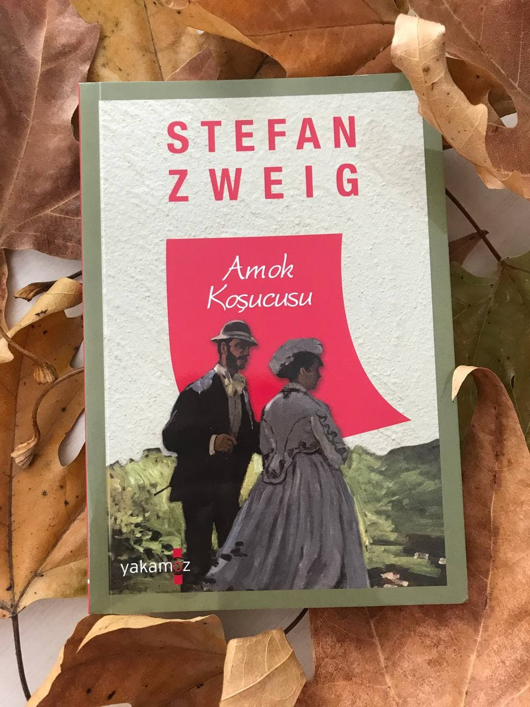

  
# Amok Koşucusu - Stefan Zweig
## 96 Sayfa
### 05.01.2021
  
 

  

    
     

 
 

***1912 yılının Mart ayında Napoli limanında,  büyük bir transatlantiğin yük boşaltması sırasında ilginç bir olay yaşandı, gazeteler bu olay hakkında ayrıntılı ancak olabildiğine şişirilmiş ve abartılmış haberler yayımladılar. Ben de Oceania'nın bir yolcusuydum, ancak ne ben ne de öteki yolcular o tuhaf olayın tanığı olduk çünkü olay geceleyin, transatlantiğe kömür yüklenip yük boşaltırken meydana gelmişti... Yine de benim kişisel görüşüm, o sıralarda açıkça dile getirmemiş olduğum bazı tahminlerimin o heyecan verici sahnenin gerçek açıklaması olduğudur; aradan bunca yıl geçtiğine göre artık o tuhaf olaydan hemen önce yapılmış olan bir konuşmayı açıklamamda bir sakınca yoktur diye düşünüyorum. (sf.5-6)***

Kahramanımız bir gece vakti kimse ortalıkta yokken geminin güvertesine çıktı. Ve sessizce bir kenara oturdu, birazda dalgın olduğu için tek başına olduğunu sanıyordu ama ansızın bir öksürük sesi duydu ve kafayı kaldırıp baktığında bir karanlıkta bir adamın oturduğunu ve kırmızı renk puronun ucunu görebildi.. Kahramanımız haliyle tedirgin oldu ve aralarında küçük bir selamlaşma ve iyi geceler dileklerinin ardından ayrıldılar.

Kahramanımız büyük bir heyecan ve merak içerisinde yine ertesi günün gecesini sabırsızlıkla bekledi. Ertesi gün yine gece vakti o adamı orada görebilmek umuduyla güverteye çıktı. O adam yine oradaydı. Bir süre sonra sohbet etmeye başladılar. Bu yabancı adam başından geçen bir olayı anlatmak istedi ve başladı anlatmaya;

____

Bu yabancı adam, doktorluk yapıyormuş. Bir gün muaneyesindeyken, bir genç kadın çıkmış gelmiş. İlk başta yüzü peçeyle örtülü olan bu kadın, normal sohbet havasıyla konuşmaya başlamış fakat sonrasında ise doktordan karnındaki çocuğu almasını ve bunun karşılığında 12 bin frank teklif etmiş. Tabi tüm bunların ardından bir daha bu doktorla karşılaşmayacağını ve doktorun buradan gideceğini söylemiş...

Böyle olunca bizim doktor ise farklı amaçlar içerisinde bu kadının bu teklifini reddetmiş. Bunun üzerine bu kadın ise hemen orayı terk etmiş ve oradan ayrılmış... Bir süre doktorumuz heykel gibi orada dikelip kalmış ve kendine gelememiş.. Ardından hemen bisikletine atlamış ve bu kadının peşinden gitmiş. Bir süre sonra bu kadının yanındaki genç hizmetçisi adam tarafından durdulmuş. Doktorumuz bu genç adamla yumruk yumruğa kavga etmiş. Bisikleti kullanılmaz hale gelince ise kadının arkasından var gücüyle koşmaya başlamış.. Uzun uzun bağıra bağıra koştuktan sonra ise bu kadının arabaya binip oradan uzaklaştığını görmüş.. Zaten oradaki herkes birbirini tandığı için hemen oradakilerden bu kadının kim olduğunu öğrenmiş. Bu kadının kocası zengin biriymiş ve 5 ay gibi bir süredir iş için dışarıdaymış.

Tüm bunların üzerine doktorumuz hemen eve gelip bir kaç eşya aldıktan sonra bir tren ile o kadının yaşadığı şehre gitmiş. Hemen kadının evini buldu ama kadınla konuşamadı. Hemen şehrin başkanına gitti, kendisinin doktorluğunun oraya alınmasını istedi ama en az 2 hafta içinde halledebilecekleri cevabını aldı..  Fakat bizim doktorun hiç zamanı yoktu 4-5 gün içerisinde kadının kocasının gemisi dönecekti ve kadına yardım etmek için çok az bir zamanı vardı.. Akşam şehirde bir balo olduğunu söyleyen başkan, doktoru baloya davet etti.

Akşam baloya katıldı, bir şekilde kadınla iletişim kurmaya çalıştı ama pek net bir şey elde edemedi.. Ertesi gün kadına hemen bir mektup yazdı ve içinden gelen tüm şeyleri anlattı, kadına özürler diledi, ona yardım etmek için her şeyi yapacağını, eğer istemiyorsa da buradan gideceğini söyledi... Ertesi gün kadından mektup geldi, artık çok geç ama yine gerekirse yardım isterim, şeklinde bir cevap verdi...

Doktor, evinde bir oraya bir buraya dolaşırken kapı çaldı... Geçen gün kavga ettikleri o genç adam yine kapısındaydı. Hemen acele etmesini ve onunla gelmesini söyleyince, doktor bir an bile düşünmeden o genç adamın peşine takıldı... Geldiklerinde ise, kadının çok büyük kan kaybettiğini gördü.. O kadar kötü bir durumdaydı ki, kadına yardım edebileceği hiçbir şey yoktu etrafında... Ne yazık ki kadın da fazla dayanamadı ve öldü.. Ölmeden önce ise doktordan söz istedi... "Tüm bu olanları kimsenin duymaması gerektiğini ve sır olarak saklaması gerektiğini"... Doktor bu sırrı saklayacağına söz verdi..

Oranın yerel, sorumlu olan doktoruna sahte bir evrak imzalattırdılar. Kadının ölümü kalp krizi olarak geçti... Bir kaç gün sonra kadının kocası geldiğinde bizim doktor hiçbir  şekilde bu adam ile görüşmedi...

_____

Tüm bunların ardından şuan içinde bulundukları gemide doktor, kadının kocası vardı. Kadının kocası ise yanında tabutla İngiltere'ye otopsi yaptırmaya gidiyordu.. Tüm bunları anlattıktan bir süre sonra gemide o ilginç kaza meydana geldi... Kadının tabutu suyun dibine boyladı ve çıkarılması mümkün değildi. Doktorumuz  o verdiği sözü tutmak için elinden gelen her şeyi yaptı...

____

> ***"Amok koşucusu' mu? Evet sanırım duymuştum... Malezyalılara özgü bir nevi sarhoşluk..."***

***Sarhoşluktan öte bu... Çılgınlık, insanın öfkeden gözünün dönmesi... İnsanın korkunç, delice bir saplantıya kapılması, öyle ki hiçbir biçimde alkol zehirlenmesiyle kıyaslanamaz... Doğu'da kaldığım süre zarfında birçok değişik vakayı inceledim. Başka insanlar hakkında bilgece ve nesnel bir tutum takınmamız daha kolaydır tabii ki. Fakat hiçbir zaman bunun kökenine ilişkin o korkunç sırra vakıf olamadım. İklimle bir ilişkisi olabilir, rutubetli ve boğucu atmosfer sinir sisteminin üzerinde ta ki bir noktada aniden bir patlak verinceye kadar baskı yaratıyor olmalı... İşte Amok... Evet Amok, şöyle oluyor:***

***Bir Malezyalı, herhangi bir  sıradan, kendi halinde adam içkisini içiyor... Ruhsuz, ilgisiz, donuk bir biçimde oturuyor oracıkta... Tıpkı benim odamda oturduğum gibi.. Sonra ansızın ayağa fırlıyor... Dosdoğru koşuyor, dosdoğru... Nereye gittiğini bilmeden... Yoluna ne çıkarsa, insan olsun hayvan olsun, hançeri saplıyor, akan kan onu daha da çıldırtıyor... Ağzı köpürüyor, kudurmuş gibi uluyor... Ama koşuyor, koşuyor, koşuyor ne sağa bakıyor ne sola, acı acı haykırarak, elinde kanlı hançeriyle, korkunç koşusunu sürdürüyor... Köylerdeki insanlar, hiçbir şeyin bir Amok koşucusunu durduramayacağını biliyor... Bu yüzden o gelince bağırarak haber veriyorlar: `" Amok! Amok! "` ve her şey sağa sola kaçışıyor... Ama o duymadan koşuyor, görmeden koşuyor, karşısına çıkan her şeyi yere seriyor... Ta ki kuduz bir köpek gibi vurularak öldürülene ya da ağzında köpüklerle yere yığılana dek... (sf.50-51)***

____

***"Bir insanı ölmek üzereyken izlemek nasıl bir şeydir, bilir misiniz? Bir ölüm döşeğinde bulundunuz mu, hiçbir bedenin acıyla iki büklüm olduğunu, morarmış tırnakların boşluğu kavrayışını gördünüz mü, can çekişen gırtlaktan çıkan hırıltıları, her bir organın kendini savunuşunu, her bir parmağın dehşete direnişini ve gözlerin kelimelerle anlatılamayacak denli korkuyla açılışını? Böyle bir şey yaşadınız mı, avare bir turist olarak, siz, yardım etmekten, bir vazife olarak söz eden siz?" (sf.73)***
____

 

### Kitaptan Alıntılar ;
- ***"...öyle zor oluyor ki şimdi, her şeyi içine atmak insanı boğuyor neredeyse..." (sf.17)***
- ***"Bu kahrolası yalnızlıkta, insanın ruhunu kemiren, iliğini kemiğini kurutan bu lanet olası ülkede, utanmayı unuttum ben." (sf.22)***
- ***"İçimdeki kötü histen dolayı heyecanlı, gergin ve endişeliydim, çünkü bu dünyada sırf özlediği için beni görmeye gelecek kimse yoktu." (sf.28)***
- ***"Güvenmenin koşulu dürüstlüktür, mutlak bir dürüstlük." (sf.35)***
- ***"Ama o zaman bu insanın böyle bir yardıma ihtiyacı olduğunu hissediyordunuz, birisini ölümden ya da çaresizlikten kurtardığınızı biliyordunuz. Yardım etmek için de bu duyguya ihtiyacınız vardı, karşınızdakinin size ihtiyacı olduğu duygusuna." (sf.40-41)***
- ***"Hani biri, bir başkasını bir caniye karşı uyarmak için arkasından koşar da öndeki onu katil sanıp kendi ölümüne koşar ya..." (sf.54)***
- ***"İnsan her şeyini kaybederse, elindeki son şeyi kaybetmemek için umarsızca mücadele eder." (sf.79)***