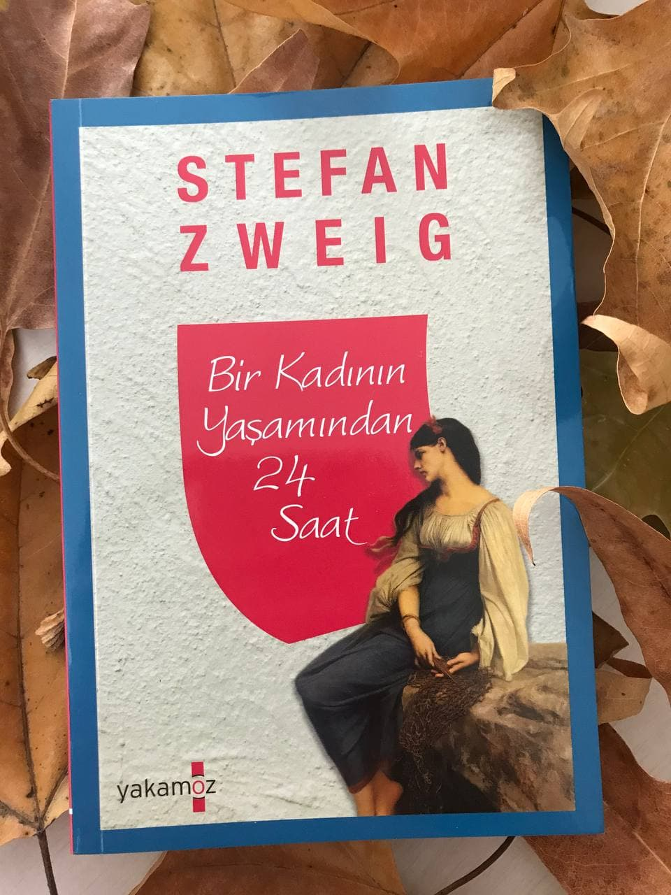

  
# Bir Kadının Yaşamından 24 Saat - Stefan Zweig
## 80 Sayfa
### 06.01.2021
  
 

  

    
     

 
 

***Karakterler ;***
- ***Madam Henriette :*** Kocasını bırakıp giden kadın.
- ***Bayan C :*** Bize 24 yıl önceki hikayesini, 24 saatini, anlatcak olan kadın.

 

Bir gün kaldıkları otelde Madam Henriette isminde bir kadın ortalıktan kayboldu. Bir süre bağırış ve çağırışlar arasında o kadını aradıktan sonra kadının kocasını terk ettikleri sonucuna ulaştılar...

Bunun üzerine kahramanımız ise, bu kocasını terk eden kadını diğer insanlara karşı savunmaya başladı. Bir süre sonra kahramanımız kalabalık ile hararetli bir tartışma içerisine girdi.. Neyse ki sonradan Bayan C araya girdi ve birazcık olsun ortalığı yatıştırdı. 

İlerleyen bir kaç gün içerisinde Bayan C kahramanımıza daha fazla yaklaşmaya ve kahramanımızla konuşmaya başladı.. Bir gün birlikte sohbet ederlerken, Bayan C, kahramanımıza başından geçen 24 saati tüm samimiyeti ile ve olduğu gibi anlatacağını söyledi.. Ve başladı anlatmaya..

____

Bayan C, kocasıyla mutlu bir hayat sürüyormuş. 23 yıl birliktelikten sonra kocası vefat etmiş. Zaten sonrasında ise Bayan C için hayatının da çokta bir önemi kalmamış.. Oradan oraya savruluyor ve seyehat ediyormuş..

Bir gün kumarhaneye gitmiş. Kocasının da çok sevdiği şekliyle insanların ellerini incelemeyi çok seviyormuş... Yani oradaki insanların ellerini inceleyip, onların nasıl bir duygu ve düşünce içerisinde olduğunu gayet net bir şekilde anlayabiliyormuş.. O gün hiç görmediği bir şekilde bir adamın ellerine odaklandı, gerçekten de daha önce böyle bir şey görmemişti...

Bir süre bu adamı izlemeye devam etti. Adam ise tüm parasını kaybetti ve masadan hiçbir şey umursamadan ayrıldı. Bunu gören Bayan C, adamın hayatından bir beklentisi kalmadığını ve kendini öldürmek isteyeceğini anlamıştı.. Böyle olunca bu adama engel olmak için, adamın peşine takıldı. Her ne kadar müdahale edip etmemek konusunda çekimser olsa da, bir süre sonra şiddetli bir yağmur başladı. Adam ise bankta umursamaz bir şekilde yağmurun altında oturuyordu. Muhtemelen sabaha kalmadan hayatına son verecekti.

Bayan C dayanamadı ve adamın yanına gitti. Onu kolundan tutup çekti ve bir dükkanın altına getirebildi, fakat hava bir o kadar da soğuktu.. Adam ilk başta onu, parasını yemek isteyen kadınlardan biri olduğunu düşündü fakat sonrasında Bayan C, gece boyunca adamı izlediğini, hiç parası kalmadığını ve yaşamına son vermek istediğini, düşündüğünü söyledi.

Bayan C, adamın gidecek bir yeri olmadığı için onu otele götürdü. Normalde adamı orada bırakıp gidecekti ama her ne olduysa kendini bir anda adamla  aynı odada buldu... Gece olanları anlatmayı tercih etmedi Bayan C, ama sonuç olarak adamla birlikte olmuşlardı..

Sabah aynı yatakta uyandılar. İlk başta kendinden nefret etti bayan C, böyle bir şeyi nasıl yapabildiğini sorguladı. Bu sefer Bayan C, kendini öldürmek istedi... Tam odadan ayrılacağı vakit uyuyan adamın yüzüne baktı, fakat adamın yüzündeki huzuru görünce bir nebze olsun rahatladı. Dün gece kendini öldürecek olan bu adamı, hayata bağlamıştı. Bir süre sonra adam da uyandı. O kadar efendi ve neşe doluydu ki...

Aynı gün içerisinde birlikte şehri dolaştılar, çok güzel zaman geçirdiler. Bu arada adam soylu bir aileden geliyormuş. Bir süre önce yeterince parası varmış ve varlıklıymış ama kumar bağımlısı olunca işler değişmiş. Elindeki her şeyi satmak zorunda kalmış. Tanrının evine gidip, Bayan C'nin eşliğinde adam yemin etti ve bir daha kumar oynamayacağı için sözler verdi.

Aynı günün akşamı için son defa istasyonda buluşacaklardı. Bayan C, adam için tren bileti alıp ona vermişti.. Bayan C, oteline döndükten sonra buluşma saati yaklaşınca heyecandan ne yapacağını bilemedi ve tüm eşyalarını topladı. Valizleri ile birlikte istasyona gitti. Adamla birlikte gitme fikri içine işlemişti. Ama ne yazıkki istasyona geç kaldı. Tren gözlerinin önünde hareket etti ve yetişemedi.

Bayan C, gerçekten mahvoldu. Onunla gitmeyi o kadar istemişti ki... Onunla yaşadığı anıları tekrarlamak için kumarhaneye gitti. Ama bir de ne görsün adam oradaydı.. Bayan C'nin kendisine verdiği paralar ile kumar oynuyordu. Bayan C'nin tüm güveni boşa gitmişti. Bayan C, adama yeminlerini hatırlattı ama hepsi boşunaydı. En sonunda adam, Bayan C'nin suratına paralarını attı ve onu rahat bırakmasını söyledi... Bayan C, kendini fahişeymiş gibi hissetmesini sebep olan bu adamdan nefret etti... Bayan C, hemen şehri terk etti...

Yıllar sonra, bu adamın kuzeni ile denk gelen Bayan C, bu adamı sorduğunda. O yaşananlardan bir süre sonra adamın kendini vurup öldürdüğünü öğrendi...

____

Tüm hikayenin ardından Bayan C, kahramanımıza onu dinlediği için teşekkür etti. Anlattığı için kendisi de büyük bir yükten kurtulmuştu. Çünkü yıllar boyunca bu şekilde düşünen birine rastlamamıştı.

> ***- SON -***

_____

***Kumar oynarken insanı ele veren tek şey elleridir, çünkü bir süre sonra yüz ifadesini kontrol etmeyi öğrenebilir. Eller, kumar masasında ayna gibidir. Yüzlerine maskelerini takıp soğukkanlı davranmaya çalışırlar, tebessümün tek kırıntısı görülmez, gözlerinde endişe yoktur, yapmacık kibarlıklarının ardına saklanırlar. Tüm dikkatleri yüzlerindeki ifadelere odaklandığı için, ellerini ve sakladıkları bakışları anlayan insanlar olabileceğini unuturlar, eller tüm sırrı bozar. (sf.26)***

___

 

### Kitaptan Alıntılar ;
- ***"Çoğu insanın düşünme ve hayal etme yetisi körelmiştir. Çuvaldızı kendine batırmayan, kendinin farkında olmayan insanları hiçbir şey harekete geçiremez." (sf.5)***
- ***"İnsan bir defa aptalca davransa ne oalcak diye kendimi rahatlatmaya çalışıyordum. Ama vicdan denen o duygu peşimi hiç bırakmadı." (sf.23)***
- ***"Kocamın ölümünden sonra hayat benim için manasını kaybetmeye başlamıştı. Yirmi üç yıl boyunca her dakikamı paylaştığım sevgili eşim gitmişti." (sf.24)***
- ***"Aşk duygumu eşimle birlikte gömmüştüm." (sf.35)***
- ***"Bana yüz frankla bin frankla da yardım edilemez, son kuruşumla yine kumarhaneye gider, kaybedene kadar oynarım. Yeniden başlamak için çok yorgunum, çok usandım." (sf.43)***
- ***"Tanrı karşıma sizi çıkardığı için ona teşekkür ederim." (sf.59)***
- ***"Hatıra denilen, kendimizi kandırdığımız anlar da olmasa ne yapacaktı bu insanlık..."(sf.68)***
- ***"Aslında duygu ve ıstırap diye nitelendirdiğimiz her şey zayıf, acı dolu ve zavallı hissiyatlardı." (sf.73)***
- ***"Fakat bahsettiğim gibi, tüm acılar korkak ve zayıftır; yaşama isteğinin gücü hepsini bastırır." (sf.74)***
- ***"Zamanın gücü ve iyileştirme şekli yok sayılamaz, yaşlılığın verdiği deneyim de tüm duyguları silebiliyor. İnsan ölümün yaklaştığını fark ediyor, o zaman her şeyin rengi soluyor ve korkutacak derecede tehlikeli gelmiyor; insan bu fikre alışmış oluyor." (sf.76)***