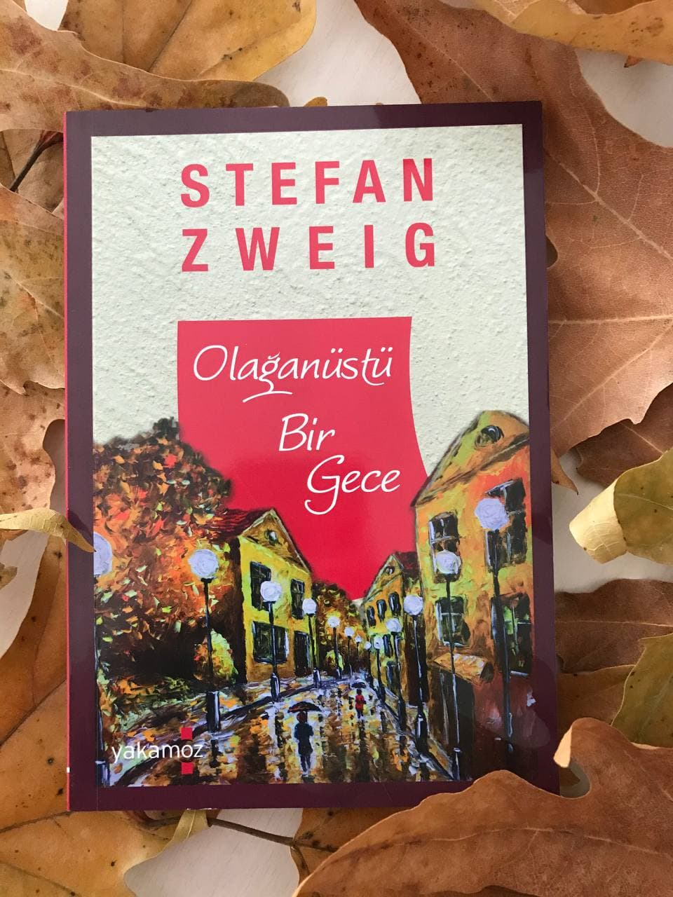

# Olağanüstü Bir Gece - Stefan Zweig
## 80 Sayfa
### 07.01.2021
  
   

  

    
     
    
 
 

***Aşağıdaki notlar, 1914 yılının sonbaharında Rava-Ruska'da Avusturya hafif süvari alayıyla katıldığı çatışmada şehit düşen Baron Friedrich Michael von R.'nin masasındaki mühürlü kutunun içinden çıkan notlar. Sayfalara üstünkörü göz gezdiren ailesi, bunların edebi bir denemeden ibaret olduğunu düşünerek gözden geçireyim diye notları bana teslim ettiler ve  yayımlanması konusundaki  kararı bana bıraktılar. Öte yandan ben bu sayfaları hayal ürünü gibi görmenin çok ötesinde, şehidimizin tüm ayrıntılarıyla başından geçen gerçek bir olayı anlattığına inanıyorum. Bu yüzden onun olduğu gibi yazıya geçirdiği ruhsal yolculuğunu, üzerinde herhangi bir değişiklik yapmadan, yalnızca ismini değiştirerek yayımladım: (sf.5)***

______

Kahramanımız ailenin tek çocuğu olduğu için, kendisine yüklü miktarda miras kalacağını biliyordu. Bu sebeple hayatını vurdum duymaz ve hiçbir şeyi umursamadan yaşamaya devam ediyordu.

Bir gün at arabasına binip gezmeye çıktı. Tesadüfen arabanın şoförü de onu bir at yarışının yapıldığı derbi müsabakasına götürdü. Orada hiçbir şey yapmadan sakin sakin duruyorken, bir tane kadın ile gözgöze geldiler ve birbirlerine bakmaya başladılar. Kadın bir o kadar güzel ve çekiciydi. Bir süre sonra kadının kocası geldi ve o adamda bir o kadar da yağlı ve çirkin bir tipti.

Kahramanımız bu adam ile çarpıştı ve adamın elindeki bir sürü at yarışı biletleri yere düştü. Adam tüm biletlerini toplamaya başladı, fakat bir tane bileti kahramanımızın ayağının dibine düştüğü için onu bulamadı. Kahramanımız da bu bileti ayağı ile üzerine bastı ve o adamın görmesini engelledi. Kahramanımız bu sahneyi izlemekten o kadar keyif almıştı ki... Sonrasında bu kadın ve kocası oradan ayrıldılar. Kahramanımız ise yerdeki bileti aldı ve yarışı takip etmeye başladı..

Yarışın sonucu olarak elindeki bilet yarışı kazanmıştı. Hemen bir heyecanla gişeye parayı almaya gitti. Parayı aldıktan sonra da bir o kadar pişman oldu, çünkü o para ona ait değildi.. Bu paradan kurtulmak için bilerek, hiç kazanamayacak bir ata oynamaya karar verdi.. Ellerindeki biletler ile geriye döndüğünde yarış bir süre sonra başladı ve kendini heyecanlı bir takibin içerisinde buldu...

En sonunda bu oynadığı at yine yarışı kazandı ve yüklü miktarda bir para kazanmış oldu. Daha fazla oynamak istiyordu fakat bu son yarış olduğu için oynayamadı... Oradan ayrılırken büyük bir vicdan azabı duyarak oradan ayrıldı. Çünkü paralar kendisine ait değildi ve kendisini bir hırsız olarak nitelendiriyordu...

Şehir merkezine geldikten sonra, hiç kimse onun yüzüne bakmıyor ve herkes ondan uzaklaşıyordu. Uzun süre yanlız başına parkın kenarında bekledi. En sonunda fahişenin biri yaklaştı ve onunla konuştu. Bu sefer de kahramanımız ona karşılık vermedi ve fahişe de çekip gitti. Bunun ardından kahramanımız onunla ilgilenen tek insanı da kaçırdığı için de pişman oldu ve onun peşinden giderek özür diledi.. 

Kadın kahramanımızı karanlık bir yere çekti ama ardından 2-3 tane adam daha geldi ve kahramanımızı sıkıştırdılar. Kahramanımızı korkutarak para vermesi için sözler ile tehdit ettiler fakat kahramanımız çok sakin kalarak onlara hiç cevap vermedi. Uzun  bir süre hep birlikte ilerlediler ve kahramanımız bu olaydan kendisini üzgün hissetti. İstemese hiçbir şey yapamadan adamlardan kurtulabilirdi. Ama 200 lira vermeyi teklif etti. Adamlar mutlu olarak oradan ayrıldılar.

Kahramanımız, sokaktaki rastgele insanlara yardım etmeye başladı.. Parasını iyilikler için kullanmaya başladı. Bu para ile insanların yüzlerini güldürdü ve aslında mutluluğun ne kadar kolay olduğunu fark etti. Bu geceden sonra hayatı değişmişti... Artık hayatını bu şekilde insanları mutlu ederek yaşamaya devam etti...

____

### Kitaptan Alıntılar ;
- ***"Bir aptallık etme, beni anla ve affet!" (sf.13)***
- ***"Yeniden bir şeyler hissediyordum, kuruyan içim yeniden yeşermeye başlamıştı." (sf.40)***
- ***"Sevdiği bir yerden gemiyle ayrılan birinin son kez karaya bakışı gibi baktım ardından." (sf.43)***
- ***"Yalnız biri için, korkularından korunabilmek için sarılacak bir dal bulmak o kadar muhteşem bir şeydir ki!" (sf.55)***
- ***"Bir suçun ortasına düştüğümü düşünmek ürkütüyordu beni, ancak içimi doldurup taşıran bu yaşam sarhoşluğu ölüme karşı da bir merak uyandırmıştı içimde." (sf.59)***
- ***"En dibe vurmuştum sonunda, şimdi bilinçli olarak geldiğim bu yolun sonunda paramparça olmaktaydı sıra." (sf.61)***
- ***"Her şeyi kaybettiklerini düşünürken bir anda umutla dolmuşlardı." (sf.65)***
- ***"Yarın benim için başlayacak, güneş yalnızca benim için doğacak gibi hissediyordum. Kalbimin etrafına ördüğüm duvar yıkıldığı andan itibaren tüm dünyayı kucaklar olmuştum." (sf.69)***
- ***"Etrafa daha çok mutluluk yaymak, daha iyi biri olmak istedim." (sf.70)***
- ***"İnsanları mutlu etmenin harika bir his olduğunu ve aslında ne kadar kolay olduğunu daha önce nasıl fark edememiştim?" (sf.71)***
- ***"İnsan bir kez kendini buldu mu bu dünyada kaybedecek hiçbir şeyi yok demektir. Ve insan bir kez olsun içindeki insana dokundu mu tüm insanlara dokunabileceğini tüm kalbiyle biliyor demektir." (sf.77)***