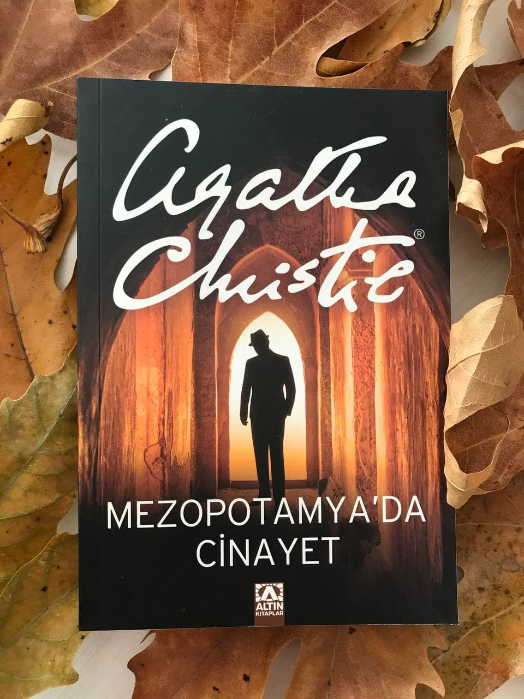

  
# Mezopotamya'da Cinayet - Agatha Christie
## 285 Sayfa
### 09.01.2021
  
 

  

    
     

 
 

***Karakterler ;***
- ***Hemşire Amy Leatheran:*** Kahramanımız, hikaye bu kişinin dilinden anlatılıyor.
- ***Hercule Poirot:*** Her zaman ki dedektifimiz
- ***Bayan Louise Leidner:*** Değişik bir şekilde davranan ve bir şeylerden korkan kadın.
- ***Doktor Leidner:*** Bayan Louise'nin kocası.

 

Hemşire Amy Leatheran, son işi için Irak'ın Hassanieh kentindeki bir kazı alanına gider. Görevi ünlü arkeolog Doktor Leidner'in güzel eşi Louise ile ilgilenmektedir. Kazı ekibinin üzerindeki gergin hava Leatheran'ın gözünden kaçmaz. Bu gerginliğin sebebinin Louise ile ilgili olduğundan emindir.

____

Bir gün Leatheran, Louise ile birlikte yürüyüşe çıktılar. Geri dönerlerken, bir anda birisinin evin penceresinden içeriye bakmaya çalıştığını görürler. Louise bunu görür görmez çok korkar..   ***"Evet öyle olmalı Ama bir an sandım ki..." sözlerini tamamlamadı.***   ***Kendi kendime, ne sandın, dedim. İşte bunu bilmeyi çok isterdim. O sırada ne düşündün?***   ***Ama artık bir şeyi biliyordum: Bayan Leidner kanlı canlı, yaşayan -gerçek- birinden korkuyordu. (sf.67)***

Yine bir gün, Louise başından geçen olayları, Leatheran'a anlatmaya karar verdi... Yıllar önce Louise, bir tane adamla evlenmiş. Bir süre sonra bu adamın bir Alman casusu olduğunu anlamış ve durumu hemen savunma bakanlığındaki babasına bildirmiş. Bunun sonucunda kocası Frederick'i kurşunu dizdirmişler. Ama herkese bunu Louise'nin kocasını savaşta kaybettiğini söylemişler.. Ama sonradan öğreniyorlar ki, Frederick kurşunu dizilmekten kurtulmuş ve kaçmış. Bir süre sonra da bir tren kazasında öldüğünü tespit etmişler. Ama ceset tanınmayacak şekildeymiş, etraftaki görgü tanıkları vasıtasıyla Frederick'in öldüğüne karar vermişler... Daha sonraki zamanlarda ise Louise ne zaman bir adamla yakınlaşsa tehdit mektupları gelmeye başlamış. Frederick adına yazılan bu mektuplar, Louise'yi ölümle tehdit ediyormuş.. Louise baya bir mektup almış.. Son olarak kaçarak Irak'a da gelse, mektuplar peşini bırakmamış. Ve son olarak gelen mektupta onu öldüreceğini ve burada olduğu yazıyormuş... Louise'nin korkusu da öldürülmekten korkmasıymış.

> ***Louise Öldürülüyor***

Ertesi gün öğle yemeklerini yedikten sonra Louise dinlenmek için odasına geçti. Leatheran ise Louise'yi odasına bıraktıktan sonra kendi odasına geçti ve kitap okumaya daldı. Saat 14:45 gibi Louise'nin odasına kocası girdiğinde büyük bir dehşet içerisinde odadan geri çıktı.. Louise öldürülmüştü... Bir süre sonra polisler olay yerine geldi.. Soruşturmaların sonucunda, avluya giren herhangi bir yabancı görmemişler. Bu sebeple Louise'yi öldürenin, Doktor Leidner'in ekibinden birisinin olması ihtimali üzerinde duruyorlar.

> ***Hercule Poirot Geliyor***

Tüm bunlardan sonra dedektif "Mösyö Hercule Poirot" u çağırdılar.. Dedektif ilk geldiğinde herkesi bir araya topladı. Herkesle genel olarak cinayet saatinde ne yaptıklarını sordu... En sonunda Doktor Leidner, Doktor Reilly ve Hemşire Leatheran'ın kalmasını istedi Mösyö Poirot. Sonrasında ise birlikte olayı değerlendirdiler. Mektupları, Louise'nin kendisi yazabileceği ihtimali üzerinde durdular.. Üç olasılık vardı; ilk olasılık; eski koca yaşıyordu, ikinci olasılık; Mektupları kendi yazıyordu ve bunu fırsat bilen birisi bunu değerlendirdi. Üçüncü; O mektuplar hayali değil, kadının ilk kocası yada kardeşi yazdı ve bu kazı ekibinden biri...

> ***Miss Reilly Bilgi veriyor***

Hemşire Leatheran ve Poirot şehre indiklerinde başbaşa dış etkenler olmadan konuşmanın daha iyi olacağını düşünüyorlardı. Ve konuşmaya başladılar. Hemşire olan biteni tamamen dedektife anlattı. Sonradan ise yanlarına Miss Reilly geldi. Reilly ise, Louise hakkında o kadar çarpıcı şeyler söyledi ki. Louise, kimsenin mutlu olmasını istemeyen bir kadın ve yıllardır kocası ile arkadaşlık eden Bay Carey ile birbirlerine aşık olduklarını ve gizli gizli buluştuklarını söyledi. Bir gün Carey ile Louise'yi nehirin kenarında buluşurlarken gördüğünü de ekledi...

> ***Carey'den bilgi***

Dedektif, Carey ile konuşup ondan bilgi almaya çalıştı. Dedektif, ima edilen ve ortalıkta dolaşan dedikodular olduğunu söyledi. Carey ise Louise'den nefret ettiğini dile getirdi.

> ***Miss Johnson***

Bir gün hemşire terasa çıkmıştı. Miss Johnson ise dalgın bir şekilde tek başına orada duruyordu.. Yüzü büyük bir dehşet içerisinde olduğu için hemşire ne olduğunu sordu. Miss Johnson ise, eve kimseye görülmeden girmenin bir yolu olduğunu söyledi. Ama henüz bunu açıklayamayacağını söyleyerek oradan ayrıldı... Aynı gece herkes uyumaya çekildiğinde, hemşire uykuya dalacağı sırada, hırıltılar duymaya başladı. Hemşire hemen dışarıya çıktı ve bu sesi dinledi. Bu ses Miss Johnson'un odasından geliyordu. Hemşire hemen onun odasına gitti. Fakat geç kalmıştı. Miss Johnson, bardaktaki bir miktar asiti içmiş, can çekişiyordu.. Ama ölmeden önce Miss Johnson, "pencere, hemşire pencere" diye fısıldadı ve maalesef öldü...

____

> ***Hercule Poirot Cinayeti Açıklıyor***

***En sonunda Dedektif Poirot, yine herkesi ilk gün gibi etrafında topladı ve onlarla geçmişe yolculuk yapacaklarını söyledi. Hikayenin bu son kısmı oldukça uzun ve oradaki tüm insanların bu cinayeti işleyip işleyemeyeceği üzerine açıklamalar yapıyor... Şimdi hepsini tek tek açıklamak çok uzun sürecek o yüzden sizleri direk sonuca götürüyorum;     Louise'yi kocası doktor Leidner öldürmüş. Cinayeti ise şu şekilde işlemiş; karısının odasındaki pencere bahçeye doğru ve dışa açıldığı için,  doktor Leidner terastayken karısının penceresine o korkunç maskeyi birkaç defa vurduktan sonra karısı bunun saçma bir oyun olduğunu düşünüyor ve pencerisini açıp yukarıya baktığı sırada, kocası ise yukarıdan başına sert bir cisim bırakıyor.. Bir saat gibi bir sürenin ardından kocası ilk odaya girdiğinde hemen ölmüş olan karısını pencereden uzaklaştırıp odanın ortasına yatırıyor ve ardından şoka girmiş, üzgün koca rolüne bürünüyor... Miss Johnson'u ise aslında Doktor Leidner'den şüpheleniyor ve neredeyse cinayeti işlediğini bile anlıyor. Doktor Leidner ise Miss Johnson öğrendiklerini başkasına anlatır ve kendisini ele verir diye kadını öldürüyor... Doktor Leidner, aslında Louise'nin ilk kocası olan Frederick Bosner'dır. O tren kaza sırasında ölmüş olan Leidner'in yerine geçerek ün kazanmış ve bir süre sonra da Louise ile evlenmiş en sonunda ise onu öldürerek intikamını almış bulunuyor.***

_____

 

### Kitaptan Alıntılar ;
-  ***+“Burada mutlu olacağınızı ve fazla sıkılmayacağınızı umarım.”***   ***-“Ben pek kolay kolay sıkılmam,” dedim. “Yaşam sıkılacak kadar uzun değil.” (sf.47)***
-  ***"İnsan sorunlarını söylerse rahatlar. Bir şeyi içine attı mı sinirleri iyice bozulur." (sf.85)***
-  ***"Şakalaşıp gülüyoruz matmazel," dedi. "Ama bazı şeyler vardır, onlarla ilgili şakalar yapılmaz. Mesleğim bana birçok gerçeği öğretti. Bunlardan biri ve belki en korkunç olanı da şu: Cinayet bir alışkanlıktır..." (sf.149)***
-  ***"Daha sonra da birçok kez tanık olduğum gibi onun gözünde hiçbir şey önemsiz değildi, en ufak bir dedikodu bile, hatta onu hiç ilgindirmese de. Hâlbuki erkekler genellikle dedikoduyu küçümserler." (sf.150)***
-  ***"Suçlu genellikle güç arsuzu ama çoğunlukla da güçlü bir aşağılık duygusunun etkisiyle hareket eder." (sf.164)***
-  ***"Milenyum sözcüğünün gelecekle ilgili olarak kullanıldığını düşünürdüm - her şeyin bambaşka olacağı gelecek!" (sf.189)***
-  ***"Bundan şüpheleniyordum ama emin değildim. Oysa her zaman emin olmak gerekir." (sf.191)***
-  ***"İnsanlar bazen köpeklere benzerler. Bir şeyi ne kadar derine gömerseniz gömün yine de bulup çıkarırlar." (sf.196)***
-  ***"Ve inanın bana istememesine rağmen delicesine âşık olan bir erkeğin kininden daha büyük kin olamaz." (sf.264)***