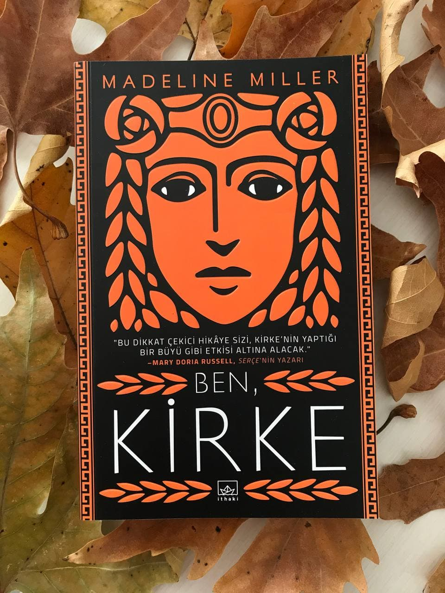

  
# Ben Kirke - Madeline Miller
## 408 Sayfa
### 15.01.2021
  
 

  

    
     

 
 

[Mitolojik Tanrıların Listesine ve Tanımlarına Ulaşmak İçin Tıklayabilirsiniz. (sf.[393-399])](https://github.com/ufukcankurt/myLibrary/tree/master/images/39_Ben_Kirke)

***Karakterler ;***
- ***Kirke:*** Güneşin kızı.
- ***Telegonos:*** Kirke'nin oğlu.
- ***Odysseus:*** Kirke'nin aşık olduğu adam. Telegonos'un babası.
- ***Helios:*** Kirke'nin babası.
- ***Perses:*** Kirke'nin erkek kardeşi.

 

"Siz de tanrıça Kirke'siniz, güneşin kızı." (s.208)
___

Kirke bir gün deniz kenarına indi. Bir tane ölümlü ile karşılaştı. Adı Glaukos'tu ve her gün geliyordu, Glaukos yoksul ve zorzoruna geçinebilen bir adamdı. Bir süre birlikte zaman geçirdiler, sohbet ettiler. Bir gün Glaukos'un babası haylazlık ettiğini ve artık ağların boş geldiğini söyledi. Bu sebeple Glaukos'da, denize açılıp çalışması gerektiğini Kirke'ye söyledi. Kirke'de bu adamı kaybetmeyi istemediği için, Babaannesi olan Tethys'e gitti ve ondan yardım istedi. Ölümlüyü kutsayıp ağlarını doldurmasını istedi ve ardından Tethys' ise Kirke'ye yemin ettirdi, ölümlü ile yatmayacağına, Kirke'de bunu kabul etti. Fakat sonrasında ise bu ölümlüye aşık oldu. Babasına onu tanrıça yapıp yapamayacaklarını sordu ama böyle bir şey mümkün değildi.

...annemin buna duyduğu zehir benim payıma düşüyordu. Beni görünce dudağını bükerdi. ***Kirke taşlar kadar sıkıcı. Kirke'nin çıplak toprak kadar aklı yok. Kirke'nin saçları köpek tüyü gibi dolaşık. Çatlak sesini bir kere daha duymak zorunda kalırsam... Bütün çocuklarımızdan geriye kalanın bu olması şart mıydı? Kimse onu almaz. (sf.45)***

Bir gün Kirke, yine Glaukos ile birlikteyken onu biraz uzağa götürdü ve uyumasını söyledi. Glaukos zaten yorgun olduğu için hemen uykuya daldı. Bu süre içerisinde Kirke, Glaukos'u tanrı yapmak için binbir yolu denedi ve sonunda başardı. Glaukos artık bir tanrı olmuştu. Kirke, yanında götürdü ve herkesle tanıştırdı. Kirke, Glaukos'a deli gibi aşıktı. Ama bir süre sonra Glaukos, Skylla'ya evlenme teklif etti. Kirke ise Glaukos'a gidip adeta yalvarmıştı kendisiyle birlikte olması için. Ama bundan hiçbir şey çıkmadı..
____

Kirke, o kadar kıskançlık ile bilenmişti ki en sonunda Skylla'ya büyü gibi bir şey yaptı ve onu çirkin bir hale getirdi. Bunun üzerine gidip babasını da tüm yaptıklarını itiraf etti. Skylla'ya yaptıklarını ve Glaukos'u kendisi tanrıça yaptığını da itiraf etti ama ne yazık ki babası ona inanmadı ve aksine işe yaramaz birisi olduğunu söyleyerek Kirke'yi aşağıladı.

Bir süre sonra Kirke'nin kardeşi Aietes çağırıldı. Aietes, babasına Kirke'nin söylediklerinin doğru olduğunu açıkladı;   ***"`Farmakonlar`la, yani dünyada değişiklik yaratma gücüne sahip olan otlarla uğraşan bu sanatlara `farmakiya` deniyor. Bu otlar tanrıların kanından yetişmiş ya da dünyada sıradan bir şekilde bitmiş olabilir. Güçlerini ortaya çıkarmak bir maharettir ve bu maharete sahip tek kişi ben değilim. Pasiphae, Girit'te zehiriyle hüküm sürüyor, Perses de Babil'de ruhları yeniden ete kemiğe büründürüyor. Kirke sonuncumuz, kanıtlarını da gösterdi." (sf.71)***

Bunu açıkladıktan sonra babaları bir süre sessiz kaldı ve bu olanları Zeus ile konuşması gerektiği, çocuklara da buradan ayrılmamalarını söyledi.. Bir süre orada kalan Aietes ve Kirke, babalarının getireceği haberi beklediler. Ne yazık ki haberler Kirke için hiç iyi değildi. Yaptığı ihanetler ve iş çevirmeleri sebebiyle Kirke'yi bir tane adaya sürgüne göndermeye karar vermişlerdi. Ertesi günü için gideceğini söylediler.
____

Ertesi gün babası Kirke'yi kimsenin olmadığı bir adaya (Aiaie) bıraktı..   ***"Şimdi Aietes, Kolkhis'ine dönmüş, ballı sütünü içiyordu. Teyzelerim nehirlerinin kenarında gülüyorlardı, kuzenlerim oyunlarına dönmüştü. Babam yukardaydı elbette, ışıklarının dünyaya döküyordu. Onlarla birlikte geçirdiğim onca sene, havuza atılmış bir taş gibiydi. Dalgalar silinmişti bile. (sf.82)***

Uzun bir süre bu adada tek başına kalan Kirke, bir süre sonra çiçeklerden iksirlerini yapmayı yavaş yavaş öğrenmişti. Kullandığı tüm güçleri, doğa üzerinde kullanıyordu.
_____

Bir gün Kirke'nin adasına Hermes geldi, kendisini misafir edip edemeyeceğini sordu. Kirke'de kabul etti. Bir süre birlikte zaman geçirdiler. Bu arada Hermes'ten şuanda bulunduğu adanın isminin **`Aiaie`** olduğunu öğrendi.   ***Hermes bunu takip eden yıllarda alacakaranlıkta kanat çırparak sık sık geldi. Tanrıların leziz şeylerini getirdi, Zeus'un kilerinden çalınmış şarap, arıların yalnızca kekik ve ıhlamur çiçeği içtiği Sipylos Dağı'nın  en tatlı balları. Sohbetlerimizin her biri zevkti, birleşmelerimiz de öyle.***   ***"Çocuğumu doğuracak mısın bana?" diye sordu bana.***   ***Güldüm. "Hayır, asla ve hiçbir zaman"***   ***(...) Ama benim içimde sevda kalmamıştı. Gündüzleri onu hayal ederek yatmıyor, geceleri ismini yastığıma söylemiyordum. Hermes kocam değildi, hatta arkadaşım bile sayılmazdı. Zehirli bir yılandı o, bende bir başka yılandım ve bu koşullar altında keyfimize bakıyorduk. (sf.99)***

____

Bir gün Kirke yine adasında tek başınayken, adaya bir gemi geldi.   Kirke; ***"Meşhur Daidalos'u sahilime hangi rüzgar attı?" diye sordu.***   Daidalos: ***"Beni tanımanızdan şeref duydum. Kız kardeşinizin(kız kardeşi, Pasiphae) ulağı olarak geldim. Bebek bekliyor ve zaman yaklaşıyor. Doğumuna katılmanızı istiyor. (...) Affedin, hanımım, daha fazlasını söyleyemiyorum ama ona siz yardım etmezseniz başka kimsenin yardım edemeyeceğini söylememi tembih etti. Sanatınızı istiyor, hanımım. Sadece sizin sanatınızı." (sf.107)***

Bir süre sonra yola çıktılar.. Ama Skylla'nın adasından geçmek zorundaydılar. Skylla ise canavarlaştıktan sonra adasının olduğu boğazdan geçen, her 12 ölümlü kişiyi yiyordu. 
Neyse ki Kirke, bunu bir şekilde başardı ve gemidekiler ile birlikte sağsalim Skylla'yı atlattı.

Neyse ki, Kirke 7 gün sonra kardeşinin yanına ulaşmıştı. Kirke'nin kardeşi Pasiphae, bir inek ile birlikte olmuş ve hamile kalmış. Kirke'yi de bu doğum için çağırmış. Adeta bir canavar olan bu bebeğin doğumunu zorla olsa da yaptırdılar ve bir kafese kapattılar. Tanrıça olan Kirke'nin elini ısıran bu bebek, bir ölümlü olsaydı kolunu komple parçalardı. Et yiyen bu yaratığın bebekken öldürülmesi mümkün değil, kaderini yaşaması gerekiyormuş. Kirke, bu yaratığı 3 mevsim boyunca yatıştıracak bir iksir hazırladı ve ona verdi. Nitekim iksir işe yaradı ve yaratık uysallaştı. Bir süre sonra Kirke, kendi adasına geri döndü.

____

Bir süre sonra Kirke'nin yaşadığı adaya  Kirke'ye hizmet etmesi için  ceza olarak Nympha'ları göndermeye başladılar. En sonunda Hermes'e de bir  daha gelmemesini söyledi.   ***"Yüz senedir adama geliyordu ve onca zamanda benimle kendi eğlencesinin ötesinde  hiç ilgilenmemişti. Nympha'lar kaldı. Cezalarını bitirdiklerinde yerlerine yenileri geldi. Bazen dört, bazen altı ya da yedi Nympha oluyordu.." (sf.187)***

Bir süre sonra adasına 20 tane yabancı ölümlü adamlar misafir olarak geldi. İlk başta yollarını kaybettiklerini ve aç olduklarını söylediler. Kirke onların karnını güzelce doyurdu. Fakat adamlar Kirke'den korkmuyor, onu tanrı olarak görmeyip sıradan birisi olduğunu düşünüyorlardı.   ***"Hermes'in uzun süre önce söylediği şeyi hatırladım. `Sesin ölümlü sesi. Senden, bizden korktukları kadar korkmayacaklar.`"***   Nitekimde öyle oldu. Adamlar, adada Kirke'den başka kimsenin olmadığını öğrenince, bir süre sonra Kirke'ye saldırdılar.

_____

Kirke, uzun bir süre adasında Odysseus ile birlikte kaldı. Aynı zamanda Odysseus'un mürettabatınıda misafir etti. Odysseus ile yattı ve kışı birlikte geçirdiler.   ***Odysseus, Laertes'in oğlu, büyük seyyah, kurnazlıkların, hilelerin ve binbir numaranın prensi. Bana yara izlerini göstermiş, karşılığında da benim hiç yaram yokmuş gibi yapmama izin vermişti. Gemisine bindi, bana bakmak için döndüğünde orada yoktum. (sf.242)***

Odysseus gittikten bir süre sonra, Kirke ona ait olan bebeği dünyaya getirdi. Kirke, bebeğin ismini "Telegonos" koydu. Kirke, ilk başlarda bebekle ilgilenmekte ve onu büyütmekte çok zorlandı. Kirke, birilerinin bebeğine zarar vermeye çalıştığını fark etmişti. Bebeğini gözü gibi korumaya çalışıyordu. Bir gün, Athena çıktı geldi. Athena, bebeği kendisine vermesini istedi. Fakat Kirke, böyle bir şey yapmadı ve Athena'ya meydan okudu diyebiliriz. Athena gittikten sonra ise, iksirler hazırlayarak; adayı dışarıdan fark edilmesin diye kayalıklarla kapatmıştı zaten. Onun dışında adaya büyüler yaparak altına aldı..

Tabi aradan çok zaman geçmişti. Bir gün, Telegonos 15 yaşındayken, adanın yakınında bir gemi batmak üzereydi. Telegonos annesine geldi ve onlara yardım etmeleri gerektiğini söyledi. Kirke de nihayet ikna oldu ve yaptığı büyüyü kaldırıp onları misafir etti. Yemekten sonra, adamlar kime teşekkür edeceklerini öğrenmek için Kirke'ye ismini sormuştu, arkadan oğlu gelip şunları söyledi:   ***"Helios kızı tanrıça Kirke'in ve oğlu Telegonos'un evindesiniz. Geminizin yan yattığını gördük ve burası ölümlülere genellikle kapalı olmasına karşın adamıza gelmenize izin verdik. Burada kaldığınız sürece sizi elimizden geldiğince yardım etmekten memnunluk duyacağız." (sf.271)***   Adamlar adada 3 gün kadar konakladılar.

Sonrasında bir süre sonra Telegonos, babasının o zamanlar kullandığı mağarada tekne yapmış. Bu tekneyi annesine gösterdi ve babasının yanına gideceğini söyledi. Tabi haliyle Kirke buna izin vermeyekti. Adanın dışına çıktığı anda Athena'nın oğlunu öldüreceğini biliyordu. Kirke ve oğlu bir süre büyük bir kavgaya tutuştular.

____

En sonunda Kirke oğlunun gitmesine izin vereceğini söyledi, ama 3 tane şart sundu. Oğlu da büyük bir sevinç içerisinde elbette bu 3 şartı kabul etti. Kirke, oğlunun gemisine onu koruması için iksirler hazırlayıp büyüler yaptı. En sonunda hazırlıklar bitti ve oğlu uykuya daldığında, Kirke denize girip, denizin derinliklerine ilerleyerek Trygon isimli tanrıçaya meydan okuduğunu söyledi ve karanlıklardan Trygon çıktı geldi. Kirke oğlu için onun kuyruğuna, yani kuyruğundaki zehire ihtiyacı olduğunu söyledi. Trygon bir kaç şart sundu, Kirke ise bunları oğlu için kabul etmek zorundaydı ve kabul etti. Böyle olunca da ilk defa Trygon'un şartlarını kabul eden birisi olduğunu belirten Trygon, kuyruğunu Kirke'ye döndü ve kesmesini istedi, tabi sonradan bunu iade etmek şartıyla.. Kirke bu kuyruk ile oradan ayrıldı ve gelip oğlunun mızrağına bu kuyruğu ve zehirleri entegre etti. Ardından tüm hazırlıkları bitirdiler ve oğlu ***gitti, gerçekten de görüş alanımdan çıkana kadar el salladı. (s.291)***

Bir süre sonra oğlu, Telegonos, büyük bir üzüntü içerisinde adaya geri döndü. Kirke onu karşıladı. Telegonos başından geçenleri anlattı. Bir şekilde babasının adasına vardığında bir süre orada beklemiş. Odysseus geldiğinde ise Telegonos'u tanımamış, üstelik adasını kendisinden alacak biri sanmış. En sonunda küçük bir boğuşma gibi, Odysseus oğlanın elindeki asayı almaya çalışmış ve asanın o zehirli ucu Odysseus'un yüzüne küçük bir çizik bırakmış. Bunun hemen ardından zaten Odysseus oracıkta ölmüş. Telegonos tüm bunları büyük bir dehşet ve üzüntü içerisinde anlattı.   Sonrasında ise Telegonos Kirke'ye, Odysseus'un karısı ve oğlunu yanında getirdiğini söyledi. Karısı "Penelope" oğlu ise "Telemakhos"... Başta Kirke onların buraya kendilerinden intikam almak için geldiğini düşünsede onları adalarında misafir etmeye karar verdi. Kirke, gece Telemakhos ile uzun uzun konuştu. Bunun sonucunda ise çocuğa haksızlık ettiğine karar verdi. Ve kendi oğlu Telegonos ile birlikte zaman geçirmelerine izin verdi.

____

Uzun bir süre; Kirke, Telegonos, Penelope ve Telemakhos birlikte yaşadılar ve zaman geçirdiler. Bu süre içersinde Kirke ve Telemakhos, bir diğer yandan da Telegonos ve Penelope birlikte zaman geçirdiler. Bir gün, Hermes çıktı geldi. Kirke'ye, Athena'nın geleceğini ve Telemakhos ile konuşmak istediğini, bu sebeple Kirke'nin adanın büyüsünü kaldırmasını söyledi. Kirke bir süre düşündükten sonra, üç gün sonra gelebileceğini iletti. Bu üç günlük süreçte ise, Penelope'nin oğlu Telemakhos ile aralarını düzeltmeleri için yeterli bir süre oldu ve barıştılar.   Bu üç günün sonunda ise Athena geldi ve Telemakhos'a babasından kalan adanın başına geçmesini ve oraya hükümdarlık etmesini teklif etti. Fakat büyük bir kararlılık ile Telemakhos, bunu üç gün boyunca düşündüğünü ve böyle bir arzusu olmadığını söyledi, yani Athena'nın teklifini reddetti. Athena o kadar çok kızdı ki, sonunda ise artık Telemakhos'u hiçbir şekilde kutsamayacağını söyledi. Athena, gitmeden ise aynı teklifi Kirke'nin oğlu Telegonos'a yaptı. Telegonos annesinden gitmek için izin istedi, çünkü bunu çok istiyordu. Kirke'de yapabileceği başka bir şey yoktu ve izin verdi. Bunun üzerine Athena oradan ayrıldı. Telegonos için eşyalarını hazırladılar. Akşam vakti bir gemi geldi ve onunla birlikte Telegonos oradan ayrıldı...

***Denizciler dizlerinin üzerine üstüne çöktü. Dayanamayacağım, diye düşündüm. Onu yakalayacak, sımsıkı kendime bastıracaktım. Ama ona son bir defa sarılmakla yetindim, cildime dağlamak istermiş gibi sıkı sıkı kucakladım. Sonra adamların arasında yerini almasını, gökyüzüne karşı siluet halinde provada durmasını seyrettim. Dalgalardan fışkıran ışık gümüş rengiydi. Hayırla gitmesini dileyerek elimi kaldırdım ve oğlumu dünyaya verdim. (s.364)***
___

> ***Sayfa 365***

***Bazıları yaşamda sevdikleriyle ele ele yürüyor, kimileri sevdiklerinin bir gün geleceğini bilmenin güvencesiyle bekliyordu. Sevmemiş olanlar, hayatları acı ve dehşetle geçmiş olanlar içinse insanın içip unutabileceği kara nehir Lethe vardı. Bir parça teselli.*** 

***Benim içinse hiçbir şey yoktu. Tanıdığım herkes parmaklarımın arasından kayıp giderken sayısız binyıldan geçecek ve benim gibi olanlarla baş başa kalacaktım. Olymposlular ve Titanlarla. Kız ve erkek kardeşlerimle. Babamla.***

***O zaman içimde bir şey hissettim. Büyülerimin eski, ilk günlerindeki gibi, yolların birden önümde engelsizce açıldığı günlerdeki gibiydi. Bunca senedir güreşmiş ve mücadele etmiştim, yine de bir tarafım tıpkı kız kardeşimin söylediği gibi kıpırtısız kalmıştı. Karanlık derinliklerindeki o solgun renkli yaratığı duyar gibi oldum.***   ***`"Öyleyse çocuğum, başka bir dünya yap."`***   ***Hiçbir hazırlık yapmadım. Şimdi hazır değilsem ne zaman olacaktım? Zirveye bile çıkmadım. Buraya, sarı kumların üstüne gelebilir ve durduğum yerde benimle karşılaşabilirdi.***   ***"Baba," dedim havaya. "Seninle konuşmak istiyorum."***

____

Bunun üzerine Kirke, göklerden babasını çağırdı ve babası bir süre sonra yanına geldi. Kirke, artık özgür kalmak istediği söyledi. Babası buna karşı çıksa da, Kirke onu Zeus'a anlatacağı şeyler ile tehdit etti. En sonunda babası razı oldu.

Ertesi sabah için yola çıkacaktı. Kirke, Penelope'ye ne yapmak istediği sordu, burada kalmak istediğini söyledi. Kirke, aynı soruyu Telemakhos'a da sordu, Telemakhos ise onunla gelmek istediğini söyledi. Eşyalarını hazırladılar ve ertesi sabah yola çıktılar. Bir süre sonra Skylla'nın adasına ulaştılar. Orada büyük bir mücadele ve savaş verdikten sonra, Kirke'nin dün geceden hazırladığı iksirler sayesinde artık Skylla sonsuzluğa gömülmüştü. Bu sırada üzücü bir şekilde Kirke, Trygon'un kuyruğunu denize düşürdü ve o kuyrukta sonsuzluğa karıştı. ***Trygon, dedim, kuyruğun sana dönüyor. Çok uzun süre sakladım onu ama sonunda iyi kullandım. (s.380)***

_____

Bir süre sonra Kirke ve Telemakhos mola verdiler. Üç gün kadar bir adada kaldılar ve Kirke bitkiler topladı. Uzun bir yolculuğun ardından eve yani Aiaie Adası'na döndüler. 

***"Tepemizde takımyıldızlar alçalıp dönüyor. Tanrılığım içimde güneşin denizde boğulmadan önceki son ışıkları gibi parlıyor. Bir zamanlar tanrıların ölümün zıttı olduğunu düşünmüştüm ama artık her şeyden daha ölü olduklarını görüyorum. çünkü hiç değişmiyorlar ve hiçbir şeyi ellerinde tutamıyorlar.***   ***Hayatım boyunca ilerledim, şimdi de buradayım. Bir ölümlünün sesine sahibim, geri kalanları da alayım. Ağzına kadar dolu kâseyi dudaklarıma götürüyor ve içiyorum. (s.392)***

> ***- SON -***

 

### Kitaptan Alıntılar ;
- ***Ölümlüleri şu şekilde tanımladı; "Çürümüş etle dolu iğrenç torbalara benzerler." (sf.10)***
- ***"Birinin yokluğumdan bahsetmesini bekledim ama kimse bahsetmedi çünkü kimse yokluğumu fark etmemişti. Niye edeceklerdi ki? Hiçbir şeydim ben, bir taştım." (sf.27)***
- ***Düşünce şuydu: "Hayatım bir çamurdan ve derinlikten oluşuyordu ama ben o karanlık suların bir parçası değildim. O suların içindeki bir varlıktım." (sf.28)***
- ***"Tanrılarla ölümlülerin ortak yönüdür bu. Gençken, dünyadaki bütün duyguları ilk hissedenin biz olduğumuzu zannederiz." (sf.46)***
- ***"Ateşi hep yanık tutacağım," dedi. "Senin için hep yanacak." (sf.47)***
- ***"Kimin içinde ne olduğunu kimse bilemez bence." (sf.75)***
- ***"Onlarla birlikte geçirdiğim onca sene, havuza atılmış bir taş gibiydi. Dalgalar silinmişti bile." (sf.82)***
- ***"Kimsenin geleceği yoktu, hiçbir zaman kimse gelmeyecekti." (sf.85)***
- ***"Bin sene boyunca ailemle aramdaki boşluğu doldurmaya çalışmıştım. Evimin odalarını doldurmaya çalışmak ona nispeten kolaydı." (sf.86)***
- ***"Yüz kuşak boyunca dünyada uykulu ve kasvetli, aylak ve rahat bir halde dolaşıp durmuştum. Hiçbir iz bırakmamış, hiç iyi bir şey yapmamıştım." (sf.88)***
- ***"Ama benim içimde sevda kalmamıştı. Gündüzleri onu hayal ederek yatmıyor, geceleri ismini yastığıma söylemiyordum." (sf.99)***
- ***"Ne yaparsan yap, demek istedim, aşırı mutlu olma. O zaman başından aşağı ateşler yağar." (sf.140)***
- ***"Ama yalnız bir yaşamda, bir başka ruhun sizinkinin yanına damladığı ender anlar vardır, yıldızların senede bir defa yeryüzüne sürünüp geçmesi gibi." (sf.156)***
- ***"Ölümlülerin kaderi buydu, hepsinin ortak hikayesi buydu. Hayatta ne kadar canlı, ne kadar parlak olurlarsa olsunlar, ne harikalar yaratırlarsa yaratsınlar, sonunda toza ve dumana dönüyorlardu. Öte yandan, bütün önemsiz ve işe yaramaz tanrıçalar yıldızları söndürene dek parlak havayı emmeyi sürdürüyordu." (sf.163)***
- ***Yüreklerimizde gerçekte ne olduğu bilinseydi kaçımız affedilirdi ? (sf.173)***
- ***"O eski mide bulandırıcı his geri dönmüştü: Hayatımın her ânında aptalın teki olduğum hissi." (sf.182)***
- ***"Bana yara izlerini göstermiş, karşılığında da benim hiç yaram yokmuş gibi yapmama izin vermişti. Gemisine bindi, bana bakmak için döndüğünde orada yoktum." (sf.242)***
- ***"Her zaman böyle şüpheci misin?"***   ***"Ne diyebilirim? Dünya çirkin bir yer. Biz de dünyada yaşamak zorundayız." (sf.208)***
- ***"Gelip en sevdiklerini alacağı korkusuyla ölüm tanrısının adını söylemeyen köylüler gibi." (s.226)***
- ***"Çocuklar biri diğerinin yerine geçebilecek tahıl çuvalları değildir." (s.257)***
- ***"Kolay mı zannetmiştin? Dinle. Bu gemiyi yapmaya kalkıştığında, baltanı bir kere havaya kaldırıp bitmesini beklemedin. Her gün, her gün çalışman gerekti. Büyücülükte aynı. Asırlardır emek veriyorum ama hâlâ tam anlamıyla ustalaşamadım." (s.282)***
- ***"Ama sen başka bir şeysin. Henüz bulmadığın bir şey. Gitmenin sebebi de bu." (s.282)***
- ***"Kuş elden uçup gitmişken uluyup bağırmanın bir faydası olmadığını bilmeliydim." (s.283)***
- ***"Ne diyebilirim? Dünya adil bir yer değil." (s.306)***
- ***"Cesaretin yaşla değil, hakiki bir ruha sahip olmakla ilgili olduğunu öğrendim." (s.312)***
- ***"Sen taşıdığın kan değilsin. Seni de kendisiyle birlikte götürmesine izin verme." (s.315)***
- ***"İki çocuğu vardı, ikisini de açıkça görememişti. Ama belki de hiçbir anne baba evladını gerçekten göremez. Baktığımızda sadece kendi hatalarımızın bir yansımasını görüyoruz." (s.318)***
- ***"Ama başka kim bütün çirkinlikleri ve hatarıyla geçmişimi hoş görebilirdi ki?" (s.356)***
- ***"Bazıları yaşamda sevdikleriyle el ele yürüyor, kimileri sevdiklerinin bir gün geleceğini bilmenin güvencesiyle bekliyordu. Sevmemiş olanlar, hayatları acı ve dehşetle geçmiş olanlar içinse insanın içip unutabileceği kara nehir Lethe vardı. Bir parça teselli." (s.365)***
- ***"Öyleyse çocuğum, başka bir dünya yap." (s.365)***
- ***"Güldü. "Gideceğin yere eninde sonunda varırdın, sadece sonsuzluğundan epeyce bir kısmını harcaman gerekirdi." (s.383)***
- ***"Birlikte bir aydan az süre geçirmiştik ama beni dünyadan gelip geçmiş herkesten daha iyi tanıyor gibiydi." (s.383)***
- ***"Şimdi gerçekleri bilmeni istiyorum, sonucu ne olursa olsun." (s.385)***
- ***"Bu kadar basitti. İstiyorsun madem, yapacağım. Mutlu olacaksan, seninle geleceğim. Bir yüreğin çatladığı bir an var mıdır? Ama çatlak bir yürek yeterli değildi ve ben bunu bilecek kadar akıllanmıştım. Onu öptüm ve orada bıraktım." (s.388)***
- ***Yara izlerini yok etmeyi önerdim. Başını iki yana salladı.***  
***"Kendimi nasıl tanıyacağım?"***
- ***"Birinin gözünde bir kıymetim olsaydı, yalnız yaşamama izin verilmezdi zaten."***