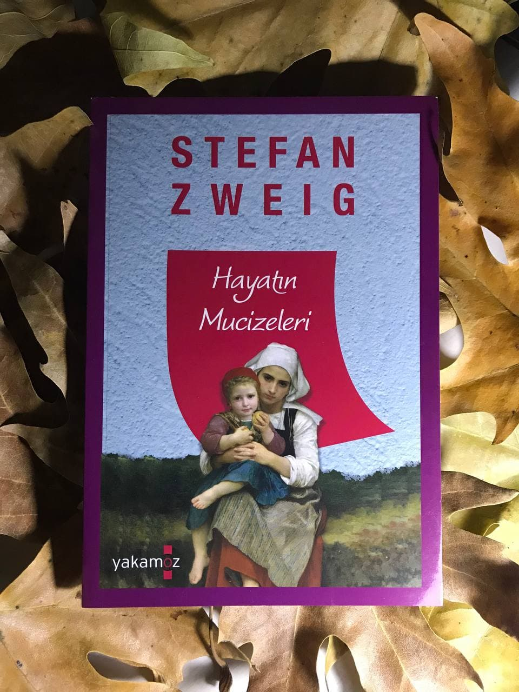

  
# Hayatın Mucizeleri - Stefan Zweig 
## 96 Sayfa
### 17.01.2021
  
 

  

    
     

 
 

____

Yaşlı bir ressam, zengin bir tüccardan Meryem ana portresi siparişi alır. Modelsiz çalışamayan bir sanatçıdır. Bir model bulmak için şehri dolaşırken, camdan dışarı bakan bir kız dikkatini çeker. Kız poz vermeyi kabul eder ama ne var ki; kız Yahudidir. 
____

Ressam, bir gün meyhanecinin evinin pencerisinde bir kız gördü. Onu bir tanrı gözüyle büyük bir parıltı içerisinde görmüştü ilk baktığında. Sonrasında gidip meyhaneci ile konuştu. Bu kız aslında, yetim kalmış bir kızmış. Yıllar önce kızın dedesi ve kız ile birlikte seyehat ederken, dedesi yolda vefat etmiş. Böyle olunca da kıza göz kulak olması için bu adama vasiyet etmiş. Bir miktarda para bırakmış.. Bu kız kimseyle konuşmuyor ve bir o kadar yalnızlık içerisindeymiş.

Ressam, kızı yanına çağırdı, ellerini tuttu ve ona resmini yapmak istediğini söyledi. Beklenmedik bir şekilde kız bunu kabul etti. Bir süre ressam ile kız arasında biraz birbirlerini anlayan bir yakınlaşma oldu. Çünkü içinde bulundukları yalnız birbirlerini tarif ediyordu.. Bir süre sonra ressam bu yahudi kıza hristiyanlığa geçmesi için bir kaç cümle kurdu ve kız bunu duyunca büyük bir öfke ile parladı:

Sonradan resim yapmak için kızı karşısına oturttu ve kucağına bir anadan doğma bir bebek verdi. İlk başta Esther bu bebekten nefret etse de bir süre sonra ona büyük bir şefkat ve ilgi göstermeye başladı. İlerleyen zamanlarda ise büyük bir tutku ile bu bebeğe anne şefkati gösteren Esther, sonrasında resim bitince ve çocuk'tan ayrılınca çok büyük bir üzüntü yaşadı. Neyseki ressam bu acıyı dindirecek bir yol buldu. Esther'i yaptığı resmi gösterdi. Bunun üzerine Esther artık kendine gelmişti. Bu yapılan resmi Katedral'e meryem ana olarak koydular. Esther her gün gidip o resme , kendisinin ve elinde bir çocuk olduğu, bakıyordu... 

Bir gün yine sokağa çıkması yasaklanmıştı. Gizlice Katedral'e gitti ve resminin önünde diz çökmüş onu izliyordu. Bu resmi bu kadar sevmesinin sebebi, sadece elindeki o bebekti. Onu öyle bir sahiplenmişti ki, ondan ayrıldığı için büyük bir üzüntü duyuyordu. Bir süre sonra içeriye bir sürü insan zorla girdiler. Katedraldeki her şeyi yıkıp, dökmeye ve yakmaya başladılar. En sonunda o resmin yanına geldiklerinde, Esther korkudan gizlendiği yerden  çıktı ve resminin üzerine atladı. Onu korumak için her şeyi yaptı. Fakat en sonunda o resim ile birlikte Esther'i orada öldürdüler....

> ***- SON -***

____

***Sana mucizelerden bahsettim Esther! Çoğu kişi bunların çok uzun zaman önce yaşandığını iddia eder ama ben, bugün hâlâ var olduklarını, sadece daha az göze çarptıklarını ve yalnızca onları gözleyenlerin ruhlarında ortaya çıktıklarını hissediyor ve söylüyorum. Bizim aramızdaki bir mucizeydi, yani benim cümlelerim ve senin gözyaşların, onlar bizim iç dünyamızın körlüğünden alıp çıkaran görünmez bir elin içinde ikisi birleşti; bu, bir aydınlanma mucizesi. (s.43)***

____

***"Ama ben Hıristiyan olmak istemiyorum. İstemiyorum. Ben..." Boğuk bir sesle  söylediği her kelimeden sonra sürekli yutkunuyordu. "Ben... Hıristiyanlardan nefret ediyorum. Onları tanımıyorum ama onlardan nefret ediyorum. Bana herkese kucak açan sevgiyle ilgili söyledikleriniz, bugüne kadar hayatımda duyduğum en güzel laflar. Ama etrafımdaki insanlar bana hiç de öyle gözükmüyor. Mesela bir defa bizi taşa tutmuşlardı. Taşlardan biri bana isabet etmişti, çarptığı yer kanadı, ben ağladım, bağırıp çağırarak yardım istediğimde babam beni korkuyla çekip aldı... Onlarla ilgili başka bir olay hatırlamıyorum... Yok, aslında anımsıyorum... Sokaklarımız dar ve karanlıktı; aynı şu an yaşadığım sokağa benziyordu. Ve bu sokaklarda sadece Yahudiler yaşardı. Ancak karşı taraftaki şehir güzeldi. Bir defasında onu bir evin tepesinden izlemiştim. İçinden masmavi, tertemiz bir nehir geçiyordu ve nehrin üstünde, sizle albümlerden gördüğümüz açık renkli kıyafetli insanların kullandığı geniş bir köprü vardı. Evler sanatsal şekillerle, altınlarla ve dik çatılarla bezenmişti. Aralarda yüksek, ah, çok yüksek kuleler vardı, içlerinde çanlar çalıyor ve güneş, sokaklara kadar geliyordu. Her şey öylesine güzeldi ki... Ama babamdan, beni alıp az ötedeki aydınlık şehre götürmesini istediğimde yüzü ciddileşir ve "Hayır Esther, Hıristiyanlar bizi öldürürler" derdi. Bu söz beni öyle korkutur ki... İşte o zamandan beri Hıristiyanlardan nefret ediyorum..." (s.45)***
____

 

### Kitaptan Alıntılar ;
- ***"Toplumların ve inançların birbirine olan uzaklığı, birbirlerine düşmanca duygular besleme ve birbirlerine karşı tereddütle yaklaşma doğrultusunda verilen eğitim... Bu tereddütün ve olumsuzluğun önüne saf sevgiyle geçilebilirdi." (s.38)***
- ***"Bana herkese kucak açan sevgiyle ilgili söyledikleriniz, bugüne kadar hayatımda duyduğum en güzel laflar. Ama etrafımdaki insanlar bana hiç de öyle gözükmüyor." (s.45)***
- ***"Artık kendini üzme, geçmişi geçmişte bırak, artık onu kurcalama. Yarın yeni çalışmamıza başlayalım; yeni bir umutla..." (s.49)***
- ***"Ayrıca eline apaçık şekilde yol gösteren bu eserden sonra bir daha acemi işi eserler yapmamaya, onun yerine zamanını, hayatını göğe, parlak ışığını o yaşamın son döneminde tekrar hissettiği yükseklere taşıyabilecek  derin bir dindarlık ve sonsuz yolun icadıyla geçirmeye karar vermişti." (s.67)***
- ***"Artık dünya onun için yabancı bir yer değildi ama ona verecek hiçbir şeyi olmadığı için bir değeri de yoktu."***
- ***"Sevgiyi öğretmek, harika bir çiçeğe dönüşecek tohumu toprağa ekmekti."***
- ***“Kalbi huzursuzluktan yorgun düşmüştü.”***