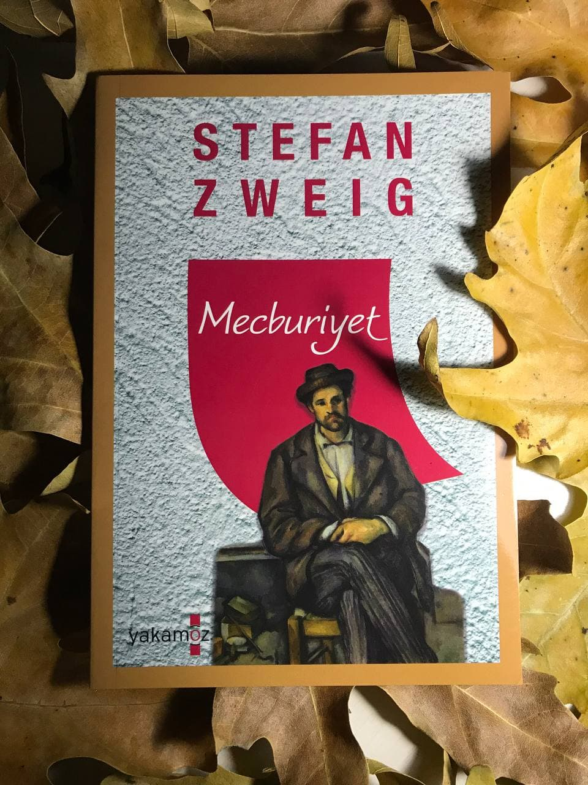

# Mecburiyet - Stefan Zweig 
## 64 Sayfa
### 18.01.2021
  
 

  

    
     

 
 

***Karakterler;***
- ***Ferdinand:*** Yıllar önce askerlikte çürük raporu alan adam. Ve bu sisteme karşı çıkıyor.
- ***Paula:*** Ferdinand'ın karısı.

 

Ferdinand, Zurih Gölü kıyısında, herkesten uzak bir köyde kiraladığı ev sayesinde, varlığını isimsiz bir şekilde hayatını sürdüyordu.

Ferdinand bir sabah dışarıdaydı. Bir süre sonra kendisine doğru bir silüet, bir yabancının geldiğini fark etti. Bu yabancı postacıydı. Kendisine bir zarf verdi. Üzerinde kendi ismi ve resmi diye bir yazı vardı. İşte yıllardır kaçtığı bu mektup sonunda gelip kendisini bulmuştu:

____

> ***Mektupta Yazanlar;***

***"No. 34.729 F.-M Bölge Karargâhı'nın emri üzerine, askerliğe uygun olup olmadığınızın tespit edilebilmesi adına muayene olmak için 22 Mart tarihine kadar M. Bölge Karargâhı, 8 numaralı odada bulunmanız rica edilmektedir. Bu amaçla, size gerekli belgeleri teslim etmeleri için Zürih Konsolosluğu'na bireysek olarak başvurmanız gerekmektedir." (s.13)***

____

Bu mektubu okuduktan sonra Ferdinand'ı tüm benliği ile bir korku ve endişe kapladı. Kendini engelleyemiyordu. Tek düşündüğü şey bu görev için oraya gitmeyi zorunlu görmesiydi. Yıllardan beridir bunu istemiyordu, reddediyordu. Ama şuan ellerine ve ayaklarına da engel olamıyordu.

Paula ile uzun uzadıya tartıştılar bu konuyu Paula, Ferdinand'ın gitmemesi için her şeyi yaptı, her şeyi söyledi. Ertesi sabah ise Ferdinand, erkenden konsoloslukta buldu kendini. Kendisine gerçekten de engel olamıyordu. Oradaki görevliye karşı söylemek için bir sürü prova yapmış ve sözler hazırlamıştı. Karşı çıkacaktı, direnecekti ve biraz daha zaman kazanacaktı. Ama o odaya girince, görevlinin Ferdinand'ın eline verdiği kağıt ve yarın gitmesi gerektiğini söylemesi üzerine Ferdinand itiraz bile edemedi. O sözler ve yaptığı provaların yerinde yeller esiyordu. Bir anda mahçup bir şekilde kabul etmiş, boyun eğmiş ve kendini oradan çıkarken buldu.. 

Sonrasında eve döndüğünde Paula uzun uzadıya kızdı ve yine tartıştılar. En sonunda Paula; ya ben, ya da onlar. İstediğini tercih et, beni bir daha burada bulamazsın dedi ve çıktı gitti. Bir süre ne yapacağını bilemeden büyük bir üzüntü içinde bir oraya bir buraya dolanan  Ferdinand, birden kendini sırt çantasını hazırlarken buldu. Bir süre sonra çantasını hazırladıktan sonra içeriye Paula girdi ve olanları görünce hiçbir şey söylemeden arkasını döndü ve gitti.

Ertesi sabah Ferdinand uyandı, evde kimse yoktu. Yanlızlığı ile başbaşaydı. Öyle olunca da büyük bir üzüntü içerisinde eşyalarını aldı ve tren garının yolunu tuttu. Oraya vardığında Paula onu bekliyordu. Gitmemesi için elinden geleni yapacaktı ve yine uzun uzun tartıştılar ama nafile herkes kendilerine gülüyordu. Fakat Ferdinand bir anda trene bindi ve arkasına bile bakmadan oradan uzaklaştı.

Ferdinand sınıra geldiğinde, oraya yeni ulaşan trenden cepheden yada savaştan dönen Fransız askerlerini gördü. Hepsi yaralı ve perişan haldelerdi ama artık İsviçre'ye yani özgürlüğe kavuştukları için mutluydular. Böyle olunca Ferdinand' her şeyi fark etti. İçinde ki bu dikdatör gücü yendi ve tekrardan eve döndü. 

Ferdinand; Paula ve köpekleriyle birlikte mutlu ve özgür bir şekilde yaşamaya devam ettiler.

> ***- SON -***

 

### Kitaptan Alıntılar ;
- ***"İnsanlar, insanlar, bana ne insanlardan?" (s.54)***
- ***"İtiaat ettiğiniz müddetçe, sizler sadece bir kölesiniz ve bunu da hak ediyorsunuz demektir."***
- ***"İçinde bir şeyler hayır diyorsa, sen de hayır demelisin."***
- ***"İnsanlar umurumda değil, onların merhametinden, sevgisinden, minnettarlığından bana ne?"***
- ***"Ormanda gezen bir atlının, kendisine gizliden gizliye doğrultulmuş olan silahı fark etmesi ve birazdan o namludan çıkacak kurşunun, derisinin altında bir yerlere gireceğini hissetmesi gibi..." (s.10)***
- ***"Belki de delilik, mantıktan çok daha güçlü olduğundan." (s.18)***
- ***"Karşımdakiler insan olsaydı kendimi gayet iyi savunabilirdim. Ama karşımdaki makine, kalbi ve mantığı olmayan bir ölüm makinesi. Bu durumda ne yapılabilir ki?" (s.20)***
- ***"Bir şeyi gerçekten istemediğini gösterince her şey hallolur. Teslim olmayınca... Her şeyi baştan sona etkileyecek bir durum bu. Tüm hayatını, özgürlüğünü, kısacası her şeyini istiyorlar. Bu nedenle de kendini ve düşüncelerini savunmalısın." (s.20)***
- ***"Böyle bir şey yapmak yerine neden inandığın bir şey yapmayasın? Kendini neden inandığın bir şeye adamıyorsun? İnandığın, sana ait olan bir düşünce için kendini feda ediyor olsan, inan bana hiçbir şey demezdim. Ama bunu, sana ait olmayan bir düşünce için yapmanı kabul edemem." (s.21)***
- ***"Ancak saat, hiçbir şeyden etkilenmeden çalışmaya devam ediyordu. Zamanın demirden bekçisi gezinip duruyordu." (s.27)***
- ***"Bekleyerek geçen her dakika, zaten zayıf olan gücünü iyice zayıflatıyordu." (s.31)***
- ***"Kanunları çok iyi biliyorum ve hukuki sonuçların da farkındayım ancak dediğim gibi benim için verilen sözlerden daha önemli bir şey yoktur. Bu noktada da verdiğim sözden daha üstün bir kanun bulunmamaktadır. Sözümü yerine getirmek adına her şeyi göze almak durumundayım. Bu benim için mecburiyet." (s.34)***
- ***"Sana neyin önemli olduğunu, meselenin ne olduğunu söyleyeyim mi? Tüm benliğinle nefret ettiğin insanların vereceği herhangi bir görevi öylece kabul mü edeceksin? Dünyanın en büyük suçu dediğin bu suça sende mi ortak olacaksın? Çünkü bu suça karşı gelmiyorsan sen de onlardansın demektir." (s.43-44)***
- ***"Bu güce sahip olmalarının sebebi ne? Sizsiniz. Bu gücü onlara siz verdiniz. Siz onlardan korkmaya devam ederseniz onlar da gücü ellerinde tutmaya devam eder. Eğer tüm insanlığın korkunç dediği her şeyin sebebi, bütün ülkelerdeki sağlam iradeli bir avuç insan; o zaman başka bir avuç insan da bu durumu tersine çevirebilir. Bir kişi bile bu gücü reddettiğinde güç sahibi kişi ölmüş sayılır. Ama şu an olduğu gibi kabuğunuza çekilip arada gözden kaçarım diye düşündüğünüzde, onlara boyun eğdiğinizde onları kölesi haline gelirsiniz. O yüzden de yaşadığınız her şeyi hak ediyorsunuz demektir. Cesur bir adam kabuğuna çekilmez, hayır der. Tek göreviniz bu olmalı; kendinizi kurban gibi önlerine koymanız değil." (s.44)***
- ***"Oraya kendi fikirlerin yüzünden, bireysel iraden yüzünden gideceksen seni durdurmam ama sırf korkudan, o canavarların kölesi olmak için gideceksen karşına geçer, seni engellerim. İnsan kendi fikirleri için ölebilir ancak diğerlerinin deliliği için ölemez. İnananlar, vatan uğruna ölmekte özgürler." (s.45)***
- ***"Hiçbir şeyden habersiz olan köpeğin karşılıksız sevgisi, Ferdinand'ı duygulandırdı. Bu sevgi, artık var olmayan bir hayattan, Ferdinand'ın eski hayatından geliyordu. Eğildi ve sanki bir insana sarılıyormuşçasına köpeğe sarıldı. Bu dünyada onu hâlâ seven ve küçümsemeyen bir şey olduğu için minnettar oldu." (s.49)***
- ***"Ne bir ses ne de bir hareket vardı. Yalnızlık ve  yok olmuşluk hissi bir kez daha onu ele geçiriyordu. Onu karşılıksız seven köpeği bile yoktu. Herkes, her şey Ferdinand'ı terk edip gitmişti. Yapayalnızdı. Son gücünü kıran, ona saldıran şey yalnızlık olmuştu." (s.52)***
- ***"Bir kişi bile yapılması gerekeni yapmadı. Korkaklığımız, Ferdinand, korkaklığımız bizi zehirleyip öldürüyor." (s.55)***
- ***"İnsan için dünyada kendi kabul ettiğinden başka bir kanun olmadığını; hiçbir şeyin insanı, birine ait olmak kadar bir şeye ya da bir yere bağlamadığını fark etti." (s.64)***