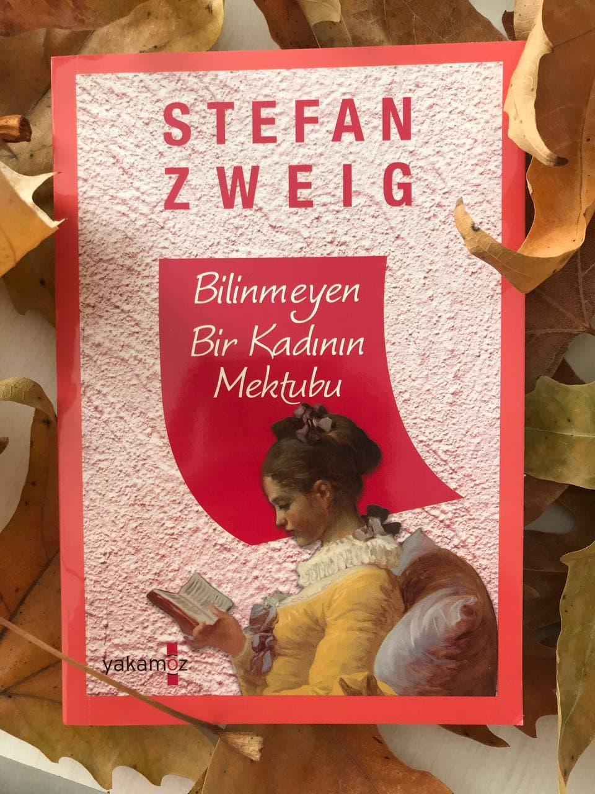

# Bilinmeyen Bir Kadının Mektubu - Stefan Zweig 
## 64 Sayfa
### 19.01.2021
  
 

  

    
     

 
 

> ***Hiçbir şekilde bu kitabı okuyup hissetmeden bir şey anlayamazsınız !!!***

***Karakterler;***
- ***Fraulein:*** Bilinmeyen bir kadın
- ***Johann:*** Uşağı
- ***R. :*** Ünlü roman yazarı

 

***Ünlü roman yazarı R. dağlarda geçirdiği üç günlük dinlendirici gezisinin ardından Viyana'ya dönmüştü. Garda aldığı gazetenin tarihine baktığında doğum gününü anımsadı. Kırk birinci doğum gününün bilgisi içine ne acı ne de zevk vermişti. Gazete sayfalarını hışırdatarak çevirdikten sonra taksiye atlayıp evine döndü. Uşak, yokluğunda uğrayan ziyaretçileri ve gelen telefonları rapor ettikten sonra bir tepside  birikmiş postaları getirdi. R., kayıtsız gözlerle postalara baktı, ilgisini çeken kişilerin mektuplarını açarken el yazısını tanımadığı kalın mektubu kenara ayırdı. Uşağının getirdiği çayı yudumlarken arkasına yaslandı ve gazetesini karıştırmaya koyuldu. Sonra bir puro yakıp kenara ayırdığı mektubu eline aldı. (s.5)***

____

> Mektubu okumaya başladı...

Yıllar önce 13 yaşında bir çocukken, karşı dairelerine taşınan R.'ye aşık olan Fraulein, tüm olanları anlatmaya başlıyor. İlk günden itibaren bu adamın ilgisini çektiği ve sonradan çok büyük bir tutku ile bağlandığını anlatıyor.. Fraulein, 2 yıl boyunca aynı apartmanda otursalarda R.'nin dikkatini çekememişti.

2 yılın sonunda ise, annesi dul olduğu için farklı bir adamla evlenmenin daha iyi olacağını düşündü. Bu sebeple de oradan taşınmaları gerekiyordu. 15 yaşında istemeye istemeye oradan taşındılar. 

Fraulein, tüm hayatını çocukluğundan itibaren R.'nin aşkına adadığı için her ne kadar çok güzel bir kız olsa da gelen istekleri geri çeviriyordu. En sonunda bir şekilde ailesini ikna edip tekrardan ilk yaşadıkları yere döndü ve çalışmaya başladı. Gündüzleri çalışıp, akşamları R.'nin evinin önünde beklemeye başladı. Bir gün R.'nin yanından geçerken, onu hiç hatırlamadığını fark edince çok büyük bir hayal kırıklığına uğradı.

Yine ilerleyen bir zamanda tekrardan karşılaştılar ama bu sefer R. ile konuştular ve R. yemek yemeyi teklif etti. Yemek yedikten sonra kendi evine de davet edince. Fraulein, hemen kabul etti. O gece birlikte zaman  geçirdiler ve Fraulein, kendisini R.'ye sundu. Zaten yıllardır bu anı bekliyordu. Çok güzel bir gecenin ardından ayrıldılar. Fraulein, her doğum gününde ona beyaz gül gönderiyordu.

O gecenin ardından bir daha karşılaşmadılar. Bir süre sonra Fraulein, hamile kaldığını öğrenince, annelerinin bu durumu öğrenmemesi için çalışmayı bıraktı. Elindeki tüm şeyleri satmak zorunda kaldı. Büyük bir yoksulluk içerisinde doğum yapmak zorunda kaldı. Devletin tüm yoksullar için yaptığı bir yerde büyük bir kabus içerisinde doğum yaptı. Çok zor zamanlar geçirdi.

Ama yine de tüm bunlara rağmen R.'ye haber vermedi. Oğlunu tek başına büyüttü. Maalesef oğlunu yoksulluğu göstermemek için. Bir anlamda kendini sattı. Erkek arkadaşları oldu, ama hiç bir zaman Fraulein, onlara bağlanmadı.. Bir gün sevgilisi ile bir bardayken, R.'yi gördü. Çok güzel olduğu için bir süre bakıştılar ve sonrasında R. Fraulein'yi kapıya çağırdı. Yine kendisini tanımamıştı ve yine kendisini eve davet etti. Fraulein, yine kabul etti. O gece yine birlikte oldular. Ama ne yaptıysa Fraulein'i hatırlamadı. Ve üzücü bir şekilde Fraulein görmeden, paltosuna para sıkıştırmıştı. Bunu gören Fraulein, bir kez daha yıkıldı. Geçen sefer ki gibi bir kez daha beyaz gül istedi. Ama Fraulein'ü yine hatırlamadı...

_____

Fraulein, bu mektubu oğlu öldükten sonra yazmaya başladı. Bu mektup ise R.'ye sadece ve sadece Fraulein öldükten sonra ulaşabilirdi. 

> Yıllardır, çocukluğundan beri hayatına adadığı adamın kendisini görmeden yaşadığı bu hayatı artık son bulmuştu.

______

***Gözlerim yaşlarla dolarken koşarak kapıyı açtım. Öylesine kendimi kaybetmişim ki az kalsın uşağın Johann'a çarpıyordum. Johann korkuyla kenara çekilde ve dairenin kapısını açtı. Gözyaşlarıyla dolu bakışlarım bakışlarına değdiğinde gözleri parladı. O bir saniye içinde, çocukluğumdan beri beni görmemiş olan yaşlı adam tanıdı, beni tanıdı. Bu lütfu için ona minnettardım. Bana verdiğin banknotları çıkarıp cebine sıkıştırdım. Yaşlı adam titreyen bakışlarla baktı bana. Tek bir saniyede o adam senin hayatın boyunca hakkımda fark edemediğin birçok şeyi fark etti. Evet, etrafımdaki herkes beni şımartıp bana iyi davranmıştı. Yalnızca sen beni unutmuş, beni asla tanımamıştın! (s.57)*** 
_____

 

### Kitaptan Alıntılar ;
- ***"Sana, ben, hiçbir zaman tanımamış olan sana." (s.6)***
- ***"Artık yalnızca sen varsın benim için, beni tanımayan, bana dair hiçbir şey bilmeyen, hiçbir şeyden haberi yokmuş gibi her şeyi ve herkesi alaya alan sen. Evet, sen beni tanımasan da hep sevdiğim sen." (s.7)***
- ***"Ölmüş biri ne sevilmeyi, ne kendine acınmasını ne de teselli edilmeyi bekler." (s.8)***
- ***İsimlerimizi dahi duymamışsındır, ne dairemizin üstünde adımız yazılıydı, ne de gelip gidenimiz vardı. Üzerinden de on beş on altı yıl geçti zaten, bilmediğine şüphem yok sevgilim. Öte yandan ben her detayı tutkuyla hatırlıyorum, adını ilk kez duyduğum anı, seni gördüğüm ilk günü, hatta saati. Hayatımın başladığı o anı nasıl hatırlamam. Her şeyi olduğu gibi baştan sona anlatacağım, sabret sevgilim. Lütfen anlatacaklarımı yorulmadan dinle, çünkü ben seni sevmekten hiç yorulmadım. (s.8-9)***
- ***"Biliyorum ki tüm bunlardan sonra yine yalnız kalacağım, böyle kalabalıklar arasında bile yalnız hissetmek kadar korkunç bir şey yoktur hayatta." (s.25)***
- ***"Sensiz mutlu olmak gibi bir düşüncem yoktu. Kendimi acı ve yalnızlıkla ördüğüm duvarların içine hapsetmiştim." (s.25)***
- ***"Ben seni istiyordum, uyuklarcasına bir özlemle geçirdiğim onca yılın ardından sana uyanmak istiyordum, beni tanımanı dikkate değer bulmanı ve bana gerçekten bakmanı istiyordum. Beni sevmeni istiyordum." (s.29)***
- ***"Beni tanımamıştın. Ne o zaman, ne de başka bir zaman tanıdın beni. O anki hayal kırıklığımı anlatmama imkân yok. Senin beni asla tanımayacağın kaderimin ilk kez o an tadını almıştım ve şimdi hâlâ o acı tat damağımdayken ölüp gideceğim bu dünyadan. Sen beni asla tanımadan göçüyorum." (s.31)***
- ***"Şimdi tökezleyerek girdiğim bu eşiği daha önce binlerce defa baktığımı düşün, belki bu anın hayatımdan neleri götürdüğünü böylece sezebilirsin, fakat asla tamamıyla anlayamazsın sevgilim." (s.36)***
- ***"Gözlerimi açıp karanlıkta yanımda seni hissettiğimde, yıldızları tepemde göremediğimi hayret  ettim, sanki gökyüzüne o kadar yakındım ki! Pişmanlık? Asla sevgilim, bir an bile pişmanlık duymadım o geceden! Hâlâ dün gibi aklımda, sen uyurken nefesini duyup bedenini tenimde hissettiğimde mutluluk gözyaşları dökmüştüm." (s.37)***
- ***"Tüm hayatımı adadığım adamın elimde bana yollanmış bir satır mektubu bile yok. Ben çaresizlik içinde beklerken sen beni hiç çağırmadın, bana tek bir satır bile yazmadın..." (s.38)***
- ***"Omuzlarında bir yük olmaktansa sevgi ve minnetle hatırladığın tek kadın olmayı arzuladım. Fakat sen beni hiç hatırlamadın, unutup gittin." (s.40)***
- ***"Seninle geçen o üç geceden asla pişmanlık duymadım. Seni benimle karşılaştıran o anı hep büyük bir aşkla hatırladım. Bil ki o cehennemi bir kez daha yaşayacağımı bilsem bile yine de yaptıklarımı tekrar etmekten asla çekinmezdim. Bir kez, binlerce kez daha yapardım aynısı." (s.43)***
- ***"Bunu itiraf etmekten çekinecek değilim, senin için hep hazır olmak istiyordum. Derinlerde bir yerlerde o çocukça beklentim yatıyordu, bir gün belki bir saat için bile olsa çağıracaktın beni yanına. İşte beni çağırdığında, o bir saatin hayali için, hiçbir bağın esaretinde olmamak için her şeyi elimin tersiyle ittim. Zaten çocukluğumda sana uyandığım o andan itibaren hayatım seni beklemekten başka bir olmamıştı ki!" (s.48)***
- ***"Güzel şeyler unutulmaz, ben seni hiç unutmayacağım." (s.55)***
- ***"Öldüğüm zaman benden kalan bu mektup eline ulaşacak, seni herkesten çok sevmesine rağmen hiç tanımayan, seni hayatının sonuna kadar beklemesine rağmen senden bir çağrı alamayan bu kadından kalan son miras." (s.58)***
- ***"Ben gidince hayatında bir eksiklik hissetmeyeceğini bilmek rahatlatıyor içimi. O ışıltılı hayatında hiçbir şey değişmeyecek. Ölümüm seni hiç üzmeyecek... Bunu bilmek yumuşatıyor içimi, sevgilim..." (s.59)***
- ***"Birden gözü, masanın üzerindeki mavi vazoya çarptı. Yıllardan beri ilk kez, bir doğum gününde o vazo boş kalmıştı. İçi ürperdi. Sanki bir yerlerde bir kapı açılmış, başka dünyadan esen buz gibi bir rüzgâr içini doldurmuştu. R., ölü bir kadının hatırasında ölümsüz aşkı hissetti. İçinde bir şeyler kopmuştu sanki, o hiç bilmediği kadını büyük bir tutkuyla düşündü. Geçmişte duyduğu bir şarkıyı hatırlar gibi..." (s.60)***

