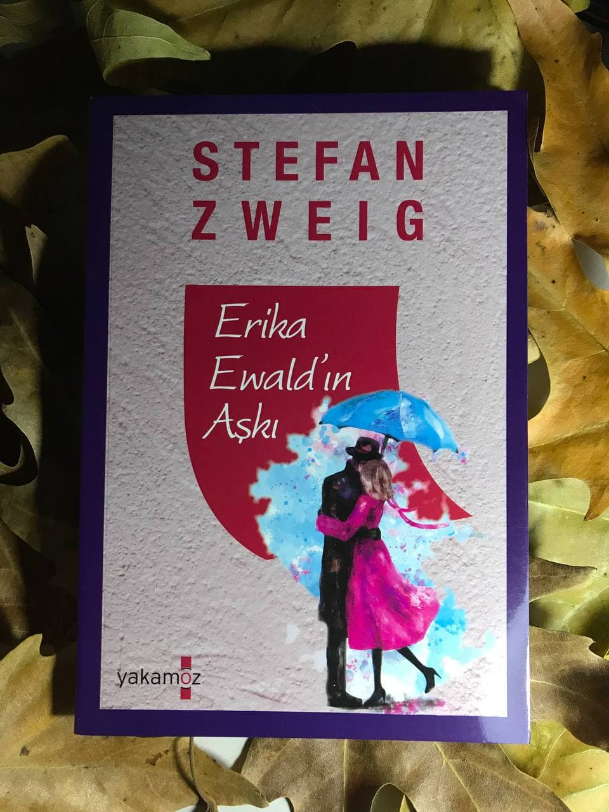

# Erika Ewald'ın Aşkı - Stefan Zweig 
## 64 Sayfa
### 20.01.2021
  
 

  

    
     

 
 

***Karakterler;***
- ***Erika:*** Bir adama aşık olan ana karakterimiz
- ***Jeanette:*** Erika'nın kız kardeşi

_____

> ***Camili Hoffman'a en içten dosluğumla...***

***"Ancak bu, bütün genç kızların, boyun eğenlerin sessiz kalanların hikâyesidir. Acı içinde olduklarını asla söylemezler. Kadınlar söz dinlemek için yaratılmışlardır. Kaderleri hiç şüphe yok ki böyledir. Bunu o kadar erken öğrenir ve buna o kadar az şaşkınlık gösterirler ki, hiç olmayacak şeyler gelip kapılarını çaldığında böyle bir şeyin yaşanmadığını söylerler..." (s.5)***

***Barbey D'aure Villy***
_____

***Bu aşk çok da eski bir hikâye değildi. Erika'nın piyano dersi verdiği bir dernekte tanışmışlardı. Erika burada o kadar çok seviliyordu ki, öylesine bir öğretmenden çok herkese arkadaş gibiydi. Adam da oradaki bir etkinliğe başkonuk olarak davet edilmişti. Genç bir keman virtüözü olmasına rağmen başarısı onaylanmış biriydi. Tanışmaları çok doğal gerçekleşmişti. Adam oraya keman çalması üzerine davet edilmişti ve tabii ki ona Erika eşlik edecekti... (s.9)***

Erika ve adam birlikte çok sayıda sahneye çıkıyorlardı..
Erika'nın aşık olduğu bu adam ile birlikte bir gün bu adamın evlerindeyken, adam yıllar öncesinde bir köyde duyduğu ezgileri çalmaya başladı. Bu ezgiler ile neredeyse birbirinden geçtiler. Aslında Erika biraz hüzünlendi ve hayal dünyasına daldı. Adam ise bu durumda ona biraz yakınlaştı, onu teselli etmeye çalıştı ve Erika'yı öptü. Bunun üzerine Erika kendine geldi ve adamı geriye doğru itti ve oradan ayrılmak istediğini geç olduğunu söyledi.

İlerleyen bir zamanda yine birlikte güzel bir gün geçirdiler. Tatil günleriydi ve sahilde dolaştılar. Bu günün sonunda ise adam, Erika'ya duyduğu şehveti ve onu istediğini dile getirdi. Bunun üzerine Erika ise olumlu bir cevap verdi, "sadece benim yanımda sen varsın ve seni mutlu etmek için her şeyi yapacağını" söyledi. Bunun üzerine adamın evine doğru yola çıktılar. Eve yaklaştıkça Erika, büyük bir pişmanklık ve huzursuzluk hissetmeye başladı. Eve geldiklerinde ise adamı orada bırakıp ardına bile bakmadan kaçtı.

Aradan uzun zaman geçti. Bu süre içerisinde başlarda bu durumu pek umursamayıp, hayatına devam etse de. Yeniden o adama büyük bir aşk ve tutku Erika'nın içinde küllerinden tekrar doğdu. Bir gün o adamın evinin oraya gittiğinde bir tane gazetede ilan gördü ve adamın bir süre sonra bir konseri vardı. Erika, o adamın da hala onu sevmesini ve arzulamasını umut ediyordu. Bu umutlarla o konsere gidecekti.

O gün geldiğinde o konsere katıldı. İlk şarkı sıradan bir şeydi ve salon adeta adamı ayakta alkışladı. İkinci parçayı çalmaya başladığında ise Erika'nn bedenini büyük bir heyecan sardı çünkü bu şarkı o gece ki şarkıydı. Bu şarkı bitene kadar büyük bir hayal alemine daldı ve yine şarkının sonunda ki alkış tufanı sebebiyle  kendine geldi. Bu şarkının üzerine adamın da hala kendisini düşündüğü ve kendisini beklediğini düşündü.

Şarkının sonunda ise çıkış kapısına doğru ilerledi ve orada beklemeye başladı. Adam yanında bir kadın ile Erika'ya gülümseyip geçti ve dönüp arkasına bile bakmadan kadın ile arabaya binip oradan uzaklaştı. Erika ise büyük bir üzüntü ve hayal kırıklığı içerisinde yürümeye başladı. Bir süre sonra kendini bir köprünün üzerinde buldu. İntihar etmeyi bile düşündü fakat bunun ne kadar gereksiz olduğuna karar verdi. İçinde büyük bir intikam duygusu kabardı ve yürümeye başladı.

Bir süre sonra yanına genç bir subay yaklaştı. Erika ilk başta ona cevap vermedi ama bir süre sonra intikam almak istercesine kendini bu genç subaya teslim etmeye karar verdi. İlk önce yemek yemeğe gittiler. Erika orada çok fazla şarap içti. En sonunda adam ona iyice sokulmuştu ve bir anda kendini adamın kollarına bırakıp, ağlama başladı. Uzun uzadıya öyle bir ağladı ki, genç subay büyük bir şevkat duymaya başladı ve en sonunda Erika'yı evine bıraktı...

 

### Kitaptan Alıntılar ;
- ***"Sonunu okuduğunda gözyaşlarına boğulmasına rağmen ona yine de zevk veren ancak yine de bir açıdan ona işkence eden bir kitap gibi onu tüketme ihtimali olan bu aşktan korkmaya başlamıştı." (s.23)***
- ***"Tıpkı unuttuğu eski bir anının zihninde yeniden canlanması gibi adamı ne kadar sevdiğini hatırladı birdenbire. Onu kaybetme ihtimalinin  canını nasıl da yakacağını hissetti. Her şey böyleyken nasıl da güzel bir rüya gibiydi." (s.27)***
- ***"Bu dünyada senden başka kimsem yok, seni mutlu etmek istiyorum." (s.28)***
- ***"Zihni korkunç anılar tarafından esir alınmıştı. Ve özellikle bir tanesi, durup durup ortaya çıkıyor ve onu boğuyordu. Bu, eskiden aynı okula gittiği bir kızın tuhaf hikayesiydi. Ruhunu ve bedenini bir adama teslim eden bu kız o adam tarafından terk edilince bir başkasına gitti... Daha sonra bir başkasına ve bir başkasına daha... Bir süre sonra bu durumun nasıl başladığını bile unutmuştu. Erika bu kızın hayatını düşündükçe içi korkuyla kaplanıyordu. Başına gelebilecek  şeylerden çekinen bir kızın korkusu değildi bu. Bu hayatının karışıklığından ve çirkinliğinden duyduğu zayıflığın yarattığı korkuydu." (s.30)***
- ***"Bazı anlar vardır ki kader işte o anların içinde kendini gösterir. Bazen bu anların karanlık bulutlar gibi size, sıkkınlıkla yaklaştığını fark edebilirsiniz. Bazen bu bulutlar dağılır, uzaklaşır ve havada asılı kalırlar... Ancak o bulutlardan kaçamazsın." (s.32)***
- ***"Tekrar kitaplarına sarılmıştı. Acının, güzelliğin, her türlü duygunun içlerinden buram buram hissedebildiği kitapları yeniden en yakınları olmuştu." (s.36)***
- ***"Öyleyse bütün bu savaş ve kazanılanlar ne içindi? Kimsenin bitip tükenmek bilmeyen bu hırsı ne içindi? (s.38)***
- ***"Farkında olmadığı şey şuydu ki, bu en derin yaralar insanın içinde gizliden gizliye sinsice ilerleyip en zayıf noktasına konuşlanır ve en olmadık anlarda gürül gürül akan bir dere gibi ortaya çıkardı." (s.39)***
- ***"Bu tür bir olay insanda öyle travmatik bir acıya neden olur ki, insan artık o acıyı hissedemez hale gelir. İnsan girdiği şokun şiddetiyle, algılama yeteneğini yitirir ve o acıyı hissedemez. Sadece ve sadece çok yüksek bir yerden nefesi kesilerek düştüğünü, bu düşüşe karşı koyamadığını, bir uçurumun dibine varacak şekilde hızla düşmeye devam ettiğini ve kaçınamayacağını bildiği acı sona adım adım yaklaştığını hisseder." (s.48)***
- ***"Oysa daha önceleri, hayatın karanlık yollarından çoktan geçtiğini ve acıları çektiğini düşünmüştü ve tüm bunlara karşı ayakta durarak kendince bir güven oluşturmuştu ancak şimdi bu güveninin tıpkı bir oyuncak gibi paramparça olduğunu görebiliyordu." (s.48-49)***
- ***"Ne kadar basit, ne kadar da çabucak olurdu şimdi. Köprünün kenarına tutunma, kendini öbür tarafa atıverme, düşüş ve birkaç çırpınış. İşte bu kadar... Sonrası huzur. Tüm gerçeklerden uzak, sonsuz bir huzur... Bir daha uyanmayacak olmanın mükemmel tesellisi." (s.50)***
- ***"Bütün anıları bir köşeye sinmiş, onun üzerine çullanmak için bekliyorlardı." (s.52)***
- ***"Erika, çektiği acının içinde savrulup durmuş, kaybolmuştu. Dünyaya karşı sağırlaşmış ve duygusuzlaşmıştı. Duyabileceği bütün sözlere ya da aşk dokunuşlarına karşı sağır ve dilsizdi." (s.56)***
- ***"Bazı insanlar aşk için doğmazdı, bunun farkındaydı. İşte o yüzden her şey olması gerektiği gibiydi... Bazı insanlar isteklerinin gerçeklemesinin ortaya çıkaracağı bir yandan acı dolu olan mutlulukları kaldırmak için fazla zayıftırlar, bunu biliyordu. Erika bütün hayatını geçirdi gözünün önünden. Bildiği bir şey vardı ki o da bir aşkın kapısını çalmayacağıydı. Ve kendisi de aşka doğru yürümeyecekti. Her şeyden vazgeçmenin acısı içine işliyordu." (s.58)***