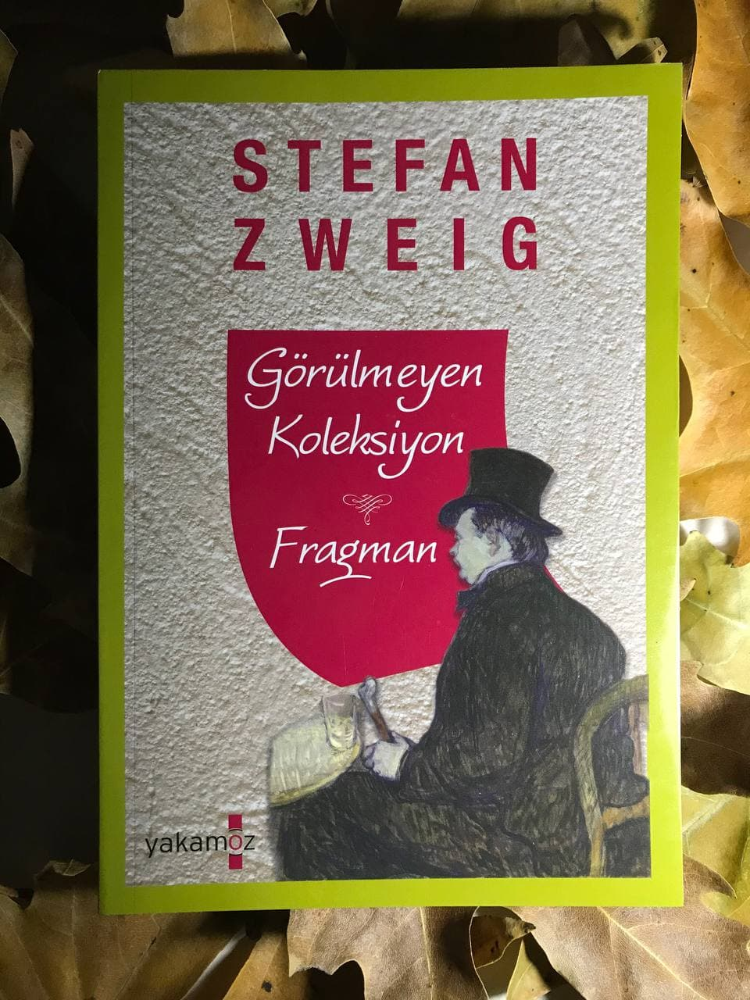

# Görülmeyen Koleksiyon & Fragman - Stefan Zweig 
## 80 Sayfa
### 22.01.2021
  
 

  

    
     

 
 

> ***Görülmeyen Koleksiyon***

Antika işiyle uğraşan kahramanımız. Bir gün 60 yıl kadar öncesinde bir mektup ile düzenli olarak, antika sattığı bir koleksiyoncuyla arasında geçen mektubu buluyor. Öyle olunca da bu adamı merak edip, yaşadığı yere gidiyor. Bir şekilde adamın evine ulaşan kahramanımız o adam ile konuşmak istediğini söylüyor. Adamın karısı, koleksiyoncuya geleni anlatınca, koleksiyoncu kahramanımızı hatırlıyor ve onu içeriye davet ediyor.

Kahramanımız içeriye giriyor ve fark ediyor ki, bu koleksiyoncu yaşlı adam gözlerini kaybetmiş ve hiçbir şey göremiyor. Öyle olunca bir süre sohbet ettikten sonra yaşlı adam koleksiyonlarını göstermek istiyor, ama araya adamın karısı giriyor ve bunu çeşitli bahaneler ile engelliyor. Bir kaç saat sonra gelmesi için kahramanımıza işaretler yapıyor ve kahramanımız kabul ediyor.

Bir kaç saat sonra kahramınımızın yanına onların kızları geliyor ve olanları anlatıyor.. Yıllar önce, savaş yıllarında babası gözlerini kaybettiği için bir süre sonra geçinememeye başlamışlar. İlk başlarda babasının antikalarını dokunmayan bu anne, kız bir süre sonra bakmışlar ki ellerinde kendilerine ait satacak bir şeyler kalmamış. Sonra bir bir bu adamın antikalarını satmaya başlamışlar, tabi tüm bunların mecburiyetten ve hayatta kalma çabası için olduğunu söylüyorlar... Sonuç olarak kız, kahramanımıza babasını üzmemesi için yalanlarına ortak olmasını istiyor. En sonunda kahramanımız mecbur kabul ediyor.

Kahramanımız tekrardan evlerine misafir olarak geldiklerinde ise, yaşlı adam çocuk gibi büyük bir sevinçle onları karşılıyor. Gerçekten büyük bir mutluluk ile yıllardır ezbere bildiği gibi albümleri tek tek gösteriyor ve fotoğraflardaki tüm detayları tek tek anlatıyordu ama ne yazık ki, albümlerde boş kağıtlar, antikaların yerlerinde ise aynı şekilde değersiz kopyalar duruyordu.. Fakat yaşlı adam, büyük bir keyif ve mutluluk ile anlatıyordu ki etkilenilmeyecek gibi değildi... Bu güzel dakikaların ardından, vedalaştılar ve kahramanımız oradan ayrıldı... Ama yaşlı adamın o mutlu hali, görülmeye değerdi.

_____

> ***Fragman (s.35)***

Ruzena isminde bir kadın, ona herkes "kuru kafa" olarak biliyordu. Yüzünün şekli itibariyle böyle bir isim takmışlardı... Bu kadın tek başına ormanda yaşıyordu. Bir gün yine evine doğru giderken birden karşısına üç tane adam çıktı ve Ruzena'ya saldırdılar. Üç adam birlikte ayrı ayrı, Ruzena'ya tecavüz ettiler. Büyük acı içerisinde yerde kanlar içinde yatan Ruzena, bir şekilde evine dönmeyi başardı..

Bir kaç ay sonra fark etti ki hamileydi. Bunu kimsenin duymaması için uzun bir süre kimseyle görüşmedi ve şehre de inmedi. Hemen bu çocuğu doğurduktan sonra onu gömmeyi ve ondan kurtulmayı düşünüyordu.

O gün geldi çattı ve tek başına evdeyken büyük bir sancı içerisinde doğumunu yaptı. O acı ve sancıyla doğumun hemen ardından uyup kaldı ve ertesi gün uyandığında, bebeğin kendi kendini ölmüş olmasını diledi. Ama oradan bir ağlama sesi duydu, bebeğe baktığında bir o kadar tatlı olan bu çocuğa karşı büyük bir şefkat hissetti ve onu emzirerek beslemeye başladı. Artık bundan sonra da büyük bir tutkuyla oğlunu sahiplendi. Onu büyüttü, artık her şeyi oğlu Karel'di ondan ayrılmak istemiyordu. Oğlundan başka hiçbir şeyi yoktu ve sadece kendisine aitti. Oğlunu kimseciklere veremezdi.

Oğlu bir süre dışarıya okumaya gitti ve sadece her hafta sonu Ruzena'nın yanına geliyordu.. Bir gün 18 yaşını doldurduğu için askere savaşa çağırıldığına dair bir kağıt ile geldi...
Bunu duyan Ruzena, hemen oğlunu azarladı ve kendisinin sözünden çıkmaması için yemin ettirdi. Bir süre oğlunu ormandaki evinde sakladı. Her gün şehre inip, oğlunun askerde olduğu ve kendisine mektuplar yazdığı yalanlarını söyleyip bu işten sıyrılabileceğini düşünmüştü. Çokta bu konuda çaba sarf etmişti ama maalesef yetmedi... Bir gece jandarmalar geldi, köpek ile arayarak Karel'i buldular. Ruzena, her ne kadar oğlunu vermemek için dirense de en sonunda gücü tükenmişti artık... İkisini birlikte sürükleyerek ertesi gün köylünün içerisinden geçirip tutukladılar.

_______

 

### Kitaptan Alıntılar ;
- ***"Aslında ruhsuz bir adam olarak, değerli parçayı bir adamı kandırarak kendisinden almak için gelmiştim. Ancak bundan çok daha fazlasını almıştım. Hayatımda ilk kez saf heyecanı, saf sevgiyi görmüş ve hissetmiştim." (s.30)***
- ***"Yukarıdaki yaşlı adamın mutluluktan parlayan yüzü; tüm o asık suratlı, dünyevi telaşların peşinde koşmaktan yorulmuş insanların üzerinde güneş gibi parlıyordu." (s.31)***
- ***O an Goethe'nin olduğunu düşündüğüm eski ve doğru bir söz aklıma geldi:   "Koleksiyoncular mutlu insanlardır." (s.31)***