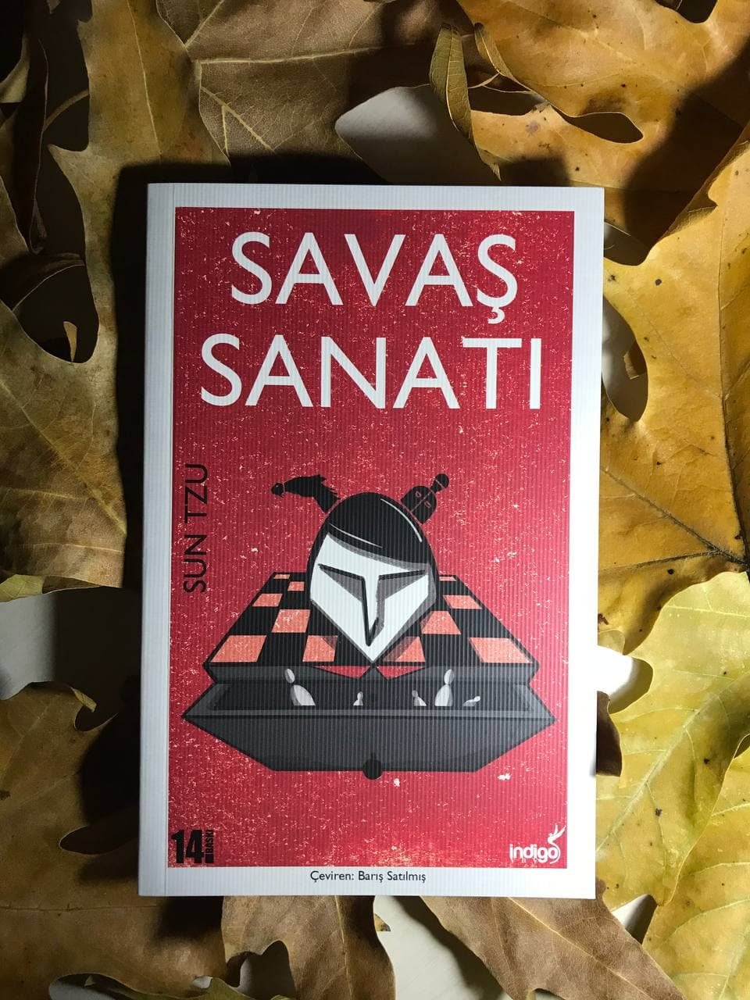

# Savaş Sanatı - Sun Tzu
## 90 Sayfa
### 22.01.2021
  
 

  

    
     

 
 

***M.Ö 400'lerde Sun Tzu tarafından kaleme alınan ve aradan geçen binlerce yıla rağmen günümüzde hâlâ değerini koruyan Savaş Sanatı, yazılı tarihin en değerli taktik-strateji eserlerinden birisidir. Doğu ve Batı ordularına kılavuzluk etmesinin yanı sıra, Savaş Sanatı şimdilerde büyük ya da küçük iş adamlarının ve liderlerin dayandığı temel kaynaklardan biri haline gelmiştir. Hayatın her safhasında mücadele etmek zorunda kaldığımız şu günlerde Sun Tzu'nun Savaş Sanatı, hâlâ uygulanabilir örneklerle, başarılı olmak ve güçlü kalmak isteyenler içni mutlaka okunması gereken bir eser.*** 

______

***Günümüzde hepimiz "bilgi çağında" olduğumuz konusunda hemfikirizdir. Savaş Sanatı'ndaki en temel prensiplerden birisi de bilginin gücüdür. Bizler belki bir komutan ya da CEO olmayabiliriz fakat hepimiz her gün sessizce savaşlar vermeye devam ederiz. Belki bir terfi için, belki ilişkimiz için... Sun Tzu bize galibiyeti getirecek kişi olabilir. (s.8)***
______

Kitabın içerisinde madde madde şu başlıklar açıklanmıştır;
- Planlama
- Savaş
- Stratejik Saldırı
- Taktik Planlar
- Enerji
- Zayıf ve Güçlü Noktalar 
- Manevralar
- Taktik Biçimleri
- Hareket Halindeki Ordu
- Arazi
- Dokuz Şart 
- Ateşle Saldırı
- Casusların Kullanımı

Bu şekilde olmak üzere 13 başlık maddeler halinde açıklanmıştır.

 

### Kitaptan Alıntılar ;
- ***"Her savaş aldatma üzerine kuruludur."   Bu nedenle saldırabilecek durumdayken, saldıramaz gibi görünmeliyiz; güçlerimizi kullanırken pasif gibi görünmeliyiz; yaklaştığımızda düşmanın uzakta olduğumuza inanmasını sağlamalıyız; uzak olduğumuzda yakın olduğumuza inandırmalıyız. (s.11)***
- ***"Savaşı kazanan general savaştan önce kafasında birçok hesaplama yapar. Savaşı kaybeden general öncesinde çok az hesaplama yapar. Bu nedenle çok hesap yapmak zafere, az hesap yapmak mağlubiyete neden olur. Hiç hesap yapmamak nelere neden olur! Bu noktaya dikkat ederek kimin kazanıp kimin kaybedeceğini tahmin edebilirim." (s.12)***
- ***"Orduların lideri insanların kaderlerine hükmeden kişi olarak bilinir, ülkenin barış içinde yaşaması veya tehlikede olması ona bağlıdır." (s.16)***
- ***"Bu nedenle şöyle diyebiliriz: Düşmanınızı ve kendinizi tanıyorsanız yüz savaşın sonucundan bile korkmanıza gerek olmaz. Kendinizi tanıyorsanız ama düşmanınızı tanımıyorsanız kazandığın her zafere karşı bir yenilgi yaşarsınız. Ne düşmanı ne de kendinizi tanıyorsanız her savaşta yenilirsiniz." (s.19)***
- ***"Kuru bir yaprağı kaldırmak güç gösterisi değildir, güneşi ve ayı görmek keskin bir görüşün işareti değildir, şimşeğin sesini duymak hızlı bir kulağın göstergesi değildir." (s.22)***
- ***"Bir hamle yapmadan önce iyice düşünün ve plan yapın." (s.37)***
- ***"Saptırma kurnazlığını öğrenen kişi zaferi kazanır. Manevra sanatı budur. (s.37)***
- ***"Gidilmemesi gereken yollar, saldırılmaması gereken ordular, kuşatılmaması gereken şehirler, karşı konulmaması gereken pozisyonlar, hükümdarın uyulması gereken emirleri vardır." (s.41)***
- ***"Kuşların uçuşu sırasında yükselmesi bir pusuya işarettir. Huzursuz hayvanlar ani bir saldırının geldiğinin göstergesidir." (s.48)***
- ***"Bu nedenle askerlere ilk seferinde insanca davranılmalıdır ama sert bir disiplin altında tutulmalıdırlar. Zafere giden kesin yol budur." (s.50)***
- ***"Askerlerinize çocuklarınız gibi davranın ki sizi en derin vadilere kadar takip etsinler, onlara sevgili oğullarınız gibi davranın ölümde bile yanınızda dursunlar." (s.54)***
- ***"Rakibinizin değer verdiği bir şeyi ele geçirin o zaman sizin iradenize teslim olur." (s.59)***