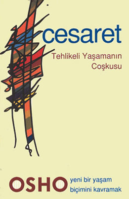

# Cesaret - Osho 
## 224 Sayfa
### 28.01.2021
  
 

  

    
     

 
 

_____

> ***Hiç kimse başkasının kendisi olmasına izin vermiyor. Bu fikirler o kadar derinine işlemiştir ki, sanki kendi fikrinmiş gibi görünür. Rahatla. Bütün bu şartlandırmaları unut, kuruyan yaprakların ağaçlardan yere düşmesi gibi onları bırak. Plastik yapraklara, plastik çiçeklere sahip olmaktansa, yapraksız, çıplak bir ağaç olmak daha iyidir.***

> ***Ama bir şeyi unutma: Risk alma sanatını asla unutma; asla, asla. Her zaman risk almaya hazır ol. Ne zaman risk alacağın bir fırsat çıkarsa, onu kaçırma ve asla kaybetmeyeceksin. Risk, gerçekten canlı olmanın tek garantisidir.***

> ***En sevdiği bara giren yaşlı adam normalde çalışan garson kızın yerine bir yabancının çalıştığını görmüş. En başta çok zorlanmış ama sonra cesaretini toplayıp yeni garson kıza 'uzun zamandır gördüğü en güzel kız' olduğunu söylemiş.  
Garson kız biraz kibirli bir tipmiş ve burnunu havaya kaldırıp "Üzgünüm ama iltifatınıza aynı şekilde karşılık veremeyeceğim." demiş.  
Adam sakin bir şekilde yanıtlamış: "Peki o zaman benim yaptığımı yapamaz mıydın, tatlım? Yalan söyleyemez miydin?"***

______

 

### Kitaptan Alıntılar ;
- ***Eğer her şey önceden bilinirse, o zaman bir heyecan, bir görkem yoktur. O zaman sadece robotlaşırsın.***
- ***Hayat belirsizliklerle doludur, sürprizlerle doludur. Zaten onun güzelliği de buradadır. "İşte şimdi emin oldum" diyebileceğin bir ana asla ulaşamazsın. Emin olduğunu söylediğin an, ölümünü ilan etmiş olur, intihar etmiş olursun.***
- ***Hiçbir kesinliğe yapışma. Hayat belirsizdir, hayatın doğası belirsizliktir. Zeki bir insan her zaman emin olmadan kalır.***
- ***Kimse ne olacağını bilemez. Bu seni sürekli merak içinde bırakır. Buna belirsizlik deme, merak de. Buna güvencesizlik deme, özgürlük de.***
- ***Eğer cesur değilsen samimi olamazsın.  
Eğer cesur değilsen sevemezsin.  
Eğer cesur değilsen güvenemezsin.  
Eğer cesur değilsen, gerçeğin peşine düşemezsin.  
O yüzden önce cesaret gelir.  
Ve diğer her şey onu izler.***
- ***Başlangıçta korkak ile cesur insan arasında pek bir fark yoktur. Aradaki tek fark: Korkak korkularını dinler ve onları izler. Cesur ise korkularını bir kenara koyup, ileri adım atar. Cesur insan, bütün korkularına rağmen bilinmeyene adım atandır.***
- ***Kısacası cesaret, bilinmeyen için bilineni riske etmektir; tanıdık olmayan için, tanıdık olanı; konforsuzluk için, konforlu olanı; bilinmeyen bir varış noktası için, herkesin bildiği göç yollarını terk etmek demektir. İnsan başarıp başaramayacağını asla bilemez. Bu bir kumardır. Ama hayatın ne olduğunu sadece kumarbazlar bilir.***
- ***Ölmeye hazır olan birini öldürmek çok zor. Onu öldürmek anlamsız. Savaşan birini öldürürsün; o zaman öldürmenin bir anlamı var. Ama ölmeye hazır olan, işte kafam burada, onu kesebilirsin diyen bir adamı öldüremezsin."***
- ***"Ama kimse onu zorlayamıyor çünkü ölümden korkmuyor. Bir insan ölümden korkmadığı zaman, ona nasıl zorla bir şey yaptırabilirsiniz?"***
- ***Seni köle yapan şey kendi korkuların; senin korkuların. Korkusuz olduğun zaman artık köle değilsin. Aslında başkalarını, onlar seni köle yapmadan köle yapmaya zorlayan güç senin kendi içindeki korkudur.***
- ***Zihin, biriktirilmiş geçmişten başka bir şey değildir, hafızadır. Kalp ise gelecektir, kalp her zaman umuttur, kalp her zaman gelecekte bir yerdedir. Kafa geçmişi düşünür; kalp geleceği hayal eder.***
- ***Neden korkuyorsun? Dünya sana ne yapabilir? İnsanlar sana gülebilir; bu onlara iyi gelir. Gülmek her zaman bir ilaçtır, sağlıklıdır. İnsanlar deli olduğunu düşünebilir. Onların seni deli olarak görmesi senin deli olduğun anlamına gelmez.***
- ***Kalbini tüm varlığınla dinlersen, asla yanlış yapmazsın. Ve kalbini dinlediğin zaman, asla bölünmezsin. Kalbini dinlediğin zaman, neyin doğru, neyin yanlış olduğunu düşünmeden doğru yola adım atmaya başlarsın.***
- ***Seni nereye götürürse onu takip et. Evet, bazen seni tehlikelere götürecek; ama unutma, seni olgunlaştırmak için o tehlikeler gereklidir. Bazen seni yanlış yola sokacaktır. Ama yine unutma, o yanlış yollar, büyümenin bir parçası olacak. Birçok kere düşecek, tekrar kalkacaksın. Çünkü insan böyle güç toplar: Düşüp tekrar kalkarak. İnsan böyle bir bütün olur.***
- ***Ve unutma, ben sana her zaman doğru yola gideceğin garantisi vermiyorum. Birçok kere, bir çok şey seni yanlış yola yönlendirecek çünkü doğru kapıya gelmek için, insanın önce birçok yanlış kapıyı çalması gerekir. Hayat böyle. Eğer birden doğru kapıya rastlarsan, onun doğru olduğunu anlayamazsın. O yüzden unutma, son tahlilde hiçbir çaba boşuna değildir: Her çaba, senin gelişmenin doruk noktasına ulaşmana katkı yapar.***
- ***Kararsız olma. Yanlış yola sapman endişe yaratmasın. Sorunlardan biri bu: İnsanlara asla yanlış bir şey yapmamaları öğretiliyor, onlar da yanlış yapmaktan o kadar korkmaya başlıyorlar ki, hiçbir şey yapmıyorlar. Hareket edemiyorlar. Yanlış bir şey olabilir. O zaman bir kayaya dönüşüyorlar, hareket kabiliyetlerini yitiriyorlar.  ***
***Mümkün olduğunca çok sayıda hata yap ama bir şeyi unutma: Aynı hatayı tekrarlama. O zaman gelişirsin***
- ***Hayat bir problem değildir. Onu bir problem olarak ele almak yola yanlış adımla başlamaktır. O, yaşanacak, sevilecek, deneyimlenecek bir gizemdir.***
- ***Güneş altında eskiden kalma hiçbir şey yoktur, sana diyorum ki, her şey yenidir. İstisnasız hareket halinde olan, inanılmaz bir dinamizmdir. Sadece değişim kalıcıdır, sadece değişim asla değişmez.***
- ***Ve bilmeden özgürleşemezsin. Bilgi özgürleştirir, sadece bilmek özgürleştirir. Bütün inançlar ödünç alınmıştır; sana başkaları tarafından verilmiştir, onlar senin içinde açan çiçekler değildir. Ve, ödünç alınmış bir şey seni nasıl gerçeğe götürür, mutlak gerçeğe?***
- ***Sadece şunu anla: Eğer kendine güvenmiyorsan, bir başkasına ya da bir şeye nasıl güvenebilirsin? İmkansızdır. Eğer kendinden kuşku duyuyorsan nasıl güvenebilirsin? Güvenecek olan sensin ve sen kendine güvenmiyorsun; o zaman kendi güvenine nasıl güveneceksin?*** 
- ***Bu bir Doğu masalıdır. Konusu aklınla ve kalbinle ilgilidir. Dilencilikle bir ilgisi yoktur; seninle bir ilgisi vardır. Orman yangınıyla bir ilgisi yoktur; seninle bir ilgisi vardır, çünkü yanmakta olan sensin. Her an yanıyor, acı çekiyor, sancılar içinde sızlanıyorsun. Akıl tek başına kördür. Bacakları vardır, hızlı koşabilir, çok hızlı yol alabilir; ama kör olduğu için hangi yöne gideceğini bilemez. O yüzden sürekli tökezler, düşer, kendine zarar verir ve hayatın anlamsız olduğunu düşünür. Dünyadaki bütün entelektüeller bunu söyler: "Hayat anlamsızdır" derler.***  
- ***"Hiçbir gariplik yok; basit bir matematik. Sahip olduğun şeyi kanıksamaya başlıyorsun. Sana, onu kaybetme ihtimalinin gösterilmesi lazım; ancak o zaman ne kaybettiğinin farkına varıyorsun. Yeni hiçbir şey kazanmadın. Bu, huzursuz bir şekilde taşıdığın torbanın kendisi. Şimdi aynı torbayı kalbine bastırıyorsun ve herkes, ne kadar mutlu ve huzurlu olduğunu görüyor: mükemmel bir bilge! Evine git ve kimseyi rahatsız etme."***
- ***HİÇBİR ZAMAN AKLINDAN ÇIKARTMA: BİLİNMEYENE GÜVEN. Bilinen zihindir; bilinmeyen zihin olamaz. Başka bir şey olabilir, ama zihin olamaz. Zihin hakkında kesin olan tek şey vardır: Zihin, biriktirilmiş bilinendir. O yüzden, örneğin, eğer yolda bir kavşağa gelirsen zihin sana, "Bu yoldan git, burası tanıdık" der; zihin işte budur. Eğer varlığını dinlersen, o tanınmadık yoldan gitmek ister: bilinmeyene. Varlık, her zaman maceraperesttir. Zihin, her zaman çok muhafazakar, çok doğrucudur. O hep izleri takip etmek, daha önce tekrar tekrar gitmiş olduğu yoldan gitmek ister: En az direncin olduğu yoldur.  
O yüzden her zaman bilinmeyeni dinle. Ve cesaretini toplayıp, bilinmeyene adım at.***
- ***Hayat, ancak tehlikeli yaşanır; onu yaşamanın başka bir yolu yoktur. Ancak tehlike sayesinde hayat olgunlaşmayı ve gelişmeyi sağlar. İnsanın maceraperest olması gerekir; her zaman bilinmeyen için bilineni riske atmaya hazır olmalıdır. Ve insan, özgürlüğün ve korkusuzluğun tadını alınca, asla pişmanlık duymaz; çünkü artık en üst düzeyde yaşamanın ne demek olduğunu öğrenmiştir. İnsan ondan sonra yaşamının meşalesini her iki uçtan yakmanın ne anlama geldiğini bilir. Ve o yoğunluğu tek bir an hissetmek bile, sonsuza dek sıradan yaşamaktan çok daha tatmin edicidir.***
- ***Sen tek boyutlu yaşadın, tek boyutlu bir şekilde düşündün, inançların üzerine rahat bir hayat kurdun. Sonra yeni bir şey kapını çaldı. Şimdi bütün geçmiş alışkanlıkların huzursuz olacak. Eğer yeninin girmesine izin verirsen, bir daha asla aynı olmayacaksın. Yeni olan seni dönüştürecek.***
- ***Yeninin görünümünü anlamaya çalış. Dünyadaki herkes yeni olmak ister; çünkü hiç kimse eskiden tatmin olmamıştır. Kimse eskiyle tatmin olamaz, çünkü ne olursa olsun, onu biliyorsun. Bir kez bilindi mi, tekrar haline geldi demektir; bir kere bilindi mi, sıkıcı, monoton hale gelmiştir. Ondan kurtulmak istersin. Keşfetmek, macera yaşamak istersin. Yeni olmak istersin. Ama buna rağmen, yeni gelip kapıyı çaldığında, geriye kaçar, eskide saklanırsın, ikilem budur.***
- ***Nasıl yeni olacağız? Ve herkes yeni olmak istiyor! Bunun için cesarete ihtiyaç vardır ve sıradan cesarete değil; olağanüstü cesarete ihtiyaç vardır. Dünya korkaklarla doludur ve o yüzden de insanlar gelişmeyi durdurdu. Eğer bir korkaksan nasıl gelişirsin? Her yeni fırsatta, gözlerini kapatıyor, geri çekiliyorsun. Nasıl gelişirsin? Nasıl varolabilirsin? Sadece "mış" gibi yaparsın.***
- ***Yeniyi her zaman büyük bir coşkuyla kabul et. Bazen yeni seni sıkıntıya soksa bile, yine de buna değer. Yeni seni bir çukura doğru yöneltse bile, yine de buna değer. Çünkü insan ancak hata yaparak öğrenir ve ancak zorlukları aşarak gelişir. Yeni her zaman zorluk getirecektir. Sen o yüzden eskiyi seçiyorsun; o, hiçbir zorluk getirmez. O, bir avuntudur, o, bir sığınaktır.***
- ***Pek çok kere bu başına gelir; eğer bir şeyi hatırlamak konusunda fazla gerilirsen, onu hatırlaman zorlaşır. O gerginlik yüzünden, varlığının üstündeki o baskı yüzünden, hafıza, içindeki bilgiyi sana göstermiyor. Birinin adını hatırlamaya çalışıyorsun da çalışıyorsun, ama her ne kadar dilinin ucunda olduğunu söylesen de gelmiyor. Bildiğini biliyorsun, ama yine de isim ortaya çıkmıyor.***
- ***Sırf cesaret eksikliği yüzünden sürekli HAYATTA BİR ÇOK ŞEYİ KAÇIRIYORUZ. Aslında başarmak için hiçbir çabaya gerek yok; cesaret yeter. Ve o zaman, senin kovalaman yerine, her şey sana gelmeye başlar; en azından iç dünyada bu böyledir.***
- ***Korku, sevgi eksikliğinden başka bir şey değildir. Bir şeyi sevgiyle yap, korkuyu unut. Eğer iyi seversen, korku kaybolur.***
- ***Karanlık diye bir şey yoktur, karanlığı ortadan kaldıramazsın. Ne istersen yap ama, karanlığı yok edemezsin. Onu getiremezsin, onu atamazsın. Eğer karanlıkla bir şey yapmak istiyorsan, ışıkla bir şey yapmak zorunda kalacaksın; çünkü, ancak varolan bir şey ile ilişki kurulabilir. Işığı kapatırsın, karanlık olur; ışığı yakarsın, karanlık kaybolur. Ama sen ışıkla bir şeyler yapıyorsun; karanlıkla hiçbir şey yapamazsın.  
Korku, karanlıktır; sevgi yokluğudur. Korkuya ilişkin olarak hiçbir şey yapamazsın. Ve ne kadar yapmaya çalışırsan, o kadar çok korkacaksın; çünkü giderek bunun mümkün olmadığını daha fazla hissedeceksin. Sorun giderek daha karmaşık hale gelecek. Eğer karanlıkla savaşırsan, yenilgiye uğrayacaksın. Bir kılıç alıp karanlığı öldürmeye çalışabilirsin; sadece yorgunluktan tükeneceksin. Ve sonunda zihin, "Karanlık o kadar güçlü ki, onu yenmem mümkün değil." diye düşünmeye başlayacak.***
- ***Korku, sevginin yokluğundan başka bir şey değildir. Sevgiyle bir şey yap, korkuyu unut gitsin. Eğer iyi seversen, korku kaybolur. Eğer derinden seversen, korku bulunmaz.
Birine, tek bir an için bile olsa gerçekten aşık olduğun zaman, ortada korku var mıydı?   İki insanın birbirini, tek bir an için bile olsa, derinden sevdiği bir ilişkide; bir araya geldiklerinde, birbirleriyle tam uyum içinde oldukları o anda, hiçbir zaman korku ortaya çıkmamıştır. Sanki ışık yakılmıştır ve karanlık ortada yoktur. Gizli anahtar budur: Daha fazla sev.***
- ***Bu risklidir. Bir başkasının gönlüne ulaşmasına izin vermen riskli ve tehlikelidir çünkü o kişinin sana ne yapacağını bilemezsin. Bütün sırlarını öğrendikten, bütün gizlediklerin açığa çıktıktan, kendini tamamen açığa çıkarttıktan sonra diğer insanın ne yapacağını asla bilemezsin. Korku oradadır. Zaten o yüzden kendimizi hiç açmayız.***
- ***Sevgi nadiren açan bir çiçektir. Sadece arada bir gerçekleşir. Milyonlarca insan sevgili oldukları yanlış inancına kapılmıştır. Onlar sevdiklerine inanıyor ancak bu yalnızca onların inancı.***
- ***Ancak sevgi zordur. Korkunun geride bırakılması gerekir. İşin garip tarafı da bu; kaybedecek hiçbir şeyin olmamasına rağmen bu kadar korkuyor olman.***
- ***Kaybedecek neyin var? Hiçbir şey. Ölüm bu bedenini elinden alacak; ölüm onu almadan önce, onu sevgiye ver. Her şeyin elinden alınacak; alınmadan önce neden onları paylaşmıyorsun? Ona sahip olmanın tek yolu bu. Eğer paylaşıp verebiliyorsan, efendi sensin. Zaten elinden alınacak; hiçbir şeyi sonsuza dek elinde tutamazsın. Ölüm her şeyi yok edecektir.***
- ***Eğer tepki vermiyorsa onu yaralaman mümkün olmayabilir. Eğer onu rahatsız edemiyorsan, ne yapabilirsin? Onun karşısında kendini güçsüz hissedersin.***
- ***Bu durumda, diğerinin yaralanacağı kesin değildir. Ama kesin olan bir şey var: Eğer birinden nefret ediyorsan, önce kendi ruhunu sayısız şekilde yaralaman gerekiyor; başkalarına zehir atabilmek için önce bu zehri içinde biriktirmen gerekiyor.***
- ***Egoist biri her zaman korkak olacaktır. Hiçbir yakınlığa izin veremez. Dostluk, sevgi ve hatta normal arkadaşlık bile tehlikelidir. Adolf Hitler odasında birinin uyumasına asla izin vermezdi. O her zaman yalnız uyur, kapıyı içeriden kilitlerdi. Hiç evlenmedi, çünkü çok basit bir nedeni vardı: Eğer evlenirsen, eşinin odaya gimesine izin vermek zorunda kalırsın. Sadece odaya değil, yatağına da almak zorunda kalacaktı. Bu fazla yakın olacaktı ve fazla tehlikeliydi.***
- ***Egosuz olmak ise korkusuz olmaktır. Çünkü artık senden hiçbir şey alınamaz; ölüm bile içinde var olan hiçbir şeyi yok edemez. Birisi tarafından yok edilebilecek olan tek şey egodur.***
- ***Kimse yarın ne olacağını bilmez.  
Gerçek varlığının farkına varmadan ölme.  
Gerçek varlıklarıyla yaşamış ve gerçek varlıklarıyla ölmüş o çok az sayıdaki insan gerçekten şanslı olanlardır. Çünkü onlar hayatın sonsuz ve ölümünse kurgu olduğunu bilir.***
- ***Başka insanların düşüncelerine bağımlısın. Başka insanların fikirlerine o kadar bağımlısın ki, kendi iç sesinle bağlantını bile kaybettin. İç sesini yeni baştan keşfetmen gerekiyor çünkü güzel olan her şey, iyi olan, kutsal olan her şey ancak içsel olarak hissedilebilir.***
- ***Çok eski bir atasözü vardır:  
Birçok kişi, korkak olma cesaretini gösteremediği için kahraman olmuştur.***
- ***Nerede ölüm riski varsa, orada muhteşem bir keyif vardır çünkü hayatını kaybetme riski seni inanılmaz canlı yapar. O yüzden tehlikeli sporlar insanlara cazip gelir.***
- ***Biz ne yapıyoruz? Bir kadına aşık oluyor ve hemen bir evlenme bürosuna ya da kiliseye giderek evleniyoruz. Sana evlenme demiyorum. O bir formalite. İyi; toplumu tatmin et ama zihninin derinliklerinde kadını sahiplenmeye kalkma. Asla, tek bir an için bile, "sen bana aitsin" deme. Çünkü bir insan nasıl sana ait olabilir? Ve sen bir kadına sahip olmaya başladığın zaman, o da seni sahiplenmeye başlayacak. O zaman ikiniz de artık aşık değilsiniz. Sadece birbirinizi eziyor, öldürüyor, felç ediyorsunuz.***
- ***Ama bu mümkün değil. Ne yaparsan yap, hayat bir gizemdir ve gizem olarak kalmaya devam edecektir.***
- ***Beni seviyorsun, bana güveniyorsun. O yüzden söylediklerimin doğru olduğuna güvenebilirsin. Ama bir şeyi tekrar tekrar vurguluyorum: Kendi deneyimine dayalı olmayan her şeyi sadece bir varsayım olarak kabul et. Onu bir inanca dönüştürme. Eğer bazen bir örnek veriyorsam, gerektiği için veriyorum; çünkü insanlar "Çocukluğunda nasıl bu kadar zeki ve cesur olabilmeyi basardın?" diye sordu.  
Ben bir şey yapmadım, sadece geçmiş hayatımda ne yapıyorsam onu yapmaya devam ettim. Cesaret sana da gelecek. Sadece basit bir formülle başla: Asla bilinmeyeni kaçırma.
Her zaman bilinmeyeni seç ve kafanın dikine git. Sıkıntı çeksen bile buna değer; her zaman değer. Her zaman daha büyümüş, daha olgun, daha zeki çıkarsın.***
- ***Korku vardır ama kimse korkusunu göstermek istemez, çünkü eğer korktuğunu gösterirsen, seni daha fazla korkutmak isteyen insanlar sıraya girecektir. Derin bir korku yaşadığını öğrendikleri zaman, herkes sana tekme atmak isteyecektir. Seni aşağılamak hoşlarına gider, kendilerinden daha zayıf birini bulmuşlardır. İnsanlar istismardan hoşlanır, o insana tekme atmak ister...***
- ***Eğer sahte olanı riske edebilirsen, gerçek senin olabilir. Ve buna değer çünkü sadece sahte bir şeyi riske edip gerçeğe sahip olacaksın. Hiçbir şey riske etmeden her şeye sahip olacaksın.***
- ***"Heyecan hissetmiyorum" diyorsun. Nasıl heyecan duyacaksın? Heyecan sadece yapmak istediğin bir şeyi yaparken hissedilir. Konu ne olursa olsun.***
- ***Vincent Van Gogh, resim yaparken çok mutluydu. Tek bir resmi bile satılmadı, kimse onu takdir etmedi ve açtı, açlıktan ölüyordu. Kardeşi ona yemek yiyebilmesi için her hafta az bir para veriyordu. Haftada dört gün oruç tutar ve üç gün yemek yerdi. Dört gün oruç tutmak zorundaydı çünkü başka türlü tuval, boya ve fırça için nasıl para bulacaktı? Ama o çok mutluydu; büyük bir heyecan yaşıyordu.
Sadece otuz üç yaşındayken öldü; intihar etti. Ama onun intiharı bile senin sahte hayatından çok daha iyidir çünkü resmini yapmak istediği şeyin resmini tamamladıktan sonra intihar etti. En büyük arzusu bir günbatımı resmi yapmaktı ve resmini bitirdiği gün bir mektup yazdı: "işim tamamlandı, tatmin oldum. Bu dünyadan tatmin olmuş bir şekilde ayrılıyorum" dedi. İntihar etti ama ben buna intihar demeyeceğim. O tam yaşadı, hayat mumunu her iki ucundan çok büyük bir yoğunlukla yaktı.***
- ***Hâlâ vakit var; bugüne kadar yaşamış olduğun zindandan çık artık! Sadece biraz cesaret yeter, biraz kumarbaz cesareti yeterli. Ve unutma, kaybedecek hiçbir şey yok. Kaybedeceğin tek şey zincirlerin: sıkıntını kaybedebilirsin, sürekli içinde varolan bu bir şeylerin eksik olduğu duygusunu kaybedebilirsin. Kaybedecek başka ne var? Başkalarının bıraktığı tekerlek izlerini takip etmeyi bırak ve kendi varlığını kabullen. Musa'ya, İsa'ya, Buda'ya, Mahavira'ya ya da Krishna'ya karşı, kendini kabullen. Senin sorumluluğun Buda'ya, Zaratustra'ya, Kabir'e ya da Nanak'a karşı değil; sen sadece kendinden sorumlusun.***
- ***Sence ölüm beni korkutuyor mu? O kadar güzel ve dolu dolu yaşadım ki, öleceğim için hiçbir üzüntü hissetmiyorum. Yarın ne yapacağım ki? Her şeyi yaptım, yapılacak bir şey kalmadı. Eğer nabzım yavaşlıyorsa, kalbim yavaşlıyorsa, bence her şey çok iyi olacak çünkü kendimi çok huzurlu, sakin ve dingin hissediyorum.***