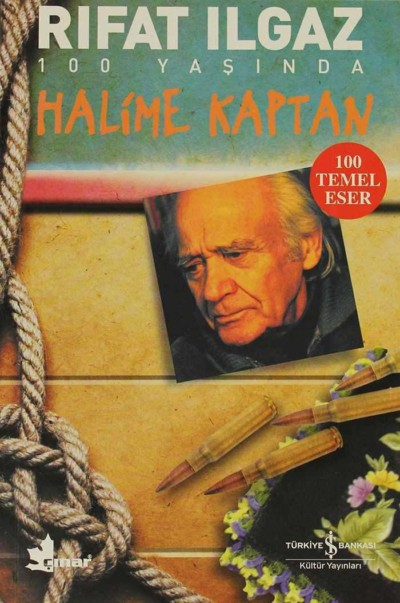

# Halime Kaptan - Rıfat Ilgaz
## 197 Sayfa
### 30.01.2021
  
 

  

    
     

 
 

***Karakterler;***
- ***Halime:*** Temel Reis'in gelini, Sabri'nin karısı.
- ***Temel Reis:*** Yılların denizcisi.
- ***Sabri:*** Halime'nin kocası, Temel Reis'in oğlu.
- ***Bekir:*** Temel Reis'in mürettebatından genç.
- ***Zeynel:*** Temel Reis'in mürettebatından genç.

 

_____

***Küçükçekmece Temmuz 1972 Rıfat İlgaz, Halime Kaptan da Cideli Temel Reis'in gelini Halime'nin bir kaptan olarak ortaya çıkışının öyküsünü anlatır. Eli silah tutan bütün erkeklerin cepheye gönderildiği Kurtuluş Savaşı yıllarıdır. Köyde yalnızca yaşlılar, kadınlar ve çocuklar kalmıştır. Herkesin tuza, şekere, ekmeğe hasret kaldığı o günlerde, evinin ihtiyaçlarını karşılamak için sefere çıkan Temel Reis, yolda hastalanarak hayatını kaybeder. Oğluyla bir başına kalan Halime'nin, geçimini sağlamak için babasından kalan sandalla Karadeniz'e açılmasının zamanı gelmiştir. Erkek kılığına girerek, oğlu ve iki tayfasıyla çıktığı ilk seferinde hırçın dalgalarla, korsanlarla mücadele etmek zorunda kalır. Bu zorlukların hiçbiri onu yıldırmaz, aksine Karadeniz e tutkuyla bağlanır. O artık İnebolu'ya cephane taşıyan, Kurtuluş Savaşı'nın fedakâr kadınlarından biridir, Halime Kaptan'dır...***
_____

O zamanlar savaş yılları olduğu için, fakirlik hat safhada. Yiyecek ve içecek bulmakta zorlanıyorlar. Çoğu şeyin satılması ellerinde olmadığı için durdulmuş. Kıtlık içerisinde yaşamaya devam etmeye çalışıyorlar.

Temel Reis, Bekir ve yanına bir kaç mürettebat daha alarak, Karadeniz'den Gelibolu'ya doğru yelken açmaya karar verdi. Zaten tüm erkekler cephedeydi. Geride Halime ve oğlunu bırakarak oradan ayrıldılar. Temel Reis giderken, Halime'yi muhtara emanet etti ve kendisini asker kaçaklarından korumasını söyledi.

Uzun bir yolculuğun ardından Temel Reis ve ekibi varacakları yere vardılar. Yumurtalarını bıraktılar. Satacaklarını sattılar, yiyecek içecek takviyesi yaptılar ve geriye dönmek için yola çıktılar. Bir süre sonra ise karşılarından onlara doğru gelen bir gemi gördüler. Muhtemelen bu gemi korsanlara aitti. Temel Reis'in akıllılığı sayesinde bir şekilde bundan kurtuldular.

Bir diğer tarafta ise bir gece Halime ve oğlu evdeyken birden kapıları çaldı. Halime, ilk başta çok fazla tereddüt etse sonradan kim o deme cesaretinde bulundu. Kapıda bekleyen ise kendi kocasıydı. Muhtemelen askerden kaçmıştı ve onları görmek istediğini, sabah ezanından önce de gideceğini söyledi. Fakat Halime, kocasını içeriye almayı kabul etmedi. Bir asker kaçağını içeriye alamam diyerek, onu reddetti. Ve kocasının diretmesi karşısında içeriden tüfeği aldı geldi ve camdan dışarıya bir el ateş ederek, evimin etrafında asker kaçakları var diyerek bağırdı...

Bir süre sonra ise Temel Reis'in mürettebatı eve döndüler. Ama yanlarında Temel Reis yoktu. Temel Reis hastalanıp yolda vefat etmişti. Bu sebeple Temel Reis olmadan döndüler. Halime onlara bir şeyler hazırlarken, eve Sabri çıktı geldi. Halime, Sabri'yi eve kabul etti. Birlikte yemek yediler ve sonra köyün koruyucusu eve kadar geldi ve muhtarın haberini Sabri'ye iletti. Sabriyle birlikte muhtarın yanına döndüler ve Sabri ile konuştuktan sonra Sabri cepheye gitmeye kabul etti ve Sabri'yi cepheye gönderdiler.

Bir süre sonra Halime, Temel Reis'in mürettebatı ve oğlu Memiş ile denize açılmak  zorunda kaldı. Odun ihtiyaçları vardı, onu karşılamak için uzak bir yere gittiler. Odunları sandallarına yüklediler, geriye evlerine dönerken karşılarına korsanlar çıktı ve yollarını kesti. Mecburen korsanların yanına sandallarını çektiler. Halime kaptan, oraya gelmeden önce ise kendisini erkeğe benzetti ve sesini kalınlaştırarak konuşmaya çalıştı, bu sebeple de kadın olduğunu belli etmedi.

Bu korsanlar zorla, Halime kaptan ve mürettebatını götürdüler. Bir süre sonra Halime kaptan onların elinden kurtuldu ve Kurtuluş Savaşı'nda büyük bir öncülük ile cepheden cepheye deniz yoluyla, mermi ve silah, cephane taşıdı... 

Bir gün, Halime kaptanın mürettebatından Zeynel, askerlik vakti geldiği için asker kaçağı olarak tutuklandı. Halime kaptan gidip binbaşı ile görüşerek onu oradan aldı ve kendisiyle birlikte deniz yoluyla cephane taşımak için emrinin altına aldı. Bu şekilde Zeynel'i oradan kurtarmış oldu. Yine bir gün, Karadeniz'de cephane almak için iki tane balıkçı teknesi ile buluşacaklardı ama çok fazla sis olduğu için karşılarına bir tane düşman gemisi çıktı ve arkalarında ise iki tane gemiyi tutuklamışlardı.

Halime Kaptan ve mürettebatı onlarla savaştılar el bombası attılar ve elbette kazandılar orayı, fakat Zeynel ağır yaralandı. Sonuç olarak, cephaneleri teslim aldılar ve gidecek yere götürdüler.

> ***- SON -***

 

### Kitaptan Alıntılar ;
- ***"Bu kış nasıl geçecekti, yokluk, yoksulluk içinde."***
- ***İnsanların en namussuzu kimdir bilir misin? Herkes toprağı için cephelerde dövüşürken düşmana arkasını dönüp kaçandır.***
- ***"Ana be!"  
"Ne var oğlum?"  
"Seni ben daha çok seviyorum be, babamdan!"  ***
- ***"Dilinin ucuna gelen her sözcük de hemen söylenemezdi ki.."***
- ***"Sen, ben neyiz ki bu patırtıda? Hepimiz bir araya gelirsek bir güç oluruz ancak."***
- ***Nerden geliyordu bu yalnızlık, kimsesizlik, çaresizlik duygusu..***
