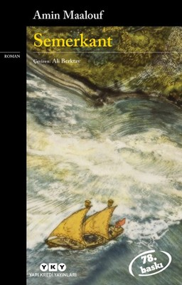

# Semerkant - Amin Maalouf
## 318 Sayfa
### 08.02.2021
  
 

  

    
     

 
 

> ***ŞAİRLER VE SEVGİLİLER (I)***

Ömer Hayyam bir gün şehre gelmişti. Yabancı bir adam tarafından durduruldu. Yabancı adam kendisine ismini sordu. ***"Ben ömer, Nişapurlu İbrahim'in oğlu."*** ve ardından yabancı adam ise halkın içerisinde bağırmaya başladı.. "Simyacı, simyacı"  ***Resmi makamların gözünde, feylesof olmak bir suç değildi ama simyacılığın sonu ölümdü.***

Bunun üzerine Ömer Hayyam'ı aralarına alıp, tekme tokat zarar vermeye başladılar. Kanlar içinde kalan Ömer Hayyam'ın imdadına Ebu Tahir (kadı) yetişti. ***Ebu Tahir, sadece kendi adamlarının tanıklığında, Ömer ile karşı karşıya geldiğinde, şu şaşırtıcı sözleri söyledi:
`"Bu yüce makamda, Nişapur'lu Ömer Hayyam'ı kabul etmek bir şereftir."`***

Sonrasında ise Ebu Tahir, Ömer Hayyam'e içi bomboş bir kitap verdi: ***Bu kitabı sakla. Düşüncende bir mısra oluştuğu ve gün ışığına çıkmak için dudaklarına kaydığı her seferinde, onu kendine sakla, sır gibi gizlenecek bu kitaba yaz. Yazarken de Ebu Tahir'i unutma.***

***Kadı, bu davranışı ile, bu sözleriyle, edebiyat tarihinde en iyi korunmuş gizlerden birine yol açtığını biliyor muydu? Ömer Hayyam'ın o ince şiirlerini keşfetmek, Rubaiyat'ını çağların en özgün yapıtı saymak ve Semerkant'ın bu elyazması kitabının garip öyküsünü öğrenmek için, aradan sekiz yüz yıl geçmesi gerekeceğini nereden bilecekti?***

____

Kitaplarda yer almış bir öyküdür. Üç arkadaştan söz eder. Derler ki: Binli yılların başlarında çağı etkilemiş üç İranlı vardır: Dünyayı gözlemlemiş olan Ömer Hayyam, dünyaya hükmetmiş olan Nizamülmülk ve dünyayı titretmiş olan Hasan Sabbah.
Derler ki, her üçü de Nişapur'da okumuştur. Ama doğru değildir bu! Nizam, Ömer'den otuz yaş büyüktü, Hasan da tahsilini Nişapur'da değil, Rey'de ve doğduğu kent olan Kum'da yapmıştır.
Gerçek, Hayyam'ın elyazması kitabında yer alıyor mu? Derler ki bu üç adam ilk kez İsfahan'da, Büyük Vezir'in Divanında buluşmuştur ve kaderin cilvesine bakın ki bu buluşma Hayyam'ın çabalarıyla gerçekleşmiştir.
____

Melikşah, müthiş bir oyuna getirildiğine, bir saniye olsun, kuşku duymuyordu. Tarihçilerin belirttiklerine göre, Nizamülmülk Hasan'ın kâtibini satın almış, bazı sayfaları yok etmesini, bazılarının yerini değiştirmesini emretmiş ve böylece rakibinin sabırla ve özenle yaptığı çalışmaları boşa çıkartmıştı. O istediği kadar komplo yapıldığını söylesin, çevresindeki gürültü sesini bastırıyor, Sultan da oyuna getirilişinin, dahası vezirinin vesayetinden kurtulma girişiminin başarısızlıkla sonuçlanmasının kusurunu Hasan'da buluyordu. Askerlerine onu tutuklamalarını söylemiş ve anında idamını emretmişti.  
Ömer ilk kez söz aldı:  
— Efendimiz merhamet etsinler. Sabbah belki kusur işlemiştir, belki çok aceleci ve çok işgüzar olmakla günah işlemiştir, ki bu yüzden kovulması gerekir, ama kimseye büyük bir kötülüğü dokunmamıştır.  
— Öyleyse gözlerine mil çekilsin. Demiri kızdırın.  
Hasan ses çıkarmıyordu. Ömer yeniden söz aldı. Kendisinin işe soktuğu bir adamın öldürülmesine ya da gözlerine mil çekilmesine gönlü razı olamazdı:
— Efendimiz diye yalvardı. Genç, gözden düşmüş olmanın tesellisini okumada bulacak bir adama, bu cezayı uygun görmeyin.
Bunun üzerine Melikşah:  
— İnsanların en bilge olanı, en saf yürekli olan senin için Hoca Ömer, kararımdan vazgeçiyorum. Hasan Sabbah sürgün edilecek ve ömrünün sonuna kadar uzak beldelerden birinde yaşayacaktır. İmparatorluk topraklarına bir daha asla ayak basmayacaktır, dedi.
Ama Kum kentinin adamı geri gelecek ve görülmemiş bir intikam alacaktır.
____

> ***HAŞHAŞÎLER CENNETİ (II)***

_____

Fedai'nin eğitilmesi, Hasan'ın büyük önem verdiği hassas bir işti. Hançerini saklamayı bilmek, aniden çıkartmayı becerebilmek, kurbanın tam kalbine saplayabilmek ya da kurban zırhlı ise şah damarını kesmek; posta güvercinlerini kendine alıştırmak, şifreleri akılda tutmak, Alamut ile süratli ve gizli haberleşme sağlamak, bazen bir yörenin lehçesini öğrenmek, yöresel şive ile konuşmasını bilmek, yabancı bir çevreye sızabilmek, bir çevreyle bütünleşmesini becerebilmek, infaz saati gelene kadar kuşku çekmemek, avı bir avcı gibi izlemek, yürüyüşünü, giyinişini, alışkanlıklarını, gezdiği yerleri akılda tutmak, yanına yaklaşılması zor biriyse yakınları ile ilişki kurup geliştirmek gibi şeyler öğretilirdi. Kurbanlardan birini öldürmek için, iki fedainin iki ay süresince, keşiş kılığı ile bir manastıra kapandıkları anlatılır.  
Bukalemun gibi renk değiştirme yeteneği, basit bir haşhaş kullanımı ile açıklanamaz. Her şeyden önce, tarikata girenin, çileden çıkmış kitlelerin onu param parça etmek üzere üstüne geldiğinde, ölümle burun buruna gelecek kadar imanlı olması gerekir.  
Hasan Sabbah'ın, Tarih'in en korkunç ölüm makinasını yarattığını kimse yadsıyamaz. Yine de bu kanlı yüzyılın sonunda, bu örgütün karşısına bir başkası dikildi. O da katledilen Vezir'e bağlı olanların Nizamiye'si idi ki o da, belki daha kurnaz ve daha az gösterişli yöntemlerle ölüm saçmış ve etkileri, diğeri kadar yıkıcı olmuştu.

____

Hayyam aniden duruldu. Son anda vekarını kaybetmemek! İnsan kaderinin bu doruk noktasına ulaşmak için yaşamlarını feda etmiş nice bilge vardır! Yaşamak için savunmaya geçecek değildi. Aksine, korkusunun her saniye azaldığını hissediyor, daha çok Cihan'ı düşünüyordu. Onun da vakur kaldığından emindi.  
— Karımı öldürenleri asla affetmezdim, ömür boyu onların düşmanı olurdum, günün birinde kazığa oturtulacaklarını düşlerdim. Benden kurtulmak istemekte haklısınız.
— Benim düşüncem bu değil üstadım. Karar veren beş subaydık. Hepsi ölümünü istedi, bir ben muhalif kaldım.  
— Hata etmişsin. Arkadaşların daha akıllıca davranmışlar.
— Seni Nizamülmülk ile çok sık gördüm. Baba oğul gibiydiniz. Karının davranışlarına rağmen seni hep sevdi. Aramızda olsaydı, seni mahkûm etmezdi. Karını da, senin hatırın için affederdi.  
Hayyam adamı süzdü, sanki onu yeni fark eder gibiydi:
— Madem ölmemi istemiyorsun, öldürmeye neden sen geldin? — Adaylığımı koyan ben oldum. Diğerleri seni öldürürlerdi. Benim niyetim seni kurtarmak.
Yoksa seninle böyle durup konuşur muydum?  
— Arkadaşlarına nasıl açıklayacaksın?  
— Açıklamayacağım. Gideceğim. Seninle birlikte.  
— Bunu, sanki uzun zamandan beri verilmiş bir karar gibi, ne kadar sakince söylüyorsun!
— Ama doğru. Ben düşünmeden hareket etmiyorum. Nizamülmülk'ün en sadık hizmetkârı idim, ona inancım tamdı. Tanrı isteseydi, onu korumak için canımı verirdim. Ama çok eskiden beri, Efendim öldüğü takdirde ne oğullarına, ne vârislerine hizmet etmemek, askerlikten ayrılmak kararı vermiştim. Ölüm biçimi, ona son bir hizmette bulunmamı gerektirdi: Melikşah'ın ölümünde benim de parmağım var ve bundan pişmanlık duymuyorum.
Vasisine, atasına, onu doruğa çıkartmış adama ihanet etti, ölmeyi hak etmişti. Öldürmem gerekti, yine de katil olmadım. Bir kadını asla öldürmezdim. Arkadaşlarım Hayyam'ı da kara listeye alınca, yaşam biçimimi değiştirmenin, bir keşiş ya da gezginci ozan kılığına girmenin sırası geldi diye düşündüm. Beni dinlersen üstadım, alacağını al ve bir an evvel bu kentten uzaklaşalım.  
— Nereye gitmek için?  
— İstediğin yere. Her yerde peşinden gelirim, bir mümin gibi. Kılıcım hizmetindedir. Ortalık yatışınca döneriz.

___

İsfahan'dan ayrılalı, Ömer Hayyam tam bir kaçak ve bir parya gibi yaşadı. Bağdat'a gittiğinde, Halife onun halka konuşma yapmasını ya da kapısına yığılan hayranlarını kabul etmesini yasaklamış, Mekke'ye gittiğinde, ona karşı olanlar ağız birliği ile "Hoş görünme umresi"  
yapmakla suçlamışlar, Basra'dan geçtiğinde, Kadı'nın oğlu, nazikçe ziyaretini kısa kesmesini istemişti.  
Gelecek can sıkıcı görünüyordu. Kimse dehasını, bilgisini yadsımamaktadır; nereye gitse, okur yazarlar, aydınlar çevresine toplanmaktadır. Gökyüzü bilimine, cebire, tıbba hatta dine ait sorular sormaktadırlar. Ama gelişinden birkaç gün ya da birkaç hafta sonra ona karşı komplo düzenlenmekte ve hakkında inanılmayacak hikâyeler uydurulmaktadır. Ona zındık veya sapık denmekte, Hasan Sabbah ile olan arkadaşlığı anımsatılmakta, Semerkant’taki gibi büyücülükle, suçlanmakta, konuşmalarını yarıda kesen bozguncular üzerine saldırtılmakta, onu konuk edeceklere ceza verileceği tehditleri yapılmaktadır. Aslında, Hayyam da ısrarcı olmamaktadır. Havanın ağırlaştığını hisseder etmez bir rahatsızlık uydurarak ortalarda görünmemekte ve hemen ardından piliyi pırtıyı toplamaktadır. Yeni bir kente doğru, oradaki günlerinin de bir önceki kadar kısa ve rasgele olacağı bilinci içinde yola çıkmaktadır.

Ömer, iki yıldan beri mutludur, canla başla çalışır; meteoroloji dalında şaşırtıcı deneyler yapar, gökyüzünü iyi tanıdığı için beş günlük hava tahminlerinde bulunur. Matematik alanında da öncül kuramlar geliştirir; Öklid geometrisi dışındaki geometrilerin dâhi bir öncüsü olduğunun anlaşılması için.

Uykusuz geçirdiği birkaç geceden sonra aklına geleni Ömer de iyi karşıladı. Sayfanın, Rubailer'den boş kalan kısmına, bu kitabın öyküsünü yazmak ve bu yolla Hayyam'ın da hayat öyküsünü yazmış olmak. Nişapur'daki çocukluğu, Semerkant'taki gençlik yılları, İsfahan'da ün kazanması, Ebu Tahir, Cihan, Hasan, Nizam ve diğerleri ile tanışması. Böylece, Hayyam'ın gözetiminde, bazen de onun yazdırması ile öykünün ilk sayfaları yazılmış oldu. Vartan sıkı çalışıyordu. Her seferinde, on, yirmi kez bir başka sayfaya yazıyor, sonra onu ince, dikkatli, köşeli bir yazı ile temize çekiyordu. Ama bu özen günün birinde, bir cümlenin tam ortasında kala kalacaktı.

Elindeki altın kürdanı sayfanın arasına koydu, kitabı kapattı, yakınlarını çağırıp vasiyette bulundu. Sonra duasını şu sözlerle bitirdi: "Tanrım, elimden geldiğince Seni algılamak istedim. Senin hakkında bildiklerim, Sana ulaşmanın tek yolu olduysa, beni affet!"
Gözlerini bir daha açmadı. 4 Aralık 1131 idi. Ömer Hayyam seksen dört yaşındaydı. 18 Haziran 1048'de şafak vakti doğmuştu. O devirde doğum tarihinin bu kadar kesinlikle bilinmesi görülmüş şey değildi. Ama Hayyam bu konuda bir gökbilimcinin hassasiyeti ile davranmıştı. Annesinden bilgi edinmiş, İkizler burcundan olduğunu anlamış ve dünyaya geldiği saatte Güneş'in, Merkür'ün ve Jüpiter'in konumlarını saptamaya çalışmıştı. Tarihçi Belh'te bildirmek üzere kendi doğumunu böyle saptamıştı.

Haşhaşilerin kütüphanesi yedi gün yedi gece yandı. Nice yapıt yok oldu, tek bir nüshası bile kalmadı. Bunların, evrenin en iyi korunan gizlerini içerdikleri ileri sürüldü.  
Çok uzun süre, Semerkant Elyazması'nın Alamut'ta kül olduğuna inanıldı.

_____

> ***BİRİNCİ YILIN SONU (III)***

____

> ***DENİZDE BİR ŞAİR (IV)***

Eğer bize; haziranın o karışık gününde, Tebriz Çarşısının dolambaçlı yollarının az ötesinde, omuzlarında Lebel silahları ve bir tek Bange topu ile, İran'a çalınmış olan özgürlüğünü geri vereceğimiz söylenseydi, kim inanırdı?  
Ama öyle oldu. Ne var ki, idealist olanımız bunu hayatı ile ödedi.

***Nasreddin Hoca'nın eşek hikâyesini bilir misin?  
Nasreddin Hoca, İran'da, Maveraünnehir'de ve Küçük Asya'da, fıkralarıyla efsane olmuş bir kişidir. Şirin anlatmaya koyuldu:  
— Yarı deli bir hükümdar, eşek çaldı diye Nasreddin Hoca'yı ölüme mahkûm etmiş. Tam öldürülmeye götürülecekken, Hoca şöyle bağırmış: "Aslında bu eşek benim kardeşimdir. Bir büyücü onu bu hale soktu. Bu eşeği bir yıl bende bırakın. Ona tekrar, sizin benim gibi konuşma öğretirim." Hükümdar ilgilenmiş, Hocaya söylediklerini tekrar ettirdikten sonra;
"Pek âlâ, demiş. Ama günü gününe bir yıl sonra eşek konuşmazsa, ölümlerden ölüm beğen."
Hükümdar gidince, karısı Hoca'ya "Böyle bir şeyi nasıl söylersin? diye sormuş. "Eşeğin konuşmayacağını sen de biliyorsun." "Tabii ki biliyorum" diye yanıtlamış Nasreddin Hoca.
"Ama bir yıla kadar hükümdar ölebilir, eşek ölebilir, ben ölebilirim."***
____

***Titanic'te Rubaiyat! Doğu'nun çiçeği, Batı'nın çiçekliğinde! Ey Hayyam! Yaşadığımız şu güzel ânı görebilseydin!***

> ***- SON -***

____

 

### Kitaptan Alıntılar ;
- ***O günden beri, dünya her gün biraz daha kana ve karanlığa bulandı. Bana gelince, artık hayat gülümsemiyor. Anıların sesini dinlemek, saf bir ümit beslemek, "onu yarın bulacaklar"
hayalini kurmak için, insanlardan uzaklaştım.***
- ***"Onun asıl korktuğu, içindeki saygınlık duvarını yıkmalarından ürktüğü, insan yığınlarıydı."***
- ***"Hiç, hiç bir şey bilmiyorlar, bilmek istemiyorlar."***
- ***"Sadece, Yaradanı ile barış içinde olan bir insan, ibadet yerinde rahat uyur.***
- ***Ben, imanı Yargı korkusu, duası da secde etmek olanlardan değilim. Nasıl mı dua ederim?  
Güle bakarım, yıldızlara bakarım, yaratılışın güzelliğine hayran kalırım, Yaradan'ın en büyük, en güzel eseri olan insana, bilgiye açlık duyan beynine, sevgiye susamış olan yüreğine, duyularına, uyanışmış ya da doyuma ulaşmış tüm duyularına hayranlık duyarım.***
- ***"Senin iki yüzün olmalı, birini halka diğerini de kendine ve Tanrı'ya göstermelisin. Gözlerine, kulaklarına, diline sahip olmak istiyorsan, gözlerin, kulakların, dilin olduğunu unut."***
- ***"Bu kitabı sakla. Düşüncende bir mısra oluştuğu ve gün ışığına çıkmak için dudaklarına kaydığı her seferinde, onu kendine sakla, sır gibi gizlenecek bu kitaba yaz. Yazarken de Ebu Tahir'i unutma.***
- ***"Saray hayatı bana göre değil. Tek düşüm, tek tutkum, günün birinde bir rasathane, bir gül bahçesi sahibi olmak. Sonsuza dek, elimde şarap, yanımda güzel bir kadın, gökyüzünü incelemek istiyorum."***
- ***"Bir kentten geriye kalan, yarı yarıya sarhoş bir şairin üzerinde gezdirdiği kayıtsız bakışlardır."***
- ***"Adım yüzünden yolumu, yolum yüzünden adımı değiştirecek değilim."***
- ***"İnsanların kim oldukları sade adlarından mı anlaşılır sanıyorsun? Bakışlarından, yürüyüşlerinden, konuşma biçimlerinden de anlaşılır."***
- ***"Her şeyi okumak asla olası değildir. Her gün öğrenilecek nice yeni şeyler vardır."***
- ***"Cennet de cehennem de senin içinde."***
- ***Ahiretten korkar mısın Hayyam?  
— Neden korkayım? Ölümden sonra ya hiçlik var ya da günahların bağışlanması.  
— Ya yapmış olabileceğim kötülükler?  
— Günahın ne denli büyük olursa olsun, Tanrı'nın bağışlaması daha büyüktür.***
- ***"Hayat yangına benzer. Oradan geçen, alevleri unutur, rüzgâr külleri üfürür, yaşamış olan insandır" dememiş miydin? Nizamülmülk'ün kaderi de bu mu olacak dersin?***
- ***"Yetmiş dört yıl, gözlerimin önünden geçiyor. Onca düş kırıklığı onca pişmanlık, başka türlü yaşamak istediğim onca şey!"***
- ***"Sevmesini biliyorsan, güneş doğmuş ya da batmış ne umurun?"***
- ***Ama Hayyam'ın, kitabının kaçırılmasından çıkarttığı bir ders vardı. Bundan böyle asla geleceği elinde tutmaya bakmayacaktı; ne kendi geleceğini ne de şiirlerininkini...***
- ***"Mezarım her ilkbahar kuzey rüzgârının çiçek saçtığı bir yerde bulunacak"***
- ***"Ayağa kalk, uyumak için Önümüzde sonsuzluk var!"***
- ***"Sanki cennetin kapısında durmuş, açılması için yakarıyordum."***
- ***"Bilinmez! Belki yollarımız bir gün karşılaşır!"***
- ***"Kim bilir! Belki yine karşılaşırız!"***
- ***"Onca suç için ceza görmedi, bir kabahat için lanetlendi."***
- ***Oyunu oynayan Tanrı, bizlerse dama taşı!  
İşin doğrusu bu, gerisi laf-ı güzaf.  
Onun için dünya dama tahtası, bizler birer oyuncak.  
Bıkar sonunda, salıverir hiçliğin kuyusuna.  
| Ömer Hayyam***
- ***"Senden hiçbir şey gizlemeyeceğim. Benim vicdanım, yeni doğmuş bir bebeğinki kadar temiz."***
- ***"Onları tanımalısın, onlar da senin benim gibi bir dünya düşlüyorlar."***
- ***Ona çok kesin bir biçimde: "Seni İstanbul'dan beri seviyorum" diyebilmeyi istiyordum.***
- ***Gidiyorsun.  
— Evet. Ama başka türlü.  
— "Başka türlü" nasıl gidilir?  
— Seninle gidiyorum.***
