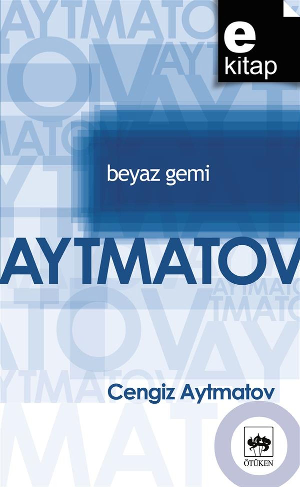

# Beyaz Gemi - Cengiz Aytmatov
## 174 Sayfa
### 13.02.2021
  
 

  

    
     

 
 

***Karakterler;***
- ***Çocuk:***  Kahramanımız
- ***Mümin:*** Kahramanımızın çok sevdiği dedesi
- ***Orozkul:***  Mümin'in damadı, herkese kötü davranıyor

 

Kahramanımız 8 yaşındaki annesi ve babası olmayan bir çocuk. Dedesi ve ninesi ile birlikte yaşamaktadır. Kahramanımızdan çocuk olarak bahsedeceğim.

***Arkadaşsız, yapayalnız çocuk, onu kuşatan bu basit, saf çevresinde yaşayıp gidiyordu. Zaman zaman bütün bunları ona unutturan tek şey, gezgin satıcı, onun mağaza-arabası idi. Onu görür görmez olanca hızıyla koşmaya başlardı. Söylemeye gerek yok, otlardan ve kayalardan başka bir şeydi bu maşin-mağaza. Neler neler yoktu içinde!***

Dedesi onun için gölün kenarına taşlardan ördü ve torununu akıntı götürmemesi için böyle bir çözüm buldu. Böylelikle çocuk gönül rahatlığı ile göle girip yüzebiliyor.

Çocuk bir gün göl kenarında yüzerken uzaklardan satıcının geldiğini gördü. Satıcı da buraya uzun zamandır gelmemişti. Çocuk hemen bir hışımla gölden çıktı ve üzerini giyindi. Sonrasında koşarak hiç vakit kaybetmeden eve vardı. Evdekilere satıcının geldiğini haber verdi. Evde erkekler yoktu, ninesi ve onun kızları vardı. İlk başta herkes büyük bir heyecan içerisinde satıcının mallarını elden geçirdi. Ardından kadınlardan kimse bir şey almadı, böyle olunca satıcıda yakınmaya başladı.. Bunların üzerine kahramanımızda hayal kırıklığına uğradı ve o ilk baştaki heyecanından eser kalmamıştı. Satıcı artık gideceği sırada kahramanımıza bir avuç şeker verdi. 

Satıcı gitmeden hemen önce ise kahramanımızın dedesi Mümin geldi. Mümin'in pek fazla parası yoktu o yüzden bir şey alamayacağını ama güzün hasatlardan sonra geldiğinde almayı umut ettiğini söyledi.. Satıcı gider ayak Mümin'e "bari şu yavrucuğa bir çanta al okula başlayacak zamanı gelmiş." diyince. Mümin, bu öneriyi çok beğendi ve torununa okul çantası aldı. Kahramanımız, gerçekten çok mutlu oldu..

Bunun üzerine koşarak yeni çantasına herkeslere göstermeye başladı.. Tarlada çalışan Seydahmet'in yanına gitti. Seydahmet ise kahramanımızın dedesi hakkında kötü konuşarak moralini bozmuştu. Bir süre onunla da konuştular, oradan dönerken ise Orozkul ile denk geldiler. Orozkul, kahramanımızın moralini altüst etti. Orozkul, küfürler savurdu ve oradan uzaklaştı.   Orozkul için;
> Başkalarına düzine düzine çocuk veren Allah, bu talih küskününe kendi kanını taşıyan bir yavrucak vermemişti. Yüreğinde böyle büyük bir acı varken, anası-babası tarafından terkedilen, karısının yeğeni olan bu çocuğun çantasından ona neydi?

_____

***Kendi kendisiyle konuşmayı severdi. Ama şimdi bir çantası vardı ve onunla konuşuyordu: “Ona inanma sen, dedem hiç de onun söylediği gibi değil. Hiçbir kötülük, hiçbir kurnazlık düşünmez o, bu yüzden alay ediyorlar onunla. Hiç kurnaz değildir. İkimizi de okula götürecek. Sen daha okulun nerede olduğunu bilmiyorsun değil mi? Çok uzak değil, sana gösteririm. Karavul dağından dürbünle bakarız. Hem sana “Beyaz Gemi”mi de göstereceğim. Ama önce dama uğrayalım. Dürbünümü orada bir yere sakladım. Buzağıya da bakmam gerek. Her defasında kaçıp “Ak Gemi”yi seyrederim. Buzağımız da iyice büyüdü ha! Kuvvetli bir dana oldu. İpini çektiği zaman tutmak çok zor oluyor. İneğin bütün sütünü emmeyi âdet edindi. İnek onun anasıdır ve sütünü hiç esirgemiyor ondan. Anlıyorsun değil mi? Anneler hiçbir şeyi esirgemez. Bunu Gülcemal söyledi. Onun da bir kızı var... Az sonra ineği sağacaklar. Sonra buzağıyı çayıra götüreceğim. O zaman tepeye çıkar ve oradan beyaz gemiyi görürüz. Biliyor musun, ben dürbünle de konuşurum. Şimdi üç kişi olduk: Ben, sen ve dürbün...”***
_____

***Karavuldağının tepesinden, dört yönde ta ufuklara kadar uzanan engin bir manzara görünüyordu. Yüzükoyun yere yatan çocuk, dürbünü gözlerine ayarlamaya başladı. Çok uzakları gösteren güzel bir sahra dürbünü idi bu. Onu dedesine, uzun yıllar ormanda görev yaptığı için armağan olarak vermişlerdi. Ama bizim ihtiyar “Gözlerimin nesi var?” diye onu yanında taşımak istememiş, torununa vermişti. Çocuğun en sevdiği oyuncaktı bu.***

***Çocuk, bölgenin tek yerleşim yerindeki evlere, kulübelere ve ahırlara alaylı alaylı baktı. Yukarıdan bakınca ne kadar küçük, ne kadar da eften-püften görünüyorlardı! Çayın daha aşağı kıyısında dost kayalarını gördü: ‘Deve’yi, ‘Kurt’u, ‘Eyer’i, ‘Tank’ı.. hepsini. Onları ilk defa buradan, Karavul dağının başından, dürbünle seyretmiş ve bu adları da o zaman vermişti.***

Yine ellerinde dürbün, beyaz geminin gelmesini bekliyordu. Ama bu sırada hiç hoş olmayan bir şey oldu. Dürbünüyle bakarak gördüğü olay şuydu, evlerinin oradaki buzağı, ninesinin asılı olan kıyafetini yiyordu. Bir süre sonra ninesi bunu fark etti ve buzağıyı kovalamaya başladı. Elbette ninesi bu işin sorumlusu olarak kahramanımızı suçladı ve bir sürü yakınmalar ve hakaretler etti.

***Çocuk dürbünü gözünden çekti. Büyük bir hüzünle başını öne eğdi. Çantasına dönerek:  
  Peki, şimdi eve nasıl gideceğiz? dedi alçak sesle. “Bütün bu olanlar benim yüzümden, aptal buzağı yüzünden.. bir de senin yüzünden ey dürbün. Hep o beyaz gemiye bakmamı istersin benden. Senin de suçun var...”***

***Dürbünü ufka çevirdi ve birden nefesini tuttu. Tamam! Geliyordu! Gemiyi görür görmez her şeyi unuttu: Taa orada, Isık-Göl’ün mavi, masmavi yüzeyinde, büyük, beyaz gemi süzülüp geliyordu.. hey güzel gemi, hey! Sıra sıra bacaları olan, uzun, güçlü, güzel gemi! Sanki iple çekiliyormuş gibi dümdüz ilerliyordu. Çocuk alelacele gömleğinin ucuyla dürbünün camını sildi, güzelce ayarladı. Şimdi geminin hatları daha net idi. Dalgaların etkisiyle hafifçe sallandığını, gerisinde bıraktığı beyaz ve saydam köpüklü izini de farkediyordu artık. Gözünü ayırmadan hayran hayran bakıyordu gemiye. Elinde olsa, gücü yetse, gemiye rica edecek, çok daha yakından geçmesini isteyecekti. Böylece içindeki insanları da görebilirdi. Ama geminin ondan haberi bile yoktu. Ağır ağır, heybetle, yoluna devam ediyordu. Nerden gelip nereye gittiği de belli değildi.
Uzun uzun baktı gemiye. Ne zaman bir balığa dönüşeceğini, çaya atlayıp yüze yüze ona, o beyaz gemiye ne zaman ulaşacağını düşünüyordu hep..***

***Günlerden bir gün, Karavul dağının tepesinden bakarken Isık-Göl’ün masmavi sularında o bembeyaz gemiyi ilk defa gördüğü zaman, o güzellik karşısında büyük bir heyecan duymuş, yüreği kafesinden çıkacakmış gibi çarpmıştı. Ve o gün, Isık-Göl’de gemicilik yapan babasının da bu beyaz gemide olabileceğini, orada çalıştığını düşünmüştü. Sonra bu düşünceye tamamiyle inandırdı kendisini. Çünkü böyle olmasını yürekten istiyordu, bunun doğruluğuna ihtiyacı vardı.  
Aslında ne babasını hatırlıyordu ne de annesini. Kendini bileli onları hiç görmemişti. Onlar da bir defacık olsun onu görmeye gelmemişlerdi. Ama babasının Isık-Göl’de gemicilik yaptığını, anasının da babasından ayrıldıktan sonra onu dedesinin yanına bırakıp şehre gittiğini biliyordu. İşte o zamandan beri bir haber alamamışlardı annesinden. Dağların ardındaki gölün, gölün de ötesindeki dağların gerisinde, uzak bir şehire yerleştiğini söylüyorlardı.***

Bir süre sonra ise Beyaz Gemi görünmeye başladı ve ağır ağır ilerliyordu. Bu süre içerisinde ise, kahramanımız hayal kurmaya başladı. Çünkü babasının o gemide olduğunu düşünüyordu... Kendisinin bir balığa dönüştüğünü ve yüzerek gemiye ulaştığını, ardından ise babası ile sohbet ettiğinin hayalini kuruyordu.

Daha öncesinden ise dedesinden duyduğu kadarıyla, babasının bir Beyaz Gemi'de çalışmaya başladığını duymuştu. Babası yeni bir yuva kurmuş ve çocukları olmuştu. Aynı şekilde bir gün dedesinin annesi ile karşılaştığını ve onunla konuştuğunu söylemişti. Annesi aynı zamanda evlenmiş ve yeni çocukları olmuştu. En kısa süre içerisinde ise oğlunu yanına almak istediğini dile getirdi.   ***“Oğlun için kaygılanma,” demiş dedesi, “ben hayatta oldukça kimseye vermem onu, kimse de kılına dokunamaz. Ben öldükten sonra ise Allah’a emanet. İnsanın kaderinde ne varsa o olur...”***

***Dedem diyor ki, geçmiş zamanların birinde, bir han başka bir hanı tutsak almış. Bu han tutsağına: “Eğer istersen benim kölem olarak yanımda kalır, uzun zaman yaşayabilirsin. İstemezsen, en büyük arzunu yerine getirir, sonra da seni öldürürüm”, demiş. Tutsak han düşünüp cevap vermiş: “Köle olarak yaşamak istemiyorum, beni öldür daha iyi. Ancak öldürmeden önce, benim vatanımdan herhangi bir çobanı buraya getirtmeni istiyorum.” -”Ne yapacaksın o çobanı?”-”Ölmeden önce ondan bir türkü dinlemek istiyorum.” Dedem diyor ki, işte böyle, vatanlarının bir türküsü için canlarını feda eden insanlar varmış. Böyle insanları görmeyi ne kadar isterdim! Herhalde onlar büyük şehirlerde yaşıyorlar.
Türküyü dinlerken dedem kulağıma fısıldar: “İlâhî! Ne büyük insanlarmış eski insanlar! Ne türküler yakmışlar ya Rabbim!”  
Bilmem neden, o anda dedeme çok acıyor, onu öyle seviyorum ki ağlamak geliyor içimden.***

________

Boynuzlu Maral Ana

Bir süre sonra çocuk okula başladı. Her gün uzaktaki okuluna dedesi götürüp getiriyordu. Dedesi bir gün Orozkul ile birlikte odun yüklüyordular ama uzun bir süre geçmişti. Nehirden odunu geçirirken odun kayalara sıkıştı kaldı ve oradan çıkartamadılar.  Çocuğun okuldan çıkış saati geldi ve geçmişti bile. Bir süre önce Mümin dedesi Orozkul'dan izin istediği halde Orozkul, gitmesine izin vermemişti. Öyle olunca en sonunda dedesi Orozkul'a karşı çıktı ve oradan ayrıldı.

Mümin, hemen eve döndü ve atı alarak çocuğu okula almaya gitti. Yarı yolda öğretmeniyle birlikte geliyorlarmış. Öğretmeni Mümin'e çok kızdı ve dedesi de bir daha geç kalmamak için söz verdi.

***Mümin, mahcup olmuş, öğretmenden özür dilemiş, bir daha geç kalmayacaklarına dair söz vermişti. Ama onu en çok üzen, en çok duygulandıran, okula geç kaldığı için bu kadar çok ağlamasıydı. “Allah vere de hep böyle sevse okumayı” diye geçirdi aklından. Ama yine de çocuğun bu kadar içli, bu kadar çok ağlamasının, okula geç kalmaktan başka sebepleri olabileceğini de düşünüyordu. Şüphesiz, kalbinin bir köşesinde, kendine özgü, açığa vuramadığı bir derdi vardı. Bir özlemi, onu çok duygulandıran, iç acısı veren bir şey vardı...***

Mümin, Orozkul'a muhtaç olduğu için kendisini kovmasından korkuyordu. Bilakis de öyle oldu ve Mümin'i resmen süründürdü.. Bir gece vakti yoğun kar yağışı ve fırtınanın olduğu gece Mümin'in evinin kapısı çaldı. Fırtınadan dolayı gençler yolda kalmışlar. Onları misafir ettiler ve ertesi gün de onları kaldıkları yerden kurtardılar.

Bir süre sonra çocuk hasta oldu ve yatıyordu. Aynı gün içerisinde ise Orozkul nehirde kalmış olan büyük odunu çıkarmak için gitmişti. Odunu satacağı adamlarda oradaydı. Mümin ise kendisini affettirmek için kuyruğu kulağı kısıp onların yanına gitti.
  orada ise  Boynuzlu Maral Ana ve onun çocuklarını gördüler. Yıllar öncesinde ise burayı terk eden Boynuzlu Maral Ana tekrardan dönmüştü. Bir süre sonra lanet olası bu insanlar onları yeniden öldürdüler. 

***Bunu gören çocuk bunu kabullenemedi. Bir çok şeyi değiştirmek istiyordu ama hiçbirine gücü yetmiyordu. Bunun üzerine göle gidip kendi hayatına son verdi ve bir balık oldu.***

_______

***Çocuk oradan uzaklaştı. Doğru dama giderek dürbününü sakladığı yerden çıkardı. Tozunu silerken onunla üzgün bir sesle konuşuyordu: “İşler kötü, ben ve çanta büyük bir suç işledik galiba. Başka bir okul olsaydı, çanta ile ikimiz kimseye haber vermeden oraya giderdik. Yalnız dedem buna çok üzülür, her yerde arar bizi. İşte buna dayanmam zor. Ya sen dürbünüm, ben olmayınca kiminle bakacaksın beyaz gemiye? Ben bir balık olamam mı sanıyorsun? Görürsün nasıl oluyorum. Bir gün balık olup beyaz gemiye kadar yüzeceğim...”***

______

Sen artık bu şarkıyı duyamazsın. Su boyunca yüzüp gittin çocuğum. Kendi efsaneni de alıp götürdün.
Yüzüp gittin. Kulubeg’in gelmesini beklemedin. Yazık, çok yazık! Beklemedin Kulubeg’i. Niye koşup yola çıkmadın? Yola çıkıp koşsaydın mutlaka görecektin onu. Daha uzaktan görür görmez tanırdın onun kamyonunu. Elini kaldırınca o hemen dururdu.
- Nereye gidiyorsun? derdi Kulubeg.
- Senin yanına, diye cevap verirdin.
Seni hemen şoför kabinine alır, yanına oturturdu. Beraber giderdiniz. Sen ve Kulubeg. Önünüzde hiç kimsenin görmediği Boynuzlu Maral Ana koşardı. Ama sen görürdün onu...
Ama sen yüzüp gittin. Hiçbir zaman balık olamayacağını biliyor muydun? Isık-Göl’e kadar yüzemeyeceğini, beyaz gemini göremeyeceğini ve ona “Selâm Beyaz Gemi, ben geldim, ben!” diyemeyeceğini biliyor muydun?
Çay boyunca yüzüp gittin çocuğum.
Şimdi ben sana yalnız şunu söyleyebilirim: “Çocuk kalbinin, çocuk ruhunun bağdaşamadığı her şeyi reddettin. İşte beni teselli eden de budur. Bir şimşek gibi yaşadın sen. Bir defa çaktın ve söndün. Şimşeği çaktıran göktür. Ve gök ebedîdir. İşte budur beni teselli eden. Bir başka tesellim daha var: İnsandaki çocuk vicdanı, tohumdaki öz gibidir. Ve o öz olmadan tohum filizlenmez, gelişmez. Yeryüzünde bizi neler beklerse beklesin, insanoğlu doğdukça ve öldükçe, insanoğlu yaşadıkça, hak ve doğruluk denen şey de var olacaktır...
Sana, senin sözlerini tekrarlayarak veda ediyorum: “Merhaba Beyaz Gemi, ben geldim!”
 
- SON -
 

______

***Ninem benim bir yabancı olduğumu söylüyor. Boşuna yedirip içirirlermiş beni, onlara hiçbir hayrım dokunmazmış. Ama baba, ben yabancı değilim ki! Her zaman dedemle beraberdim ben. Asıl yabancı olan kendisi çünkü sonradan gelen o. Kalkmış bir de bana yabancı diyor!...***

______

 

### Kitaptan Alıntılar ;
- ***Ama ninesi onun bir yabancı, bir hiç olduğunu söylüyordu. Bir yabancıyı ne kadar yedirip içirsen, ne kadar baksan, yine yabancı kalırdı.. bir yabancı!***
- ***Çocuğa göz kırpan satıcı çantayı ona verdi:  
 Al bakalım yaba kulak, dedi. Ama iyi oku ha! Yoksa dedenle birlikte bu dağlara çakılıp kalırsın!***
- ***Hayatta ona en büyük sadakat, en büyük ilgi gösteren ve kendisini canı kadar sevdiğinden emin olduğu tek kişi varsa o da dedesiydi.***
- ***"İnsanın çocuğunun olmaması kötü bir şeydi, ama çocuklarının çocukları olmaması daha da kötüydü. Nine böyle diyordu."***
- ***"Çocuk kendini korkunç derecede küçük, korkunç derecede yalnız ve yitik hissetti. Burada bir o vardı, bir de dağlar, her tarafta dağlar, ulu dağlar..."***
- ***“Oğlun için kaygılanma,” demiş dedesi, “ben hayatta oldukça kimseye vermem onu, kimse de kılına dokunamaz. Ben öldükten sonra ise Allah’a emanet. İnsanın kaderinde ne varsa o olur...”***
- ***Ninem benim bir yabancı olduğumu söylüyor. Boşuna yedirip içirirlermiş beni, onlara hiçbir hayrım dokunmazmış. Ama baba, ben yabancı değilim ki! Her zaman dedemle beraberdim ben. Asıl yabancı olan kendisi çünkü sonradan gelen o. Kalkmış bir de bana yabancı diyor!...***
- ***“Peygamberin kendi de bilmez peygamber olduğunu, o da ötekiler gibi bir insandır. Yalnız haydutlar haydut olduklarını bilirler.”***
- ***Ama boş yere dememişler:   “Kendi ayıbını örtmek isteyen başkalarının yüzüne kara çalar” diye.***
- ***Kendi kendine kızıyordu:   “Sen ona iyilik edersin, o sana kötülük. Utanmak, arlanmak da bilmiyorlar. Sanki kural bu imiş. Hep kendilerini haklı görürler. Herkes onlara kul-köle olsun."***
- ***"Zaten aptallar her zaman kaderlerine razı olurlardı."***
- ***İnsan yalnız olunca neler neler düşünür.. gerçekleşmemiş hayallerini, uçup giden yıllarını, ilk aşk maceralarını... O pek gerilerde kalan yılları, erişilemeyen ve erişilemeyecek olan bir isteği hatırlamak, düşünmek de hoş bir şeydi. Niye böyle olur? Bunu da bilmez insan. Ama zaman zaman bunları düşünmekten, o günleri yeniden yaşıyor gibi olmaktan hoşlanır.***
- ***Sanki felâketi unutmak, onu kaçınılmaz sondan kurtaracaktı.***
- ***Dedem diyor ki, atalarının adlarını, kim olduklarını unutanlar, kötülük yapmaktan utanmazlarmış. Çünkü o zaman insanın nasıl biri olduğunu ne çocukları bilirmiş ne de çocuklarının çocukları.***
- ***İnsanlar niçin böyle yaşıyorlardı? Niçin bazıları iyi bazıları kötüydü? Niye bazıları mutlu, bazıları mutsuz? Niye bazılarından herkes korkar da bazılarından kimse korkmaz?***
- ***Ee, hayat zordu işte! Tam bir işini bitirip hale-yola koyuyorsun, “Tamam, artık rahat edeceğim” diyorsun, hemen başka bir dert çıkıyor.***
- ***“Merhaba Beyaz Gemi, ben geldim!”***
