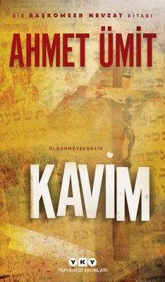

  
# Kavim - Ahmet Ümit
## 440 Sayfa
### 23.02.2021
  
 

  

    
     

 
 

***Karakterler;***
- ***Nazmi:***
- ***Nevzat Başkomiser:***
- ***Ali:***
- ***Zeynep:***
- ***Evgenia:***
- ***Can:***

_____

> ***BİLGİ:***

- İncil sayılmaz. 'Diatessaron.'"  "O ne demek?"  "Aslında bir müzik terimi. 'Dört ezginin harmonisi' anlamına geliyor. Hıristiyanların bugün kabul ettiği incil, dört ayrı incil’in birleşmesinden oluşur: Matta, Markos, Luka ve Yuhanna indileri. Diatessaron, bu metinlerden alınmış parçalarla Tatiyan adlı bir Süryanî tarafından yazılmış. Bu metnin bir elyazması nüshası 1933 yılında Salihiye'deki kazılar sırasında bulundu. Orijinal metnin MS 170'li yıllarda yazıldığı sanılıyor."

- "Ancak Roma'nın acımasız imparatoru Neron, Pavlus'un insanlara gösterdiği merhameti ona göstermemiş. Uzun bir tutukluluk ve soruşturmanın ardından Pavlus'un kafasını kestirerek idam ettirmiştir."

- Ama hâlâ Türk olduğumuz için, Müslüman olduğumuz için bizden önceki kültürleri görmezden geliyoruz. Oysa bu yanlış. Bugün Türkiye'de kim ne kadar Türk, kim ne kadar Ermeni, kim ne kadar Kürt, kim ne kadar Rum, kim ne kadar Süryanî bunu ayırt etmek mümkün mü? Ayrıca böyle buseyi niye yapalım? Ama bu sözleri söylediğim için, beni taşa tutacak yüz binlerce fanatik insan yaşıyor bu ülkede. Hayatlarının anlamını sadece ulusal kimlikte ya da dinde bulan insanlar. Bunun için can almaktan, can vermekten çekinmeyen insanlar."

_____

 

Kitabımız, Başkomiser Nevzat ve kendisiyle birlikte çalışan Ali isimli komiserin sorgusuyla başlıyor. Başkomiser Nevzat ve yanındaki meslektaşı; bir süre önce karısı ve kızını vurarak ölümüne sebep olan Başkomiser Nazmi'nin sorgusunu yapıyorlardı. Nazmi ise olanları olduğu gibi onlara anlattı. Uzun bir süre çalışmanın ardından eve gelen Nazmi, bir süre karısıyla tartıştıktan sonra kendini kaybediyor ve istemeden silahından çıkan kurşunlar eşi ve çocuğunu ondan koparıyor. Gerçekten çok üzücü bir olay.

Bir süre sonra ise Başkomiser Nevzat ve onunla birlikte çalışan Ali ve Zeynep; yeni bir cinayet soruşturması için olay yerine gittiler. Öldürülen kişi ise Yusuf Akdağ ismindeki bir hristiyan. İlginç bir olay olduğu için Başkomiser Nevzat ve ekibinin ilgisini çekti. Olay yerinden ayrılacakları sırada ise ölen adamın Can isminde bir arkadaşı geldi. Başkomiser Nevzat ve Ali bu adamı biraz sorguladılar ve bilgi almaya çalıştılar.

Ardından ise ölen adamın yani Yusuf'un kız arkadaşı Meryem varmış. Bir kulüp tarzında bir mekan işletiyormuş. Başkomiser Nevzat ve Ali, bu kadını görmeye gittiler. Orada bir süre kadın ve mekandaki birkaç kişi ile de görüşüp bilgi aldılar.

____

Nevzat bunların ardından Evgenia'nın meyhanesine gitti. Evgenia ile bundan beş yıl önce filan şu şekilde tanışmışlar; 
  O zamanlar Evgenia genç bir kızmış. Bir tane Murat isminde oğlana İstanbul'da aşık olmuş ve birbirlerini seviyorlarmış. Murat'ın kendi memleketine, doğu tarafına dönmesi gerekiyormuş. Böyle olunca da Evgenia da her şeyi geride bırakıp Murat ile gitmiş.. Evlenmeye karar vermişler ve imam nikahı bile yapmışlar. Ama zamanla Evgenia için artık orada olanlar çekilmez bir hal almış. Evgenia adetâ hapis hayatı yaşıyormuş. Evgenia artık evlenmeden önce dayanamamış ve burada yaşamak istemediğini söylemiş. Her ne kadar karşı çıksalar da Evgenia son çare olarak oradaki karakola gitmiş ve yardım istemiş. Kendisini İstanbul'a göndermelerini yoksa öldüreceklerini söylemiş. O zamanda Nevzat o karakolda çalışıyormuş. Ardından birkaç bir şey yaptıktan sonra Nevzat'ın da yardımıyla Evgenia'yı İstanbul'a göndermişler. Nevzat, Evgenia'yı otobüse bindirirken vedalaştıkları sırada ise Evgenia, Nevzat'a annesinden kalan haç işareti olan kolyeyi şans getirmesi için hediye etmiş..

Bunun ardından beş yıl geçtikten sonra Nevzat İstanbul'a dönmüş. Üzücü bir şekilde Nevzat bir bombalama olayında karısını ve kızını kaybetmiş. Cenaze sırasında bir tane kadın gelip Nevzat'a başsağlığı dilemiş. Nevzat o sırada bu kadının bir yerden tanıdık geldiğini fark etmiş ama tam olarak çıkartamamış... Aradan biraz zaman geçtikten sonra Evgenia yine arıyor ve Nevzat'ı kendi mekanına davet ediyor. İşte her şey böyle başlıyor..
Bir süre sonra ise Evgenia, Nevzat'a evlenme teklifi ediyor.   ***Ama beni hayata bağlayan çok az bağ var. İşte o bağlardan biri sensin Evgenia. Seni özlemek güzel şey. Beni hayata bağlayan, hayatın hâlâ yaşanabilir olduğunu kanıtlayan duygulardan biri seni özlemek.***   ***Eğer seninle evlenirsem, eğer her gün birlikte olursak, eğer her akşam şu masada buluşursak, seni özleyememekten korkuyorum. Daha kötüsü senin beni özleyememenden korkuyorum. O zaman, yaşamak için elimde çok daha az nedenim kalacak. Kendimi öldürmekten söz etmiyorum, intihardan nefret ederim, ama herhalde o zaman hayat iyice çekilmez bir hal alacak."***

_____

Nevzat evine döndü. Tam uyudu uyuyacak telefon çalmaya başladı. Ali, bir cinayet işlendiğini söyledi. Bingöllü itirafçı PKK'lı bir adamı öldürmüşler. Bunu yapanda Meryem'in yanında çalışan koruması Tonguç, zaten hemen ardından Tonguç gidip teslim olmuş. Olaylar biraz karışık. Bunun üzerine Nevzat gecenin o vakti karakola gitmek zorunda kalıyor ve evden ayrılıyor. 

Karakola gidip Tonguç'u sorguluyor. Tonguç olanları birbir anlatıyor. Cinayeti kendisinin işlediğini söylüyor. Fakat yanında Meryem Ablası'nın olduğunu ve cinayeti onun azmettirdiğini de ekliyor.

Nevzat başkomiser merkeze döndüğünde ise müdürü ile bir konuşma yapıyor. Müdürü ondan bir süre daha emekli olmayıp kendileriyle devam etmesini istiyor. Sonuç olarak Nevzat Başkomiser bunu kabul ediyor.

Aradan biraz zaman geçtikten sonra Nevzat Başkomiser, Antikacı Malik'i görmeye gidiyor. Onunla uzun uzun konuşuyor ve Yusuf hakkında bilgi alıyor. Bu sırada Malik'i Meryem arıyor ve Malik ile konuşmak istediğini söylüyor. Bunun sayesinde Nevzat Başkomiser,
Meryem'in Yusuf'un evinde olduğunu öğreniyor. Nevzat Başkomiser, oradan ayrılıp Meryem'i görmeye giderken Zeynep'ten haber geliyor ve Yusuf'un sünnetli olduğunu öğreniyor.

Nevzat Başkomiser, Yusuf'un evine vardığında Meryem'in müslüman için dua okuttuğunu görüyorlar. Biraz orada konuştuktan sonra Nevzat Başkomiser Meryem'i cinayete azmettirdiği için tutukluyor.

___

Nevzat Başkomiser, merkezde Can'ı sorguluyor, daha doğrusu bilgi almaya çalışıyor. Can ise din hakkında bir çok şey anlatıyor. Bunun üzerine bir de Antikacı Malik'in Yusuf'a 100 bin lira para verdiğini söylüyor.. 

Bunun üzerine Nevzat Başkomiser ise ertesi gün için Antikacı Malik'in evine gidiyor. Malik olanları bir bir anlatıyor. Yusuf'a niye o kadar para verdiğini de açıklıyor. Yusuf farklı bir adamdan Mor Gabriel'e ait olan bir kitabı satın almış. Aslında Yusuf'un yaptığı büyük bir suçmuş. Malik, Yusuf'tan bu kitabı alıp kiliseye geri götürüp bırakmış ve bunun karşılığında ise 100 bin TL vermiş.

Bunların ardından ise Nevzat Başkomiser, merkeze döndüğünde ilginç bir olay ile karşılaşıyorlar. Yusuf'un kardeşi cesedi teşhiş etmek için geliyor. Fakat işin ilginç tarafı o ceset abisine ait değilmiş. Yani kimlik doğru fakat ceset ve kimlikteki fotoğrafın abisi ile bir ilgisi yokmuş. Muhtemelen birisi abisinin kimliğini çalmış, yani kullanıyormuş.. Sonuç olarak şu an için cesedin kime ait olduğunu bilmiyorlar ve asıl Yusuf'un nerede olduğunu da bilmiyorlar...

____

Evgenia, Nevzat Başkomiser'i arıyor ve onunla konuşmak istediğini söylüyor. Bir süre sonra ise Nevzat Başkomiser, Evgenia'nın yanına gidiyor. Nevzat Başkomiser ilk baştan itibaren zaten bir terslik olduğunu anlıyor. Evgenia başlıyor anlatmaya; Evgenia Yunanistan'a dönmeye karar vermiş. Bu kararını Nevzat Başkomiser'e anlatıyor. Evgenia gözyaşları içerisinde uzun uzun ağlıyor ve konuşma bu şekilde devam ediyor. Nevzat Başkomiser'e gelen telefon ile konuşmaları bölünüyor. Nevzat Başkomiser'i arayan Ali, "Malik'in öldürüldüğünü, kılıç ile başının kesildiğini ve olay yerinde Can'ın yakalandığını" söylüyor. Bunun üzerine Nevzat Başkomiser, Evgenia'dan ayrılmak zorunda kalıyor.

Nevzat Başkomiser, Malik'in evine geliyor. Olay yerindekiler ile konuşup bilgi alıyor. Bunun ardından Nevzat Başkomiser, Can ile konuşmak için karakola gidiyor. Mahalleli neredeyse canı linç edeceğinden dolayı, çocuğun üstü başı perişan ve kan içinde kalmış. Can'da büyük bir umutla Nevzat Başkomiser'i beklediğini söylüyor.. Can başlıyor anlatmaya;   Can bugün Nevzat Başkomiser'in yanından ayrılırken üniversiteye gideceğini söylüyor. Merkezden ayrıldıktan sonra ise Malik Amca, Can'ı arıyor ve yanına gelmesini. Biraz konuşmaları gerektiğini söylüyor. Can, Malik amcanın yanına geldikten sonra, Yusuf'un katili ile ilgili bir konuşma geçmiş aralarında. Malik amca'nın bunu kimin yaptığı ile ilgili bir tahmini varmış ama bunu Can'a söylemek istememiş tehlikeli olacağı için.. Bu konuşmanın ardından Can'dan gitmesini rica etmiş. Eski bir dostunun ona ziyarete geleceğini ve onunla konuşması gerektiği şeylerin olduğunu söylemiş..

Malik amca, Can'a bunları söyleyince Can hemen kabul etmiş. Can hemen karşıdaki kahveye gitmiş ve oturmuş. Bu gelecek olan adamı beklemeye başlamış. Sonra o adam gelmiş ve bu gelen adamın dün Nevzat Başkomiser'in yanında gördüğü Cengiz Müdür olduğunu görünce şaşırmış.. Can iki saat boyunca kahvede oturup adamın gitmesini beklemiş ama evden çıkan olmayınca Can korkmuş ve eve yaklaşmış. Eve vardığında ise Malik amcanın başının gövdesinden ayrı olduğunu görmüş ve ardından olanlar olmuş...

Nevzat Başkomiser bunları duyduktan sonra en son isteyeceği şey Cengiz Müdürü'nü suçlamak olacaktı. Hemen bunlara inanmadı. Nevzat Başkomiser mahalleye döndüğünde otoparka gitti ve bugün o saatlerde bir arabanın gelip gelmediğini sordu. Otoparkçı ise Nevzat Başkomiser'in sorduğu arabanın o saatlerde geldiğini onayladı. Bu araba Cengiz Müdür'e aitti. Ardından Nevzat Başkomiser kahveye gidip, kahvenin sahibine sorular sordu. Kahvenin sahibi Can'ın bugün orada iki saat kadar da oturduğunu onayladı. Bunun ardından Malik'in evine gelen Nevzat Başkomiser, Malik'in oğlunun ağzını aradı. Malik'in oğlu ise Cengiz Amcasının yıllardan beridir babasıyla dost olduğunu söyledi.. Yani sonuç olarak Nevzat Başkomiser, Can'ın anlattıklarının doğru olduğuna ikna oldu...

______

Tüm bu olanlardan sonra Nevzat Başkomiser, Sabri müdürünün yardımıyla, aslında suç olarak nitelendirebileceğimiz şekliyle gizli yolla arşivden bilgileri istiyor ve Sabri'de Nevzat'ı kırmıyor.. Nevzat'ın aldığı bu bilgilerin içerisinde bundan yıllar önce öldürülen Çoban Yusuf'un aynı zamanda Cengiz müdürün bilgileri yer almaktaydı. Aslında bir bakıma bu bilgiler sayesinde olaylar çözüldü ve Cengiz'in suçlu olduğu ortaya çıktı.. 

Yıllar önce Cengiz ve arkadaşları diğer iki polis daha masum insanları öldürüyorlar. Cengiz'in bunda bir suçu yok. Ama sonrasında arkadaşlarının arkasında durup onları savunuyor. Böyle olunca o polislerden biri kendini PKK tarafından patoz makinasında öldürülmüş olarak gösteriyor. Aslında öldürülen masum olan çoban Yusuf, o polislerden biri de Yusuf'un kimliğini alıyor ve Yusuf'un yerine geçiyor.

Bunların sonucunda Nevzat Başkomiser, Cengiz'i tüm cinayetlerden suçlu tutuyor. Sahte Yusuf'un yanında bir de diğer arkadaşları da öldürülüyor. Cengiz Malik'i kazayla öldürdüğünü kabul ediyor. Ama diğer iki cinayeti kendisinin işlemediğini söylüyor.. 

Tüm bu karmaşanın içerisinde ise Nevzat Başkomiser, kendisini savunmak için Cengiz'i öldürmek zorunda kalıyor. Malik dışındaki diğer iki cinayeti Cengiz'in işlemediğini anlıyorlar. Çünkü bu Malik dışındaki iki adam ve Cengiz, yıllar önce Can'ın annesi ve babasını arabadayken öldürmüşler. Ve o zamanlar aynı arabanın içerisinde Can'da varmış ve henüz 9 yaşında bir çocukmuş.. 

Tüm bu bilgilerin ardından her ne kadar diğer iki cinayeti Can'ın işlediğini bilselerde ellerinde somut bir kanıt olmadığı için Can'ı serbest bırakmak zorunda kalıyorlar. Can ise dışarıya çıktığı anda büyük bir kalabalık onu karşılıyor. O kalabalığın içerisinden Meryem'in adamı Tayyar, Can'ı orada 3 el ateş ederek vuruyor. Nevzat Başkomiser hemen Can'ın yanına koşuyor. Can'ın ağzından dökülen son cümle ise şu şekilde oluyor;   ***"Olmadı Başkomiserim" diyor güçlükle fısıldayarak. "Olmadı, bakın beni yine yakalayamadınız."***

> ***- SON -***

 

### Kitaptan Alıntılar ;
- ***"İnsan denen bu tuhaf yaratığı, kötülükten uzak tutacak ne bir güç var, ne de bir yasa."***
- ***"Keşke öğrenmemiş olsaydım diyorum çoğu zaman, keşke yalan da olsa dünyada adalet diye bir şeyin var olduğuna inanabilseydim. Ama inanamıyorum."***
- ***"Geçmiş olsun" diyorum.   
 Nazmi'nin dudaklarında acı bir gülümseme beliriyor.   
 "Sağ olun Baş komiserim, ama geçmez..."***
- ***"Dünya eskiden de o kadar iyi bir yer değildi, şimdi de değil."***
- ***"...oysa ben, bir kez daha, bir insana yakınının öldüğünü söyleyecek olmanın tedirginliğini taşıyorum. Bu işi defalarca yapmış olmama rağmen bu meslekte alışamadığım rutinlerden biridir. Demek ki bir işi defalarca yapmış olmak, alışmak için yeterli olmuyor."***
- ***"...çünkü şu dünyada tümüyle tanıyacağın biri yoktur."   Ali'nin susması kadını iyice cesaretlendiriyor.   "Söyler misiniz bana, siz kendinizi ne kadar tanıyorsunuz?"***
- ***"Kimse kimseyi tanıyamaz. Tanıdığımızı sanırız. Tanıdığımız kadarına inanırız. Eğer gerçekten tanısak, bırakın aşkı filan, kimse kimseyle arkadaş bile olamaz."***
- ***"Gerçekler her zaman güzel olmayabilir. Bazen, ne kadar az şey bilirsen, o kadar iyidir."***
- ***Onu uyarmaya kalktığımda, "Ne yapayım yani" der, "sevdiklerime, dostlarıma, arkadaşlarıma inanmazsam, yaşamın ne anlamı kalır? Doğru, kimi zaman sevdiklerimin ihanetine uğrarım, kimi zaman arkadaş bildiklerimce arkadan hançerlenirim, kimi zaman hayal kırıklıkları yaşarım ama dostlarımdan asla vazgeçmem. Onlardan vazgeçersem, yaşamaktan vazgeçmiş gibi olurum. Sevdiklerin olmadan, paylaşmadan yaşamanın ne anlamı var? Bana kızma ama Nevzatçım, kendini aptal gibi hissetmek, yalnız olmaktan daha iyidir."***
- ***Ama beni hayata bağlayan çok az bağ var. İşte o bağlardan biri sensin Evgenia. Seni özlemek güzel şey. Beni hayata bağlayan, hayatın hâlâ yaşanabilir olduğunu kanıtlayan duygulardan biri seni özlemek.***
- ***Eğer seninle evlenirsem, eğer her gün birlikte olursak, eğer her akşam şu masada buluşursak, seni özleyememekten korkuyorum. Daha kötüsü senin beni özleyememenden korkuyorum. O zaman, yaşamak için elimde çok daha az nedenim kalacak. Kendimi öldürmekten söz etmiyorum, intihardan nefret ederim, ama herhalde o zaman hayat iyice çekilmez bir hal alacak."***
- ***"Görüyorsunuz değil mi?" diye mırıldanıyorum. "Değişen hiçbir şey yok. Yine uykumuzu bölen telefonlar, yine geceyarısı çıkılan görevler."***
- ***"Vatandaş da sahtekâr, işi düştü mü, korkuyla saygı gösteriyor bize, arkamızı döner dönmez basıyorlar küfürü. Sen de içindesin işte, hep böyle oluyor. Daha iyi olabilir mi, belki. Ama dünyanın her yerinde böyle bu. Polis sevilmez abi. Eşyanın tabiatı Nevzatçım, kömür taşıyanlar mutlaka kirlenir."***
- ***"...çünkü hapishanedeyken Meryem Ablasının ona bakacağını düşünüyor, çünkü bu ülkede her on yılda bir olduğu gibi üç beş yıla kalmadan yeni bir afla dışarı çıkacağına inanıyor."***
- ***"Adalet, vicdanımız ile yasa arasında bir yerde duruyor."***
- ***"Gerçek inanç, nüfus kâğıdında yazmaz Nevzat Bey. Gerçek inanç yüreğimizdedir.  
Gerçek inanç, ruhumuzun ta kendisidir."***
- ***"Çünkü bu dünya sonludur, çünkü bu beden günahkârdır, kirlidir. Saf ve ölümsüz olan sadece sevgidir. Bizi gerçek kurtuluşa götürecek olan da bu sevgidir..."***
- ***Şu dünyada iki tür insan vardır.  
"Gördüğüne inananlarla, gördükleriyle yetinmeyip gerçeği arayanlar, ikinci türden insanlar, duyduklarıyla, gördükleriyle yetinmezler, gerçeği bulmak için hep yeni deliller ararlar. Kendi inançlarını, kendi düşüncelerini, kendi dünyalarını yıkmak pahasına da olsa, korkunç da olsa olayların perdelediği gerçeği bulmaya çalışırlar."***
- ***"Daha da önemlisi, önceden de söylediğim gibi, hiçbir şey tümüyle yeni değildir yeryüzünde. Her yeni düşünce, her yeni inanç kendinden öncekileri taşır içerisinde."***
- ***"Ama bana bağırmayın, beni tehdit etmeyin lütfen, çünkü bu güzel değil. Bu tür bir davranış sadece beni incitmekle kalmaz, özür dilerim ama sizi de kaba bir insan yapar. Oysa siz öyle biri değilsiniz."***
- ***"Sevgili, arkadaş, dost, aile, hepsi bir yere kadar; tek gerçek, yalnızlığımız."***
- ***Yüzüme bakıyor; sanki seni anlıyorum, seni bağışlıyorum ama sen de beni anla der gibi.   "Öyle değil mi Nevzat, hepimiz yalnız değil miyiz?"***
- ***"Seni gerçekten de çok sevdim Nevzat" diyor burnunu çekerken, "hayatta kimseyi sevmediğim kadar."   "Belki bu yüzden çok kızıyorum sana. Sözlerimi de kızgınlığıma ver. 
Aldırma. Ben gidince her şeyi unutursun..."***
- ***"Rakını bitir sonra git, çünkü ölüler seni bekliyor Nevzat. Ölüleri bekletmek olmaz."***
- ***"Bazı yazılar, okunmak için değil, okunmamak için yazılır."***
- ***"Olmaz be Nevzat" demişti. "İnsanları mutlu etmek için çiçek vermek yetmez, onların ihtiyaçları olan şeyi vereceksin. O da çok zor. Çünkü kimin neye ihtiyacı olduğunu bilemezsin. İnsanlar çoğu zaman kendileri bile bilmiyor neye ihtiyaçları olduğunu."***
- ***"Benim için arkadaşlık kutsaldır. Vatan gibi, bayrak gibi."***
- ***"Artık ne kendime, ne devlete, ne teşkilata, ne de insanlara inanabiliyorum, inanmamak istediğimden değil, onca yaşanan olaydan sonra inanma duygumu yitirdiğimden."***
- ***"Söylediğime kendim de inanmıyorum, ama umut insanı aptallaştırıyor işte."***
- ***"Yine düşmanlarını çoğalttın Nevzat... Çoğalsın, umurumda bile değil, doğruyu yapmış olmanın verdiği huzur, artan birkaç düşmandan çok daha önemli benim için."***
- ***"Kadınlar bir erkeği sevince ama gerçekten sevince, tuhaf bir güç geliyor üzerlerine. Yıkıcı olduğu kadar yapıcı bir güç; o anda sizi öldürebilirler ya da sizin için gözlerini bile kırpmadan ölüme gidebilirler."***
- ***"Ama kalbim arsızca umut etmeyi sürdürüyor hâlâ."***
- ***"Olmasın be Başkomiserim. Orada mutlu olursa, geri gelmez. Evgenia Hanım buraya gelsin, burada mutlu olsun. Onsuz tadı yok bu meyhanenin."***
- ***"Şarkılar seni söyler    dillerde name adın    aşk gibi, sevda gibi   huysuz ve tatlı kadın."***
- ***"Yaşamının anlamını yitirmiş bir insan, iblisten daha tehlikelidir Nevzat Bey."***
- ***Kütüphanenin ahşap kapısından içeri girince, yıllardır duymadığım bir koku karşılıyor bizi. Kâğıtlar ile mürekkebin, karton ile tutkalın, ahşap ile tozun buluşmasından, hepsinin yıllanmasından oluşan bir koku. Babam medeniyetin kokusu derdi buna.  
Sadece kütüphanelerde duyabileceğiniz bir koku.***
- ***"Çünkü birini öldürürsen, biraz da kendini öldürürsün. Kendi hayatını, kendi ruhunu, kendi masumiyetini. Ölüler tuhaf varlıklardır Can, onları toprağa koyduğumuzda, hatta çürüyüp kemikleri un ufak olduğunda bile aramızda yaşamaya devam ederler. Bir yerlerden düşlerimize sızarlar, hayallerimizi gölgelerler, umutlarımızı karartırlar. O yüzden ben, kimseyi öldürmek istemem. Çünkü birini öldürdükten sonra, artık yaşamımın eskisi gibi olmayacağını bilirim."***
- ***"Onları gerçekten de ben öldürmüş olsaydım, bana hiç mi hak vermezdiniz?"  Kesin bir ifadeyle başımı sallıyorum.  
 "Vermezdim, ölümle gerçekleştirilen adalet, ölümü yüceltmekten başka bir işe yaramaz."***
- ***"Yaşamın anlamı insandır Nevzatçım, insan."***
- ***"Ne bileyim, herkes kendine göre bir anlam yaratıyor işte. Eğer bu insanlar olmasaydı, bu anlamların hiçbiri olmazdı. Öyle değil mi?   Yaşamın anlamı insandır Nevzatçım, insan."***
- ***"Olmadı Başkomiserim" diyor güçlükle fısıldayarak. "Olmadı, bakın beni yine yakalayamadınız."***
