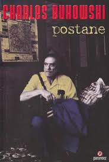

  
# Postane - Charles Bukowski
## 168 Sayfa
### 25.01.2021
  
 

  

    
     

 
 

***Karakterler;***
- ***Hank Chinaski:*** Kahramanımız
- ***Betty:*** Kahramanımızın ilk sevgilisi
- ***Joyce:*** Kahramanımızın sonraki sevgilisi, evlendiler
- ***Jonstone:*** Kahramanımızın, postanedeki patronu

 

> ***"Bu kitap; argo, küfür ve uygunsuz şeyleri içermektedir."***

 

> ***BİR***

Hank ilk başta denenmek üzere postacılık yapmaya başladı. Başarıyla deneme sürecini tamamladığı için ise yedek postacı olarak göreve devam etti. Yedek postacının görevi ise, asil postacı gelmez ise onun yerine sen göreve çıkıyordun. Hank ise Jonstone isimli bir patronun altında bir şubede yedek postacı olarak çalışmaya başladı. Hank, Jonstone ile hiç anlaşamadı. Hep zıtlaştılar ve zaten Jonstone ise çoğu zaman görev vermiyordu. Verdiği zamanda en zor en kötü görevleri en yağmurlu günlerde veriyordu. Hank sırılsıklam olarak çalışıyordu. Birbirinden değişik insanlar ile karşılaşan Hank, üç yılın sonunda asil kadroya geçiş yaptı. Ama bir süre sonra ise istifa edip işini bıraktı. Bunun akabinde ilerleyen sürede ise sevgilisi Betty, artık yapamadığını ve ayrılmak istediğini söyledi..

_____

> ***İKİ***

Hank, Joyce isimli 23 yaşındaki filinta gibi bir hatun ile tanıştı ve onunla birlikte olmaya başladı. Bu kadın çok zengindi fakat Hank'ın bu kadının parasında gözü yoktu. Bir süre birlikte köye taşınıp orada yaşadılar. Belli bir sürenin ardından köyde yapamadılar ve tekrardan şehre döndüler. Her ne kadar paraları olsa da kadının kafası kırık olduğu için çalışmaları gerektiğini öne sürerek çalışmaya başladılar.. Kadında farklı bir şey vardı. Her gece, her an Hank ile düzüşmek istiyordu, bazen Hank'ı uykusundan uyandırıp bunu yapıyordu ve Hank ise buna ayak uyduruyordu.. Bir süre sonra Joyce boşanmak için başvuruda bulunmuş. Bir sabah Hank uyurken kapı çalıyor ve gelen kağıtlar ile bu kararı öğrenmiş oluyor. Zaten Hank üstelemiyor, bunu bana söyleseydin zaten istediğini yapardım diyor.. Ve ayrılıyorlar...

____

> ***ÜÇ***

Hank, Joyce ile ayrıldıktan sonra eski sevgilisi Betty ile karşılaştı.. Aradan uzun zaman geçtiği için her ikisi de yaşlanmıştı. Ama Betty çok daha kötü durumdaydı. Her şeyini kaybetmiş, fakir bir otel odasında temizlikçi olarak kalıyordu.. Bir süre Hank ve Betty bir araya geldiler. Birlikte kaldılar, seviştiler. Bir gün Betty hastalandı ve hastaneye kaldırıldı. Ardından zaten pek fazla dayanamadı ve öldü..   Hank hemen ertesi günü hipodroma gitmişti. Orada Vi isminde bir kadın ile bir araya geldiler. Gün boyu at yarışlarına bahis oynadılar. Hank'in şansı yerindeydi. Baya iyi kazandı ve aynı günün gecesini Hank ile Vi birlikte geçirdiler... 

_____

> ***DÖRT***

Hank, at yarışı oynamaya devam etti. Aslında uzun bir süre çok da güzel miktarda para kazandı. Bu sebeple postaneden, yani işinden 90 günlük izin almıştı. Tabi bir süre sonra parası tekrardan bitti. Hank, Jay isimli bir kadın ile yaşamaya başladı. Bu kadın biraz yaşlı ve saçlarına aklar düşmüş bir kadındı. Jay bir süre sonra hamile kaldı ve Hank'ın bebeğini dünyaya getirdi. Bir süre birlikte yaşamaya devam ettiler. En sonunda Hank ve Jay ayrıldılar ve farklı evlere çıktılar...

_____

> ***BEŞ***

Bu bölümde sadece ve sadece Hank'ın birden fazla yediği cezaları yazmaktadır. Bu tüm cezalar postane'de yaptığı şeyler sonucunda aldığı cezalardır.

____

> ***ALTI***

Hank, puro içerken düşen küçük bir kül ile yangın çıkardı. Bir anda ortalık alev aldı, bazı mektuplar yani postalar yansa da yangını güç bela söndürebildi.. Bir süre daha çalışmaya devam etti.. Hank postanede 11 yıldır çalışıyordu. Artık 50 yaşına basmasına az bir zaman kalmıştı.. İstifa edip, işi bırakmaya karar verdi ve nitekimde bunu yaptı.. 

____

***Yazar Hakkında;***  
1920 yılında Almanya'da doğdu. İki yaşındayken ailesiyle birlikte ABD'ye, Los Angeles'a göç etti. İlk öyküsünü yirmi dört yaşındayken yayımlayan Bukowski, otuz beş yaşında şiir yazmaya başladı. Bugün Kaliforniya, San Pedro'da yaşayan Bukowski'nin şiir ve öykülerini toplayan kırk beş kitap yayımlanmış, yapıtları çeşitli dillere çevrilmiş, öykü ve şiirleri dünyanın pek çok ülkesinde dergilerde yer almıştır. Ülkemizde ilk kez Sokak dergisinde çıkan öyküleriyle tanıştığımız Bukowski'nin yapıtları arasında en başta şunları sayabiliriz: Barfly filminin senaryosu (1987), The Roominghouse Madrigals: Early Selected Poems 1946-1966 (1988), Pansiyon Manzumeleri (Parantez, 2000); Kaptan Yemeğe Çıktı ve Tayfalar Gemiyi Ele Geçirdi (Parantez, 2000); Suda Yan Ateşte Boğul (Parantez, 1999); Ölüler Böyle Sever (Parantez, 1999); Kadınlar (Arion, 1994); Hollywood (roman, 1989; YKY, 1992); Post Office (1971, Postane, İmge, 1993). Metis'te yayımlanan Kasabanın En Güzel Kızı (1992) ve Büyük Zen Düğünü (1992), dilimize çeviren Avi Pardo'nun hazırladığı özel öykü seçkileridir.

 

***- SON -***

### Kitaptan Alıntılar ;
- ***"Bu yaşadığımız hayat herkesin yaşadığı hayat: bizi öldürüyor."***
- ***"O odada Başkan ya da Vali ya da varlıklı orospu çocuğunun teki yatıyor olsaydı içerisi doktordan geçilmezdi şimdi. Neden ölmelerine izin veriyorsunuz? Yoksul olmak suç mu?"***
- ***"Birinin beni özleyecek olmasına sevindim."***
- ***"Kadınlar acı çekmek için yaratılmışlardı sanki; sürekli sevgi sözleri duyma ihtiyaçları bundan kaynaklanıyordu belki."***
- ***"...uyudum, uyudum, uyudum...  
Sabah uyandığımda sabahtı ve hâla hayattaydım."***
- ***“Okyanus,nasıl da dövünüyor,bir aşağı bir yukarı. Ve altında,balıklar, zavallı balıklar birbirleriyle savaşıyorlar, birbirlerini yiyorlar.Bizim de o balıklardan farkımız yok, ama biz karadayız, tek fark bu.”***
