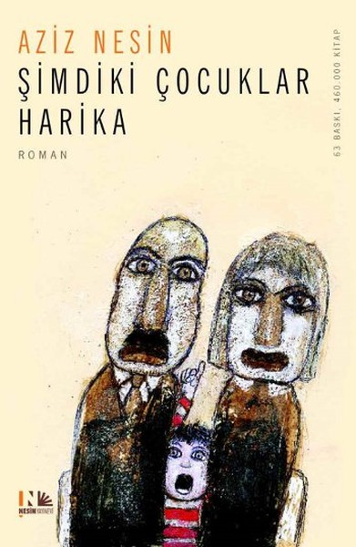

  
# Şimdiki Çocuklar Harika - Aziz Nesin
## 224 Sayfa
### 03.03.2021
  
 

  

    
     

 
 

***Karakterler;***
- ***Ahmet TARBAY:*** Birbirine mektup yazan iki çocuk
- ***Zeynep YALKIR:*** Birbirine mektup yazan iki çocuk

 

Bu romanda, çocukların gözüyle büyüklerin nasıl göründüğü anlatılıyor.
Bu romanda, çocuklar anababalarını, öğretmenlerini ve büyüklerini eleştiriyor.
Bu roman, çocuk eğitiminde gerekli sanılan, günümüzde geçerli birtakım değer yargılarının yanlışlığını anlatıyor.

Bu roman, çocukların büyüklerine karşı haklarını ve kendilerini savunmalarıdır.
Bu romanı, salt çocuklar için değil, anababalarla öğretmenler için de yazdım.
Aziz Nesin

 

### Kitaptan Alıntılar ;
- ***Böyle şeyler, sizin yaşınızın konusu değil, dedi.  
  İşte en canımı sıkan cevap da budur. Bizi, hiçbişeyden anlamaz sanıyorlar.***
- ***"Cumhuriyet kurulduktan sonra, kadınla erkek artık eşit olmuştur. Kadınla erkek arasında hiçbir fark yoktur," dedi.***
- ***Tarihte biçok büyük önemli kadınlar var. Acaba onlara, erkek olmak ister misiniz? diye sorulsaydı, erkek olmak isterler miydi? Hiç sanmıyorum.İster kadın, ister erkek olalım, kendi kendimizden memnunsak, şanslıyız demektir.***
- ***"Yavrularım, yurtsever olunuz. Yurdunuzu çok, çok seviniz. 
Yurdunuzu yakından tanıyınız. Büyüyünce Anadolu'yu köy köy dolaşınız. Yoksul yerlerde görev alınız. Bu cumhuriyet size emanettir," demişti.   Sözleri hala kulaklarımda çınlıyor.  
"Yoksul Anadolu'ya medeniyet ışığını sizler götüreceksiniz." demişti.***
- ***"Her çocukta bir kabiliyet vardır, ama bu ruhunda gizli bir tohumdur. Bu tohumu keşfedip filizlendirmeli, çocuğun kabiliyetini ortaya çıkarmalı."***
- ***"İnsanlar, içinde bulundukları durumdan memnun olmalıdır. Çok zaman, bu hikayedeki küçük kız gibi, içinde bulunduğumuz mutluluğu bilemeyiz. Ancak ondan uzaklaşınca, mutluluk içinde yaşadığımızı anlarız."***
- ***Ne güzel örnekler vermişiz, veriyoruz çocuklarımıza! Gençlerimizi ne de güzel yetiştiriyoruz! Sonra da, niçin böyleler? diye yakınıyoruz.   İçimizi, davranışlarımızı, çarpıklığımızı gösteren bu tür aynalara bir baksak ya! Baksak görür müyüz acaba? Özdenlikten nice uzak olduğumuzu. Sözlerimizle davranışlarımızın, yaptıklarımızın tutarsızlığını? Bencilliğimizi, çıkarcılığımızı, cüceyken devce şişinmelerimizi?***
- ***Çocukların kötü sözcükler kullanmamalarını, terbiyeli olmalarını isteriz. Biz büyükler öyle miyiz? Yurtsever olunuz söylevlerini, yazılarını yineler dururuz. Ve kendimiz?***
- ***"Yaşlarınız küçük diye hiçbir gerçeğin sizlerden saklı kalmasından yana değilim. Çocukların anlayamayacakları hiçbir sorun yoktur."***