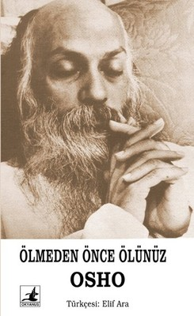

  
# Ölmeden Önce Ölünüz - Osho
## 195 Sayfa
### 05.03.2021
  
 

  

    
     

 
 

_____

***Birkaç gün önce Keşmir'in Pakistan işgali altındaki bölgesinde yaşayan bir adam, üçüncü kez ailesini ve arkadaşlarını yanılttı. Yüzotuzbeş yaşında, üçüncü kez öldü. İnsanlar bu duruma oldukça şüpheyle yaklaştılar, çünkü aynı oyunu daha önce de iki kere oynamış, iki kere daha ölmüştü. Doktorlar tarafından öldüğü tespit edilip, rapor yazıldıktan sonra bir anda uyanıp, gözlerini açıp, kahkahalar atmaya başlamıştı. Bu yüzden bu kez öldüğünde, herkes çok dikkatli davrandı. Doktorlar büyük bir dikkatle ölüme ait tüm verileri topladılar; hepsi de hiçbir soru işaretine yer bırakmayacak denli kesindi.  
Doktorlar şöyle dedi: "Sizi daha önce yanıltmış olabilir, fakat bu kez gerçekten ölmüş. Tıp bilimine göre, bu adam ölü bir insanda görülebilecek her türlü belirtiyi taşıyor." Ve tam üç doktor ölüm raporunu imzaladıkları anda adam gözlerini açıp gülmeye başladı ve, "Dinleyin, bir sonraki ölümümde gerçekten öleceğim. Yalnızca bir kez daha denemek istedim."dedi.***

_____

***Bu yüzyılın başında şöyle bir olay gerçekleşti: Varanasi Kralının bir ameliyat olması gerekiyordu. Bu, oldukça büyük bir ameliyat olduğu halde inatçı Kral hiçbir şekilde anestezi kullanılmasını istemiyordu. "Ameliyatı yapabilirsiniz ama bu sırada ben de olup biteni izlemek istiyorum; baygın olmak istemiyorum." diyordu.  
Doktorların kafası oldukça karışmıştı. Bu tıp ahlakına aykırıydı; böyle büyük bir ameliyat çok fazla acı verecek, hasta belki de ameliyat sırasında duyduğu acıdan ölecekti. Ameliyat sırasında hastanın baygın olması gerekiyordu.  
Belki de cerrahi bilimi anestezi sanatını ölüm deneyiminden öğrenmiştir çünkü ölüm en büyük cerrahidir. Ölüm sizi bedeninizden, zihninizden, kalbinizden ayırır -ki siz yetmiş seksen sene boyunca bunlarla özdeşleştirildiniz. Bu özellikler neredeyse gerçek siz haline geldi. Bu ayrılık oldukça acı verecek ama acının da bir sınırı vardır.
Hiç farkettiniz mi? Katlanılmaz acı diye bir şey yoktur. Katlanılmaz acı yalnızca dilde varolabilir, her acı katlanılabilirdir. Acı katlanılmaz olduğu an zaten baygın düşersiniz. Bilinç acıya katlanmanın bir yoludur.  
O sıradan bir adam olsaydı doktorlar onu dinlemeyecekti- ama o bir kraldı hem de çok sevilen bir kral, tüm ülke onu büyük bir bilge olarak tanırdı. Cerrahları ikna etti, "Merak etmeyin, bana hiçbir şey olmayacak. Yalnızca ameliyata başlamadan önce bana beş dakika tanıyın ki kendimi meditatif bir duruma sokabileyim. Bir kez meditasyona girdikten sonra, zaten bedenimden çok uzaklarda olacağım. Ondan sonra isterseniz tüm bedenimi küçücük parçalar halinde kesip biçebilirsiniz, ben yalnızca bir gözlemci olacağım, olup bitenler başkasına oluyormuşçasına uzak bir gözlemci."  
Bu çok kritik bir andı; ameliyatın hemen gerçekleşmesi gerekiyordu yoksa hasta ölebilirdi. Bu durumda iki seçenek kalıyordu: ameliyatı gerçekleştirip hastanın uyanık olmasına izin vermek, ya da ameliyat yapmayarak bilimin eski rutinini izlemek. Ama bu ikinci durumda ölümün gerçekleşmesi kesindi. Birinci seçenekte ise bu kadar ısrar ettiğine göre hastanın bu durumu idare etme şansı olabilirdi belki. Onu ikna edecek bir yol bulamadıkları için ameliyata başladılar.  
Bu anestezi kullanılmadan, hasta meditasyondayken gerçekleştirilen ilk ameliyattı. Kral yalnızca gözlerini kapadı ve tamamen sessizleşti. Cerrahlar bile kralın etrafındaki değişikliği hissettiler; yaydığı titreşimler, hissedilen varlığı değişmiş, yüzü yeni doğmuş küçük bir bebeğinki gibi rahatlamıştı ve beş dakika içinde ameliyata başladılar. Ameliyat iki saat sürdü, doktorlar korkudan titriyordu; aslında kralın kurtulup kurtulamayacağından emin değillerdi- bu şok belki de fazla güçlü gelecekti. Fakat ameliyat sona erince kral, "Artık gözlerimi açabilir miyim?" diye sordu.
Bu vaka tıp alanında tüm dünyada çok tuhaf bir vaka olarak tartışıldı. Cerrahlar krala ne yaptığını sordular.  
Şöyle yanıt verdi, "Hiçbir şey yapmadım. Meditasyon yapmak benim hayatım. An be an sessizlik içinde yaşıyorum. O beş dakikayı istememin nedeni bu kadar tehlikeli bir ameliyat yapacağınız için varlığımın içinde hiç titremeden çok sağlam bir şekilde yerleşmem gerekmesiydi. O zaman her şeyi yapabilirdiniz çünkü bunları bana yapmıyor olacaktınız. Ben ayık bilince dönüşmüştüm ve bilinci ameliyat edemezsiniz, yalnızca bedeni ameliyat edebilirsiniz."  
Bana diyorsunuz ki, "Sizinle birlikte otururken bir şekilde kendimi güvende hissediyorum." Benimle ya da kendi başınıza oturmanız arasında hiçbir fark yoktur, bu yalnızca zihinsel bir güvencedir, usta oradayken o sıçramayı yapmaktan bir zarar gelmeyeceği düşüncesidir. Bir şeyler ters giderse, nasıl olsa bunu düzeltebilecek biri var.
Meditasyonda hiçbir şey ters gitmez-asla.  
Meditasyon olmadan ise herşey zaten ters gidiyordur.  
Meditasyon olmadan hiçbir şey yolunda gidemez; tüm yaşamınız ters gidiyordur. Yalnızca ümit içinde yaşıyorsunuz ama ümitleriniz hiçbir zaman gerçekleşmiyor. Yaşamınız uzun, upuzun bir trajediden ibaret. Bunun nedeni ise sizin bir farkındalık ve meditasyon hali içinde olmayışınız.  
Meditasyon ölüme benzer, deneyim olarak ise tamamen aynıdırlar. Fakat tavır ve yaklaşım olarak birbirlerinden farklıdırlar ve bu fark öyle uçsuz bucaksızdır ki, meditasyonun yaşamın ta kendisi, ölümün ise yalnızca bir düş olduğu söylenebilir.***

_____

Siz yalnızca yaşayın, sevin ve her anı derin bir haz ve mutluluğa çevirin. Tüm korkular böylece kaybolabilir. Ve tüm insanlık beni dinlerse, belki dünya sona ermez ve varlığımızı sürdürebiliriz. Yaşlı insan ölünce, taze değerlere sahip yepyeni bir insan ortaya çıkıp, onun yerini doldurabilir.

> ***- SON -***

 

### Kitaptan Alıntılar ;
- ***Jean Paul Sartre'a ait bir cümle, Batının ölüme bakış açısının tipik bir örneğidir:   "Yaşama anlam veren şey asla ölüm olamaz; o tam tersine prensipte yaşamın tüm anlamını silen şeydir."***
- ***"Çok sevdiğiniz biri ölene dek ölümle tam olarak karşılaşamazsınız. Bunun altı çizilmeli: ölümle yalnızca sevdiğiniz biri ölünce gerçekten yüz yüze gelirsiniz."***
- ***"Unutma çünkü unutulmaması gereken anlar vardır; daha fazlasını isteme. Ne varsa o yeterli olandır."***
- ***"Bir şeyler söyle, bu kadar sessiz olma, dayanamıyorum."dedim.  
İnanır mısınız, benim için bir şarkı söylemeye başladı! Ölümün kutlanması gereken bir şey olduğunu o zaman anladım. Dedeme ilk aşık olduğunda söylediği şarkıyı söyledi.***
- ***"Dedemin öldüğü günden beri ölüm benim için daimi bir refakatçi haline geldi. O gün ben de onunla öldüm çünkü bir şey kafamda kesinlik kazandı; yedi yıl da yetmiş yıl da yaşasan ne farkeder? Bir gün mutlaka öleceksin."***
- ***Ona, "Köyde küçük çocukların öldüğünü gördüm." diye yanıt verdim.   "Bu soruları sormadıkları için, yanıtlarını da alamadan öldüler. Bana yarın ya da öbür gün ölmeyeceğime dair garanti verebilir misin? Yanıtları bulmadan önce ölmeyeceğimi garanti edebilir misin?"***
- ***Ölmeden yaklaşık on saat önce bana şöyle dedi: "Sen haklıydın, ertelemek doğru değil. Şimdi kafamdaki tüm sorularla birlikte ölüyorum. Unutma, bütün tavsiyelerim yanlıştı. Sen haklısın, hiçbir şeyi erteleme. Kafanda bir soru belirdiği zaman, yanıtını en kısa zamanda bulmaya çalış."***
- ***"Tanıdığınız, sevdiğiniz, birlikte yaşadığınız, varlığınızın bir parçası haline gelmiş biri öldüğü zaman, sizin de içinizde bir şeyler ölür. Tabii ki onu özleyecek, içinizde o boşluğu hissedeceksiniz, bu çok doğal."***
- ***"Ölüm insanlar tarafından bozulamamış tek olgudur. İnsanoğlu onun dışında her şeyi bozmuş, kirletmiştir. Kirletilememiş, el değmemiş, bakir kalan tek şeydir ölüm. İnsanlar onu da bozmak ister ama onu ellerinde tutmaları, sahip olmaları mümkün değildir."***
- ***"Yalnızca ölüm anında aslında yaşamadıkları gerçeğinin farkına varırlar. Yaşamları rüyada gibi geçmiş ve ölüm anı gelip çatmıştır. Artık yaşamak için daha fazla zamanları kalmamıştır çünkü ölüm kapıyı çalmaktadır. Oysa yaşamak için zamanları varken bunu değerlendirmek yerine bu zamanı binbir türlü saçma şeye harcamışlardır."***
- ***"Yaşayabildiğiniz kadar yoğun ve dolu dolu yaşayın ki, yaşamın tadı, ölümün neden korkulacak bir şey olmadığına dair bir ipucu sunsun size."***
- ***"Hesaplamaya çalıştığınızda ömrünüzün üçte birini uykuya, diğer üçte birini yiyecek, giyecek ve ev masraflarınızı karşılayabilmek için çalışmaya harcadığınızı göreceksiniz. Geriye kalan kısa zaman ise eğitim, futbol maçları, filmler, saçma sapan tartışma ve kavgalara gidiyor. Bu durumda yetmiş senelik ömrünüzün yedi dakikasını bile kendinize ayırabilmişseniz eğer, bence bilge biri sayılırsınız!"***
- ***"Yalnızca kesinlik kazanmış gerçekler sizi kurtarabilir. İnançlarsa kağıttan yapılmış gemiler gibidir."***
- ***"Şair der ki,   "Hiçbir zaman çanlar kimin için çalıyor diye sorma; çanlar senin için çalıyor..."***
- ***"Ölüm havası bir anda bütün maskelerinizi çıkarır, bir anda yalnız olduğunuzun ve tüm ilişkilerinizin bunu unutmak için, bir aile kurup kendinizi yalnız hissetmemek için yaratılmış birer kandırmaca olduğunun farkına varmanızı sağlar."***
- ***"Aydınlanmayı başarmış birkaç kişi dışında hemen hemen herkes bilinçsizce ölür çünkü ölümün ne olduğunu, yeni bir başlangıç, yeni bir gün doğumu olduğunu bilmezler."***
- ***"Gitgide daha sessiz olabilirseniz, kendi kalp atışlarınızı, kendi kanınızın akışını dinleyebilirsiniz çünkü kanınız sürekli olarak tüm bedeninizde akmaktadır. Siz daha bilinçli ve sessiz oldukça, daha fazla netlik, daha fazla yaratıcılık ve zeka ortaya çıkacaktır."***
- ***"Sorunları, şüpheleri ve ertelemeleri yaratan yaşamdır. Ölürken hiçbir şeyi erteleyecek zamanınız kalmamıştır."***
- ***"Bu sizin yaşamınız. Bazı şeyleri neden yapıyorsunuz? Neden bir takım şeyleri satın alıyorsunuz? Ömrünüzü nasıl geçiriyorsunuz? Hiçbir şeyin farkında değilsiniz. Yalnızca bir uyurgezersiniz. Herkes sizi kandırabilir- zaten politikacılar da, din adamları da bunu yapmaktadır ve sizin bu bilinçsiz halinizde bu son derece doğaldır. Yalnızca bilinçli bir insan istismar edilemez. Yalnızca bilinçli biri gerçekten yaşar, ve gerçekten yaşayanlar huzur içinde, sessizce, yüzlerinde bir gülümsemeyle ölür. Yüzünde gülümsemeyle ölen bu insanlar için aslında ölüm yoktur çünkü onların bilincinin derinliklerinde, geride bırakılanın yalnızca beden olduğuna dair mutlak bir kesinlik vardır. Yaşam her zaman sürmüştür ve her zaman da sürecektir."***
- ***"Adi metali değerli metallere dönüştürmenin, simyacılığın sırrını öğrenemeden ölümün sizi almasına izin vermeyin. Eğer üzüntüyü dönüştürebilirseniz, ölümü de dönüştürebilirsiniz. Koşulsuzca kutlamayı öğrenebilirseniz, ölüm geldiği zaman kahkahalar atabilir, bunu kutlayabilir ve mutlulukla ayrılabilirsiniz. Hatta bu durumda ölüm sizi değil, siz ölümü öldürmüş olursunuz. Bunu mutlaka bir deneyin. Kaybedecek hiçbir şeyiniz yok!"***
- ***"Hiçbir ölüm aslında ölüm değildir çünkü her ölüm yeni bir kapı açar, bir başlangıçtır. Yaşamın sonu yoktur, yalnızca yeni başlangıçlar, yeniden-doğuşlar mevcuttur."***
- ***"Üzüntünüzü kutlamaya çevirebildiğiniz zaman, ölümünüzü de yeniden-doğuşa çevirebilme yetisine sahip olmuş olacaksınız. Bu yüzden henüz vakit varken bu sanatı öğrenmeye bakın."***
- ***"Aslında insanlar savaş malzemeleri üretmeyi bırakıp, komşularıyla savaşmak yerine onlarla birlikte şarkılar söyleyip, dans etmeye başlamalıdır. Bunca az zaman kalmışken, bunu kavga dövüş için harcamak doğru olmaz. İnsanlar tüm din ayrımlarını, komünizm, sosyalizm ve faşizmi bir kenara bırakmalıdırlar. Yeterince zaman varken bu farklılıklar faydalı olabilir ama artık zaman çok daralmış, Hıristiyan, Hindu ya da Müslüman olmanın getirdiği farklılıklara zaman kalmamıştır."***
- ***"Eğer bütünüyle burada ve bu anın içindeyseniz, yarın kimin umurundadır? Yarın kendi başını becerebilir. İsa Tanrıya, "Tanrım günlük ekmeğimi ver" diye dua ederken haklıdır. Yarından söz etmemektedir çünkü bugün kendi başına yeterlidir. Ve her anın kendi içinde tamamlandığını bilmeniz gerekir."***
- ***"Önemsiz şeylerle zamanınızı harcamayın, yaşayın, şarkı söyleyip dans edin, yapabildiğiniz kadar tam ve dolu dolu sevin ki hiçbir korku size yaklaşamasın ve yarın ne yapacağınız endişesi de yok olsun. Bugün tek başına yeterlidir."***