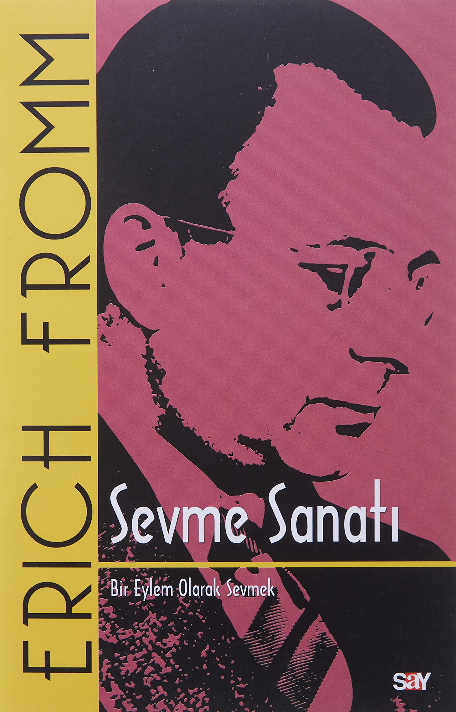

  
# Sevme Sanatı - Erich Fromm
## 200 Sayfa
### 09.03.2021
  
 

  

    
     

 
 

Her sanat dalı disiplin, odaklanma ve sabır gerektirir. Sanatta ustalaşma, bir çocuğun yeni yürümeye başladığı evredeki gibi düşe kalka ama denemekten vazgeçmemekle elde edilir. Sevmek de içinde sevme ve sevilme eylemini birlikte muhafaza eden bir sanattır. Hatta diğer sanat dallarından daha fazla içgörüye ve anlayışa sahip olmaya ihtiyaç duyar. Bir ustası, bir kılavuzu yoktur; kişinin salt kendisi için ve tek başına edinebileceği bireysel bir deneyimdir.

Sevme Sanatı, bu sanatın nasıl ve hangi araçlarla icra edileceğinin anlatıldığı bir reçete ya da sevginin ne olduğu konusunda binlercesi bulunan bir kişisel gelişim kitabı değildir. Bunun çok ötesinde, artık bir klasik sayılan, hemen hemen tüm dünya dillerine çevrilen, yayımlandığı ülkelerde milyonlarca satan bu kitap, insanlığın geleceği için hümanist bir yaklaşım, sevme hakkında kusursuz bir felsefi manifestodur.

Sevme Sanatı, “sevmek” eyleminin ana hatlarını belirleyen ve bunu felsefe ve psikoloji temelinde ele alan, incitmeyen, eleştirmeyen, dili ve içeriği asla eskimeyen bir kitap.

“Psikoloji alanındaki en önemli çalışmalardan biri.”

 

### Kitaptan Alıntılar ;
- ***"Hiçbir şey bilmeyen, hiçbir şeyi sevemez."***
- ***"Başarı, itibar, para, güç, hemen hemen tüm enerjimizi bunları nasıl gerçekleştireceğimizi öğrenmeye harcarız. Sevmeyi öğrenmeye ise verecek hiç bir şeyimiz kalmaz."***
- ***"Kim bir yaşam kurtarırsa, tüm dünyayı kurtarmış olur, kim bir yaşamı yok ederse, dünyayı yok etmiş olur."***
- ***"Sevgi olmadan insanlık bir gün için bile varolamaz."***
- ***"Bize çiçekleri sevdiğini söyleyen bir kadının, çiçekleri sulamayı unuttuğunu görürsek, onun çiçek sevgisine inanmayın.   Sevgi, sevdiğimiz şeyin büyümesi ve yaşaması için gösterdiğimiz etken ilgidir."***
- ***"Kişi, uğrunda emek harcadığı şeyleri sever ve kişi sevdiği şeyler için emek harcar."***
- ***"Şu eski Fransız şarkısının dediği gibi, « l'amour est l'enfant de la biberi »   sevgi özgürlüğün çocuğudur. O, asla zorbalığın çocuğu olamaz."***
- ***"Bencil kişilerin başkalarını sevemediklerî bîr gerçektir. Fakat onlar kendilerini de sevme yetisinden de yoksundurlar."***
- ***"Bilmediğimiz halde bildiğimizi sanmak hastalıktır!"***
