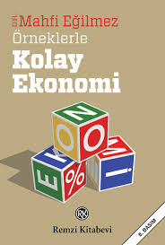

  
# Örneklerle Kolay Ekonomi - Mahfi Eğilmez
## 192 Sayfa
### 13.03.2021
  
 

  

    
     

 
 

Ekonomi sözcüğü bugün bir bilim dalının adı olmak­la birlikte tasarruf anlamına da gelmektedir. Bizde uzun sü­re sözcüğün Arapça karşılığı olan iktisat kullanılmış, son dö­nemlerde ekonomi onun yerini almıştır. İktisat sözcüğü de özünde tasarruf anlamına gelir.

_____

Ekonomideki ikinci ders arz ve talep dersidir. Ekonomide 11 arz dediğimiz şey basit olarak bir malın satışa sunulan mikta­rıdır. Talep dediğimiz şey de yine basit olarak bir maldan sa­tın almak isteyenlerin alım arzusudur. Arz, talepten fazlaysa malın fiyatı düşer; talep, arzdan fazlaysa malın fiyatı yükse­lir. Başka bir deyişle, bir piyasada mal çok buna karşılık o ma­lı almak isteyenlerin sayısı azsa, o malın fiyatı ucuzlar. Tersi olursa, mal az ama o malı almak isteyenlerin sayısı çoksa, o zaman o malın fiyatı artar.

_____

Demek ki makro ekonomik devrenin halkaları şöyledir:
Tüketim - Tasarruf - Yatırım - Üretim - Tüketim Tüketim olmazsa üretim, tasarruf olmazsa yatırım olmaz.   
Yatırım olmayınca üretim artmaz, üretim artmayınca eko­nomik büyüme olmaz, ekonomik büyüme olmayınca toplu­mun refah düzeyi yükselmez.  
Bu durumda tüketimi mi teşvik etmek gerekir, tasarrufu mu? Bu sorunun tek ve kesin bir yanıtı yoktur. Yanıt ekono­minin durumuna bağlıdır. Eğer ekonomide enflasyonist bir gidiş varsa tasarrufları, deflasyonist bir gidiş varsa tüketimi teşvik etmek doğru olur. Eğer tüketimi artırmaya karar ve­rilmişse vergileri düşürmek gerekmez mi? Vergiler düşürü­lürse, bu kez bütçede ortaya çıkacak açığın karşılanması so­runu doğar.
Ekonomik amaçlar birbiriyle çelişir. Ekonomi politikası bu çelişkiler arasından bir amacı seçip onu yakalamaya çalı­şır. Siyaset ise seçilen amaç ve feda edilen amaçlar konusunda toplumu ikna etmeye çabalar.

_____

Halk arasında gayrimenkule, altına yatırılan para tasar­ruf olarak adlandırılsa da ekonomi bilimi açısından tasar­ruf, başkalarının kullanımına hazır tutulan para demektir.   
Bankadaki mevduat tasarruftur. Bu para, sahibine faiz geli­ri kazandırırken ihtiyacı olana da kredi olarak kullandırılır.  
Bir ekonomide büyümeyi sağlayan unsurlar tüketim ve 33 tasarruftur. Tüketim, üretimin yapılmasını sağlar. Yani iç ya da dış tüketim olmadan üretim yapılmaz. Kimse satamayacağı malı üretmez. Öte yandan üretim yapabilmek için yatı­rım yapmak gerekir.

_____

Büyüme, bir ülkenin reel GSYH’sının bir yıldan ötekine artması haline verilen addır.
Bir ülkede bir yıl içinde yalnızca 1OOO adet ekmek, 25 kg beyaz peynir ve 500 şişe su üretildiğini varsayarsak üretim şöyle bir görünüm sergiler:
Üretim = 1000 ekmek + 25 kg beyaz peynir + 500 şişe su Ekmeğin adedinin 1 TL, beyaz peynirin kilosunun 10 TL, suyun da şişesinin 0,50 TL’den satıldığını varsayarsak, örne­ğin bu ülkede 2011 yılının GSYH’sını şöyle hesaplayabiliriz:
GSYH = (1000 x 1) + (25 x 10) + (500 x 0,50) = 1.500 TL Diyelim ki 2012 yılı başında yeni bir fırın devreye girmiş ve ekmek üretimi 1100 adede yükselmiş, ekmek fiyatı ise de­ğişmeden kalmış olsun.  
51 GSYH = (1100 X 1) + (25 x 10) + (500 x 0,50) = 1.600 TL.
Bu ekonomi 2012 yılında bir önceki yıla göre [(1600 - 1500)/1500] 0,67 yani %6,7 oranında büyümüştür.

_____

Ülkenin Geliri:   
GSYH Bir ülkede belirli bir dönem içinde (3 ay, 1 yıl) üretilen bütün nihai malların piyasa fiyatları üzerinden toplanmasıy­la oluşan toplam değere, gayrısafi yurtiçi hasıla (ya da kısaca GSYH) diyoruz.  
Bir ülkede bir yıl içinde yalnızca 1000 adet ekmek, 25 kg beyaz peynir ve 500 şişe su üretildiğini ve ekmeğin adedinin 1 TL, beyaz peynirin kilosunun 10 TL, suyun da şişesinin 0,50 TL’den satıldığını varsayarsak GSYH’yı şöyle hesaplayabiliriz:
GSYH = (1000 x 1) + (25 x 10) + (500 x 0,50) = 1.500 TL Buna göre bu ülkede o yıl için piyasa fiyatları cinsinden hesaplanan GSYH 1.500 TL’dir. (Basitleştirme amacıyla bu ekonomide hizmet üretiminin ekmek, su ve peynir üretimi­ nin içindeki satış, ambalajlama gibi hizmetle sınırlı olduğu­nu, ayrıca hizmet üretilmediğini varsayıyoruz.) 39 Bu basitleştirilmiş hesaplamada dikkat edilmesi gere­ken şey, sadece nihai malların piyasa satış fiyatlarının dikka­te alındığıdır. Yani ekmekteki buğdayın, un haline getirilir­ken eklenen işçilik değerinin veya suyun şişesinin, kapağının ya da beyaz peynirin ambalajının ayrı ayrı hesaba katılması söz konusu olmuyor. Üretilen malın tüketiciye nihai satış fi­yatları toplanıyor. Aksi takdirde çift sayım yapmış oluruz ve GSYH olduğundan büyük çıkar.  
GSYH bu şekilde hesaplanan üretim yöntemi yanında harcamalar ve ülkede elde edilen gelirler üzerinden giderek de hesaplanır. Çünkü bir ülkedeki toplam üretim değeri, top­lam harcamalar ve toplam gelirler bir eşkenar üçgenin üç ke­narı gibi birbirine eşittir.

_____

İktisatçılar bu üç temel işleve son zamanlarda paranın bir ekonomi politikası aracı olma işlevini de eklemeye başlamış­lardır. Bu politikanın alt dallarından en önemlisi faiz oran­larını bir yönlendirici olarak kullanmaktır. Merkez Bankası bankalardan para alıp onlara para verirken uyguladığı faizleri düzenleyerek bankaların ve piyasanın faiz oranlarını da etki­ler. Yine Merkez Bankası para basarak veya elindeki senetleri piyasaya satıp karşılığında para alarak piyasadaki para mikta­rını artırır ya da azaltır ve bu yolla bir yönlendirme politika­sı izlemiş olur.  
Tıpkı diğer malların olduğu gibi paranın da arz ve talebi vardır. Piyasada bulunan paranın toplam miktarına para ar­ zı denir. Para talebi ise insanların çeşitli amaçlarla parayı el­ de tutmak istemelerini ifade eder. Para talebimiz üç neden­le olur:  
1) Günlük ihtiyaçlarımızı karşılamak için para talep ede­riz.  
2) Değer biriktirmek amacıyla para talep ederiz.  
3) Spekülasyon amacıyla para talep ederiz.

___

Dolar yukarı gittiğinde Merkez Bankası rezervlerini piya­saya satarak doları bollaştırmakta ve TL’sini kıtlaştırmaktadır. Çünkü insanlar dolar alabilmek için TL vermektedir. Bu durumda TL değerlenmekte, dolar değer kaybetmektedir.
Yani özetle dolar yükseldiğinde eskisi kadar kolay kriz ol­maz. Ama bu, hiç kriz olmayacak anlamına da gelmemeli.   
Asıl kriz TL aşırı değerli kalmaya devam ederse olur. O za­man bizim cari açık alır başını gider ve kriz tohumları ekil­meye başlanır.  
İlginç bir durum ama TL’nin aşırı değerli olması bir sü­re sonra aşırı değersiz hale gelmesine yol açar. Ki bu durum doların değer kazanması ve vatandaşın kriz çıkar mı korku­sunun başlangıcını oluşturur. Daha açık bir ifadeyle, TL’nin aşırı değerli olması, aşın değersiz olmasına göre daha tehli­kelidir.

___

Kâğıt para ilk kez 7. yüzyılda Tang Hanedanı’nm hü­kümranlığı sırasında Çin’de kullanıldı. Madeni paralarını sürekli yanlarında taşımak zahmet ve riskinden kurtulmak isteyen tüccarlar paralarını güvenilir kişilere emanet ola­rak bırakıyorlar ve karşılığında yazılı bir senet alıyorlardı.   
Zaman içinde bu senetler arkalarına devir kayıtları ve mü­hürleri konularak, yani bir anlamda ciro edilerek, başkala­rına devredilir oldular. Böylece malı alan kişi bunun karşılı­ğında satıcıya bu emanet senedini devrettiğinde para el de­ğiştirmiş oluyordu.  

***Madeni parayla ilişkisi koparılmış kâğıt parayı basan ilk kamu bankası 1609 yılında kurulmuş olan ve merkez banka­ larının ilk örneği olarak kabul edilen Amsterdam Bankası’dır.***   

Merkez bankalarının en eski örnekleri arasında kabul edilen İsveç Merkez Bankası (Riksbank, 1664) ve İngiltere Merkez 99 Bankası’nm (Bank of England, 1694) kuruluş amacı hükü­metin ihtiyacı olana borç parayı sağlamaktı.  
I. Dünya Savaşı öncesinde hemen her yerde hükümet­ler kâğıt para basımını tekel haline getirdi ve çoğu bu yetkiyi Merkez Bankası’na verdi. Basılan kâğıt paraların değerli ma­den (çoğunlukla altın) karşılığı vardı. Bu karşılığı bulundur­makla kâğıt parayı getirene o karşılığın ödenmesi sözü veril­miş oluyordu. I. Dünya Savaşı’yla birlikte bu söz rafa kaldı­rıldı ve kâğıt para yalnızca yasal bir zorunluluğa dayalı ola­rak kullanılır oldu. Savaştan sonra karşılık meselesi yeniden oturtulmaya çalışılsa da gerçekleşmedi

___

 

### Kitaptan Alıntılar ;
- ***"Ekonomide ilk ders kıtlıktır. Buna göre, insan ihtiyaçlarını karşılamakta kullanılan her şey kıttır. Siyasetteki ilk ders ise, ekonomideki ilk dersin..."***
- ***"İnsan, bir şeyler ürettiği ve çevresine katkı yaptığın­ da daha mutlu olur."***
- ***"Bununla birlikte üretimi fazlaca abartmamak gerekir.  
Çünkü tüketim talebi olmadan bir şeyi üretirseniz satamaz­sınız, elinizde kalır."***
- ***"Yüksek bir gelir, mutluluk için duyduğum en iyi reçetedir."  
Jane Austen***
- ***"Büyümenin yaratıcısı hükümet değil, çalışan insanlardır."   
William Philip Gramm***
- ***"Güvenmediğin adama iş verme, iş verdiğin adama güvenme."  
Çin Atasözü***
- ***"Finans, parayı elden ele geçirip sonunda kaybetme sanatıdır."  
Robert W. Sarnoff***
- ***"Para kötü bir sahip, harika bir köledir."  
E T. Barnum***
- ***"İnsani gelişmişlik endeksi düşük olursa ne olur? Örneğin yeterince eğitim almamış bir toplum çıkar ortaya. Böyle bir toplumda insan kalitesi düşük kalır. O zaman o toplumda de­mokrasi kültürü yerleşemez, insanları yönlendirmek ve ya­nıltmak kolay olur."***
- ***"Enflasyon, saçınız varken beş dolara yaptırdığınız saç tıraşını, saçınız döküldüğünde on dolara yaptırmanızdır."   
Sam Ewing***
- ***"Parlayan her şey altın değildir."  
Alman Atasözü***
