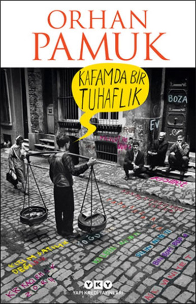

  
# Kafamda Bir Tuhaflık - Orhan Pamuk
## 490 Sayfa
### 20.03.2021
  
 

  

    
     

 
 

***Karakterler;***
- ***Mevlut:*** Kahramanımız
- ***Rayiha:*** Kaçırdığı kız
- ***Süleyman:*** Onlara yardım eden amcaoğlu
- ***:***
- ***:***
- ***:***
- ***:***

 

Mevlut yıllar önce  gittiği bir düğünde, orada çok güzel bir kız görür. O zamanlar kızın yaşı küçüktür. Ama uzun süre bu kıza mektup yazan Mevlüt aşkından bahseder. En sonunda kızı ikna eder.. Kızı kaçırmak için planlar yapar ve bu iş için amcaoğlu olan Süleyman'dan yardım ister. Kızı kaçıracakları gece, Mevlüt evin önüne gelir. Bir süre bekledikten sonra Rahiya isimli kızla birlikte kaçarlar. 

Onları anlaştıkları yerde kamyoneti ile bekleyen Süleyman bu ikisini alır ve Akşehir'de ki tren istasyonuna götürür ve oraya bırakır. Gecenin karanlığından kızın yüzünü net göremeyen Mevlüt, kızın yüzünü ilk gördüğünde, bu kızın gördüğü kız olmadığını anlar.   ***Kim, nasıl oynamıştı bu oyunu ona? İstasyon binasının bilet gişesine yürürken kendi ayak seslerinin yankılanışını başkasının ayak sesleriymiş gibi uzaktan işitiyordu. Eski tren istasyonları, Mevlut’a hayatının sonuna kadar o birkaç dakikayı hatırlatacaktı.*** 

Uzun bir tren yolculuğunun ardından Mevlüt ve Rahiya İstanbul'a gelirler.

> ***Aradan 12 yıl geçer. Artık Rayiha ve Mevlüt evlidir ve 2 tane kız çocukları vardır.***

Mevlut 25 yıldır sokakta yoğurt, boza gibi şeyler satmaktadır. Ve  uzun bir süredir de sadece boza satıyor. Bir gece yine işe çıkmıştı, birkaç satış yaptıktan sonra ilk defa önünü sokak köpekleri kesti ve ona doğru saldırmaya başladılar. Her ne kadar Mevlüt korkmuş olsa da, neyse ki hemen üst katta oturan biri yukarıdan bağırarak köpekleri dağıtır. Bunun ardından bu adam Mevlüt'ü yukarıya çağırır. Mevlüt yukarıya çıktığında ise bir grup alkol içen sarhoş insanlar ile karşılaşır. Bir süre sohbet ederler, Mevlüt onların sorularını cevaplar ve onlara bir miktar boza sattıktan sonra oradan ayrılır.. Bunun ardından gece vakti karanlıkta Mevlüt ilerlerken peşine iki tane adam takılır. Mevlüt'ü durdururlar ve birer bardak boza içtikten sonra Mevlüt'e bıçak çekerek soyalar. Elindeki tüm parasını ve kolundaki 12 yıl önce evlilik hediyesi edilmiş saatini alırlar.. 25 yıldır ilk defa başına böyle bir şey gelen Mevlüt eve döner ve karısına artık Boza satmayı bıraktığını söyler... 

> ***Geçmişten devam ediyoruz***

Kitabın ilerleyen bölümlerinde ise Mevlüt'ün çocukluğuna dönüyoruz. İstanbul'a ilk kez babasıyla nasıl geldiğinden. İlk baştaki gece kondu evlerinden diğer evlerine nasıl taşındıklarından bahsediliyor. Aynı şekilde zamanla sokaklarda Mevlüt'ün babasıyla Yoğurt ve Boza satmaya başlamasından. Bunun ne kadar zor bir şey olduğundan bahsediliyor. Mevlüt, babasının sokakların dilini nasıl bu kadar iyi bildiğini, nasıl bu kadar çok insanı tanıdığını merak ediyordu.. Babası Mevlüt'e tek tek her şeyi öğretmeye çalışıyordu. Bu sürede yaşadıkları zorlukları da anlatan bu bölümümüzde. Mevlüt başladığı ortaokulu başarılı bir şekilde bitiriyor..

Mevlüt lise'ye başladıktan sonra uzun bir süre okulunu asmaya başlıyor. Okula uğramıyor. Bir süre sonra babasıyla birlikte sattıkları yoğurt işleri de artık azalmıştı. Çünkü fabrikalarda üretilen yoğurtlar artık kamyonetler ile taşınıyordu. Mevlüt, Ferhat arkadaşı ile birlikte takılmaya onunla Kısmet ismindeki şeyleri satmaya başladılar. Uzun bir süre birlikteydiler. Lise 1'in sonuna geldiklerinde ise Mevlüt direk sınıfta kalmıştı...

_____

> ***1976 Yılları Zamanları***

Mevlüt ve babasının yaşadığı yerde o yıllarda çıkan ve uzun bir süre devam eden Duttepe - Kültepe Savaşı baya büyük bir olay oldu.. Her ne kadar Mevlüt ve babası tarafsız bir tavır sergileselerde herkes bu olaylardan ciddi şekilde etkilendi. Bu süre içerisinde polisler, askerler, daha bir çok kişinin karıştığı saldırılarda ölenler ve yaralananlar olmuş. Mevlüt'ün gittiği Atatürk Erkek Lisesi kapatılmış ve uzun süre açılmamıştı.. Tüm bu olayların ardından zaten Mevlüt okula gidip kaydını dondurmak istediğinde; lisedeki son sınıfı ve okuldaki 8. yılıydı. Aynı zamanda 22 yaşına gelmişti.   ***Mevlut bunun ne kâğıdı olduğunu sormadı bile. Daha okulun bahçesindeyken, sekiz yıl önce ilk defa girdiği lise binasına bunun son gelişi olduğunu kalbiyle anlamıştı. Aklı ise, mutfaktan hâlâ gelen UNICEF sütünün, artık kullanılmayan kömürlüğün ve ortaokuldayken kapısından korkuyla baktığı, lisedeyken kalabalık içinde sigara otlayıp içtiği bodrum kat helasının kokusuna hiç kapılmamasını öğütlüyordu. Öğretmenler odasının ve kütüphanenin kapısına hiç dönüp bakmadan merdivenlerden indi. Son gelişlerinde her seferinde “Zaten bitiremeyeceğim, ne geliyorum ki!” diye düşünürdü. Atatürk heykelinin yanından son kere geçerken “Çok isteseydim mezun olurdum,” dedi kendi kendine.***

_____

 

### Kitaptan Alıntılar ;
- ***"Mevlut vaktin geçmediğini, okulun hiç bitmeyeceğini düşünen bir çocuk gibi hissetti."***
- ***"Yıllar süren bir evlilikten sonra aralarında konuşacak hiçbir şey kalmamış karı kocalar gibi hiç konuşmadan vagonun penceresinden baktılar."***
- ***“İyi bir eğitim, zenginle fakirin farkını ortadan kaldırır!”***
- ***"Ama her pazartesi sabahı Atatürk büstünün çevresinde toplanan bin iki yüz öğrencinin hep birlikte söylediği İstiklal Marşı tepeler arasında güçle yankılanır, civardaki binlerce evden işitilirdi."***
- ***"Hayatının sonuna kadar nerede –hatta filmlerde bile– yükselen bir Türk bayrağı görse Mevlut’un gözleri sulanmaya devam etti."***
- ***Mevlut, “her şeyi vatanı için yapan Atatürk” gibi olmayı da çok isterdi.***
- ***"Sokaklardaki dünya okuldakinden çok daha büyük ve hakikiydi."***
- ***"İnsan şehirde kalabalık içinde yalnız olabilirdi ve şehri şehir yapan şey de zaten kalabalık içinde insanın kafasındaki tuhaflığı saklayabilme imkânıydı."***
- ***“Madem sonu kötü olacak, niye savaşıyoruz ki?” dedi Mevlut.  
“Hiçbir şey yapmadan boyun eğip teslim mi olalım?”***
- ***
- ***
- ***
- ***