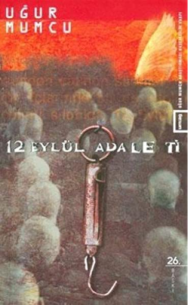

  
# 12 Eylül Adaleti - Uğur Mumcu
## 132 Sayfa
### 30.03.2021
  
 

  

    
     

 
 

_____

> ***Kitabın başlangıçındaki "SUNUŞ" bölümü...***

***Uğur Mumcu, ailesi Ankaralı olmasına karşın, 22 Ağustos 1942’de, babasının görevi nedeniyle bulundukları Kırşehir’de doğdu. Babası Ankara’ya atanınca, Ulus’taki Devrim İlkokulu’nda başladığı ilköğrenimini Bahçelievler’deki Ulubatlı Hasan İlkokulu’nda tamamladı, Cumhuriyet Ortaokulu ve Deneme Lisesini bitirdikten sonra (1961), Ankara Hukuk Fakültesine girdi.  
Uğur Mumcu öğrencilik yıllarında “bilgi sahibi olmadan fikir sahibi olunamayacağını kavramış, etkin, coşkulu, çok okuyan, araştıran ve sorgulayan bir gençti. Onun öncülüğünde yapılan toplantılara zamanın politikacıları, bilim ve sanat insanları çağrılıyor, “münazara”lardaki başarılarıyla dikkati çekiyordu. Daha 20 yaşındayken “Türk Sosyalizmi” başlıklı yazısıyla Yunus Nadi Makale Yarışmasını kazandı. Hukuk Fakültesini bitirince (1965), kısa bir süre avukatlık yaptı. Sonra dil öğrenmek için İngiltere’ye gitti, dönüşünde Hukuk Fakültesi İdare Hukuku Profesörü Tahsin Bekir Balta’nın asistanı oldu. 12 Mart’ın aydınlara yönelik baskıcı tutumundan o da payına düşeni aldı, askerliğini yapmaya hazırlanırken tutuklandı, sonrasında “Sakıncalı Piyade” sayıldı. Askerlik dönüşü gazetecilikte karar kıldı, üniversiteden ayrıldı. Yön, Kim, Ant, Devrim, Türk Solu, Ortam, Akşam, Milliyet ve Yeni Ortam’dan sonra uzun süre Cumhuriyette yazdı. Ölümünden önce 25; ölümünden sonra yazılarının toplandığı 40’ı aşkın kitabı yayımlandı.  
Atatürkçü, laik, cumhuriyetçi, demokrat bir Türkiye’nin yılmaz savunucusu; devrimci, hep emekten yana olan, hep araştıran ve sorgulayan gazeteci Uğur Mumcu, 24 Ocak 1993 Pazar günü otomobiline konan bir bomba ile inandığı değerler uğruna öldürüldü.  
Eşi Güldal Mumcu, çocukları Özgür ile Özge; Uğur Mumcu’nun, ilkelerinden ödün vermeyen kişiliğini gelecek kuşaklara aktarmak; kütüphanesini, arşivini ve tüm yazılarını düzenli olarak araştırmacıların kullanımına sunmak, gazeteciliğe hevesli gençleri, araştırmacılık alışkanlığıyla mesleğe kazandırmak gibi amaçlarla Ekim 1994’te Uğur Mumcu Araştırmacı Gazetecilik Vakfı‘nı kurdular. Vakıf, Aralık 1995’te amacı doğrultusunda etkinliklerini yaşama geçirmeye başladı. Şimdi genç gazetecileri araştırmacılığa yöneltmek, insanların düşündüklerini yazıya doğru aktarmalarını sağlamak için yazma seminerleri düzenliyor, türlü toplantıların yanı sıra kitaplar yayımlıyor.
Eğitimden hukuka, her şeyin tümüyle değiştiği düşünülürse, Türkiye için 12 Eylül, unutulmaması ve unutturulmaması gereken bir tarihtir. Neler yaşandığını, izlerinin hâlâ silinmediğini, özellikle dönemin hukuk anlayışını, bu yapıtı okuyunca daha iyi anlıyoruz. Bu nedenle Mumcu’nun öteki yapıtları gibi bu da önemini uzun yıllar koruyacak.
12 Eylül Adaleti’nin şu anda elinizde bulunması, yanılmadığımızı gösteriyor. Birlikte, onun düşüncelerini kitaplarıyla geleceğe aktaracağız. Bu, ayrıca, ülkemizi aydınlık yarınlara taşımak amacıyla kurulan Uğur Mumcu Vakfı’na yapılmış önemli bir katkıdır. Sağ olun.***

***Önemli bir görevin gereği olan bu kitapların yeniden yayımlanmasında emeğini esirgemeyen, Abdullah Nefes, Fatih Alpertan, Öcal Beningtan, Savaş Sönmez, Hakkı Erdem, Canan Duran, Çiler Keleş, Sezer Yücel, Neriman Küpçü, Şebnem Kocabıyık, Serkan Salihoğlu, Zeynur Türkmen Sunda Işık’a, Kubilay Gönen ile arkadaşlarına, Dumat Matbaası çalışanlarına, kapak düzenlemelerini büyük bir ustalık ve özenle yeniden yapan Emrah Yücel ve Murat Kayaya içtenlikle teşekkür ediyoruz. Sağ olsunlar…  
Çağlar boyunca daha iyi, daha güzel, daha aydınlık bir dünya isteyen insanlar, düşünceleri uğruna çok eziyet çektiler, öldürülmeyi göze aldılar, öldürüldüler. Bu yolda gözünü kırpmadan yaşamını feda edebilecek insanlar yitirilmeden, ışıl ışıl ve güzel bir dünyanın, ancak sizin gibi aydınların emeği ve çabası ile oluşacağına inanıyoruz.  
Bu çabanın başarıya ulaşabilmesinin ilk koşulu, suskun kalmamak!  
Düşünenlerin öldürülmemesi, öldürülenlerin hiç unutulmaması dileğiyle…***  

_______

> ***ÖNSÖZ***

***İstanbul Barosu Başkanı Orhan Apaydın, 21 Mayıs 1960; 12 Mart 1971 ve 12 Eylül 1980 dönemlerinde avukat olarak görev yaptı. 12 Eylül döneminde DİSK davasının avukatlığını yaparken Barış Derneği soruşturması nedeniyle tutuklandı; uzun süre askeri ve sivil cezaevlerinde kaldı.  
Orhan Apaydın, cezaevindeyken ölümcül bir hastalığın pençesine düşmüştü. Ağabeyi Burhan Apaydın, bir gün bana telefon ederek, Orhan Apaydın’ın sağlık durumu hakkında bilgi verdi ve benden, durumun Genelkurmay Başkanı Necdet Üruğ‘a aktarılmasını rica etti.
Orgeneral Üruğ‘a başvurarak, Apaydın’ın hastalığı hakkında bilgi verdim. Üruğ, İstanbul Sıkıyönetim Komutanı Orgeneral Necdet Öztorun’u arayarak, Apaydın’ın hastaneye kaldırılmasını ve tutukluluk süresini hastanede geçirmesini isteyeceğini bildirdi.
Üruğ ile görüşmemizi, Avukat Burhan Apaydın’a anlattım, Burhan Apaydın, hemen o gün Sağmalcılar Cezaevi’ne giderek, kardeşi Orhan Apaydın’dan “hastaneye kaldırılması” için sıkıyönetim komutanına başvurmasını istedi. Avukat Orhan Apaydın, ağabeyi Burhan Apaydın’a teşekkür ettikten sonra şunları söyledi:  
`“Hayır başvurmam. Değil mi ki, beni, ellerimi arkadan kelepçeleyerek hastaneye götürecekler… Hayır gitmiyorum. Burada ölmeyi tercih ederim.”`  
Orhan Apaydın bu başvuruyu yapmadı. Bir süre sonra salıverildiğinde artık ecel ile yarışı yitirmek üzereydi. Pasaport da verilmediğinden Orhan Apaydın’ın yurt dışında bakım görmesi olanağı da yoktu. Bu hukuk adamına, bütün hukuk yolları tek tek kapatılmıştı.
Aynı günlerde “liberal” olduğunu ileri süren ANAP, Avukatlık Yasası‘nı değiştirerek, Orhan Apaydın’ın avukatlık yapmasını yasaklıyordu. Ağabeyi Burhan Apaydın, kardeşi ecel ile boğuşurken Başbakan Özal’a başvurmuş ve Özal’dan Orhan Apaydın’a pasaport sağlanmasını istemişti. Apaydın’a pasaport verilmesi için Özal yasa gücünde kararname çıkardı. Apaydın’ın pasaportu hazırlanmıştı.  
Ama artık çok geçti! Apaydın, pasaportun hazırlandığı saatlerde son yolculuğuna çıkmıştı.
Ankara Sıkıyönetim Askeri Savcısı Nurettin Soyer’in anlatımları, olağanüstü dönemin adalet anlayışını sergiliyor. Bu olayların arkasında binlerce kişinin acıları ve gözyaşları gizlidir.  
`Bu kitabı, her üç askeri dönemde avukat cübbesi ile bir hukuk savaşı veren büyük hukukçu, özgürlük, demokrasi ve barış savaşçısı Avukat Orhan Apaydın’ın unutulmaz anısına adıyorum.`  
Uğur MUMCU***
______

Ankara Sıkıyönetim Savcısı Nurettin Soyer’in Org. Recep Ergun’la ilgili bir diğer anısı gerçekten çok ilginçti. Şaşkınlıkla ve üzüntüyle dinliyorum Soyer’i…  
“12 Eylül’den sonra savcılık karakol timi bir operasyon yaptı. Bu operasyon sonunda 5-6 tane tabanca ve 500’ün üzerinde mermi ele geçti. Operasyon gece yapılmıştı. Sabah silahları bana getirdiler.  
Ben biliyorum ki, emniyette bir tabanca bile yakalandığında ödüllendirmeler oluyor. Polislere ‘Hemen’ dedim ‘komutana gidiyoruz.’ Şeflerini de aldım. Şefi emir albayının odasına bıraktım. Kendim girdim içeri. ‘Komutanım iyi haberlerim var’ dedim. Baktım ki yüzü bozuk. ‘Buyurun efendim’ dedi. Ben:  
‘Efendim uzun namlulu silah yakaladık. Otomatik silah. 5-6 tane tabanca yakaladık… Pek çok mermi yakaladık. Bunlar pek çok katliam olaylarını, faili meçhul öldürme olaylarını aydınlığa kavuşturacak’ dedim. Komutan:  
‘Bırakın efendim onu’, dedi. ‘Kızılay’da pankart asılmış, onun haberi geldi. Siz savcısınız gidip onun failini yakalayın bana’.  
‘Efendim’ dedim, ‘Bu olayın failini de yakalarız. O da bizim görevimiz. Ama siz pankartı, silahın önüne mi getiriyorsunuz?..’  
‘Evet’ dedi, ‘Pankartı silahlardan önemli görüyorum!’ ‘Çünkü’ diye ekledi; ‘ülkücüler zaten sinmiş, tecrit olmuş, dönmüş… Ama sol boş durmuyor.’‘Efendim ama bunlar adam öldürmüş… Biz de silahları yakalamışız!’ dedim. Sinirlenmiştim. ‘Bu silahlarla insanlar öldü..’ dedim.  
‘Beni ilgilendirmez, beni ilgilendirmez.’ dedi. ‘Ben istemiyorum bu silahları…’
Ben silahları aldım, açtım kapıyı, Bende artık büyük bir heyecan,.. Sesler dışarıdan duyuluyordu. Emir subayı ve odadakiler ‘Komutan savcıyı fırçalıyor’ diye düşünüyor olabilirlerdi. Kapıyı hızla açtım. ‘Emir subayının odasına götürün bu silahları’ diye bağırdım. Biz çıktık gittik.  
Bu olayla biraz önce anlattığım olayı bugüne bağlarsak… Komutan ülkücülerde yakalanan silahları hiç önemsemez, ama solcu, bir pankart astı mı, savcılığı da, herkesi de ayağa kaldırırdı. Ama insan öldürülmüş, ben bunları yakalamışım… Bunların hiç önemi yoktu komutan için. Pankart daha önemlidir!.. Ben demiyorum ki, pankart asmak suç değil. O da suç. Görevimiz bu suçu da izlemek. Ama adam öldürmek suçların en büyüğü! Bunu anlatamadık…”

____

Bu yargımızı yineliyoruz:  
Murat Bayrak bilmecesi çözülmeden 12 Eylül öncesi ve sonrası yeterince anlaşılamaz.
Savcı Nurettin Soyer “Murat Bayrak’ı, emniyetten kayıt gelmediği için sorgulayamadık” diyor.  
Murat Bayrak’ın MHP’nin son yöneticilerinden olduğu Ankara Valiliği’nce, Emniyet Müdürlüğü’nce ve MİT Müsteşarlığınca bilinmez mi? Biliniyor.  
Bilinir de, bu kayıt Askeri Savcılığa niçin bildirilmez?!..  

_____

 

### Kitaptan Alıntılar ;
- ***Uğur Mumcu öğrencilik yıllarında;   “bilgi sahibi olmadan fikir sahibi olunamayacağını kavramış, etkin, coşkulu, çok okuyan, araştıran ve sorgulayan bir gençti."***
- ***"Atatürkçü, laik, cumhuriyetçi, demokrat bir Türkiye’nin yılmaz savunucusu;   devrimci, hep emekten yana olan, hep araştıran ve sorgulayan gazeteci Uğur Mumcu, 24 Ocak 1993 Pazar günü otomobiline konan bir bomba ile inandığı değerler uğruna öldürüldü."***
- ***Çağlar boyunca daha iyi, daha güzel, daha aydınlık bir dünya isteyen insanlar, düşünceleri uğruna çok eziyet çektiler, öldürülmeyi göze aldılar, öldürüldüler. Bu yolda gözünü kırpmadan yaşamını feda edebilecek insanlar yitirilmeden, ışıl ışıl ve güzel bir dünyanın, ancak sizin gibi aydınların emeği ve çabası ile oluşacağına inanıyoruz.
Bu çabanın başarıya ulaşabilmesinin ilk koşulu, suskun kalmamak!
Düşünenlerin öldürülmemesi, öldürülenlerin hiç unutulmaması dileğiyle…***
