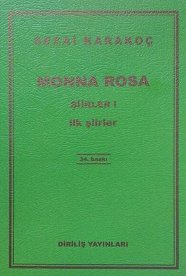

  
# Monna Rosa / Şiirler I - Sezai Karakoç
## 48 Sayfa
### 30.03.2021
  
 

  

    
     

 
 

________

> ***1-AŞK VE  ÇiLELER*** 

Monna Rosa, siyah güller, ak güller;  
Gülce'nin gülleri ve beyaz yatak.  
Kanadı kırık kuş merhamet ister;  
Ah, senin yüzünden kana batacak,  
Monna Rosa, siyah güller, ak güller!  

Ulur aya karşı kirli çakallar,  
Bakar ürkek ürkek tavşanlar dağa.  
Monna Rosa, bugün bende bir hal var,  
Yağmur iğri iğri düşer toprağa,  
Ulur aya karşı kirli çakallar.  

Zeytin ağacının karanlığıdır  
Elindeki elma ile başlayan...  
Bir yakut yüzükte aydınlanan sır,  
Sıcak ve minnacık yüzündeki kan,  
Zeytin ağacının karanlığıdır.  

Zambaklar en ıssız yerlerde açar,  
Ve vardır her vahşi çiçekte gurur.  
Bir mumun ardında bekleyen rüzgar,  
Işıksız ruhumu sallar da durur,  
Zambaklar en ıssız yerlerde açar.  

Ellerin, ellerin ve parmakların  
Bir nar çiçeğini eziyor gibi..  
Ellerinden belli olur bir kadın.  
Denizin dibinde geziyor gibi  
Ellerin, ellerin ve parmakların.  

Açma pencereni, perdeleri çek:  
Monna Rosa, seni görmemeliyim.  
Bir bakışın ölmem için yetecek;  
Anla Monna Rosa, ben öteliyim...  
Açma pencereni, perdeleri çek.  

Zaman çabuk çabuk geçiyor Monna;  
Saat on ikidir, söndü lambalar.  
Uyu da turnalar gelsin rüyana,  
Bakma tuhaf tuhaf göğe bu kadar;  
Zaman çabuk çabuk geçiyor Monna.  

Akşamları gelir incir kuşları,  
Konarlar bahçemin incirlerine;  
Kiminin rengi ak, kiminin sarı.  
Ah, beni vursalar bir kuş yerine!  
Akşamları gelir incir kuşları...  

Ki ben, Monna Rosa, bulurum seni  
İncir kuşlarının bakışlarında.  
Hayatla doldurur bu boş yelkeni  
O masum bakışlar... Su kenarında  
Ki ben, Monna Rosa, bulurum seni.  

Kırgın kırgın bakma yüzüme Rosa:  
Henüz dinlemedin benden türküler.  
Benim aşkım uymaz öyle her saza,  
En güzel şarkıyı bir kurşun söyler...  
Kırgın kırgın bakma yüzüme Rosa.  

Yağmurlardan sonra büyürmüş başak,  
Meyvalar sabırla olgunlaşırmış.  
Bir gün gözlerimin ta içine bak:  
Anlarsın ölüler niçin yaşarmış,  
Yağmurlardan sonra büyürmüş başak.  

Artık inan bana muhacir kızı,  
Dinle ve kabul et itirafımı.  
Bir soğuk, bir garip, bir mavi sızı  
Alev alev sardı her tarafımı,  
Artık inan bana muhacir kızı.  

Altın bilezikler, o korkulu ten,  
Cevap versin bu kanlı kuş tüyüne;  
Bir tüy ki, can verir bir gülümsesen,  
Bir tüy ki, kapalı geceye, güne;  
Altın bilezikler, o korkulu ten!  

Monna Rosa, siyah güller, ak güller,  
Gülce'nin gülleri ve beyaz yatak.  
Kanadı kırık kuş merhamet ister;  
Ah, senin yüzünden kana batacak,  
Monna Rosa, siyah güller, ak güller!  

***1952, İlkbahar.***

______

> ***II. ÖLÜM VE ÇERÇEVELER***

Bir lamba yanıyor, hafif ve sarı;  
Garip bir yolculuk, tren ve Gülce.  
Bir hançer bölüyor, ah, rüyaları:  
Bir rüya, bir hançer, bir el; ve, ve, ve...  

Lambalar yanıyor, hafif ve sarı;  
Gece kar yağacak sabaha kadar.  
Toprakta et, kemik çıtırtıları...  
Yarı ölüleri bir korku tutar  
Değince bir taşa kafatasları.  
-Ölüler ki yalnız tırnakları var,  
Ve yalnız burkulmuş diz kapakları...-  

Bir lamba yanıyor, hafif ve sarı,  
Açıyor elini göğe bir kadın.  
Uzuyor, uzuyor, uzuyor saçları  
Uğrunda ölen güzel kızların...  

Bir lamba yanıyor, hafif ve sarı;  
Esmer delikanlı, hatıra ve kan.  
Yeşil gözlü kızın hıçkırıkları  
Sızıyor bir kapı aralığından;  
Lambalar yanıyor, hafif ve sarı.  

Lambalar yanıyor, hafif ve sarı;  
Çocuklara açar mağaraları  
Gün görmemiş kuşlar ve örümcekler.  
İlan-ı aşk eden dil balıkları  
Aşina suları çabuk terkeder...  

Lambalar yanıyor, hafif ve sarı;  
Bakıyor ateşe, küle böcekler.  
Köpekler parçalar kanaryaları  
Mektupları bir boz ağaç kurdu yer.  
Baykuşlar ötüyor harabelerde;  
Yanıyor lambalar, hafif ve sarı.  
Bir kaza kurşunu bulur her yerde  
Süvarisiz şaha kalkan atları...  
Bir ruhun ışığı vardır göklerde,  
Lambalar yanıyor, hafif ve sarı;  
Ötüyor baykuşlar harabelerde.  

Bir lamba yanıyor, hafif ve sarı;  
Titriyor yıldırım düşmüş gibi yer.  
Bekledi arzuyla karanlıkları  
Anneler, babalar, erkek kardeşler.  
Ta içinde duyar ani bir ağrı,  
Bir hüzün şarkısı tutturur gider  
Anneler, babalar, erkek kardeşler.  

Lambalar yanıyor, hafif ve sarı;  
Her yatak dopdolu, bir yatak bomboş.  
Bir neşe şarkısı tutturur gider  

Birinci, ikinci, üçüncü sarhoş;  
Kurşunlar sıkılır göklere doğru,  
Serçe yavruları yuvada titrer.  

Lambalar yanıyor, hafif ve sarı...  

Bir lamba yanıyor, hafif ve sarı;  
İnce yelkenleri alıyor yeller.  
Titretir kalpleri ve bayrakları  
Gemiden toprağa uzanan eller.  
Lambalar yanıyor, hafif ve sarı,  
Bir yosun köküne hasret kalacak  
Gizli hazineler, su yılanları...  

İnce yelkenleri alıyor yeller;  
Bir lamba yanıyor, hafif ve sarı.  
Beyaz pelerinli hür tayfaları  
Kendine bağlıyor siyah kediler;  
Titriyor gönüller ve kara bayrak,  
Bir yosun köküne hasret kalacak  
Gemiden toprağa uzanan eller.  
Bir lamba yanıyor, hafif ve sarı.  

Bir lamba yanıyor, hafif ve sarı,  
Garip bir yolculuk, tren ve Gülce.  
Bölüyor bir hançer, ah, rüyaları:  
Bir rüya, bir hançer, bir el; ve, ve, ve...  

**1952, Yaz**

______

> ***III. PİŞMANLIK VE ÇİLELER***

Rüzgar eser, yağmur yağar, tilkiler üşür;  
Bir odun parçası aydınlatır ocağı.  
Anne ateşin önünde perişan,  
Anne ateşin içinde hür...  
Rüzgar eser, yağmur yağar, tilkiler üşür.  

Yağmurlar sırtıyla sırtımın arasındadır;  
Şarkılar dudaklarıyla dudaklarımın.  
Bin parçaya böldü beni bir divane sır,  
Sesi geliyor sesi günahkar çocukların;  
Şarkılar dudaklarıyla dudaklarımın arasındadır.  

Gönüller yanarak kavuşacaktı;  
Yüzdeki ıstırap, çile ocağı,  
Onun bu ocakta yanan toprağı,  
Bir gece rüyamda avuçlarımı yaktı,  
Gönüller yanarak kavuşacaktı.  

Benim gözlerim yeşildir, onun gözleri kara;  
Ben günah kadar beyazım, o tövbe kadar kara.  

Annenin başı elleri arasında,  
Parmağında aydınlık günlerden kalma yüzük.  
Bir fotoğraf asılıdır duvarda:  
Aynaya, geceye, maziye dönük,  
Annenin başı elleri arasında,  

Bir tüfeğin burnu havadadır,  
Ateş almak üzredir, mermisiz.  
Ben bir küçük kızım, ben bir deli kızım,  
Siz beni ne anlarsınız siz!  
Bir tüfek ateş almak üzredir, mermisiz...  

Bir saman çöpüne tutunmuş kızların  
Eteğini ben çektim.  
NEyleyim göğsümü kara dağın sert rüzgarı doldurmuş,  
Annemden ilk sütü Gülce'de içtim.  
Ankara'ya, çatal dağa biz zindandan gün vurmuş:  
Az kalsın yerine ben ölecektim  
Bir saman çöpüne tutunmuş kızların...  

Kediler halıları parçalıyor,  
Kırmızı bir ışık düşüyor yere.  
Annenin dizinde derman yok,  
Annenin kafası iki parçadır.  

Hükmedemiyor insan ruhuna ateş,  
Rüzgar hükmedemiyor incecik perdelere;  
Kediler halıları parçalıyor.  

Ateşte sarı gül açan saksılar,  
Kızarmış bir ekmek gibi duruyor;  
Kulağıma garip sesler geliyor.  
Kuş yumurtasından çıkan insanlar  
Ahırda bir ata eğer vuruyor,  
Kulağıma garip sesler geliyor.  

Ben bir şarkı, ben bir tüyüm;  
Ben Meryemin yanağındaki tüyüm.  
Beni bir azizin nefesi uçurur,  
Kalbimde Allahın elleri durur.  
Cici ayaklarım iplikle bağlı,  
Ben onun sılası, kendimin gurbetiyim;  
Ben bir azizin hasreti,  
Ben Meryem'in yanağındaki tüyüm.  

Benim gözlerim yeşildir, evet evet, onun gözleri kara;  
Ben günah kadar beyazım, o tövbe kadar kara...  

Ocak sönüyor, ateş kül oluyor.  
Annenin saçları beyaz,  
Anne saçlarını yoluyor.  
Ateşin içinde gül açar, servi büyür, ardıç büyür, çocuk büyür;  
Ocak sönüyor, ateş kül oluyor,  
Anne ruhunda ruhuma eğiliyor.  

Yaralı kuş kanadını ısıtan  
Bir güneş toprağı yarıp çıkacak.  
Kadınlar sansa da yaşadığını,  
Şarkısız kaldıkça yaşamayacak.  
Kadınları şarkılar, geceler aydınlatır.  
Kadınları şarkılar, akrepler aydınlatır.  
Kadınları şarkılar, zehirler aydınlatır...  

Artık ben gideceğim, ata eğer vuruyorlar.  
Hatıralarımı birer birer yakacağım.  
Entarimi parça parça edip  
Zehirli kirpilere bırakacağım.  
Beyaz bir kayanın üstüne çıkıp  
Göğsüme siyah bir gül takacağım.  
Batan güne doğru kurşunlar sıkıp  
Kendimi boşluğa bırakacağım.  
Ayaklarımın altından geçiyor bir deniz...  
Ben bir küçük kızım, ben bir deli kızım,  
Siz beni ne anlarsınız siz!  
Artık ben gideceğim atım kişniyor;  
Bir bebek mum istiyor, bir ölü şarkı istiyor,  
Ayaklarımın altından geçiyor bir deniz, bir deniz;  
Beni onun gözleri çağırıyor, duramam duramam.  

Benim gözlerim yeşildir, ah, onun gözleri kara;  
Ben günah kadar beyazım, o tövbe kadar kara...  

***1952, Güz***

______

> ***VE MONNA ROSA***

Peygamber çiçeğinin aydınlığında ara  
Sana doğru uzanan çaresiz ellerimi.  
Sırrımı söylüyorum vefakar balıklara:  
Yalnız onlar tutacak bu dünyada yerimi.  
Koyverip telli pullu saçlarımı rüzgara,  
Bir çocuğun ardına düşen heykellerimi  
Peygamber çiçeğinin aydınlığında ara...  

Bir çevre sağ elimden bulanık suya düştü  
Ve boğazımı sıktı parmaklar ince, uzun.  
Günahkar toprağıma saçından bir tel düştü;  
Sana ne olmuş Rosa, bir derde tutulmuşsun.  
Bir ekmek kadar aziz fikirler böyle pişti:  
Noel ağaçları ve manolyalar kahrolsun,  
Bir çevre sağ elimden bulanık suya düştü...  

Şu şapkayı çıkarıp atıyorum ırmağa;  
Her şeyim sizin olsun, hep sizin kesik başlar.  
Rüyasında örümcek başlarsa ağlamağa,  
İçine gül koyduğum tüfek ölmeğe başlar.  
Günahını sırtına yüklenen kaplumbağa  
Gibi ölüm önünde öz benliğim yavaşlar.  
Öyleyse şu şapkayı fırlatayım ırmağa.  

Bu erkekler kokuyu kediler gibi alır  
Ve kediler her gece sürünür yastıklara.  
Denizleri bahtiyar eden günler kısalır;  
Satılmayan çiçekler, zehirli ve kapkara,  
Unutulmuş erkekler ve kadınlara kalır.  
Bir geyiğin gözleri düşer eriyen kara  
Ve erkekler kokuyu kediler gibi alır.  

Ve yalnızlık, sigara külü kadar yalnızlık!  
Ve toprağın rüyaya yılan gibi girişi.  
Sana da, Monna Rosa, taş bebeği bıraktık,  
Ellerinde kılçıklı balıkların bir dişi.  
Senin hatıran gibi büyük, yeni, karanlık;  
Senin hatıran kadar Allah ve şeytan işi...  
Ve yalnızlık, sigara külü kadar yalnızlık!  

Bugün yalnız yağmura tahammül edeceğim;  
Ta boğazıma kadar çıkan deli yağmura.  
Tüyüme horozdan çok itimat edeceğim,  
İtimat edeceğim şu belalı yağmura.  
Ruhuma bayrak yapıp ben teslim edeceğim  
Asılmış bir adamın iki eli yağmura.  
Bugün yalnız yağmura tahammül edeceğim.  

Bir tren ışığına, güneşe çekmek seni  
Ve bir şehir yaratmak, ruhundan Gülce diye.  
Parçalanan gemiyi ve yırtılan yelkeni  
Katıvermek sessizce söylenen bir türküye.  
Ve sonra bir köşede öldürmek ölmeyeni  
Ve son vermek bitmeyen, bu bitmeyen şarkıya,  
Bir tren ışığına, güneşe çekmek seni.  

Sana tavuskuşunun içime girdiğini  
Son, en son söz olarak söylemek istiyorum.  
İçime girdiğini, tüyünü yolduğunu  
Son, en son söz olarak söylemek istiyorum.  
İçimde tavusların bir bir kaybolduğunu,  
Bana da bir çift ak kanat kaldığını  
Son, en son söz olarak söylemek istiyorum.  

Peygamber çiçeğinin aydınlığında ara  
Sana doğru uzanan çaresiz ellerimi.  
Sırrımı söylüyorum vefakar balıklara;  
Yalnız onlar tutacak bu dünyada yerimi.  
Koyverip telli pullu saçlarını rüzgara.  
Bir çocuğun ardına düşen heykellerimi  
Peygamber çiçeğinin aydınlığında ara...  

***1952, Kış (Yılbaşı Gecesi)***

____

> ***İŞARET***  

Ne zaman yandı elin,  
Ne zaman ellerini yaktı hatıram?  
Ne zaman bir yüzük gibi taktı hatıram,  
Parmağına, bu gizli ve acı işareti, gelin.  

***1954***

_____

> ***KADER YOLU***

Etrafımız, uçsuz bucaksız çöller;   
Yerler demir, gökler bakır Madonna.   
Nehirler çekilmiş, kurumuş göller;   
Aramızda deniz vardır Madonna!   
Gelir gelmez Venedik'ten aynalar,   Uçtu gökte kara kara kargalar.  
Ömrü biçti kılıç gibi levhalar;   
Bize kalan sade sabır Madonna!   

***1956***

_______

> ***KAYBOLUŞ***

Üstündeki giysi gözünün renginde   Yürüyor yürüyordu arkasına bakmadan   Onu kaybettim bir kış gününde   Yağmur yağmur yağmur yağıyordu durmadan   

Ölü taşıyan bir araba   Araya girdi galiba

Koştum koştum yetişemedim   Sanki önümü kapatan bir sütundu zaman   İnsanlar otomobiller dalgın habersiz zalim   Alıkoyamadım onu meçhullere dalmaktan 

Boşunaydı artık çaba  
Boşuna mıydı acaba  

Dondum kalakaldım olduğum yerde  
Gözlerimi kaplıyordu duman duman duman  
Gönlüm ne geçmişte ne geleceklerde  
Bir mahkumdum görülmemiş bir cezaya çarpılan  

Uğrayan bir azaba  
Sığmaz hesaba kitaba 

***1957***

______

***- SON -***

 

### Kitaptan Alıntılar ;
- ***"Hayat bir ölümdür, aşk bir uçurum..."***
- ***İyi ki bilmiyor kalabalıklar   Yağmura bakmayı cam arkasından,   İnsandan insana şükür ki fark var;   Birine cennetse, birine zindan   İyi ki bilmiyor kalabalıklar.***
- ***Açma pencereni, perdeleri çek:  
Monna Rosa, seni görmemeliyim.  
Bir bakışın ölmem için yetecek;***
- ***Yağmurlardan sonra büyürmüş başak,  
Meyvalar sabırla olgunlaşırmış.  
Bir gün gözlerimin ta içine bak:  
Anlarsın ölüler niçin yaşarmış,  
Yağmurlardan sonra büyürmüş başak.***  
- ***"Artık inan bana muhacir kızı.."***
- ***Kanadı kırık kuş merhamet ister;  
Ah, senin yüzünden kana batacak,  
Monna Rosa, siyah güller, ak güller!***  
- ***Ölüler ki yalnız tırnakları var,  
Ve yalnız burkulmuş diz kapakları...***  
- ***Gönüller yanarak kavuşacaktı;  
Yüzdeki ıstırap, çile ocağı,  
Onun bu ocakta yanan toprağı,  
Bir gece rüyamda avuçlarımı yaktı,  
Gönüller yanarak kavuşacaktı.***  
- ***Benim gözlerim yeşildir, onun gözleri kara;  
Ben günah kadar beyazım, o tövbe kadar kara.***  
- ***Göğsüme siyah bir gül takacağım.  
Batan güne doğru kurşunlar sıkıp  
Kendimi boşluğa bırakacağım.***  
- ***"Beni onun gözleri çağırıyor, duramam duramam."***
- ***"Ve yalnızlık, sigara külü kadar yalnızlık!"***