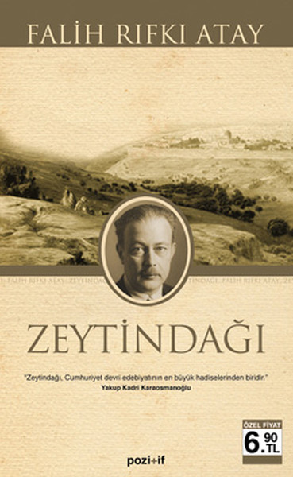

  
# Zeytindağı - Falih Rıfkı Atay
## 176 Sayfa
### 03.04.2021
  
 

  

    
     

 
 

Öldberg, Zeytindağı'nın Almancası! Cebelizzeytun Arapçası, Zeytindağı ise Kudüs'e hakim komuta karargahının bulunduğu tepenin adıdır.

_______

***Biz, şimdi kırkına yaklaşanlar, Osmanlı İmparatorluğu'nun son gençleriyiz. 1914'te üç, beş, yedi yaşında bulunan çocuklar, bugün, yeni Türkiye'nin gençleri olmuşlardır ve hatıralarında imparatorluktan hiçbir iz kalmamıştı. İşte onlara, saltanatın, Suriye'de, Filistin ve Hicaz'daki son yıllarını anlatmak istiyorum.***

_____

Zeytindağı, insanın kanını donduran tarihi bir süreci, “bir imparatorluğun çöküşünü” o zamana göre en duru Türkçe ile karşımıza getiriyor. Kitapta Mehmetçiğin Yemen’de, Aden’de, Kanal’da, Gazze’de, Arap Çölleri’nde nasıl kırıldığını, yenilgiden sonra bir vagon dolusu “mecidiye altınını” bile nasıl bıraktığımızı hayretler içerisinde okuyacaksınız.

Cemal Paşa’nın emir subayı olarak, o günlerde en yakınında olan Falih Rıfkı, Zeytindağı kitabıyla tarihimize bir ibret belgesi bırakırken, her biri bir destan olabilecek, askerlerin günlükleri ve adeta kumar masasında kaybedilen Ahmetlerin, Mehmetlerin hikâyeleri tüylerinizi ürpertecek.

 

### Kitaptan Alıntılar ;
- ***"1913'te bir Mustafa Kemal, yüzyıl sonrası için bile hayaldi, fantazi romanlarında bile yeri yoktu."***
- ***"Fakat bir avuç Türk, bütün kıtayı tuttu."***
- ***"Acaba insanın öldüreceği kimseleri, önceden, sağ olarak, karşısında dizlerine kapatmaktan ve dik boyunlarını eğdirmekten aldığı zevk nedir?"***
- ***- "Suriye'de bizim ne kadar temelsiz olduğumuzun en iyi misali nedir, bilir misiniz?"
Yüzüne baktım.
  - "Şu sekiz yaşında çocuğun korkudan, bana selam duruşu!"***
- ***+ Efendimiz kanunu getirdim. 
  - Ne kanunu? 
   + Bir mesele için emir buyurmuştunuz. Halbuki elimizdeki kanun sarihtir, bu mesele emriniz gibi halledilemez.  
Yaverine dönerek: 
 - Bana bir müsvedde kâğıdı getiriniz! 
  - Ve hemen Harbiye Nazırlığı'na müstacel bir telgraf: ''Şu numaralı kanunu hemen bu şekilde değiştirerek bana metnini müstacel telgrafla bildiriniz.''  
Bir kumaş bile bu kadar kolay ısmarlanmaz.***
