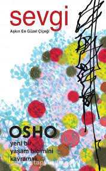

  
# Sevgi - Osho
## 208 Sayfa
### 08.04.2021
  
 

  

    
     

 
 

_____________

***İnsan zaten hipnoz altındadır. Şu an hipnoz altında olup olmadığın önemli değildir; sen zaten hipnoz edilmiş haldesin. Toplumun tüm işleyişi bir tür hipnozdur. Birisine Hıristiyan olduğu söylenmiştir. Ve bu o kadar çok ve sürekli olarak tekrar edilmiştir ki onun zihni şartlandırılır ve kendisini bir Hıristiyan zanneder. Birisi Hintlidir, birisi bir Müslüman'dır. Sen zaten hipnoz altındasın. Istırap çektiğini düşünüyorsan bu bir hipnozdur. Şayet çok sayıda problemin olduğunu zannediyorsan bu hipnozdur. Sen her ne olursan ol bu bir çeşit hipnozdur. Toplum sana bu fikirleri vermiştir ve şimdi sen bu fikirlerle ve şartlanmışlıklarla dolusun.***

_____

***Küçük bir okuldaki bayan öğretmen çocuklara, "Her hafta en azından bir tane iyilik yapmalısınız" dedi. Bir çocuk sordu: "İyi şeyler için bir örnek verin lütfen. Neyin iyi olduğunu bilmiyoruz." Bunun üzerine öğretmen, "Örneğin kör bir kadın karşıdan karşıya geçmek istiyor, o zaman ona karşıdan karşıya geçmesi için yardım edin. Bu iyi bir iştir. Bu sevaptır" dedi.  
Sonraki hafta kadın sordu, "Size söylediğim şeyi hatırlayan var mı?" Üç çocuk ellerini kaldırdı. Öğretmen, "Bu hiç iyi değil. Hiçbiriniz beni dinlememiş. Ama yine de üç oğlanın iyi bir şey yapmış olması güzel" dedi. Birincisine sordu, "Ne yaptın?" "Tam olarak söylediğiniz şeyi: Kör bir yaşlı kadın vardı onun karşıya geçmesine yardım ettim" dedi.
"Bu çok iyi. Tanrı seni korusun" dedi. İkincisine sordu, "Sen ne yaptın?" O da, "Aynısını; yaşlı kör bir kadının karşıya geçmesine yarım ettim" dedi. Öğretmenin biraz aklı karıştı; yaşlı, kör kadınları nereden buluyorlardı?" Ama bu büyük bir şehirdi; belki iki tane bulmuş olabilirlerdi. Üçüncüye sordu ve o da, "Ben de onların yaptığı şeyin tam olarak aynısını yaptım: yaşlı, kör bir kadının karşıya geçmesine yardım ettim" dedi.
Öğretmen "iyi ama üç tane yaşlı kör kadını nereden buldunuz?" dedi. Onlar da, "Anlamıyorsunuz: Üç tane yaşlı, kör kadın yoktu, sadece tek bir kör kadın vardı. Ve onun karşıdan karşıya geçmesini sağlamak çok zordu! Bize vuruyordu ve bağırıyordu ve çığlık atıyordu çünkü karşıya geçmek istemiyordu ama biz sevap işlemek niyetindeydik. Bir kalabalık toplandı, insanlar bize bağırıyorlardı ama biz, 'Endişelenmeyin. Biz onu diğer tarafa götürüyoruz' dedik. Ama o asla öteki tarafa gitmek istemedi!" dediler.  
İnsanlara diğerlerine yardım etmeleri söyleniyor ve onlar kendi içlerinde boşlar. Onlara başkalarını sevmeleri söyleniyor —komşularını sev, düşmanlarını sev— ve asla onlara kendilerini sevmelerini söylemiyorlar. Tüm dinler doğrudan yahut dolaylı olarak insanlara kendilerinden nefret etmelerini söylüyor. Kendisinden nefret eden bir insan hiç kimseyi sevemez; o sadece öyleymiş gibi yapar.***

______

***Birisi acı çekiyor; duygusal insan ağlamaya başlayacaktır. Ağlamanın bir faydası olmayacak. Birisinin evi yanıyor; duygusal insan bağıracak ve ağlayacak ve göğsünü yumruklayacaktır. Bunun bir yararı olmaz. Sevgi dolu insan harekete geçecektir. Ağlamayacaktır, bu anlamsızdır. Gözyaşlarının bir yararı olmaz. Gözyaşları ateşi söndüremez, gözyaşları acı için ilaç olamaz, gözyaşları adamı boğulmaktan kurtaramaz. Bir adam boğuluyor ve sen kıyıda durmuş ağlayıp zırlıyorsun ve ağlamak ve zırlamak gerçekten zordur. Sen duygusal bir adamsın, kesinlikle. Ama sevgi dolu bir adam değilsin. Sevgi dolu bir insan hemen eyleme geçer. Onun eylemi anındadır; o tek bir an bile tereddüt etmez. Onun eylemi anındadır; onun görüş alanında herhangi bir şey ortaya çıktığı an o bunu hemen eyleme döker. Tam olarak o, bunu eyleme dökmez; o, eyleme dönüşür, onun anlayışı ve onun eylemi aynı olgunun iki yüzüdür, onlar iki ayrı şey değildir. Onun bir tarafına anlayış denir, diğer tarafına eylem denir.***

______

***Artık, delirmiş insanların bu şekilde tedavi edilemeyeceğini biliyoruz. Delirmiş insanlar hapsedilir, hücrelerde izole edilir. Bu dünyanın her yerinde hâlâ oluyor. Çünkü başka ne yapılabileceğini bilmiyoruz. Cahilliğimizi gizlemek için delirmiş insanları hapsediyoruz ve böylelikle onları unutabiliyoruz. En azından onların var olduğu gerçeğini göz ardı edebiliyoruz.  
Kasabamda arkadaşlarımdan birisinin amcası deliydi. Onlar zengin insanlardı. Onların evine sıklıkla giderdim ama ben bile, bu arkadaşımın amcalarından birisinin yıllar boyunca yeraltındaki bodrumda zincirlenmiş olarak tutulduğunu fark etmemiştim.
"Niçin?" diye sordum.  
"O deli. Sadece iki yol vardı: Ya onu evimizde, zincirlenmiş halde tutacaktık... Ve elbette onu evin üst katında zincirleyemezdik. Aksi taktirde ziyarete gelen insanların hepsi endişelenecek ve kaygılanacaklardı. Ve onun çocukları ve karısı babalarını, kocasını bu halde görecekti... Bu çok kötü olurdu. Onu hapsetmek ailemizin ününe yakışmayacaktı, bu yüzden biz de bir yol bulduk. Onu yer altına hapsettik. Yiyeceği bir hizmetçi tarafından götürülüyor; onun dışında hiç kimse onu görmüyor, kimse onunla karşılaşmıyor.  
"Onunla tanışmak istiyorum" diye arkadaşımı ikna ettim.  
"Ama seninle gelemem, o tehlikeli bir adam, o deli. Zincirlenmiş bile olsa, her şeyi yapabilir" dedi.  
"En kötü ihtimalle beni öldürebilir. Sen sadece benim arkamda dur, böylelikle ben ölürsem sen kaçabilirsin, ama ben gitmek istiyorum."  
Israr ettiğim için amcasının yiyeceğini sağlayan hizmetçiden anahtarı almayı başardı. Otuz yıldır hizmetçi dışında onunla buluşan, dış dünyadan gelen ilk insandım. Ve bu adam bir zamanlar delirmiş olabilir —bilemiyorum— ama o artık deli değildi. Ancak hiç kimse onu dinlemeye hazır değildi çünkü tüm deliler "Biz deli değiliz" der. Bu nedenle o ne zaman hizmetçiye "Aileme söyle ben deli değilim" dese hizmetçi sadece gülerdi. En sonunda hizmetçi bile aileye söyledi ama hiç kimse bunu dikkate almadı.  
Adamı gördüğümde yanına oturdum ve onunla konuştum. O dünyadaki herhangi bir insan kadar akıllıydı; belki de biraz daha akıllıydı çünkü bana bir şey söyledi: "Otuz yıldır burada olmak çok muazzam bir tecrübeydi. Aslında sizin çılgın dünyanızın dışında olduğum için şanslı hissediyorum. Onlar benim deli olduğumu düşünüyor —bırak öyle zannetsinler, bunun bir zararı yok— ama aslında sizin çılgın dünyanızın dışında olduğum için şanslıyım. Ne düşüyorsun?"  
"Kesinlikle haklısın. Dışarıdaki dünya otuz yıl önce sen terk ettiğinden beri çok çılgın. Otuz yılda her şeyde büyük gelişmeler oldu; delilikte de. İnsanlara deli olmadığını söyleyip durmaktan vazgeçmelisin. Yoksa seni dışarı çıkarabilirler. Sen son derece güzel bir hayat yaşıyorsun etrafta yürüyebileceğin kadar yeterli alan var..."
"Burada yapabildiğim tek egzersiz bu: Yürümek" dedi.  
Ona vipassana öğretmeye başladım. "Bir Buda olmak için öylesine mükemmel bir durumdasın ki: Endişe yok, rahatsız edecek bir şey yok, kaygı yok. Sen gerçekten kutsanmışsın" dedim. Ve onu ölmeden önce son kez gördüğümde yüzünden, gözlerinden onun aynı kişi olmadığını; tam bir dönüşüm yaşadığını, bir başkalaşımın onun başına geldiğini görebildim.  
Delirmiş insanların meditasyon yöntemlerine ihtiyaçları vardır böylelikle onlar deliliklerinin dışına çıkabilirler. Suçluların psikolojik yardıma, ruhsal desteğe ihtiyacı vardır. Onlar gerçekten derinde hastadır. Ve sen hasta insanları cezalandırıyorsun. Bu onların suçu değildir. Eğer birisi cinayet işlerse bunun anlamı onun öldürme eğilimini uzun bir süredir taşıyor olduğudur. Öylesine, aniden birisini öldürmezsin.***

________

***Bir başka Zen öyküsü:  
Bir Zen ustası pek çok kereler hapse atılmıştı.  
...Şimdi, bir adım daha ötesi! Bu Zen insanları gerçekten eksantrik insanlar, çılgın insanlardır; ama güzel şeyler yaparlar. "Bir Zen ustası pek çok kereler hapse atılmıştı." Şimdi, bir hırsızı affetmek bir şeydir, onun kötü olmadığını düşünmek bir şeydir, kişinin kendisinin hapse girmesiyse bambaşka bir şeydir. Ve bir kez de değil, pek çok kez komşulardan küçük şeyler çaldığı için. Ve komşular biliyorlardı ve kafaları karışmıştı: Bu adam niye çalıyor? Ve bu kadar küçük şeyler. Ama hapisten çıkarıldığı an yeniden çalardı ve geri dönerdi. Yargıçlar bile endişelenmişti. Ama onu hapse göndermek zorunda idiler çünkü itiraf ediyordu. Asla, "Ben çalmadım" demezdi.  
En sonunda komşular toplandılar ve dedi  
ler ki: "Efendim, artık çalmayın. Yaşlanıyorsunuz ve siz neye ihtiyaç duyuyorsanız size sağladık; ne olursa olsun tüm gereksinimlerinizi. Buna bir son verin! Çok endişeliyiz ve çok üzgünüz. Niçin bunu yapmaya devam ediyorsunuz?"Ve yaşlı adam kahkaha attı ve dedi ki:
Mahkûmlarla buluşmak ve onlara manevi mesajlar götürmek için çalıyorum. Onlara kim yardım edecek? Siz dışarıdaki mahkûmlara yardım edecek pek çok usta var. Ancak hapishanenin içinde hiç usta yok. Onlara kim yardım edecek, siz bana söyleyin? İçeri girip bu insanlara yardım etmek için benim yolum budur. Bu nedenle cezam bittiğinde ve dışarı çıkarıldığımda, geri dönebilmek için yeniden çalmak zorundayım. Buna devam edeceğim. Ve hapiste öylesine güzel ruhlar, o kadar masum; bazen çok daha masum ruhlar buldum ki..."  
Bir seferinde arkadaşlarımdan birisi Hindistan'daki bir eyalette vali olmuştu ve eyaletteki tüm hapishanelerin içine girmeme izin vermişti. Yıllar boyunca gittim ve şaşırdım. Hapishanedeki insanlar politikacılardan, zengin insanlardan, sözde azizlerden çok daha masumdular. Hindistan'ın neredeyse tüm azizlerini tanıyorum. Onlar çok daha kurnazdır. Suçluların arasında o kadar masum ruhlar buldum ki... Bu yaşlı Zen ustasının düşüncesini —çalmayı, yakalanmayı ve onlara, "Mahkûmlarla buluşmak ve onlara manevi mesajlar götürmek için çalıyorum" mesajını götürmesini— anlıyorum.***

______

 

### Kitaptan Alıntılar ;
- ***"İnsanlar gelir ve gider, onlar kalmaz! Onlar kalamaz, onların kalmaması gerekir, onların işi kalmamaktır."***
- ***"Nefes almak yaşamak değildir.."***
- ***"Ve unutma, hiçbir duygu birkaç dakikadan fazla kalamaz."***
- ***"Ve insanları unutma. Onların engelleri olabilir, onlar senin düşmanların olabilir. Onlar seni pek çok şekilde mahvetmeye çalışmış olabilir; onlar seni çoktan çarmıha germiş olabilir; seni ölümüne taşa tutmuş, yahut seni hapsetmiş olabilirler fakat sen onları unutma. Her ne yaptılarsa bilinçsiz bir halde yaptılar. Onları affedemezsen, kim onları affedecek? Ve senin onları affetmen seni kıyaslanamaz bir şekilde zenginleştirecektir."***
- ***"Kendi içinde rahatla, sadece gözlerini kapa ve etrafında olan biten şeyleri dinle."***
- ***"Güneş yok olursa ağaçlar yok olur. Ağaçlar yok olursa kuşlar yok olacaktır. Kuşlar ve ağaçlar yok olursa sen burada olamazsın, yok olacaksın. Bu bir ekolojidir. Her şey diğer her şeyle derinden bağlıdır. Sen hiçbir şeyi reddetme. Çünkü reddettiğin an kendindeki bir şeyi reddediyorsun."***
- ***"Etrafında sürekli olarak bir mucize oluyor ama sen onu ıskalamaya devam ediyorsun."***
- ***"Eğer sessizsen pek çok şey görebilirsin; muazzam enerji dalgaları her tarafta hareket ediyor. Bir kez kabul edersen nereye gidersen git onu hissedeceksin."***
- ***"Birincisi, verecek hiçbir şeyin olmasa bile yeniden bak. Her zaman için verilecek bir şey bulacaksın. Bu bir tavır meselesidir. Hiçbir şey veremezsen en azından gülümseyebilirsin; hiçbir şey veremezsen en azından o kişi ile birlikte oturabilirsin ve ellerini tutabilirsin. Bu bir şey verme meselesi değildir, bu vermekle ilgili bir meselesidir."***
- ***"Dünyanın ne olmasını istersen, önce kendin örnek olman gerekir."***
- ***"Bir çocuk doğduğunda nefret nedir bilmez, o sadece sevgiyi bilir. Sevgi doğuştan gelir; nefreti daha sonradan öğrenecektir.  Kıskançlık, sahiplenme, haset etmeyi sonradan öğrenecektir. Toplumun çocuğa öğreteceği şeyler şunlardır: Nasıl kıskanç olunur, nasıl nefretle dolu olunur, nasıl öfke ve şiddetle dolu olunur? Toplum bunları öğretecektir."***
- ***"Çocuklar güvenirler ama yavaş yavaş kandırılacakları, başlarının derde gireceği, engellenecekleri, korkacakları tecrübelerin içine girecekler. Yavaş yavaş dünyanın tüm dalaverelerini öğrenecekler. Az ya da çok herkesin başına gelmiş olan budur."***
- ***"Ego bir erkeğin yahut bir kadının başına gelebilecek en aptalca şeydir. O bir kez oluştuğunda onu görmek dahi çok zordur çünkü o senin gözlerini perdeler."***
- ***"...tıpkı tüm insanlığın ölü olması gibi, onlar sadece yürüyen cesetlerdir. Ve nereye yürüyorlar? En sonunda dinlenebilmek için mezarlarına yürüyorlar."***
- ***"Çocuk doğduğunda bir "ben" ile gelmez. O basitçe boş bir yapraktır, üzerinde hiçbir şey yazmaz. Artık toplum yazmaya başlayacaktır ve onun bilincini darlaştırmaya başlayacaktır. Toplum yavaş yavaş onun için bir rolü sabitleyecektir —"Senin rolün bu; sen busun"— ve o bu role tutunacaktır. Bu rol onun asla mutlu olmasına izin vermeyecektir çünkü mutluluk sadece sen sonsuzsan mümkündür."***
- ***"Kör köre yardımcı olamaz. Karanlıkta el yordamıyla yolunu arayanlar, başkalarını ışığa götüremezler."***
- ***"Şayet senin yaşam ateşin yanmıyorsa, nasıl olur da başkalarının yanmayan kandillerini yakabileceksin?"***
- ***"Bütün ve yoğun bir şekilde yaşamayanlar, henüz kalpten şarkıları olmayanlar, dudaklarındaki gülümsemesi sahte olanlar başkalarının samimi ve hakiki olmalarına yardımcı olamazlar."***
- ***"Henüz kendisi olamamışlar, kendileri hakkında hiçbir şey bilmeyenler, kendi bireylikleri hakkında hiçbir fikre sahip olmayanlar —hâlâ sahte olan, toplumca yaratılmış olan kendi kişilikleri içerisinde kayıp olanlar— bireyselliğini kazanmaları için başkalarına yardımcı olamazlar. Tüm iyi niyetlere rağmen, bu basitçe mümkün değildir."***
- ***"Bu dünyada iletişim kurmak çok zordur. Tecrübelerini nasıl aktaracağını öğrenmek zorundasın. Böylelikle diğerlerine ulaşan şey tam olarak senin söylemek istediğin şeydir. Aksi taktirde sen nektar paylaştığını zannedebilirsin ve o, onların hayatında bir zehre dönüşür. Onlar zaten yeterince zehirlenmişlerdir."***
- ***"Ancak tavsiye vermenin keyfi öyle çoktur ki. Kendi tavsiyeme benim uyup uymadığım kimin umurunda?  
Başkalarına tavsiye vermenin keyfi çok ince, egoist bir hazdır. Tavsiye verdiğin kişi cahil hale gelir; sen bilgili hale gelirsin. Tavsiye herkesin verdiği ama hiç kimsenin almadığı dünyadaki yegâne şeydir."***
- ***"Unutma ki eşyanın tabiatı gereği eğer dünyayı değiştirmek istersen önce kendini değiştirmek zorundasın. Devrim ilk önce sana gelmelidir. Sadece ondan sonra onu başkalarının kalbine yayabilirsin. İlk önce sen dans etmelisin ve sadece o zaman bir mucize göreceksin; diğerleri de dans etmeye başlamıştır."***
- ***"İnsanlar nefret tarafından mahvedilmezler, insanlar sözde sevgileri tarafından mahvedilirler."***
- ***"Her aşk ilişkisi hayal kırıklığıyla biter. Her aşk ilişkisinin sonunda seni bir üzüntü, depresyon çukurunun içinde, kandırılmışlık duygusuyla bıraktığını hiç gözlemlemedin mi?"***
- ***"Kişi düşüncelerin ortaya çıkmasından değil, sadece, onların farkında olmanın gerisinde kalmaktan korkmalıdır."***
- ***"Bazen gökyüzünde siyah bulutlar olur; gökyüzü bu siyah bulutlar yüzünden değişmez. Ve bazen beyaz bulutlar da olur ve gökyüzü bu beyaz bulutlar yüzünden de değişmez. Bulutlar gelir ve gider ve gökyüzü aynı kalır. Bulutlar gelir ve gider ve gökyüzü baki kalır."***
- ***Normalde sen konuk ile aşırı şekilde özdeşleşmişsindir. Istırabının sebebi budur. Bir konuk gelir, çok bağlanırsın. Ve konuk toplanıp ayrıldığında o zaman sen ağlayıp gözyaşı dökersin ve etrafta koşuşturursun. Ve onunla birlikte gidersin, en azından o ayrılırken görmek için ona güle güle demek için. Sonra ağlayarak ve ağlayarak geri dönersin; bir konuk terk etmiştir ve sen çok mutsuz hissediyorsun. Sonra başka bir konuk gelir ve sen yine konuğun içine düşersin, yeniden konukla özdeşleşirsin ve o yine gidiyor..."***
- ***"Hiç herhangi bir düşünceyi izledin mi? O asla kalmaz, kalamaz. Onu tutmaya çalışsan da o kalamaz. Dene. İnsanlar bazen bunu denerler; tek bir sözcüğü zihninde tutmaya çalışırlar. Örneğin tek bir sesi, aum sesini zihinde tutmaya çalışırlar. Birkaç saniye hatırlarlar ve ondan sonra kayıp gitmiştir. Yine onlar işlerini, karısını, çocukları düşünüyor... Ansızın farkına varırlar; bu aum nerededir? O zihinden kayıp gitmiştir."***
- ***"Düşünceler gelir ve gider, duygular gelir ve gider, hayaller gelir ve gider, ruh halleri gelir ve gider, iklimler değişir. Sen değişen hiçbir şey değilsin."***
- ***"Ancak tüm aptallar kendini akıllı sanır. Aslında kendini akıllı zannetmek aptal olmanın en temel koşullarından birisidir. Akıllı insanlar akıllı olduklarını düşünmezler. Aptal insanlar her zaman kendilerini akıllı zannederler."***
- ***"Unutma, haklının haklılığı her zaman doğru değildir. Haklı olduklarını düşünen insanlar neredeyse her zaman için aptal olanlardır. Hayat son derece karmaşıktır ve hayat o kadar inceliklidir ki, senin haklı olduğuna ve başka birisinin yanlış olduğuna o kadar kolayca karar veremezsin. Aslında, birazcık anlayış sahibi bir insan, asla haklı olma tuzağına düşmeyecektir."***
- ***"Asla birisini kötüleme ve asla kendini yüceltme; aksi taktirde ıskalayacaksın. İnsanları nasıl olursa olsun kabul et. Onlar böyleler ve onların doğru ya da yanlış olduğuna karar vermek için sen kim oluyorsun. Eğer onlar yanlışsa acı çekerler, eğer onlar doğruysa kutsanırlar. Fakat onları kınamak için sen kim oluyorsun."***
- ***"Bu nedenle insanlar başkalarının yanlışları hakkında bu kadar çok konuşur. Bu onlara kendilerinin haklı olduğu hissini verir. Birisi bir katildir. Ve onlar iyi hissederler: "Ben bir katil değilim; en azından ben bir katil değilim. Birisi bir hırsızdır ve onlar iyi hisseder: "Ben bir hırsız değilim." Ve bu böyle sürüp gider ve onların egoları güçlenmeye devam eder. İnsanlar, başkalarının günahları ve başkalarının işlediği suçlar ve başkalarının hayatında yanlış giden tüm şeyler hakkında konuşurlar."***
- ***"Sıradan kal, hiç kimse olarak kal. Ve senin hiç kimseliğinin içine ölümsüz misafir gelir...senin hiç kimseliğinin içinde sen, bir ev sahibi olursun."***
- ***"Birçok vaiz yüzünden dünya dindar değildir derken, çok sayıda insanın başkalarını kendi ideolojilerine göre değiştirmeye, dönüştürmeye, dinini değiştirmeye çalıştığını söylemeye çalışıyorum. Fikir kişiden daha önemli olmamalıdır."***
- ***"İnsanları sevmenin tek bir yolu vardır ve o da onları olduğu gibi sevmektir."***
- ***"Örneğin eğer sen bir anneysen çocuğun bakımını yaparsın çocuğun sana ihtiyacı vardır, sensiz hayatta kalamaz. Sen bir zorunluluksun. O yiyeceğe ihtiyaç duyar, sevgiye ihtiyaç duyar, bakıma ihtiyaç duyar ama o senin ideolojine ihtiyaç duymaz. Onun senin ideallerine ihtiyacı yoktur. Onun, senin Hıristiyanlığına, senin Hinduizm'ine, senin İslam'ına, senin Budizm'ine ihtiyacı yoktur. Onun, senin kutsal kitaplarına ihtiyacı yoktur. Senin inançlarına ihtiyacı yoktur. Onun nasıl olması gerektiği ile ilgili senin fikirlerine ihtiyacı yoktur."***
- ***"Sevgi karşılıksız bir hediye olmalıdır. Onun üzerinde bir fiyat etiketi olduğu an artık o sevgi değildir."***
- ***"Kendisinden nefret eden bir insan hiç kimseyi sevemez; o sadece öyleymiş gibi yapar."***
- ***"Eğer ölmekten korkarsan asla hayatı tanımayacaksın çünkü korku asla tanıyamaz. Eğer ölümden korkmazsan, onu tanımak için ölmeye hazırsan hayatı, asla ölmeyen sonsuz hayatı tanıyacaksın."***
- ***"Sevdiğin zaman korku kaybolur; bunu hiç gözlemledin mi? Sevdiğin zaman korku yoktur. Birini seversen korku kaybolur. Ne kadar çok seversen korku o kadar kaybolur. Bütünüyle seversen korku mutlak şekilde yoktur. Korku sadece sen sevmediğinde ortaya çıkar. Korku sevginin yokluğudur."***
- ***"Ölüm cezası, insanın insana olan zulmünün küçük düşürücü kanıtıdır. Bu, insanın hâlâ barbarlık çağında yaşadığını gösterir. Medeniyet hâlâ bir fikir olarak kalır; o henüz bir gerçeklik olmamıştır."***
- ***"Aslında masumiyetin asla herhangi bir kanıtı yoktur. Kanıtlar suç için ya da suça karşı vardır."***
- ***"İnsan sürekli olarak bir şey söyleyip durur ve onun tam zıddını yapmaya devam eder."***
- ***Aynı şey asırlar boyunca sürdürülmüştür ve ölüm cezası da tam olarak aynı kanundur: "Göze göz, dişe diş. Eğer bir insanın birisini öldürdüğü düşünülürse, o öldürülmelidir." Ancak bu garip: Eğer birisini öldürmek bir suçsa, o zaman aynı suçu işleyerek bu suçu toplumdan nasıl yok edeceksin?***
- ***Kimsenin ölüm cezasına ihtiyacı yoktur, hiç kimse onu hak etmez. Aslında sadece ölüm cezası değil hiçbir türden ceza da doğru değildir çünkü ceza asla kimseyi iyileştirmez. Her gün suçluların sayısı artmaya devam ediyor, her gün daha çok hapishane inşa ediyorsun. Bu garip. Bu böyle olmamalı. Durum tam tersi olmalı çünkü bu kadar çok mahkemeyle, bu kadar çok cezayla ve hapishaneyle suç daha az olmalıdır, suçlular daha az olmalıdır. Zamanla hapishaneler daha az olmalıdır, mahkemeler daha az olmalıdır. Ve bu olmuyor.***
- ***Bunun nedeni senin tüm sebep-sonuç ilişkinin yanlış olmasıdır, insanları cezalandırarak bir şey öğretemezsin. Senin hukukçularının, yasa uzmanlarının politikacılarının asırlardır söylediği şey şudur: "İnsanları cezalandırmazsak, o zaman onlara nasıl öğreteceğiz? O zaman herkes suç işlemeye başlar. İnsanları cezalandırmaya devam etmeliyiz ki bu sayede onlar korkar halde kalsın." Onlar korkunun öğretmek için yegâne yol olduğunu zannederler ve aslında korku insanlara bir şey öğretmenin bir yolu dahi değildir. Cezalandırmanın yaptığı şey, insanları korkuya öylesine alıştırmaktır ki, artık orijinal şok yok olur. Onlar ne olabileceğini bilirler: "En kötü ihtimalle beni döverler. Ve eğer bir insan buna dayanabiliyorsa, ben de dayanabilirim.***
- ***"Ancak kimse suçun ortadan kalkmasını istemiyor çünkü suçluların ortadan kalkması demek senin yargıçlarının, avukatlarının, yasa uzmanlarının, parlamentolarının, polislerinin, gardiyanlarının kaybolması demektir. Bu çok büyük bir işsizlik sorunu yaratacaktır; kimse herhangi bir şeyin daha iyi olması için değişmesini istemez."***
- ***"Suçlulara, kendinin ne kadar ahlaklı, saygıdeğer bir insan olduğunu hissedebilmen için ihtiyaç vardır. Günahkârlara azizlerin kendilerini aziz hissedebilmesi için ihtiyaç vardır. Günahkârlar olmadan, kim bir aziz olurdu? Şayet toplum iyi insanlardan oluşsaydı, İsa Mesih'i iki bin yıl boyunca hatırlayacağını mı sanıyorsun?"***
- ***"Şimdi yüz yaşını geçen pek çok insan vardır. Ve dünyanın bazı bölgelerinde yüz yaşını aşmış hâlâ genç bir adam gibi tarlada çalışabilen insanları bulabilirsin. Bazı bilim adamları şayet doğru beslenme, doğru egzersiz ve doğru atmosfer varsa bir kişinin bedeninin en az üç yüzyıl yaşamasının mümkün olduğunu söylüyorlar. Bu çok tehlikeli bir reçetedir çünkü doksan ya da yüz yıllık zamanda bile hayattan o kadar çok bıkarsın ki üç yüzyıl ne yapacaksın?***"
- ***"Ölüm konusunu bütünüyle yeniden düşünmemiz gerekiyor. Benim fikrim odur ki eğer bir insan kendisi için yaşamanın bütünüyle anlamsız olduğu, yeterince yaşadığı bir aşamaya gelirse bunun yasadışı olmaması gerektiğidir. Buna kesinlikle izin verilebilmelidir; aslında her hastanenin oraya ölmeye gelen insanlar için özel bir bölümü olmalıdır. Böylelikle onlar huzur içinde, sessizce, tüm uygun tıbbi bakım ile ölebilirler. Bu tıbbi bakım onları hayatta tutmak için değildir, bu tıbbi bakım onların mümkün olduğunca güzel, mümkün olduğunca sessiz bir şekilde ölmelerine yardım etmek içindir."***
- ***Bunu düşünmek için kendine zaman tanıyabilirsin. Belki de kişi duygusal olarak o an üzgün hissediyor. Belki de onlara, "Hayatımı sona erdirmeliyim" fikrini veren bir şey olmuştur. Onlara zaman verilmelidir, "Hastaneye gel, bir ay dinlen, ölüme hazırlan. Sana yardım edeceğiz. Ama bu süre içinde fikrini değiştirirsen bu sana kalmış. Kalkıp gidebilirsin, kimse seni zorlamıyor" denilmelidir.***
- ***"Ve bu sadece dünyanın daha az fakir ve daha az kalabalık hale gelmesiyle ilgili bir mesele değildir, bu ayrıca o insanlarla ilgili bir meseledir. Çoğu Batı ülkesinde ve özellikle Amerika'da yüz binlerce insan hastanelerde yaşamaktadır. Onlar doksan yaşında ya da yüz yaşındadırlar. Onlar evlerinde yaşayamazlar çünkü kendi kendilerine nefes bile alamazlar. Ve biz hâlâ onları canlı tutuyoruz; ne için?"***
- ***"Doğmak senin ellerinde değildir ama en azından ölümünü seçebilmekte özgür olabilirsin."***
- ***"Bırakın bu zavallı insanlar ölsün. Ve dünyanın her tarafında beden onlara sadece acı verdiği için bedenlerini terk etmeye hazır binlerce insan var. Çok fazla hastalıkla, çok fazla rahatsızlıkla artık herhangi başka bir şey yapamazlar. Onlar artık hiçbir şeyden zevk almazlar."***
- ***"Herkes öyle bir şekilde yetiştirilmiştir ki, herkes gelecekte bir yerde birisi, bir şey olmak zorundaymış diye düşünmeye devam eder. Bir imaj verilir ve sen onun gibi olmak zorundasın. Bu sana bir gerginlik verir çünkü sen o değilsin, sen başka bir şeysin, ama yine de o olmak zorundasın."***
- ***"Asla mükemmel olmaya çalışma, aksi taktirde çok fazla endişe yaratacaksın. Halihazırda çok sayıda dert var; kendin için daha fazla dert yaratma."***
- ***"Bütün olarak yapılan her eylem canlılık katar ve bütün olarak yapılmış olan her eylem asla herhangi bir esaret yaratmaz. Bütünüyle sev ve bağlılık asla ortaya çıkmaz; yarım yamalak sev ve bağlılık ortaya çıkar. Bütünüyle yaşa ve ölümden korkmazsın; kısmen yaşa ve ölümden korkarsın."***
- ***Yaşlı Heraklit "Aynı nehre ikinci kez giremezsin" der. Aynı kişiyle yeniden karşılaşamazsın. Aynı kişiyle ikinci kez karşılaşmak imkânsızdır çünkü insan varlığı bir nehirdir sürekli akar. Ne olacağını asla bilemeyeceksin. Gelecek açık kalır.***
- ***"Bir insanoğlu asla aynı kalmaz. Geriye düşebilir, ileriye gidebilir; cehenneme ya da cennete gidebilir. Ama asla aynı kalmaz."***
- ***"Tüm dünya sevgiden bahseder, sevgi şarkısını söyler: Ve, sen bu kadar sevgisiz başka bir yer bulabilir misin? Sevginin bir zerreciği dahi yoktur; sadece dağlarca laf, sevgi hakkında Himalayalarca edebiyat."***
- ***İlk adım kendini olduğun halinle kabul etmektir; tüm olmalıları bırak. Yüreğinde hiçbir "olmalı" taşıma! Başka birisi olman gerekmiyor; sana ait olmayan bir şeyi yapman beklenmiyor; sen sadece kendin ol. Rahatla ve sadece kendin ol. Kendi bireyselliğine saygılı ol ve kendi imzanı atmak için cesur ol. Başkalarının imzalarını kopyalamayı bırak.***
- ***Bir insana iyi dediğinde ona bakmayı bırakmışsındır. Onu çoktan etiketlemişsindir, onu tasnif etmişsindir, kategorize etmişsindir. "Bu adam kötü" dediğin an nasıl onun gözlerinin içine bakabilirsin? Ona saygı duymamaya karar vermişsindir, o insanla işin bitmiştir. Bu insan artık bir gizem değildir. Gizemi çözmüşsündür; onun üzerine "bu kötü" ve "bu iyi" yazmışsındır. Artık bu etiketlerle etkileşim kurmaktasın, gerçeklerle değil.***
- ***"Hiç kimse senin beklentilerini yerine getirmek için burada değildir. Ve sadece son derece korkak insanlar başkalarının beklentilerini yerine getirmeye çalışır."***
