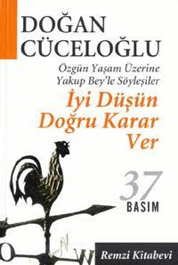

  
# İyi Düşün Doğru Karar Ver - Doğan Cüceloğlu
## 350 Sayfa
### 13.04.2021
  
 

  

    
     

 
 

***Karakterler;***
- ***Timur:*** Kahramanımız
- ***Yakup:*** 65 Yaşındaki akıl hocası

 

____

***`Yakup Bey: "Sırf zaman öldürmek için beraber oluyorsan ne iyi dinlemene ne de iyi konuşmana gerek var. Söz konusu ettiğimiz kişi «etkili yaşam» oluşturma gayreti içinde olan, kendini geliştiren, yaşamının temeline inandığı ilkeleri koymaya önem veren biri. Böyle bir kişi zaman öldürmeye çalışamaz; çünkü öldürdüğünün zaman değil, kendi hayatı olduğunu bilir."`***

_____

Timur ismindeki kahramanımız, psikoloji okuyan ve bir süre sonra öğretim görevlisi olacak birisidir. Sevdiği kız ile buluşup ona evlenme teklif eder fakat üzücü bir şekilde reddedilir. Karşısındaki kız zengin bir kız olup, bir çok ülke gezdiğini dile getirip, zengin oluşunu göz önüne çıkartarak Timur'a olumsuz bir cevap verir. Verdiği bu cevap ile Timur'u çok büyük bir üzüntünün içine iter. Timur oradan ayrıldıktan sonra başıboş ve dalgın bir şekilde yürümeye başlar, en sonunda bir cadde de neredeyse bir arabanın altında kalacaktır. O esnada olanları idrak edemez ve dalgın bir şekilde yolun ortasında beklemeye devam eder. Arabalardan yükselen düdük seslerinin arasında bir kişi Timur'un koluna girer ve onu yolun kenarına çeker. Bu adam kendini şu şekilde tanıtır:   ***"Adım Yakup. Sahaflar Çarşısı'ndaki Elif Kitabevi'nde beni bulabilirsiniz. Zamanınız olduğu zaman gelin, bir çayımı için" dedi.***

Oradan ayrıldıktan sonra Timur eve döner ve gözyaşları içerisinde uyuyup kalır. Sonrasında Yakup beyi görmek için sahaflar çarşısına gider ve onunla bir araya gelir. Sohbet etmeye başlarlar. Timur kız arkadaşı ile arasında geçen şeyleri Yakup Bey'e anlatır. Bu ikili birbirlerini çok sever. 

Birkaç gün sonra yine Timur, Yakup Bey'i görmeye gelir ama ilk başta Yakup Bey yoktur. Timur onu beklerken bir gazete alır ve gazetedeki trafik kazası haberi dikkatini çeker. Bir süre sonra Yakup Bey gelir ve bugün için çok fazla vakti olmadığını sadece 1 saat zaman ayırabileceğini söyler. Bugün konuştukları şey ise trafik kazası konusu üzerinedir..

***Son buluşmamızda "Yaşama hakkı düşman saldırdığı zaman söz konusu oluyor da, trafik kazaları öldürdüğü zaman söz konusu olmuyor mu? Konuyu iyice irdelediğin zaman trafik kazalarının can alışı, düşman güçlerin can alışı kadar ülkenin ulusal bağımsızlığı, onuru ve yaşama hakkı ile ilgili. Ama, bugün bir ulusal tarama yapılsa ve vatandaşın ne düşündüğü sorulsa, hemen hemen herkes sizin gibi, trafiğin can almaya devam edişini düşman güçlerin öldürmesinden çok farklı görecektir" demesi beni çok düşündürmüştü. Onun olaylara bakışı ve anlamlandırışı benimkinden farklıydı ve bu farklılık beni ürküteceği yerde, aksine çekici geliyordu.***

____

Bir gün de birlikte vapurla boğaz turu yaparak sohbet ettiler. Bu sohbetlerinde ise algılamayı konu olarak aldılar ve duyu organlarının algılamadaki önemini ve durumlarını tartıştılar..

**Yakup Bey, "Algılamada iki önemli alt-süreç yer alır" diyerek kaldığı yerden devam etti: "Bu iki süreci iyi anlarsak, algılamanın yapısı ve oluşumu ile ilgili önemli bir adım atmış oluruz. Alt-süreçlerden ilki seçici dikkat, diğeri de organizasyondur."
Vapur Beşiktaş'a yanaştı ve çok kalmadan yeniden yola çıktı. Yolculardan hiç inen olmamıştı; sadece üç dört yeni yolcu bizim oturduğumuz güverteye geldi.   
Seçici Dikkat   
Yakup Bey açıklamasına devam etti: "Biraz önce, «Duyusal düzeydeki nörofizyolojik sinyallerin hepsini algılar mıyız?» diye sormuştun. Şimdi o konuyla ilgili konuşacağım. Dış dünyada olupbitenlerin büyük kısmını duyu organlarımız yakalar, ne var ki biz bu enerjilerin tümünün farkına varamayız. İnsanoğlu, çevresini seçici biçimde algılar. Duyu organlarımızın yakaladığı uyarıcıların ancak bir kısmını seçerek algılarız. Örneğin, şu anda beni dinlemeyi bırak ve gözlerini kapatarak, çevrendeki sesleri dinle" dedi. Gözlerimi kapadım ve Yakup Bey'in dediği gibi dikkatle çevremdeki sesleri dinlemeye başladım.   
Birçok sesin farkına varmaya başladım. Yakında oturan insanların konuşmaları, su hışırtısı, kuş sesi, çaycının uzaktan sürekli tekrar ettiği "Çay, taze çay, çay içen var mı?" sözü dikkatimi çekmeye başladı. Bu arada ensemde güneşin sıcaklığını hissetmeye başladım. Oturduğum yerin sertliğini, ayağımdaki çorabın hafifçe gevşeyip aşağıya doğru kaymış olduğunu, kalbimin atışını, öne doğru hafif eğilmiş olduğumu da bu süre içinde gözlemledim.   
Yakup Bey, "Şimdi farkına vardığın uyarıcıların hepsine dikkat etmeye devam etseydin, duyduğundan bir şey anlayamazdın" diye sözüne devam etti: "Beynimiz aynı anda gelen milyarlarca duyu verilerinin tümünü işleyecek kapasiteye sahip değildir" dedi ve üstüneb asa basa "bıı nedenle beyin, gelen duyusal uyarımları seçerek algılar. Seçme olayı, algılama olayının en belirgin özelliklerinden biridir" diye cümlesini bitirdi.**

_______

> ***PARADİGMA nedir?***

**"İnceleyeceğimiz kavramın adı paradigma” diyerek sözüne başladı.   
"Geçen gün trafik afeti, sigara afeti gibi konuların altında yatan temel kavramı mı tartışacağız?" diye sordum. Gülümseyerek, "Evet, nihayet beklenen zaman geldi; algılama ile ilgili süreçleri açıkladıktan sonra şimdi paradigma kavramını inceyebiliriz" dedi ve açıklamasına başladı.   
"Paradigma, bireyin iç ve dış dünyasını algılayıp yorumlamasında etkili olan tüm faktörleri kapsar. Algılama, yorumlama ve bilme süreçleriyle ilgili tüm etkenlerin yarattığı örgütlü ve dinamik düşünsel sisteme algı diizeneği ya da paradigma adı verilir. Paradigma, farkına varmadan taktığımız bir psikolojik gözlüktür; iç dünyamızı olduğu kadar dış dünyamızı da bu gözlük aracılığıyla görürüz.   
"Vapurda gelirken algılamanın ne olduğunu incelemiş ve duyu organlarımızdan gelen duyumları aktif biçimde seçen, organize eden ve yorumlayan süreçlere algılama adını vermiştik. Algılama süreçleri, hangi duyumlara dikkat edileceğini belirler, seçilen duyumları bir şema ya da örüntü halinde organize eder ve bu örüntünün ne anlama geldiğini yorumlar.   
"Algılamayı etkileyen kişiye ait tüm iç etkenler bir araya gelerek bir algı düzeneği oluşturduğu zaman bu sisteme paradigma adı verilir. Paradigma dinamiktir ve çoğu kez kişi kullandığı paradigmanın farkında değildir" dedi.   
Yakup Bey'in yüzünden, son derece önem verdiği bir konuyu açıklayan bir hocanın ciddiyetini okuyordum.   
Ihlamurundan bir yudum daha aldıktan sonra, konuşmasına devam etti:   
Bir Örnek   
"Paradigmaların ne olduğunu ve nasıl işlediğini basit bir örnekle açıklayalım. Farzet ki, evin önündeki bahçede küçük bir kedi yavrusu yoldan geçenlere yaklaşarak miyavlamakta olsun. Kedi yavrusunun bu davranışına normal koşullarda çocuklar ilgi gösterirler, durup bakarlar, küçük kedinin yanlarına yaklaşmasına izin verirler, çoğu kere onu okşamaya yeltenirler.   
(7)      Orüntü kelimesi İngilizce «pattem» kelimesi karşılığı kullanıldı.   
(8)      Çocuklar yapılan telkinlere daha çabuk inandıkları için onlardan örnek verildi.    «Normal koşullar»dan kastımız özellikle kedi korkusu olmayan, ya da ana-babası kediyi iğrenç bulmayan çocukların oluşturduğu bir durumdur.**

**"Şimdi şöyle bir deney yaptığımızı düşünelim: Evin sağına ve soluna ellişer metre ilerisine «sözcü» bırakalım. Eve sağ taraftan yaklaşan çocuklara (bu gruba «A» grubu diyelim) sözcü, «50 metre ilerideki bahçeli evin önünde küçük bir kedi yavrusu var. Zavallı sahipsiz. Kendini sevecek, okşayacak birini arıyor. Ne olur yanınızda varsa ona yiyecek verin; geçerken durun, biraz okşayın,» mesajını versin.   
"Eve sol taraftan yaklaşanlara ise (bu gruba «B» grubu diyelim) «50 metre ileride bahçeli evin önünde küçük bir kedi yavrusu var. Kedi yavrusu kuduz hastalığına yakalanmış; her an insanları tırmalamaya ve ısırmaya hazır. Sakın onun yanına yaklaşmayın; sizi ısırırsa kuduz olursunuz!» mesajı verilsin.   
"Bu iki farklı mesaj, iki farklı davranışa yol açacaktır; eve farklı yönlerden yaklaşan iki grup çocuk, «kedinin miyavlayarak kendilerine yaklaşması»na birbirinden farklı iki tepkide bulunacaktır. «A» grubundaki çocuklar, "Ah zavallı, gidecek yeri yok, bakımsız" diyerek ona «şefkatle» yaklaşırken, diğer grup, "Pis hayvan şimdi bizi ısıracak" diyerek «korkuyla» ondan kaçacaktır.   
"«A» grubundaki çocuklara «şefkat paradigması»nın gözlüğü takılırken, diğer yönden gelen «B» grubundaki çocuklara «korku paradigmasının gözlüğü takılmıştır."
Yakup Bey'in anlattığını hemen anlamıştım. Olay gayet açık ve seçikti. Anladığımı belirtmek üzere düşündüklerimi söylemeye başladım: "Büyürken ana-babamız, okulda öğretmenlerimiz, gazeteler, siyasi partiler, hükümet ve şu anda siz bana belirli paradigmalar öğretmeye çalışmıyor musunuz?" diye sordum.**   

**Yakup Bey'in gözleri parladı ve "Evet, benim ileride söyleyeceğimi şu anda siz söylediniz" dedi. "Aile, eğitim, bütün kurumlarıyla toplum ve kültür insanlara sürekli paradigmalar empoze etme durumundadır. Ama, konunun bu yönüne gelmeden önce paradigma kavramını biraz daha açmak istiyorum" diyerek konuşmasına devam etti:   
Paradigma   
"Paradigma kelimesi Yunanca kaynaklıdır. Bugün aşağıdaki anlamlarda da kullanılmaktadır: model, kuram, varsayım, algı dayanağı gibi.   
"Yukarıda da belirttiğim gibi paradigma kavramını daha geniş anlamında dünyayı görüş, algılama, anlama ve yorumlama sistemi olarak kullanıyorum."   
Yaktip Bey çantasından bir harita çıkardı masanın üzerine koydu.   
"Paradigmayı bir harita olarak düşün. Harita temsil ettiği şeyi ne kadar gerçekçi olarak yansıtırsa o derecede değer kazanır. Örneğin bir şehrin haritası, o şehrin kendi değildir, o şehrin kağıt üzerine çizilmiş bir modelidir. Şehri ne kadar gerçeğe uygun olarak temsil ediyorsa, harita o derece kullanışlı ve işe yarar olacaktır.   
Paradigma da, bir harita gibi, başka bir gerçeğin modelidir.   
"Bursa şehrinin haritası üzerine yanlışlıkla, İzmir yazılmış olsa ve siz bu haritayı kullanarak İzmir'in bir noktasından diğer noktasına gitmeye çalışsanız, ne kadar dikkat ederseniz edin, ne kadar hızlı giderseniz gidin, başarılı olamazsınız. Çünkü kullanmış olduğunuz paradigma, izlediğiniz harita yanlıştır; temsil etmesi gerektiği gerçeği, yani İzmir şehrini temsil etmemektedir. İzmir'de adres bulmakta kullandığınız tutum, öğrendiğiniz teknikler, araba kullanma hızınız, ya da başka hiçbir şey yanlış paradigmanın (haritanın) getirdiği zararı önleyemeyecektir."**

_______

***Yakup Bey'den ayrıldıktan sonra aldığım notları unutmadan ayrıntılı olarak yeniden yazdım ve konuşulan kavramlar üzerinde düşündüm. Söylediği cümlelerden birini söylerken yüzündeki ifadeyi hatırlıyorum; sanki «Bu söylediğim çok önemli, eğer hatırlarsan sana çok yardımı olur» türünden bir anlamı vardı. "Bütün bu gözlemlerden çıkaracağımız önemli bir sonuç var; o da dünyayı olduğu gibi değil, olduğumuz gibi gördüğümüzdür. Gördüğümüzü anlatırken, esasında kendimizi, kendi paradigmamızı anlatırız" demişti. Bu cümleden anladığım şuydu: `İnsan bir olayı anlatırken, sadece dış dünyada olup biten bir hadiseden söz etmiyor, ister istemez kendinden de söz ediyordu. Eğer dinlemesini bilirsek kişinin söylediği her şeyden o kişinin nasıl biri olduğunu az çok çıkarabilirdik.`***

_______

**Bardağında kalan ıhlamuru bir yudumda bitirdikten sonra bana, "Timur Bey, şimdi söyleyin bakalım, Türk halkı aptal mı?" dedi.  
Çok ciddi bir tavır takınarak, "Yakup Bey, hangi davranışa, kimin gözlüğüyle baktığınızı söyleyin, ben de ona göre o kişinin aptal ya da akıllı olduğunu size söyleyeyim" dedim. İkimiz de güldük.**

______

**Timur: "Geçen konuşmamızdan özet olarak anladığım şu: «Kalıplanmış» ve «gelişmiş» insanların paradigmaları birbirlerinden farklı. Bunun belirtisi başarı anlayışında görülebilir. «Kalıplanmış» kişi daha çok dış başarıya, «gelişmiş» insan ise iç ve dış başarı arasında denge kurmaya önem verir.”**

_______

**"Böylece insan onurunun da, canın parçası olduğunu keşfediyorum. «Oğlum canın büyüğü küçüğü olur mu? Allah herkese tek bir can vermiş,» diyen köylü analığımın sözünde şimdi, «Oğlum insan onurunun büyüğü küçüğü olur mu? İster sultan, ister hamal olsun herkes onur yönünden eşittir. İnsan onuru onun canının parçasıdır,» anlamını da buluyorum."**

_______

**Sorunlarımız ve Paradigmalar  
Şimdiye kadar konuştuklarımızdan anlayabileceğin gibi yaşamımızdaki her olaya bakış tarzımızın altında, bizim algılama paradigmalarımız yatar. İnsanların büyük çoğunluğu kullandıkları paradigmaların farkında değildir. Ancak az sayıda kişi kullandığı paradigmanın farkına varmayı başarmıştır.
"Bir insanın kullanmış olduğu paradigmanın farkına varması, dünyaya hangi gözlükle baktığının bilincinde olması anlamına gelir. Böyle bir bilinçlenme çok önemli değişiklikler yapma potansiyelini beraberinde getirir. Bu tür bilinç düzeyine ulaşabilmiş birey, «kaynağı dışarıda olan» sorunla, «paradigmasının özelliklerinden kaynaklanan» sorunu birbirinden ayırt ederek yaşamını yönetmede çok daha güçlü duruma gelir."
Yakup Bey'den kişinin paradigmasından kaynaklanan sorunla neyi kastettiğini öğrenmek istedim.  
"Birçok psikolog sorunun dışarıdaki olayda değil, o olaya bakış tarzımızda yattığını kabul eder" diye sözüne devam etti: "Bunun örneklerini verdiğim gazete kupürlerinde gördünüz. Bu konuya ileride sık sık temas edeceğiz. Ama size bir örnek daha vereyim. Boş zamanlarında şiir yazan tanıdığım son derece hassas bir ev hanımı bana şu olayı anlattı. Evlendiği zaman gelinliği üzerindeyken eve gelen misafirlere duvağından gelin teli vermiş. Gelenler arasında birini pek tanımadığından gelin teli vermekten utanmış ve ona vermemiş. «Otuz sekiz yıl önce olan bu olayı hâlâ düşünürüm ve üzülürüm» demişti. Eğer bu hanım kendi paradigmalarının farkına varabilseydi kendine şu tür soruları sorabilirdi: «15 yaşında genç bir kızdım; duvak telini vermemek bir hata olsa dahi, bir insan olarak bu hatayı yapma hakkını kendime niçin tanımıyorum? Mükemmel olmamak bir suç mu? Otuz sekiz yıldır bu olaya hâlâ neden üzülüyorum?» Bu tür sorulara cevap aramak onun kendini tanımasına yol açacak ve bu bilinç içinde sorunu yeniden tanımlayabilecekti."  
"Sizi örnek alalım Timur Bey" dedi. Bu söz üzerine içimde bir korku belirdi, «Şimdi bende ne kusur bulacak,» diye korktum.  
`"Nesrin'le olan etkileşiminizi şimdi yeni bir görüşle değerlendirdiğinizi biraz önce bana söylemiştiniz. Nesrin'le aranızda geçen etkileşim değişmedi, yani olay aynı kaldığı halde, sizin olaya bakış tarzınızda bir değişiklik oldu ve bu paradigma değişikliği o olayı sizin için sorun olmaktan çıkardı, değil mi?" diye yüzüme baktı."`  
Söylediğini anlamıştım. "Şimdi gayet açık seçik anladım" diyerek konuya devam etmesini bekledim.  
"Algılama paradigmasının bilincinde olan kişi, paradigmasının kör tahakkümünden kurtulabilir ve onun ötesine geçerek sorunu yeniden tanımlayabilir. Sorunu yeniden tanımlayabilme kişinin daha etkili yaşam kurabilmesinin temelinde yatar.
"İster kişisel, ister iş hayatında olsun, sorunların çoğunun temelinde «kalıplanmış» insan paradigması yatar. Bir başka deyişle «kalıplanmış» insan paradigması olayların çoğunu sorun olarak kişinin yaşamına yansıtır. «Kalıplanmış» insan paradigmasının bilincine varmadıkça kişi sorunlara çözüm bulamaz. Sorunlar ancak «gelişmiş» insan paradigması geliştirerek çözülebilir."**  

_____

**"İnsanın eski alışkanlıklarını, tutumlarım değiştirmesi zordur. Kendini yenilemeyi isteyen kişi, şimdiye kadar kolay gelen bir tutumdan, daha sonra elde edeceği daha anlamlı bir dünya uğruna feragat etme durumundadır. Feragat etme bir anda olup biten bir olay değildir. Kişinin kendini yenilemesi anlamında feragat etme, gelişim ilkesi çerçevesinde, adım adım gerçekleştirilen bir süreçtir."**

**Yakup Bey'den ayrıldıktan sonra aldığım notları gözden geçirdim. Öğrendiğim kavramların kendi yaşamımla ilişkisini arıyor ve bu kavramları yaşamıma nasıl uygulayabileceğimi düşünüyordum. Eski tutum ve alışkanlıkları aşabilen insanların kendilerini yenileyebileceklerini ve iç özgürlüklerine kavuşabileceklerini söylemişti. «İç özgürlüğü» kavramı dikkatimi çekmişti. Kişinin iç özgürlüğüne kavuşabilmesi için eski kalıplarını kırabilmesi gerektiğini söylüyordu. Kişi ancak o zaman kendi yaşamının anlamını keşfedebilirdi. Bunun kişinin mutluluğu ile yakın ilişkisi vardı.
Nesrin'le olan ilişkimi düşününce, iç özgürlüğünden yoksun olduğumu hissediyordum; ne var ki, bunun ne olduğunu ve nasıl elde edilebileceğini bilemiyordum. Sezgi düzeyinde bu kavramın önemini kavrıyor ve iç özgürlüğü olan biri olmayı çok istiyordum.**

______

***Timur: ”Şimdi daha iyi görebiliyorum. Burada karakter kelimesiyle siz kişinin olgunluk ve gelişmişlik derecesini ifade ediyorsunuz. Bu anlamda karakter kişinin en kuvvetli iletişim kaynağı oluyor. Eğer insan karşısındakine inanamaz, kişisel bütünlüğü göremezse, ona kendini açamaz; sevgisine ihtiyacı olsa dahi, güvenemediğinden ondan çekinir."
   Yakup Bey: ”Evet. Konuşamadığı, gerçek algı ve düşüncelerini söylemediği biri onu iyi anlayamayacak ve bu nedenle ona yardım edemeyecektir. İnsanı gerçekten anlamak isteyen kişinin ona özgü olan paradigmalarını, dünyaya bakarken kullandığı gözlükleri, tanıması ve bilmesi gerekir."   
Timur: "Karşıdakinin paradigmasını anlamak niçin önemli"'    Yakup Bey: "Bireyi tek ve emsalsiz yapan, kendine özgü paradigmalarıdır. Kişiyi tek ve emsalsiz görmedikçe, onu anlamak için gerekli dikkat ve ilgi gösterilmez. Demek oluyor ki, bireyi anlamadan önce ona yardım edilemez; kişiyi anlayabilmek, onun iç dünyasını karşıdakiyle paylaşabilmesinden geçer. Bireyin karşısındakine güven duyabilmesi için kendini dinleyenin karakter sahibi bir kimse olduğuna inanması gerekir."   
Yakup Bey konuşurken kendi kendime düşünmeye başladım; «Beni bu tür dinleyen oldu mu?», diye kendime sordum. Ne benim başkalarını, ne de başkasının beni gerçekten anlayarak dinlemediğini keşfetmem, beni etkileyen bir gözlem oldu; «Gözümdeki perde aralandı» derler ya, işte öyle bir duyguya kapıldım.***

_____

***Yakup Bey, "Vicdanı geliştirmek en zorudur" dedi ve bana bakarak bir an sustu. Ihlamurundan bir yudum aldı ve konuşmasına devam etti:  
"Vicdanın sesi çok yumuşaktır, fakat açık seçik ve berraktır. Bu ses insanı evrensel ilkelere, kişisel bütünlüğe doğru yöneltir. Bütün tutumları tam anlamıyla gerçekleştirebilmek için kişinin vicdanının sesini dinlemesi gerekir. Vicdanın gelişimi için iyi çevreye, kaliteli kitaplar okumaya, zengin manevi yaşama gerek vardır. Uzun dönemde ne ekersek onu biçeriz, ne eksiğiyle, ne de fazlasıyla. Temel değerler ne kadar doğru ve geçerli ise, yaşam paradigmaları ne kadar bu temel değerler üzerine kurulursa, kişinin yaşamdan alacağı sonuçlar o kadar geçerli ve anlamlı olacaktır."***

______

***`Arizona'da bir otobüs yolcu terminalinde Don Juan Matus adında yaşlı bir Kızılderili ile tanışır. Bu tanışmanın sonucu Carlos Castaneda uzun yıllar Don Juan Matus'la beraber olur ve ondan öğrendiklerini 8 kitap halinde yayınlar  
"Carlos Castaneda'nın kitapları benim üzerimde etkili oldu. Bu kitapları ara sıra hâlâ okurum. Don Juan kitap yoluyla tanıdığım en bilge kişilerden biridir. Ölümle ilgili olarak Carlos'a, «Ne zaman yaşamını anlamsız, yüzeysel ve sıkıcı bulmaya başlarsan, şu dünya üzerinde kaç günün olduğunu düşün ve bu bilinçle davranışlarını gözden geçirerek yönlendir,» diye öğüt verir.`***

______

**Sorularımın Cevabı**    
Bana bu kadar zaman ayırmasının altında yatan nedeni sormak istiyordum. Kendisinin bana karşılıksız böylesine zaman vermesini ve beni kendi eşiti kabul ederek etkileşimde bulunmasını anlamakta zorluk çektiğimi söyledim. Kendisine etkili zaman kullanımı uygulayıp uygulamadığını sorduğum zaman, "Evet, uyguluyorum" diye cevap verdiğini hatırlattım.  
"Kimsenin bana ayırmadığı kadar zaman ayırarak benim için önemli kavramları, bilgileri ve becerileri benimle paylaştınız. Benimle buluşmanızdan kuşkusuz yararlanıyorum; ne var ki, bunun size ne gibi yararı var, onu göremiyorum" dedim.  
Yakup Bey, "Evet, sorunuzu hatırlıyorum; şimdi cevaplamanın zamanı geldi" diyerek tazelenen ıhlamurundan bir yudum aldı ve konuşmasına devam etti:
”Bu sorunun cevabı benim manevi yaşam anlayışımda yatıyor. Biliyorsunuz manevi yaşam son derece kişiye özgü, öznel ve derin duygusal tonu olan bir konudur. Bu nedenle benim kendi manevi yaşam anlayışımla sizin anlayışınız büyük olasılıkla birbirine uymayacaktır.  
"Sorduğunuz sorunun cevabını vermeden önce ben size bir soru sorayım: Şimdiye kadar ki konuşmalarımız süresince, kendi manevi yaşam anlayışımı size empoze ediyormuşum hissine kapıldığınız oldu mu?"  
Hiç düşünmeden, "Hayır, sizin manevi hayatınızla ilgili herhangi bir belirti, bir yükleme ya da empoze ediş hissetmedim; böyle bir duyguya kapılmadım" diye cevap verdim.
Yakup Bey memnuniyetini ifade eden bir gülümseyişle, "Güzel, buna memnun oldum; çünkü benim böyle bir niyetim yoktu zaten. Şimdi de yok" dedi ve konuşmasını şöyle sürdürdü: 'Sorunuza cevap verebilmek için kendime özgü manevi hayat anlayışımı anlatmak durumundayım . Böyle bir anlayışı kabul etmeni beklemem; ne var ki, saygı duymanı beklerim."
Bir süre sustu, ıhlamurundan birkaç yudum aldı. Neleri, nasıl söyleyeceğini düşünen bir hali vardı. Konuşmaya başladı:   
"Ben evrenin anlamlı bir bütün olduğuna inanıyorum. Size niçin böyle bir inancım olduğunu anlatmayacağım. Şu 65 yıllık ömrümdeki yaşantılarım, sezgilerim, gözlemlerim beni böyle bir inanca getirdi."  
Burada bir süre sustu, ıhlamurundan bir yudum aldı ve açıklamasına devam etti:
"Benim için «anlam» ilişki demektir. Herhangi bir şeyi «anlamsız» buluyorum demek, o kavram, nesne ya da şeyle, benim farkında olduğum yaşantılarını, deneyimlerim arasında bir ilişki kuramıyorum demektir. Diğer taraftan, herhangi bir şeyi «anlamlı» buluyorum demek, o kavram, nesne ya da şeyle, benim farkında olduğum yaşantılarım, deneyimlerim arasında bir ilişki kurabiliyorum demektir."  
Yakup Bey yüzüme baktı, gülümsedi, sanki söylemekten utanıyor gibi bir hali vardı. Konuşmasına bu mahcup gülümseyişle devam etti:  
"İlk gün sizinle karşılaştığımız anı hatırlıyor musunuz?" diye bana sordu. Evet anlamında başımı salladım. Yakup Bey, "Sizinle tanışmamızın tesadüfi olmadığı duygusu uyandı bende" dedi.  
Yüzüne hayretle bakakalmıştım. O konuşmasına devam etti:  
"Bu sadece bir his, bir sezgi. Tabii tamamiyle yanılabilirim. Ama bu duygu beni düşündürdü.
"Yalnız, kaybolmuş, acı çeken genç bir insanın yüzü gözümün önünden gitmiyordu.
"Siz evrenin, hiç olmazsa benim evrenimin parçası olarak karşıma çıktınız; o andan itibaren benim için var oldunuz. Ya sizi tanıyacaktım; yanibu olaya bir anlam verecektim, ya da tanımayacak, kendi yaşamımı eskisi gibi sürdürmeye devam edecektim. Sizi tanıma ya da tanımama konusunda tereddüdüm oldu. Sahaflar Çarşısında beni bulabileceğinizi söylemeden önce, tereddüt ettim. Ama bu tereddüt uzun sürmedi; sezgi düzeyinde verilmiş kararı söze vurdum, kendimi tanıttım ve beni nerede bulabileceğinizi söyledim.
"Bu kararımın altında sadece size yardım etme duygusu yatmıyordu. Sizi o anda tanımazsam, kendimle ilgili önemli bir yönümü yok edeceğimi fark ettim."
Yakup Bey'in ne demek istediğini anlayamamıştım.   "Kendinizle ilgili önemli bir yönünüzü nasıl kaybedecektiniz, açıklar mısınız?" diye sordum.   
Sustu; alnı kırıştı; ifade etmesi zor bir düşünceyle uğraştığı belli oluyordu. Ihlamurundan bir yudum aldı. Açıklamasını şöyle sürdürdü:  
"Bende yılların getirdiği deneyimlerin birikimi var. 65 yaşındayım, sizin o gün içinde bulunduğunuz yalnızlığın, bunalımın, zihinsel karışıklığın ne olduğunu bilen bir insandım. Bendeki bütün bu birikimin «anlamlı» olabilmesi için o gün sizi kendi evrenim içinde tanımam ve size ulaşmam gerekiyordu. Aksi halde 65 yıllık birikimimin «anlamsız» olduğuna önce kendimi inandırmış olacaktım."  
Yakup Bey'e bakakalmıştım. Ne söyleyeceğimi bilemiyordum. Hiç tanıdık olmadığım bir düşünceyle karşıma çıkmıştı.  
Ama söyledikleri bana anlamlı geliyordu. O anda bu kitabı yazma fikri içimde doğdu. Yakup Bey'le geçen günlerimin, ondan öğrendiklerimin «anlamlı» olabilmesi için, diğer insanlara ulaşması, onlarla ilişki kurması gerekiyordu. içimde bir mutluluk duygusu kabarmaya başladı. Mutluluğumun farkına varınca, «Bu duygu evren içinde «anlamlı» bir karar almamdan kaynaklanıyor herhalde,» diye düşündüm.  
Yakup Bey, "Sorunuzun cevabını alabildiniz mi?" dercesine yüzüme bakıyordu. Evet anlamıştım. Sadece kendine değil, gittikçe anlam kazanan yaşamımın temelinde yatan süreci de bana göstermişti. İçimden kalkıp ellerini öpmek, sonra da doyasıya kucaklamak geçti. Ama bunları yapmadım. Yapmak istediğimi gözlerim söylemişti ve onun anlayan gözleri görmüştü. Gerçek ve güvenilir olan bir sevgi denizinde hissettim kendimi. Şu anda benim de evrenim anlamlı bir bütündü ve bu duyguyu hiç kaybetmek istemiyordum.

> ***- SON -***

 

### Kitaptan Alıntılar ;
- ***"İnsanlar başarmak için doğarlar, başarısızlık için değil."   
HENRY DAVID THOREAU***
- ***"Yaptığımız şeyler için pişmanlık zamanla geçer, ne var ki, yapmadığımız şeylere pişmanlığın çaresi yoktur."    SYDNEY J. HARRIS***
- ***"Dünya bazen kapkaranlık gözükür; insan kendini yapayalnız ve değersiz görür. Bu duygular yaşamın parçası"***
- ***"Davranışlarından utanıp sıkılma. Yaşamın tümü bir denemedir."***
- ***Gözlerimin içine iyice bakarak: "Belki beni ileride daha iyi tanıyacaksınız, belki bu son konuşmamız olacak. Ama şunu iyi bilmenizi istiyorum: Ne zaman benimle konuşursanız, saygınlık yönünden eşit iki insan olarak konuşacağız. Sizden daha yaşlıyım, uzun yıllar hocalık yaptım ve doğal olarak birçok konuda sizden daha bilgiliyim. Ne var ki, bu sizden daha saygıya değer olduğum anlamına gelmez. Siz, her insan gibi, en az benim kadar saygınlığı olan bir insansınız. Önce bunu kabul ederek işe başlamamız gerekiyor.***
- ***"Başkalarının beklentilerini yaşamak çoğu kimseye kolay gelir" diye sözüne devam etti. "Ne var ki, çaresizlik nedeniyle başkalarının beklentilerini yaşayan insan yalnızdır, hem de derin bir yalnızlığa gömülüdür."***
- ***"Biyolojik olarak yaşıyor olduğunu bilmek, yaşamının bilincinde olmak anlamına gelmez. Yaşamının bilincinde olan kişi kendini ailesiyle, mahallesiyle, kasabasıyla, ülkesiyle, dünyasıyla ve kademe kademe tüm evrenle ilişki içinde görür. Evrenle ilişkisini kendisi keşfeder; bu ilişkilerin anlamını kendi verir, başkası değil."***
- ***"Kendini arayan birçok insan bu arayıştan yorulur ve vazgeçer" dedi. Yüzüme uzun uzun baktıktan sonra, "Söylendiği gibi yaşamak, kendi yaşamını kurmaktan çok daha kolaydır" diye sözüne devam etti.***
- ***"Düşüncelerimi ne kadar rahatlıkla ifade edebildiğimi gözledim. İçimde herhangi bir tedirginlik olmadığını hissettim, ne söylersem söyleyeyim, Yakup Bey'in beni yargılamadan dinleyeceğinden emindim."***
- ***"Bir sorunu çözmeye karar veren devletin onu çözmemesi mümkün değildir. Bir başka deyişle, ortada çözülmemiş bir sorun varsa biliniz ki, öyle bir sorunun olması, iktidar sahiplerinin işine gelmektedir."***
- ***Bir gün babama, işleri diğer insanlar gibi yapamadığım için üzüldüğümü söyledim.
Babamın nasihatı: "Margo, koyun olma. insanlar koyunları sevmezler. insanlar koyunları yerler."   
MARGO KAUFMAN***
- ***"Akıl kendi başına cenneti cehennem, cehennemi cennet yapabilir."   
JOHN MILTON***
- ***Her şey aynı nefesten alır: Hayvanlar, ağaçlar, insanlar.. Hayvanlar olmazsa insanlar ne yapar? Bütün hayvanlar gitse insanların ruhu büyük bir yalnızlığa boğulur; insanlar yalnızlıktan ölür.   
KIZILDERİLİ REİS SEATTLE***
- ***"Çayda kafein ve teofilin olmak üzere iki tür uyarıcı var. Bunlar beni gerginleştiriyor, ıhlamur ise rahatlatıyor" demişti.***
- ***"Tanıdığım bazı insanlar, paradigmalarına öylesine bağlanmışlar, öylesine bir «paradigma tutkunluğu» geliştirmişlerdir ki, ellerindeki Bursa haritasının İzmir'de adres bulmaya yaramadığını yüzlerce defa gördükleri halde, kabahati haritada değil, İzmir'de bulurlar."***
- ***"Tutum ve davranışların kökenleri bireyin paradigmalarında yatar. Paradigmalar insanın o kadar bir parçasıdır ki, günlük yaşamda onların farkına varmak zordur. Bu nedenle kişi kendi algılamasının ötesinde başka türden algılamalar olabileceğini çoğu kez hiç düşünmez."***
- ***"Bütün bu gözlemlerden çıkaracağımız önemli bir sonuç var; o da dünyayı olduğu gibi değil, olduğumuz gibi gördüğümüzdür. Gördüğümüzü anlatırken, esasında kendimizi, kendi paradigmamızı anlatırız."***
- ***"«Kalıplanmış» kişi dünyada kendi kalıplarını görür. Bu kalıpların dışında başka gerçek, başka değer yoktur. Bizimle hem fikir olmayan insanlarda bir bozukluk veya eksiklik olduğunu düşünmemizin altında bu gerçek yatar."***
- ***"Bizim ahmaklık dediğimiz davranışlar, davranışı düzgün ve düşünceyi tutarlı kılan doğal kaynaklardır."   
WALTER BAGEHOT***
- ***Kitap, gazete ve dergi okumayı sevmeyiz. Hatta okumaktan nefret ederiz. Bir okuyan gördük mü asla dayanamaz, "Sen de okuya okuya hafız olacaksın be kardeşim" diye söylenmeye başlarız.***
- ***"En korktuğumuz şey birey olmak ve böylece yalnız kalmaktır. Bu yüzden hemen bir gruba dahil olur, onlar gibi giyinir, onlar gibi düşünürüz. Bizim kendi düşüncemiz yoktur. Grup ne derse o olur."***
- ***"İnsanların büyük çoğunluğu tüm mutluluklarını bir başka insanın eline bilerek koymaya çalışır. Bu tür mutluluk arayışı insanın olgun olmadığını gösterir.
Olgun insan mutluluğunun temelinin kendi içinde olduğunu bilir.   
QUENTIN CRISP***
- ***Bana baktı ve "Her zamanki masamıza oturamadığımız için canınız sıkıldı mı?" diye sordu. Duygumu saklamadım, "Evet, biraz" diye cevap verdim.   
"insan ne kadar çabuk tutkunluklar geliştiriyor, değil mi?" diye güldü.***
- ***"Örneğin eğitilmek amacıyla okula giden kişi, derslerine her gün çalışmaz, ancak sınav zamanı sınavları geçecek derecede çalışırsa, eğitimin vermek istediği ürünü alamaz. Eğitim, bitkinin ürün vermesi gibi uzun bir süreçtir ve her şeyin zamanında yapılmasını gerektirir."***
- ***"İnsanın özgürlüğü, kendisine yapılanlara karşı takındığı tavırda gizlidir."   
JEAN-PAUL SARTRE***
- ***Albert Einstein «Karşılaşılan önemli yaşam sorunları, o sorunları ortaya çıkaran düşünce düzeyinde çözülemez» der,***
- ***"Başkalarının bizi kızdıran tarafları kendimizi anlamamıza yol açar."   
CARL JUNG***
- ***"Kendini yetersiz gören insan tereddüt içinde beklerken girişimci insan hata yapmaktan korkmadığından daha üstün hale gelir." HENRY C. LİNK***
- ***Eleanor Roosevelt bir konuşmasında, «Sizin onayınız olmadan hiç kimse sizi etkileyemez,» demiştir. Ghandi, «Kendimize olan saygımızı, eğer biz vermezsek, kimse elimizden alamaz,» sözüyle aynı anlayışı dile getirmiştir.***
- ***"Düşlemek, bilmekten daha önemlidir."   
ALBERT EINSTEIN***
- ***"Tanrım, değiştirilebilen ve değişmesi gereken şeyleri değiştirme cesaret ve gücünü; değiştirilemeyecek şeyleri olduğu gibi kabul etme olgunluğunu ve ikisi arasındaki farkı anlayabilecek bilgeliği bana ver."***
- ***IBM'in kurucusu T. J. Watson, «Başarı, hata ve başarısızlığın biraz ilerisinde duran şeydir,» demiştir.***
- ***"Etkili insan olmaya doğru giden yolun ilk adımı kendi kendine söz verme ve verdiği sözü tutmadır. Bilgi, beceri ve arzu bizim denetimimiz altındadır. Bilgi, beceri ve arzuyu bir araya getirdik mi, söz verdiğimiz işleri mutlaka başarırız."***
- ***"Kişinin sadece vicdanlı olması yeterli değildi, vicdanının emrettiği şeyleri yapabilecek irade kuvvetinin olması da gerekiyordu."***
- ***"Her davranışın atası bir düşüncedir."   
EMERSON***
- ***"Carlos Castaneda'nın Kızılderili piri Don Juan Matus, «Unutma, ölüm en güçlü öğretmendir,»" der.***
- ***«Ne zaman yaşamını anlamsız, yüzeysel ve sıkıcı bulmaya başlarsan, şu dünya üzerinde kaç günün olduğunu düşün ve bu bilinçle davranışlarını gözden geçirerek yönlendir,»***
- ***"Kendini ve sorunlarını çok önemseyen kişilerin ara sıra mezarlığa gidip, mezar taşlarının üstündeki isim ve tarihleri okumalarını salık verir."***
- ***"Ölümünün bilincinde olan çok az kişi vardır" diye konuşmaya başladı. "İnsanların çoğunluğu sanki ölümsüz bir yaşamları varmış gibi olayları değerlendirirler. Bu nedenle, yaşadıkları her dakika, saat ya da günün ne kadar ender, ne kadar önemli olduğunu hiç düşünmezler. Bu nedenle kendileri için önemli olanları hep ertelerler; bütün yaşamlarını başkalarına göstermelik bir felsefeye göre oluştururlar.***
- ***"Ölümünün bilincine varmış insan ise kaybedecek saati olmadığını bilir. Kendi gerçeğini bulup, bu temel üzerine yaşamını kurması gerektiğini anlar. Yaşamının her saatinin, her günü ve her haftasının önce kendisine hesabını vermesi gerektiğinin farkındadır. Başka bir deyişle, etkili bir yaşam kurarak bu dünyada varlığını sürdürmesi gerektiğini bilir."***
- ***"Kişinin kendi ilkeleri uğruna savaşması, bu ilkelerle ahenk içinde yaşamasından daha kolaydır."    ALFRED ADLER***
- ***"Düşünüyorum, o halde varım!"   
RENE DESCARTES***
- ***"Düşüncenin gizlerinde gücümü buldum."    EURIPIDES***
- ***"Büyük insanlar olmadan büyük işler başarılamaz.   
İnsanı büyük yapan, kendi azmi ve sebatıdır."   
CHARLES DE GA ULLE***
- ***"Kişisel bütünlük kişinin düşünce, duygu ve davranış dünyasının birbiriyle tutarlı olmasından kaynaklanır. Kendine saygısı olan kişi düşüncelerini, inandığı değerleri davranışlarında yansıtmaya özen gösterir; değişik durum ve koşullarda zorlansa dahi, kendine saygısı olduğundan, ilkeleriyle tutarlı olarak hareket etmeye çalışır.***
- ***İnsanlar bana, "Bu kadar çok şeyi nasıl yapabiliyorsun?” diye sorduklarında, onları incitmek amacıyla değil, fakat gerçekten,
"Bu kadar az şeyi yapmayı nasıl beceriyorsunuz?” diye cevaplarım.    PHILIP ADAMS***
- ***"Bir insanın tecrübesini başından ne geçtiği değil, başından geçenlerden nasıl yararlandığı gösterir."    ALDOUS HUXLEY***
- ***Aralık ayının son günü...   
Değişen bir takvim sayfası yani 1993   
Oysa savaşlar-açlık ve olumsuzluklar devam ettiği sürece adı "yeni yıl” olamaz...    olmayacak...   
1992 bitiyor...   
Yalnızca 1993 başlıyor...   
Kutlu olsun!***
- ***Babamın, «Allah'ım, hakkımızda hayırlı ne ise onu ver,» duasının anlamını şimdi daha iyi anlıyordum."***
- ***"Yapabileceğimiz şeyleri yapmaya başlasak, kendimizi hayretler içinde bırakacak sonuçlar alırız."   
THOMAS EDISON***
- ***"Söylenen ve Yapılan Aynı Olmazsa Güven Kaybolur."***
- ***Göz odur ki dağın arkasını göre, akıl odur ki başa geleceği bile."   
TÜRK ATASÖZü***
- ***Büyük insan, dinlemesini bilendir."    SIR ARTHUR HELPI***
- ***Gelenler korkmayanlardır; korkanlar gelmediler."   
ÇİN ATASÖZÜ***
- ***"Başarıyı hedef alın; mükemmel olmayı değil. Yanlış yapma hakkınızdan vezgeçmeyin;    vazgeçerseniz yeni şeyler öğrenme ve gelişme olanağınızı kaybedersiniz.   
Unutmayın; mükemmelliyetçiliğin arkasında korku yatar.   
İnsan olduğunuzu hatırlayarak korkularınızı göğüsleyin.   
Daha mutlu ve daha etkili bir insan olursunuz."   
DA VID M. BURNS***
- ***"Okumak kişinin kalıplarından kurtulup kendini geliştirmesi yönünde atacağı ilk adımlardan en etkilisi olabilir. Kendi temel ilke ve değerlerini keşfetmek isteyen kişinin zihnini uyanık ve akıcı tutması kaçınılmaz bir gerektir."***