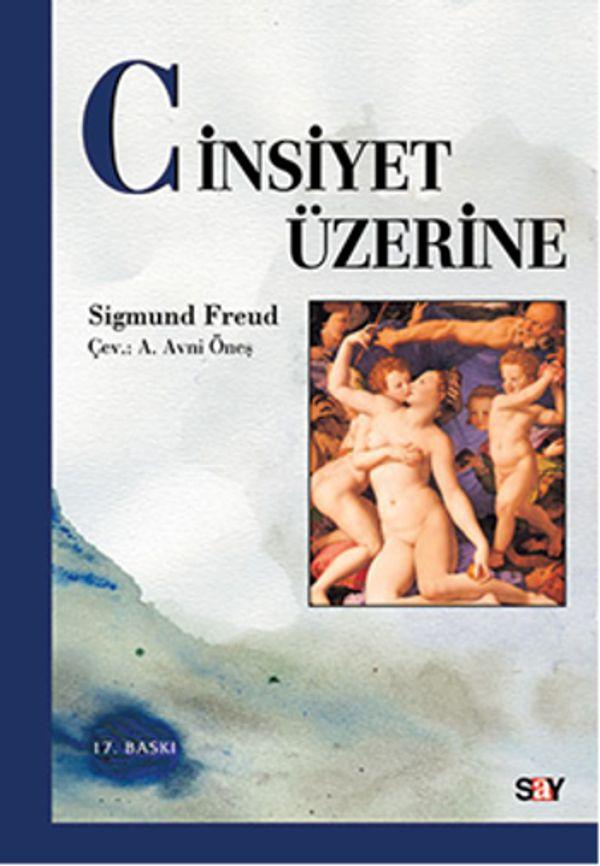

  
# Cinsiyet Üzerine - Sigmund Freud
## 152 Sayfa
### 17.04.2021
  
 

  

    
     

 
 

***İnsanın ve hayvanın cinsel gereksinimlerini açıklamak için, biyolojide "cinsel bir dürtü"nün varlığından söz edilir. Aynı şekilde, açlığı anlatmak için de bir beslenme dürtüsünün olduğu varsayılır. Bununla birlikte halk dilinde cinsel gereksinim için açlığa karşılık gelen bir kelime yoktur. Halkın görüşü, cinsel dürtünün niteliği ve karakterleri üzerine bazı kesin düşünceler içerir. Freud, bu noktada müdahale etme gereği duyar ve cinsel bastırmaların çocuklar üzerinde nasıl evrildiğini sergiler. Freud'un anlaşılmasında kilit rolü oynayan ve büyük gürültüler kopararak sert tartışmalara yol açan Cinsiyet Üzerine, her aydının hatta her anne babanın mutlaka okuması gereken temel yapıtlardan biridir.***

