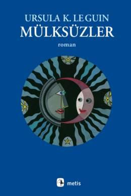

  
# Mülksüzler - Ursula K. Le Guin 
## 348 Sayfa
### 24.04.2021
  
 

  

    
     

 
 

***Karakterler;***
- ***Shevek:*** Anarres'ten gelmiştir ve fizikçidir
- ***Tanvel:*** Shevek'in karısı
- ***Sadik:*** Shevek ve Tanvel'in kız çocukları

 

Yaptığı politik göndermeler ile tanınan Ursala LeGuin’in dünyaca ünlü bilim kurgu romanı Mülksüzler ilk olarak 1974 yılında yayınlandı fakat Türkiye’ye gelmesi 1990'lı yılları buldu.

Ursala Le Guin Mülksüzler romanında ikiye bölünmüş ütopik bir dünyadan bahsediyor. Bir taraf anarşist bir ideale sahip olan Anarres ve diğer taraf kapitalist düzende yönetilen Urras. Bir taraf özgür fakat kötü yaşam şartlarında yaşarken diğer taraf ise güzel fakat özgürlüğün pek olmadığı bir yaşam sürer.

Hikaye Shevek isminde bir Anarresli’nin gözünden anlatılıyor. Shevek bilime meraklıdır ve yeni bir teori keşfeder. Fakat teorisinin Urraslılara yarayacağı düşüncesi ile kabul görmez. Bunun üzerine de Shevek Urras’a gider.

 

***Ursula Kroeber Le Guin, 1929'da Kaliforniya'da doğdu. Babası ünlü antropolog Alfred Kroeber, annesi ise yazar Theodora Kroeber'dir. Radcliff ve Columbia Üniversiteleri'nde edebiyat eğitimi gördü. Tarihçi Charles Le Guin ile evlendi. 1950'li yıllarda fantastik öyküler ve romanlar yazmaya başladı, ancak bunlar uzun süre yayımlanmadı. 1962'de ilk bilim kurgu öyküsü yayımlandı.Mülksüzler'inyayımlandığı 1974 yılına kadar altı bilim kurgu romanı yazdı. Bu tarihten sonra zaman zaman bilim kurgu öyküleri yazmakla birlikte romanlarında daha ziyade yarı gerçekçi/yarı fantastik temalar işledi. En önemli bilim kurgu romanları arasındaMülksüzler(1974),The Left Hand of Darkness(Karanlığın Sol Eli, 1969), CityofIllusions(Hayaller Şehri, 1967),Rocannon'sWorld(Rocannon'un Dünyası, 1966) vePlanet of Exile(Sürgün Gezegeni, 1966) sayılabilir. Önemli fantastik romanları iseThreshold(Eşik) ve"Yerdeniz Üçlemesi"adı altında toplananA Wizard of Earthsea(Yerdeniz Büyücüsü, 1968),The Tombsof Atuan(Atuan Mezarları, 1971) veThe Farthest Shore'dur (En Uzak Sahil, 1972). Ursula Le Guin, ABD'nin Oregon eyaletinde, Portland kentinde yaşıyor.***

____

> ***Arka Kapak Bilgisi;***

"...Vermediğimiz şeyi alamazsınız, kendinizi vermeniz gerekir. Devrim'i satın alamazsınız. Devrim'i yapamazsınız. Devrim olabilirsiniz ancak. Devrim ya ruhunuzdadır ya da hiç bir yerde değildir." Konuşmasını bitirirken, yaklaşan polis helikopterlerinin gürültüsü sesini boğmaya başladı.

"Romanım Mülksüzler, kendilerine Odocu diyen küçük bir dünya dolusu insanı anlatıyor; Odo romandaki olaylardan kuşaklarca önce yaşamış, bu yüzden olaylara katılmıyor, ya da yalnızca zımnen katılıyor, çünkü bütün olaylar aslında onunla başlamıştı.

"Odoculuk anarşizmdir. Sağı solu bombalamak anlamında değil: kendine hangi saygıdeğer adı verirse versin bunun adı tedhişçiliktir. Aşırı sağın sosyal-Darwinist ekonomik özgürlükçülüğü de değil; düpedüz anarşizm: eski Taocu düşüncede öngörülen, Shelley ve Kropotkin'in, Goldmann ve Goodman'ın geliştirdiği biçimiyle. Anarşizmin baş hedefi, ister kapitalist isterse sosyalist olsun, otoriter devlettir; önde gelen ahlaki ve ilkesel teması ise işbirliğidir (dayanışma, karşılıklı yardım). Tüm siyasal kuramlar içinde en idealist olanı anarşizmdir; bu yüzden de bana en ilginç gelen kuramdır."

____

**"Şey, bir fikrim var."  
"Daha yüksek sesle," dedi yönetici; yirmilerinde, sağlam yapılı bir adamdı.
Çocuk utanarak gülümsedi. "Şimdi, bakın, düşünüyordum, diyelim ki bir şeye taş atıyorsunuz. Ağaca. Atıyorsunuz, taş havada uçuyor ve ağaca çarpıyor. Tamam mı? Ama çarpamaz. Çünkü— yazı tahtasını alabilir miyim? Bakın, bu sizin taşı atarkenki resminiz, bu da ağaç," diye çiziktirdi tahtaya, "bu ağaç oluyor, bu da taş, bakın, tam ortada." Çocuklar holumağacını gösteren çizgilerine güldüler, o da gülümsedi. "Taş sizden ağaca gitmek için, sizinle ağaç arasındaki yolun tam yarısına gelmeli, değil mi? Daha sonra yarı noktasıyla ağaç arasındaki yolun tam yarısına gelmeli. Daha sonra onunla ağaç arasındaki yolun yarısına. Ne kadar giderse gitsin, son bulunduğu yerle ağaç arasında bir nokta —daha doğrusu bir zaman—- var.""Bu size ilginç geliyor mu?" diye araya girdi yönetici diğer çocuklara hitaben.  
"Niye ağaca ulaşamıyor?" dedi on yaşında bir kız.  
"Çünkü her zaman geriye kalan yolun yarısı kadar yol gitmek zorunda," dedi Shevek, "ve her zaman gidecek yolun yarısı var— anlıyor musunuz?"  
"Kötü nişan aldığını söyleyebilir miyiz?" dedi yönetici zoraki bir gülümsemeyle.  
"Nasıl nişan alırsanız alın farketmez.Ağaca ulaşamaz.  
"Kim verdi sana bu fikri?"  
"Kimse. Birden aklıma geldi. Sanırım taşın nasıl— "  
"Yeter."**

_____

**"Nasıl bir yardım istiyorsunuz?"  
Shevek kendini toparlamaya çalıştı. Küçük, dağınık dükkâna, sonra da Maedda'ya baktı. "Bende istedikleri bir şey var," dedi. "Bir fikir. Bilimsel bir kuram. Anarres'ten buraya geldim, çünkü burada çalışmayı bitirip yayınlayabileceğimi düşünüyordum. Burada fikirlerin de Devlet'e ait bir mülk olduğunu anlamamıştım. Ben bir Devlet için çalışmam. Bana verdikleri parayı ve diğer şeyleri alamam. Gitmek istiyorum. Ama eve dönemem. Bu yüzden buraya geldim. Benim bilimimi istemiyorsunuz, belki siz de hükümetinizi pek sevmiyorsunuzdur."**

_____

 

### Kitaptan Alıntılar ;
- ***"Kendini bu insanlara teslim etmişti; doğuştan kendinin olan karar hakkını devretmişti. Dünyasıyla birlikte, Vadedilmiş dünyasıyla, o çorak taşla birlikte bu hak da elinden kayıp düşmüş, ondan uzaklaşmıştı."***
- ***"Çoğu kez bir kadın kadar dayanıklı olmayı istediğim olmuştur."***
- ***"Ama hasta bir organizmada sağlıklı hücreler bile yaşayamaz,"***
- ***"Taştan yeşil yaprakları yeşerten,  
Kayanın kalbinden berrak suyu fışkırtan kadın..."***
- ***"O anda şunu anladım... Hiç kimse için hiç bir şey yapamayacağımızı... anlıyor musunuz... Birbirimizi kurtaramayız. Kendimizi de."***
- ***"Onun için çok değerli olan o anı, şimdi ona acı veriyordu.."***
- ***"Bir insan ne kadar zeki olursa olsun, nasıl göreceğini bilmediği bir şeyi göremez."***
- ***"Bir hırsız yaratmak için, bir sahip yaratın; suç yaratmak istiyorsanız, yasalar koyun."***
- ***"Öğrenecekler kuşkusuz. Sonunda. Öğrenmeliler de. Bilimsel gerçek, sonunda galip gelir, güneşi bir kayanın ardına gizleyemezsin."***
- ***"Yalnızdı, her gün gördüğü onca insanın arasında boğulurcasına yalnızdı."***
- ***"İnsanları bir araya getiren acıdır,"***
- ***"Çünkü bu gezegende yazdığımı anlayabilen kimse yok. Ya da anlamak isteyen."***
- ***"Düşünceler baskı altına alarak yok edilemez. Onlar ancak dikkate alınmayarak yok edilebilir. Düşünmeyi reddederek — değişmeyi reddederek. İşte bizim toplumumuzun yaptığı da bu!"***
- ***"Hayır kardeşim, aklım başımda. İnsanı delirten, gerçeğin dışında yaşamaya çalışmak oluyor. Gerçek dehşet verici. İnsanı öldürebilir. Yeterince zamanı olursa kesinlikle öldürür. Gerçek acıdır — bunu sen söylemiştin! Ama insanı delirten yalanlar, gerçekten kaçışlar. Kendini öldürmek istemene neden olan o yalanlar..."***
- ***"Bir şeyi yok. İstiyorum da. Ama gereksinmem yok. Eğer gereksinmem olmayan şeyleri alırsam, gereksinme duyduklarıma hiç birzaman sıra gelmez!"***
- ***"Zamanı gayet safça, uzanıp giden bir yol gibi görüyordu. İleri doğru yürüyüp bir yerlere varıyordunuz. Eğer şanslıysanız, gidilmeye değecek bir yer oluyordu bu."***
- ***"Eğer bir şeyi bütün olarak görebilirsen," dedi, "hep güzelmiş gibi görünür. Gezegenler, yaşamlar... Ama yakından bakıldığında bir dünya yalnızca toz ve kayadan oluşur. Günden güne yaşam daha da zorlaşır, yorulursun, ritmi kaçırırsın. Uzaklığı ararsın— ara vermeyi. Dünyanın ne kadar güzel olduğunu görmenin yolu, onu ay gibi görmekten geçiyor. Yaşamın ne güzel olduğunu görmenin yolu ölümün bakış açısından bakmaktan geçiyor."***
- ***"Şey, zamanın 'geçtiğini', önümüzden akıp gittiğini düşünürüz; ama ya biz öne doğru, geçmişten geleceğe, sürekli yeniyi keşfederek gidiyorsak? Böyle bir zaman akışı, biraz kitap okumaya benzerdi, anlıyor musunuz? Kitap orada, tümüyle, kapağının içinde. Ama öyküyü okumak ve anlamak istiyorsanız, ilk sayfadan başlamalı, sonra ilerlemeli, hep sırayla gitmelisiniz. Böylece evren çok büyük bir kitap, biz de onun çok küçük okuyucuları olurduk."***
- ***"Yirmi yaş dolaylarında öyle bir an vardır ki," dedi Bedap, "yaşamının geri kalan kısmı boyunca ya herkes gibi olmayı, ya da farklılıklarını erdeme dönüştürmeyi seçmen gerekir."***
- ***"Yapılacak hiçbir şey, gidilecek hiç bir yer yoktu. En sonunda yatağını yapmak, yalnız başına uzanıp, kötü düşler görerek rahatsız bir şekilde uyumak zorunda kaldı."***
- ***"Bir çocuğun yapmak istediğiyle toplumun ondan bekledikleri her zaman aynı olmaz."***
- ***"On yıldır gerçeğe bakıp nasıl olmuştu da görememişti bunu?"***
- ***"İnsanın yaşamı boyunca beklediği bir şeyin gerçekleştiğini bilmesi de gariptir, fazlasıyla garip."***
- ***"Barışa yalnızca barış yoluyla ulaşılabilir, yalnız adil eylemler adalet getirebilir!"***
- ***"Bizi bir araya getiren şey, acı çekmemiz. Sevgi değil. Sevgi akla boyun eğmez, zorlandığında da nefrete dönüşür."***
- ***"Küçük çocuklar metin oluyorlar. Kafalarını çarpınca ağlıyorlar, ama büyük şeyleri olduğu gibi kabul ediyorlar, bir çok yetişkin gibi sızlanıp durmuyorlar."***
- ***"Şimdi, benim hayal bile edemediğim bir dünyadan gelen siz, benim Cennet'imi Cehennem gibi gören siz, bana benim dünyamın nasıl bir şey olduğunu sormayacak mısınız?"***
- ***Benim dünyam, benim Arz'ım bir yıkıntı. İnsan ırkı tarafından berbat edilmiş bir gezegen. Hiç bir şey kalmayana dek çoğaldık, tıkındık ve savaştık, sonra da öldük. Ne hırsımızı ne de şiddetimizi denetledik; uyum göstermedik. Kendimizi yok ettik. Ama önce dünyayı yok ettik. Benim dünyamda hiç orman kalmadı. Hava gri, gök gri, her zaman sıcak.***
- ***"Umudun ne olduğunu bilmeden onu nasıl bilebilirsiniz!"***
