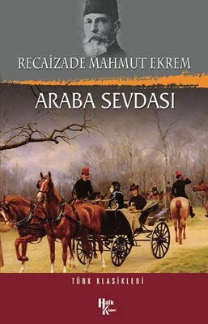

  
# Araba Sevdası - Recaizade Mahmut Ekrem
## 320 Sayfa
### 03.05.2021
  
 

  

    
     

 
 

Romanda çok fazla tanzimat dönemine ait kelimeler olmasından dolayı anlamakta güçlük çektim. Her ne kadar türkçe anlamları dipnot olarak verilse de benim için takip etmesi ve odaklanması bir o kadar zor oldu.. İlerleyen zamanlarda bir kez daha okuyarak daha iyi anlamak isterim..

______

> ***(Tanıtım Bülteninden)***

Araba Sevdası, Tanzimat döneminde rastladığımız diğer roman denemelerinden apayrı, yazarını da benzersiz kılan bir romandır. Sultan Abdülaziz döneminde yaşanan trajikomik bir aşk hikâyesini, abartılı bir "alafranga züppe" karakterinin etrafında anlatan Araba Sevdası, Türkçe edebiyatın en özgün örneklerinden biridir. Daha sonra pek çok romanda benzer örnekleri yaratılacak, aşırı Batılılaşmış, özenti karakterlerin dramı, en yoğun olarak Araba Sevdası'nın kahramanı Bihruz Bey'in şahsında ete kemiğe bürünür ve bir klasik haline gelir. Bu sadeleştirilmiş basımda, Araba Sevdası'nın orijinalinde yer alan resimlerin yanı sıra romanın kaynaklarını ve göndermelerini belirginleştiren metinlere, haritalara ve resimlere de yer verilmiştir.

"Eğer Tanzimat romanına bir Batılılaşma romanı değil de bir modernleşme romanı olarak bakarsak, Araba Sevdası gerçek 
anlamda modern ilk romandır."  
**-JALE PARLA-**

"Bu köksüz gölgeler kitabında asıl kahraman, Bihruz Bey'in parasını tam olarak ödemediği ve sonunda elinden aldıkları arabasıdır. O, kitabın sembolü ve fatalitesidir."  
**-AHMET HAMDİ TANPINAR-**

______

**Özet bana ait değildir.**   [Özet'e ulaşmak için..](https://www.edebiyatogretmeni.org/araba-sevdasi-roman-ozeti/)

Araba Sevdası Roman Özeti
Recaizade Mahmut Ekrem’in yazdığı bu roman, edebiyatımızdaki ilk realist romanlardan biridir. Romanda alafranga yaşama özenen, mirasyedi bir paşa çocuğunun içine düştüğü gülünç durumlar işlenir.

Romanın Özeti:

Bihruz Bey, bir Osmanlı paşasının, evde özel öğretmenlerle yetiştirilmiş, buna rağmen eğitimi öğretimi yetersiz, alafranga yaşama meraklısı, 23-24 yaşlarındaki oğludur. Yarım yamalak Fransızca bilir, alafranga kahve ve gazinolara gider, kıyafetlerini Avrupa mallarının satıldığı mağazalardan alır. Şık, pahalı ve Avrupa malı fayton arabasıyla eğlence yerlerini dolaşmak onda tutku haline gelmiştir.

Babası ölünce saf annesiyle Bihruz Bey’e yüklü miktarda miras kalır. Bihruz Bey bu serveti çar çur etmektedir. Çamlıca tepesine arabasıyla yaptığı gezilerden birinde kendi arabası gibi güzel bir arabada sarışın, güzel, kibar bir hanım görür. Onun iyi bir aile kızı olduğunu zanneder. S Halbuki “Periveş” adındaki bu kadın bir sokak yosmasıdır. O, Periveş’e tek görüşte sırılsıklam aşık olmuştur. Günün her saatinde onu düşünmektedir. Ona vermek üzere özene bezene bir mektup yazar. Sonraki hafta Periveş’i Çamlıca’da yine görür, bir yolunu bulup mektubu ona verir ama konuşmaya cesaret edemez. Sonra bir daha onu göremez; oysa onunla konuşmak, mektubuna cevap almak, en azından yüzünü görmek istemektedir. Periveş’i bir daha göremeyen Bihruz Bey’in iştahı kesilir ve Bihruz Bey zayıf düşer. Bu kara sevdadan dolayı çok sevdiği annesine bile ilgi göstermez.

Eskiden arada bir gittiği kaleme artık hiç gitmemektedir. Kalemdeki memur arkadaşı olan Keşfi Bey onun bu kara sevdasından haberdardır. Keşfi Bey aynı zamanda yalancılığıyla meşhurdur. Keşfi Bey, Bihruz Bey’e Periveş’i ve ailesini tanıdığını, Periveş’in öldüğünü, birde ablası olduğunu anlatır. Bihruz Bey, Keşfi Bey’in anlattıklarına inanır, o gece uyuyamaz, hasta olur. Sevgilisinin öldüğüne inanan Bihruz Bey onun mezarını bulmayı kafasına koyar. Bir gün Şehzadebaşı’nda Periveş’le karşılaşır; ancak onun Periveş’in ablası olduğunu sanarak Periveş’in mezarını sorar. Bu duruma kadın kahkahalarla güler, kendisinin Periveş olduğunu ve kendinin nasıl bir kadın olduğunu anlatır. Neye uğradığını ve ne yapacağını bilemeyen Bihruz Bey, yanından uzaklaşmakta olan Periveş’in peşine takılır; ancak peşini bırakması için Periveş tarafından azarlanınca aklı başına gelir.

_____

 

### Kitaptan Alıntılar ;
- ***"O kadar güzel bir vücudun içindeki yürek taş olabilir mi?.."***
- ***"Benim perişan hâlime bir kere bak. Ayrılığının ateşiyle bütün bedenim yanıyor."***
- ***"İnsan mutlu olunca vakit nasıl çabuk geçiyor!”***
- ***"Oturmuş akıntıya kürek çekiyoruz..."***
- ***"Sevdaya sabırla karşı koymuştum."***
- ***"Ah!   Bilemezsin, düşünemezsin ne kadar sevmiştim..."***
- ***"Görünüş aldatıcıdır..."***
