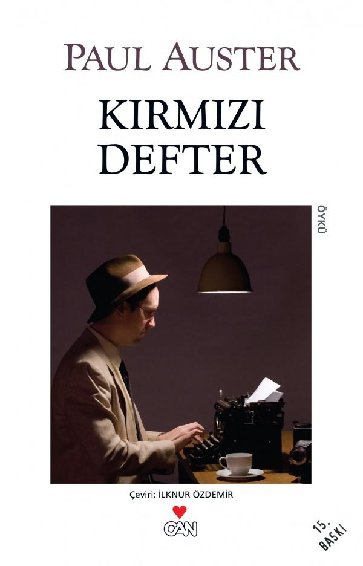

  
# Kırmızı Defter - Paul Auster
## 80 Sayfa
### 04.05.2021
  
 

  

    
     

 
 

Benim için yazarın okuduğum ilk kitabı oldu. Kitapta kısa kısa birbirinden bağımsız hikayeler anlatılmakta. Aynı zamanda kitabın anlatımı bir  o kadar yalın ve akıcı olduğu için okurken hiç sıkılmadım..

__________

> ***(Tanıtım Bülteninden)***

Kırmızı Defter’deki öyküler, Paul Auster’ın özel dünyasına girmek isteyenler için biçilmiş kaftan. New York Üçlemesi, Ay Sarayı, Şans Müziği, Tim­buktu, Brooklyn Çılgınlıkları, Yazı Odasında Yol­cu­luklar, Yük­seklik Korkusu gibi yapıtlarında olağanüstü düşgücünü orta­ya koyan Auster, bu kitabındaki öykülerde, ya gerçekten ya­şadığı ve tanık olduğu ya da yakınlarından, dostlarından dinle­diği gerçek olayları anlatıyor. Ama bu trajik ya da komik olay­ları öykülerken bir bakıma öteki yapıtlarının ipuçlarını sunu­yor okurlarına. Kırmızı Defter’in, anlatı sanatından sap­ma­dan sunulmuş bir yazınsal manifesto olduğu da söylene­bi­lir.

Kitaptaki dört anlatının ortak yanı, rastlantıların insan ya­şa­mın­daki önemini vurgulamaları. Her şeyin ve herkesin gizem­li bir biçimde birbiriyle bağlantılı olduğunu sezdiriyor Auster. Herkesin başına gelebilecek tuhaf, ayrıksı olayların, insan denen varlığın önceden bilinemeyen, değişken doğasını nasıl or­taya çıkarıverdiğini anlatıyor.

___________________

> ***- ALTI -*** 

**Buna benzer ama daha kısa bir süre içinde (yirmi yıl yerine birkaç ay) geçen bir olayı da R. adında bir başka arkadaşım anlattı; peşine düştüğü ancak bir türlü bulamadığı tuhaf bir kitap vardı; okumayı çok istediği ve ilginç bir yapıt olduğunu söylediği bu kitabı ele geçirmek için kitabevlerini ve katalogları taramış; bir öğle sonrası kentte dolaşırken kestirme olsun diye Grand Central İstasyonu’ndan geçmiş, Vanderbilt Bulvarı’na çıkan merdivenlerdeyken mermer korkuluğun yanında, elinde bir kitapla duran bir genç kadın görmüş; izini bulmak için umarsızca çabaladığı kitapmış o.  
Genellikle yabancılarla konuşan türden biri olmamasına karşın bu rastlantı onu öylesine hayrete düşürmüş ki sessiz kalamamış. “İster inanın ister inanmayın,” demiş genç kadına, “her yerde bu kitabı aradım.”  
“Harika bir kitap,” demiş genç kadın. “Az önce bitirdim.”  
“Bu kitabı nerede bulabileceğimi biliyor musunuz?” diye sormuş R., “Bunun benim için ne anlama geldiğini size anlatamam.”  
“Bu kitap sizin,” diye yanıtlamış kadın onu.  
“Ama o sizin,” demiş R.  
“Benim ‘idi’,” demiş kadın. “Ama benim işim bitti. Bugün buraya onu size vermek için geldim.”**

 

### Kitaptan Alıntılar ;
- ***"Belki de o mektup, benim hiçbir şey bilmediğimi, içinde yaşadığım dünyanın benden sürekli kaçacağını kendime hatırlatmanın bir yoludur."***
- ***Paris’ten Lyon’a giden trende otururken bana son bir ayın olaylarını özetleyen bir mektup yazmıştı.  
Raylardaki her sarsıntı elyazısına yansımıştı, sanki trenin hızı onun kafasından geçen düşüncelerin tam bir imgesiydi. O mektubun bir yerinde şöyle yazmıştı:   “Senin romanlarındaki karakterlerden biri olmuşum gibi geliyor bana.”***
- ***Geçen yıllar en azından bana şunu öğretti:  
"Cebinde bir kalem varsa, büyük olasılıkla bir gün onu kullanmaya başlamak gelecektir içinden."***
- ***"Benim birşeyim yok.   Doğru insana rastlamadım, hepsi bu."***
- ***"Ne zaman yüzümü aynada görsem başka birine bakar gibi oluyordum."***
