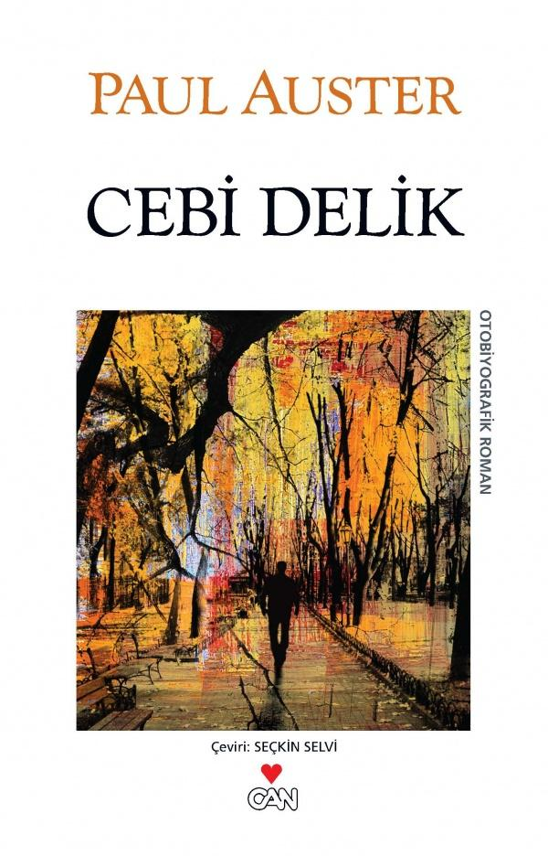

  
# Cebi Delik - Paul Auster
## 126 Sayfa
### 07.05.2021
  
 

  

    
     

 
 

Paul Auster'in hayatını anlattığı bu eserde. Anlatım dili bir o kadar yalın ve akıcı olduğu için. Anlaması, okuması da aynı şekilde kolay ve keyifliydi..   Paul Auster'ın hayatının büyük bir çoğunluğunun zorluklar içinde geçmesini gözler önüne koyduğu bu eserde; çocukluğunda annesiyle ve babasının ayrılmasından sonrasında şehir şehir dolaştığından, yazarlık ve çevirilik yaptığından. Adeta en dibe batmış bir şekilde en dibi gördükten sonra,  ve bu süreçte birbirinden farklı her işi yapmayı deneyerek hayata nasıl tutunduğunu bize anlatmaktadır. Asıl hayatı 1980'den sonra ikinci eşiyle evlendikten sonra düzeliyor ve adeta yeniden başlıyor diyebiliriz..

_____

> ***(Tanıtım Bülteninden)***

***Paul Auster'ın yapıtlarında, çağdaş insanı en çıplak durumuyla görüyor, onunla aramızda özdeşlikler, benzerlikler kurabiliyoruz. Paul Auster'ın yazdıklarının bu kadar beğenilmesinin, benimsenmesinin nedeni, belki de okuruyla arasındaki bu paylaşım. Bir Amerikalı yazar olmasına karşın, Amerikalı insanı değil, 'insan'ı anlattığı için evrensel boyutta oluyor yazdıkları. Yazarın bunca benimsenmesinin bir başka nedeni de, kısa, yalın cümlelerden oluşan kıvrak ve duru anlatımının, psikolojik çözümlemelerde kapsamlı ve derin bir boyuta ulaşabilmesi. Kurmaca yazarının genel yaklaşımının dışına çıkan ve alabildiğine gerçekmiş duygusu vererek yazan Paul Auster, 'olabilir'leri, 'olması gerekli'leri değil, olanları, yaşadıklarını, tanık olduklarını aktarıyor. Süslü edebiyattan uzak duruyor, yaşama hızını aktarabilmek için anlatımını yalınlaştırıp durulaştırıyor. Cebi Delik, yazarı tanımak isteyenler için benzersiz bir fırsat: Yaşamöyküsünü içtenlikle, dobra dobra ve her zamanki akıcı, ustalıklı diliyle ortaya koymuş Paul Auster.  
(Arka Kapak)***

________

Bir seferinde elime bütün bir elli sentlik geçtiğini anımsıyorum. O zaman da şimdiki kadar seyrek rastlanan bu paranın nereden geldiğini kestiremiyorum; ama ister birisi vermiş olsun, ister ben kazanmış olayım, o paranın benim için ne kadar önemli olduğunu ve ne kadar büyük bir meblağ sayıldığını çok iyi biliyorum. O devirde elli sente on deste beyzbol kartı, beş çizgi roman, on çubuk şeker, elli akide şekeri alabilir ya da istersen hepsinden biraz biraz alıp paçal yaptırabilirdiniz. Yarım doları arka cebime koyup bu minik serveti nasıl harcayacağımı coşkuyla hesaplayarak dükkânın yolunu tuttum. Ama yolda, hâlâ kavrayamadığım bir nedenden ötürü para yok oldu. Paranın orada olduğunu biliyordum, yine de bir kez daha yoklamak için elimi arka cebime attım ki ne göreyim, para yoktu. Cebim mi delikti acaba? Parayı son kez yoklarken pantolonun paçasından mı düşürmüştüm? Hiç bilmiyorum. Altı-yedi yaşlarındaydım, o anda nasıl yıkıldığımı bugün bile anımsıyorum. Çok dikkatli olmaya çalışmıştım ve onca özen göstermeme karşın yine de parayı kaybetmiştim. Böyle bir şeyi nasıl yapabilmiştim? Herhangi bir mantıklı açıklama bulamadığım için, sonunda Tanrı’nın beni cezalandırdığına karar verdim. Nedenini bilmiyorum, ama Kadir-i Mutlak’ın cebime uzanıp parayı bizzat kendisinin aldığından da kuşkum yoktu.

____

Fransa’da on sekiz ay daha kaldım; bunun yarısını Paris’te, yarısını da sevgilimle birlikte Kuzey Var’daki bir çiftlikte çalışarak Provence’ta geçirdim. New York’a döndüğümde cebimdeki para on dolardan azdı ve kafamda da geleceğe yönelik en ufak bir plan yoktu. Yirmi yedi yaşımdaydım; bir şiir kitabı ile bir avuç eleştiri yazısından başka birikimim yoktu; para sorununu çözme konusunda da Amerika’dan ayrılmadan önceki durumumdan bir adım ileri gitmiş değildim. İşleri daha da karmaşıklaştırmak için, tutmuş sevgilimle evlenmeye de karar vermiştik. Bu uzun uzadıya düşünülüp taşınılmış bir karar değildi; ama madem ki bir yığın şey değişecek, öyleyse neden her şeyi birden değiştirmeyelim demiştik.

____

Yavaş yavaş tükenme noktasına yaklaşıyordum. Joliet’den gelen okuması yazması kıt o adamların mektubundan sonra, Action Baseball’un boş hayal olduğunu anlamıştım. Oyunun para kazandıracağını beklemek, kendimi aldatmak, bağışlanmaz bir yanlışa düşmek demekti. Birkaç ay daha oyalandım, ama o son çabalar çok az zamanımı aldı. İçten içe yenilgiyi zaten kabullenmiştim, hem yalnızca oyunun, iş âlemine aptalca hamlemin değil, bütün ilkelerimin, çalışma, para ve kendime zaman ayırma konularında ömür boyu korumaya çalıştığım tavrımın da yenilgisiydi bu. Artık zaman önemli değildi. Eskiden yazmak için zamana gereksinimim vardı. Ama artık bir sabık-yazar olduğuma, yalnızca kâğıtları buruşturup çöpe atma adına karalayan bir yazar olduğuma göre, bununla uğraşmaktan vazgeçip herkes gibi yaşamalıydım. Dokuz yıl free-lance yazarlık yapmak yüreğimi tüketmişti.  
Oyunu icat ederek kendimi kurtarmak istemiştim, ama oyunu almaya kimse yanaşmamıştı; ve şimdi yeniden başladığım noktadaydım. Üstelik eskisinden de kötü, eskisinden de tükenmiş durumdaydım: O oyun hiç değilse bir fikrin, geçici bir umudun simgesiydi. Oysa şimdi fikirleri de tüketmiştim.  
İşin doğrusu, kendimi derin, karanlık bir çukura gömmüştüm ve oradan çıkmanın tek yolu iş bulmaktı.  
Oraya buraya telefonlar ettim, mektuplar yazdım, başvurduğum işyerleriyle görüşmek için defalarca kente indim. Öğretmenlik, gazetecilik, yayıncılık, ne olsa fark etmezdi.
Yapacağım iş belirli bir haftalık ücret getirecekse, ne iş olursa razıydım. İki ya da üç iş neredeyse olacak gibi görünüyordu, ama sonunda olmadı. Üzücü ayrıntılara girmek istemiyorum; başvurularımdan hiçbir elle tutulur sonuç çıkmadan birkaç ay geçti. Gittikçe umutsuzluğa kapılıyor, ne yapacağımı bilemez hale geliyordum: Üzüntüden beynim durmuş gibiydi. Tamamen teslim olmuş; yıllardır savunduğum ne varsa hepsini gözden çıkarmıştım ve hâlâ bir yere varamıyor, attığım her adımda geri düşünüyordum: sonra hiç beklenmedik bir anda, New York Eyaleti Sanat Konseyi’nden üç bin beş yüz dolar geldi ve rahat bir soluk aldım. Bu para uzun zaman idare etmezdi, ama yine de bir şeydi hiç değilse ölüm ânını birkaç dakika geciktirmeye yeterdi.

_____

 

### Kitaptan Alıntılar ;
- ***"Para uğruna kitap yazmanın karşılığı bu kadar ediyordu. Kendimi satmanın karşılığı bu kadardı işte."***
- ***"Önemli olan kendimi tanımak ve bu dünyadaki yerimin neresi olduğunu anlamaktı."***
- ***"Sonunda, şans kuşunun kendiliğinden gelip onun başına konmadığını istemeye istemeye kabullenmek zorunda kalmıştım. Mike, şansını kendisi yaratan biriydi."***
- ***"Artık bir yerlere gidip de sonunda dönülecek bir yer yoktu; yapılacak tek şey çekip gitmekti."***
- ***"... ama çoğunlukla yalnızdım; kimi zaman kafamın içinde sesler duyacak kadar yapayalnızdım."***
- ***"Beynim tutuşmuş gibi, hayat memat sorunuymuş gibi okuyordum."***
- ***"Bir kitap bir başka kitabı peşinden sürüklüyor, bir düşünce bir başka düşünceye yol açıyordu; ve bir aydan ötekine her konudaki düşüncelerim tamamen değişiyordu."***
- ***"Herhalde bir yerden başlamak gerekiyor. Belki istediğim hızla ilerleyemiyordum, ama en azından ilerleme yönünde adım atıyordum.   Ayaklarımın üzerinde duruyor, adım adım ilerliyordum; fakat nasıl koşacağımı henüz bilemiyordum."***
- ***"Kimseye güvenme; izini belli etme; kanıtları yok et."***
- ***"Tek bir kişiyi kurtarmak bile yeterince zorken, bir anda bütün dünyayı kurtarmaya kalkışmak düş kırıklığından başka sonuç veremez."***
- ***"Ve her gün kaç sayfa yapacağımızı planlayarak çalışmaya başlardık.   
Hiçbir neden, bizi hedefimizden caydıramazdı.   
Günde şu kadar sayfa yapacağız diye kararlaştırırdık;    ve canımız çalışmak istese de istemese de her gün oturur, o kadar sayfayı bitirirdik."***
- ***"Eğer bu işe biraz zaman ve emek harcamaya gönüllü değilsem, bir boka yaramaz ödleğin teki sayılırdım."***
- ***"Aptallara inanırsan, kendini aptal durumuna düşürürsün."***