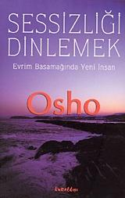

  
# Sessizliği Dinlemek - Osho 
## 174 Sayfa
### 16.05.2021
  
 

  

    
     

 
 

> ***(Tanıtım Bülteninden)***

"Bilinçsiz evrim insanla sona erer ve bilinçli evrim, başlar. Ama bilinçli evrim belirli bir insanla başlamaz. Ancak, siz başlamayı seçtiğinizde başlar..." Osho"nun bu kitabında bahsettiği yeni bir insanın yaratılmasından başka bir şey değil...  
Bunun olması için "İnsanı bütünüyle kabul etmeliyiz. Ne mantığının reddetmeliyiz ne de mantıksızlığını, ne aklını reddetmeliyiz, ne de duygularını, ne bilimsel, ne de dinsel yanını... İnsan akıcı olmasıl, bir kutuptan diğerine gidebilmeli. Zihin mantıklı, akılcı bir biçimde eğitilmeli ama aynı süreçte meditasyon eğitimi de görmelidir. Mantık ve duygular aynı anda eğitilmeli. Şüphe olmalı ama inanç da olmalı... Ne mantıksızı reddeden gelişebilir, ne de mantığı reddeden. Bir bütün olarak gelimeden gelişemezisin." 
Bhagwan'ın amacı, potansiyelimizin tamamen farkında olmak, kendi içsel devrimimizi yaşamaktır. Bu ise, beyinlerimizi daha fazla bilgi ile doldurmakla değil, sözcüklerin ötesindekini deneyimlemekle mümkündür.

_____

**Meditasyon Nedir?  
Meditasyon Hintlilere has bir metot değildir. Basit anlamıyla bir teknik de değildir. Onu öğrenemezsiniz. O bir gelişmedir; tüm yaşamınızdan gelen, tüm yaşamınızın gelişmesidir. Meditasyon, olduğunuz şeye eklenebilen bir şey değildir. Size, ancak temel bir değişim ile, bir mutasyonla gelebilir. O bir çiçek açmadır; bir büyümedir. Meditasyona doğru büyümelisiniz.  
Kişiliğin tümüyle çiçek açması doğru anlaşılmalıdır. Aksi halde insan kendisi ile oyunlar oynayabilir, zihinsel numaralar ile kendini oyalayabilir. Üstelik de o kadar çok oyun var ki! Aldatılırsınız, hiçbir kazancınız olmaz ama gerçek anlamda hiçbir zarar da görmezsiniz. Meditasyonun -onu bir metot olarak ele alırsanız- birtakım hileler, numaralar içerdiğini düşünmek temelde yanlıştır. İnsan zihinsel oyunlar oynamaya başladığında zihin yozlaşmaya başlar.**

_____

**Bir nokta daha var: "Seks" ve "aşk-sevgi" sözcüklerini kullandınız. Genelde bu ikisini birbiri ile ilgisi varmış gibi kullanırız. Fakat, böyle bir ilişki yoktur. Sevgi ancak seks gittiğinde gelir. Bundan önceki aşk yalnızca bir kur yapmadan, ön sevişmeden ileri gitmez. Sadece sekse ortam hazırlar. Bir giriş, bir önsözdür. İki insan arasında ne kadar fazla seks olursa aşk da o kadar azalır; çünkü önsöze gerek kalmaz.  
Birbirine aşık iki kişi arasında seks olmadığında aşkın romantizmi yaşanır. Seks işin içine girdiği an aşk yok olur. Seks çok anidir. Ve şiddet içerir. Ön sevişmeye, önsöze gereksinimi vardır. Bizim bildiğimiz aşk seksin çıplak gerçeği için bir giysiden ibarettir. Aşk dediğiniz şeyin derinliklerine bakarsanız orada seksin sıçramaya hazır beklediğini görürsünüz. Aşk konuşurken seks hazırlanır.  
Seksle birlikte düşündüğümüz bu güya aşk yalnızca bir giriştir. Seks gelirse bir kenara atılır. Evliliğin romantik aşkı kesin biçimde öldürmesi bu yüzdendir. İki insan birbirini ve ön sevişmeyi tanıdıktan sonra aşk gereksiz hale gelir.  
Gerçek aşk, gerçek sevgi bir giriş bölümü değildir. O bir rayihadır. Seksten önce değil, sonra gelir. Bir önsöz değil, son sözdür. Seksi yaşadıktan sonra eşinize sevgi ve şefkat duyuyorsanız aşk gelişir. Ve meditasyon yapıyorsanız sevgi ve şefkat duyarsınız. Seks eylemi ile meditasyon yapıyorsanız o zaman partneriniz yalnızca sizin fiziksel zevklerinizin bir aracı olmayacaktır. İkiniz de derin meditasyona ulaştığınız için birbirinize şükran duyacaksınız.**

____

**Seks yalnız meditatif olduğunda arkasında bir rayiha bırakır. Ön sevişme duygusu yerine bir olgunluk, bir büyüme, bir meditatif farkındalık hissedersiniz. Aşkı, sevgiyi o zaman bilirsiniz. Aşk şükran, dostluk ve şefkatin karışımıdır.  
Böyle bir sevgi oluştuğunda seksi aşarsınız. Aşk ve sevgi seks yolu ile ortaya çıkar ama onun ötesine geçer. Tıpkı bir çiçek gibi, köklerde oluşur ama onları aşar. Ve bunun geri dönüşü yoktur. Ya aşk vardır ya seks. Zaten gerçek aşkı tanımanın bir yolu da budur. Seks bir yumurtanın kabuğu gibidir, içinden aşk çıkar. Çıktığı anda ise kabuk kırılıp bir kenara atılır.  
Seks ancak meditasyon olduğunda sevgiye ulaşır. Olmadığında ise tekrarlanıp duran ve can sıkan bir şey haline gelir. Birbirinize şükran duymazsınız. Kendinizi aldatılmış hissedersiniz. Partnerinize düşman olursunuz; bir ihtiyaç haline gelen seks yolu ile size hükmediyordur. Seks olmadan yaşayamadığınız için onun kölesi oldunuz. Kölesi olduğunuz birine karşı ise asla dostluk duyamazsınız.**

____

**Bence şizofreninin asıl nedeni de budur. Bu yüzden sıradan psikoloji şizofreniyi çözümleyemiyor. Şizofrenik zihin aynı anda iki ayrı yöne bakan zihindir: dışarıda durup içeri bakar; dışarıda durup yukarı bakar. Sisteminiz tümüyle uyum içinde olmalıdır. Fiziksel bedeninizi içerden tanımıyorsanız, bilinciniz aşağı dönüktür. Bu sağlıklıdır, uyum vardır. Dışarı doğru hareket eden bir zihni asla yukarı çevirmeye çalışmamalısınız. Yoksa bölünme, yani şizofreni ortaya çıkar.  
Uygarlıklarımız, dinlerimiz insanların çift kişilikli olmalarının başlıca nedenleridir. Mutlak uyumla ilgilenmemişlerdir. Daha kendi fiziksel bedenlerine bile girememiş kişilere yukarı çıkma metotları öğreten öğretmenler var. Metot işe yaramaya başladığında kişinin yarısı yukarı doğru çıkarken diğer yarısı bedenin dışında kalır. O zaman bu ikisi ayrılır, bölünme olur. O insan iki kişi olur; bazen biri, bazen öteki; Jekyll ve Hyde.
Bir insanın aynı anda yedi kişiliği olması bile mümkündür. Bu durumda bölünme tamamlanmıştır. Yedi farklı enerji haline gelmiştir. Bir parçası aşağı doğru hareket ederek birinci bedende kalır. Bir parça ikinci, bir parça ise üçüncü ile birliktedir. Bir parça yukarı doğru gider, başka bir parça başka bir yöne. Artık kişinin merkezi kalmamıştır.  
Gurdjieff böyle bir insanı efendisi olmayan bir eve benzetiyor. Yedi hizmetçi var ve her biri kendinin evin efendisi olduğunu iddia ediyor. Kimse bunun aksini savunamıyor çünkü efendi evde değil. Kapı çalındığında kapıya en yakın hizmetçi açıyor ve evin efendisi o oluyor. Ertesi gün, bir başka hizmetçi kapıyı açıyor ve evin efendisi olduğunu söylüyor.
Bir şizofrenin merkezi yoktur. Ve hepimiz bu durumdayız! Topluma uyum sağlamışız, hepsi o kadar. Aramızda yalnız derece farkları var. Efendi ya uyuyor ya da evde yok ve her parça evin sahibinin kendisi olduğunu iddia ediyor. Cinsel dürtüler ortaya çıktığında, efendi seks oluyor. Ölümlü olduğunuz, aileniz, dininiz, her şey inkar ediliyor. Seks evin mutlak sahibi haline geliyor. Sonra, seks dürtüsü bittiğinde kargaşa başlıyor. Mantığınız işi ele alıyor ve "efendi benim" diyor. Artık mantık bütün evi ele geçirip seksi eve almıyor.  
Tüm parçalar sırayla evin tümünü ele geçiriyor. Öfke duyulduğunda efendi o oluyor. Artık ne mantık ne bilinçlilik ortada. Kimse öfkenin önüne geçemiyor. İşte bu yüzden birbirimizi anlayamıyoruz. Sevecen bir kişi öfkeleniyor ve aniden sevgi ortadan kayboluyor. Biz de o kişi gerçekten sevecen mi değil mi anlayamıyoruz. Sevgi yalnızca bir hizmetkardı. Öfke de öyle. Efendi yok. Bu yüzden normalde başkalarına güvenemiyoruz çünkü o efendi değil. Her an hizmetkarlardan biri idareyi ele alabilir. O hiç kimse; o bir bütün değil.  
Özetle söylemek istediğim; ilk dört bedenden geçmeden yukarı bakma teknikleri uygulanmamalıdır. Yoksa aşılması imkansız bölünmeler oluşur ve yeniden başlamak için bir sonraki yaşamınıza kadar beklemek zorunda kalırsınız. Baştan başlayan teknikler uygulamak gerekir. Önceki yaşamlarınızda ilk üç bedeni aşmışsanız, onları tekrar geçmeniz an meselesi. Hiçbir zorluk çekmezsiniz. Bölgeyi tanıyorsunuz, yolu biliyorsunuz. Hemen karşınıza çıkarlar. Onları tanıyorsunuz ve onları aştınız! O zaman ilerleyebilirsiniz. Benim ısrar ettiğim konu herkesin birinci bedenden başlaması gerektiği. Herkesin!**

_____

**Hepimiz aşkla ilgili rüyalar görürüz ama hiçbirimiz aşık değiliz. Herkes aşkın nasıl olması gerektiği hakkında rüyalar görür ve herkes bu konuda hayal kırıklığı içindedir. Üzüntüler içinde kıvranarak ya gelecek ya da geçmişle ilgili rüyalar görüyoruz ama hiçbirimiz gerçekten sevmiyoruz.**

___

**Skinner'e göre insan da her şey gibi önceden kestirilebilen bir varlık. İnsanın geleceğini tahmin etmedeki tek zorluk geçmişinin tam olarak bilinememesi. Onun geçmişinin tüm detaylarını bilebildiğiniz an geleceğini de tüm detayları ile görebilirsiniz. Üzerinde çalıştığı kişiler Skinner'in haklı olduğunu gösterdi. Yüzlerce insan üzerinde deneyler yaptı ve hepsinin mekanik varlıklar olduklarını, içlerinde özgürlük denebilecek bir şeyin yaşamadığını gördü.**

____

**Aşk diye bilinen yalnızca birine tutulmaktır. O kişi tümüyle sizin olduğunda o aşk kısa sürede ölecektir. Arada engeller varsa ve sevdiğinizi elde edemezseniz o zaman aşkınız artar. Engeller ne kadar fazlaysa, aşkı o kadar yoğun hissedersiniz. Ama aşığınızı kazandığınızda aşkınız çabucak ölür.  
Bir şeyi isteyip de elde edemediğinizde o isteğiniz çoğalır. Önünüze engeller çıktıkça, egonuz bu konuda bir şeyler yapmak ihtiyacını duyar. Bu bir ego sorunu haline gelir. Elde edemedikçe gerginleşirsiniz. Kendinizi daha çok aşık hissedersiniz. Aşk dediğiniz işte bu gerginliktir. Bu yüzden balayı biter bitmez aşk eskimiştir; hatta daha önce. Aşk sandığınız aşk değildi. Yalnızca egonun bir kişiye vurulması, tutulmasıydı; bir ego gerginliğiydi; bir çabalama, bir çatışmaydı.**

_____

 

### Kitaptan Alıntılar ;

- ***"Aslında herkes başkalarında kendini arar. İnsan kendi evini başkalarının evlerinin kapılarını çalarak bulur."***
- ***İsa, "Tanrı her taşın altındadır" der, ama siz yalnız taşları görüyorsunuz. Taşlaşmış zihninizi değiştirmelisiniz.***
- ***"İlk adımı attığınız an bir anlamda tüm seçimleri yapmış olursunuz."***
- ***"Artık yalnızsınız, yalnızsınız ve yalnızsınız."***
- ***"Kendi cehaletinizden kaçamazsınız; bilmediğinizi biliyorsunuz."***
- ***"Tüm yaşamlarımız kendimizden kaçmakla geçiyor."***
- ***Lao Tzu'nun bir sözü vardır: "Ararsan yitirirsin. Arama, bulursun."***
- ***"Olduğumuz yerde kalmamız imkansızdır. Ya daha yüksek bir bilinç düzeyine doğru evrim geçiririz ya da gerileriz. Seçim bizimdir."***
- ***"Bir bütün olarak gelişmeden gelişemezsiniz."***
- ***"Ve her seçim bir anlamda nihaidir. Geri dönüşü yoktur, onu unutamazsınız, seçileni seçilmemiş hale getiremezsiniz. Seçiminiz kaderiniz olur. Sizinle kalır, bir parçanız olur; onu inkar edemezsiniz."***
- ***"Ama seçmek her zaman bir kumardır. Her seçim karanlıkta yapılır çünkü hiçbir şey kesin değildir."***
- ***"Hatalar yapılacaktır, başarısızlıklar olacaktır çünkü kesin olan hiçbir şey yoktur. Bu durum zihinde gerginlik yaratır. Nerede olduğunuzu, nereye doğru gitmekte olduğunuzu bilemezsiniz. Kimliğiniz kaybolmuştur."***
- ***"Doğumunuz bilinçsiz evrimin elindedir. Aslında doğumunuz bir insan eylemi bile değildir. Doğasında hayvansaldır çünkü sizin seçiminiz değildir. İnsanlık ancak seçebilmekle başlar. Ama ölümünüzü seçebilirsiniz. Bu karar verilebilir bir eylemdir. Bu yüzden intihar kesinlikle insana has bir özelliktir."***
- ***"Doğrudan intihar etmeye cesaret edemeyebilirsiniz ama yavaş, uzatılmış bir intihar sürecinden geçersiniz; ölümü beklerken oyalandığınız bir süreç."***
- ***Eğer tümüyle yalnız olabilirseniz, sadece bir an bile yalnız olabilirseniz, ego ölür, "ben" ölür.***
- ***"Hayaller yaratmamalıyız, yoksa gerçeği asla bilemeyiz. Hayaller yaratılmış, yansıtılmış, geliştirilmiş gerçeklerdir ve asıl gerçeği görmenizi engeller."***
- ***Sartre bir yerde şöyle yazmış: "İnsan özgür olmaya mahkumdur." İster cehennemi seçersiniz, ister cenneti. Özgürlük iki şeyden birini seçebilmek demektir. Yalnız cenneti seçebilme olanağınız varsa bu bir seçim olmaz. Cehennem seçeneği olmadan cenneti seçmek cehennemin ta kendisidir. Seçim ya o ya bu demektir. Yalnızca iyi olanı seçmekte özgür olduğunuz anlamına gelmez. Öyle olduğunda özgürlük yok demektir.***
- ***"İki aşık hiç sessiz kalamıyorsa bu aşkın öldüğü anlamına gelir. Aşkın geride bıraktığı boşluğu sözcüklerle dolduruyorlar demektir. Aşkı yaşarken sözcükler orada olamaz çünkü aşkın varlığı o derece güçlüdür, o derece içe işler ki dilin ve sözcüklerin engeli aşılır. Zaten genelde bu engeli yalnız aşk aşar."***
- ***"Neden böyle oluyor? Çünkü zihin çok uzun bir süre bir yere odaklanamaz. Değişiklik gerekir ya da zihin uyur. Bu ikisinden başka bir olasılık yoktur. Tek bir şeye odaklanmayı sürdürdüğünüzde zihniniz uykuya dalar. Sabit kalamaz; o bir sürekliliktir, yaşayan bir şeydir. Zihninizin sıkılmasına izin verirseniz, odaklandığınız şeyin tekdüzeliğinden kaçar. O zaman yaşamını rüyalarda sürdürür."***
- ***"İnsanın bir yerlerden başlaması gerekir. Her başlangıç sahte bir başlangıçtır ama gene de başlanmalıdır. Sahte başlangıçlarla, karanlıkta, el yordamı ile kapı bulunur. Yalnız gerçek başlangıcı bulduğunda başlamayı bekleyen, hiçbir zaman başlayamaz. Doğru yöne doğru sahte bir adım bile bir adımdır, bir başlangıçtır."***
- ***Karanlıkta el yordamı ile arayın. Başka yapacak bir şey yoktur. Karanlıkta arayış size, sizi karanlıktan kurtaracak kavrayışı getirecektir. "Gerçek, özgürlüktür." Bu özgürlüğü kavrayın. Gerçeğin yolu hep kavrayıştan geçer. Bu, karşılaştığınız ve tanıdığınız bir şey değildir; gelişerek ulaştığınız bir şeydir. Onun için kavrayışın peşinde olun çünkü ne kadar çok şeyi kavrayabilirseniz gerçeğe o kadar yaklaşırsınız. Sonunda hiç bilinmeyen, beklenmeyen, önceden kestirilemeyen bir anda kavrayış en üst noktasına vardığında, kendinizi o dipsiz kuyunun içinde bulursunuz. Artık siz yoksunuz, meditasyon var.***
- ***"Karanlıklar içinde arayışınıza devam edin ve başarısızlıklardan korkmayın. Onları kabullenin ama aynı hataları tekrarlamayın. Gerçeği ararken yanlışlar yapan insan daima affedilir. Bu varoluşun derinliklerinden gelen bir vaattir."***
- ***"Ölüm kesin bir gerçektir. Seksin bu kadar büyük bir dürtü olmasının nedeni budur. Sonsuza dek burada olmayacaksınız, öyleyse yeni bir beden, bir benzeriniz sizin yerinizi almalı. Seks son derece önemlidir çünkü tüm doğa onun üzerinde ısrar eder. Yoksa insan varlığını sürdüremezdi. İsteğe bağlı bir şey olsaydı yeryüzünde kimse kalmazdı. Son derece dürtücü, zorlayıcı ve yoğun bir itkidir çünkü doğa tamamen onun yanındadır. O olmadan yaşam var olamaz."***
- ***İlk adım sonuncudan daha önemlidir. Başlangıcın sonuçtan daha önemli olduğu gibi; çünkü sonuç bir semeredir, bir büyümedir. Ama bizler başlangıçlar ve kullanılan yollarla değil hep sonuçlarla ilgileniriz. Sonuç o kadar önemli bir hale geldi ki, tohumu, yani başlangıcı gözden kaçırdık. Bu durumda rüya görmeyi sürdürebiliriz ama gerçeğe ulaşamayız.***
- ***"Geri dönüp ilk adımı değiştirmeden hiçbir yere varamazsınız çünkü yanlış bir adım ondan sonraki yanlış adımlara yol açar. Öyleyse baştan doğru başlayın."***
- ***İyi ve kötü birbirinin karşıtı değildir; birlikte vardırlar. İnsanın ikisini de olma olasılığı vardır, bu yüzden hangisini arıyorsanız onu bulabilirsiniz. İnsan bazı durumlarda iyi, bazı durumlarda kötü olur. Onu yargılamanız durumu nasıl tanımladığınıza ve bakış açınıza bağlıdır.***
- ***"İşte her şey sizin bakış açınıza, durumları ve olayları nasıl tanımladığınıza bağlı. Her zaman neyi arıyorsak onu buluruz. Gerçek bir ciddiyetle aradığınızda her şeyi bulabilirsiniz."***
- ***İnsan Meru Dağına da gidebilir ama sonuçta yine kendine dönmek zorundadır. En sonunda Meru Dağının da, Tibet'in de burada olduğunu fark eder: "Burada, benim içimde. Bense başka her yerde arayıp durmuşum..."***
- ***"Yeni keşifler gizli kalmalı. Bilgilerin açıklanmasının tehlikeli olmayacağı zamanı beklemeliyiz. Bu da, insanın yeterince gelişmiş olacağı zamandır."***
- ***"Geçmişte bazı şeylerin gizli kalması gerekiyordu çünkü bilgi, cehaletin eline düştüğünde tehlikeli olur."***
- ***"Örneğin hipnoterapist size kör olduğunuzu söylerse gözlerinizde hiçbir sorun olmamasına karşın artık göremezsiniz; yalnızca kör olduğunuza inandığınız için."***
- ***Hipnoz altında acı duyulmaz. Hipnoz altında her türlü ameliyat acısız yapılabilir çünkü ikinci beden acı olmayacağı telkini aldığında acı olmaz. Ben her türlü acının olduğu kadar her türlü hazzın da ikinci bedende oluştuğuna ve birinciye geçtiğine kesinlikle inanıyorum. Telkin değiştiğinde acı veren her neyse zevk verebilir. Tabii bunun tersi de mümkün.***
- ***"Doğum sancısı birinciye değil, ikinci bedene aittir. Bu nedenle hipnozla tamamen sancısız doğum yapılabilir. Kadınların hiç doğum sancısı çekmediği ilkel toplumlar vardır çünkü o kadınların kafalarında bu kavram yoktur."***
- ***"İnsan daima yukarı bakmalıdır, aşağı bakmayı bırakmalıdır."***
- ***"Bir şizofrenin merkezi yoktur. Ve hepimiz bu durumdayız! Topluma uyum sağlamışız, hepsi o kadar."***
- ***Bizler bildiklerimiz, hissettiklerimizden ibaretiz. Sınırsızı ve sınırsızlığı gördükten sonra siz de bir bakıma sonsuzlaşırsınız. Bir şeyi bilmek o olmaktır. Sevgiyi bilmek sevgi olmaktır; duayı bilmek dua olmaktır; ilahi olanı bilmek ilahi olmaktır. Bilmek gerçekleştirmektir; bilmek olmaktır.***
- ***"Yalnız bilinmeyen insanı çeker, yalnız bilinmeyenin mıknatıslı gizemi vardır."***
- ***"Bazen en iyi anladığımızı düşündüğümüz şeyi anlayamayız."***
- ***Lao Tzu, "Yalnızca mantıksal olmakla aptallık ediyorsunuz" der. "Mantıklı ve tutarlı olmak yeterli değildir. Mantıksız olanın çıkış noktaları vardır. Bir kişi ancak hem mantıklı hem de mantıksız olduğunda mantıklıdır."***
- ***Teorik sorular sormayın. Teoriler çözümden çok karmaşa getirir. Teoriler olmasaydı, daha az sorun olurdu. Onlar ne sorunları çözümler ne de soruları yanıtlar. Tam aksine, sorular yaratırlar."***
- ***Kişisel, özel, varoluşçu sorular sorun. İnsan ne sorduğunun farkında olmalı. Gerçekten sizin için bir anlam taşıyor mu? Yanıtlanırsa sizin için yeni bir boyut mu açılacak? Varlığınıza bir katkısı olacak mı, varlığınızda herhangi bir değişime neden olacak mı?***
- ***Bedeniniz dış dünyadan geliyor, düşünceleriniz dışarıdan geliyor, kişiliğiniz bile size başkaları tarafından verildi. Bu yüzden başkalarının sizin hakkınızda düşündüklerinden bu kadar korkuyorsunuz çünkü kontrolünüz tümüyle onların elinde. Her an fikirlerini değiştirebilirler.***
- ***Çocuğunuzu iyi bir yaşama gerçekten hazırlamak istiyorsanız, ona gerçek anlamda öfke duymayı öğretin. "Öfkelenme" demeyin. "Öfkelendiğinde, gerçekten, tümüyle öfkelen. Öfkenden dolayı suçluluk duyma" deyin. Ona doğru biçimde öfkelenmeyi öğretin. Doğru zamanlarda, gerçek anlamda öfkelenebilmeli. Yanlış zamanda öfkelenmemeli. Aynı şey sevgi için de geçerlidir. Doğru zaman geldiğinde gerçekten sevebilmeli; zaman yanlışsa sevmemeli.***

