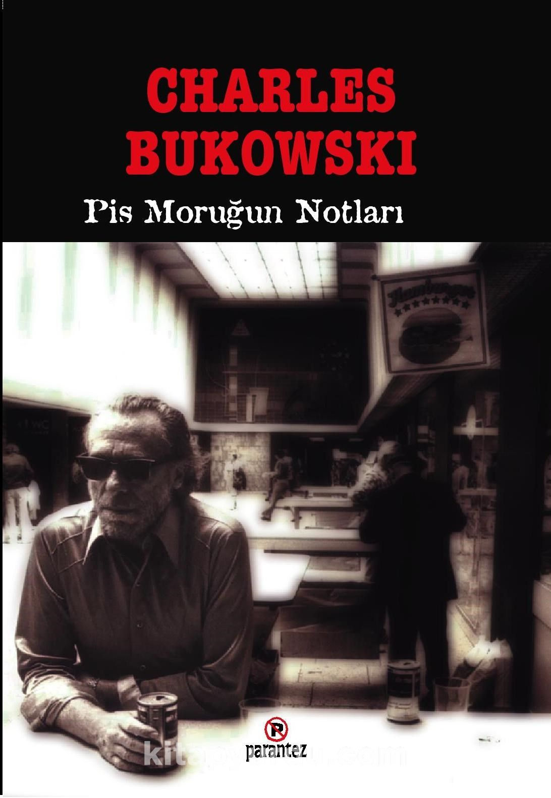

# Pis Moruğun Notları - Charles Bukowski
## 176 Sayfa
### 24.05.2021
  
 

  

    
     

 
 

> **"Kitap içerisinde birbirinden farklı hikayeler anlatılmaktadır. Fakat anlatılanları herkes sevmeyebilir, bazen çok edepsiz ve argo şeylerden bahseden bu kitabı okumadan önce tekrardan bir düşünün isterseniz, keyifli okumalar."**

 

> ***(Tanıtım Bülteninden)***

Bukowski''yi Dünya çapında meşhur eden, kültleşen öyküleri...
"bir hafta kalıp içtim, kiranın bitmesini bekleyerek, sonra da Village'in dışında bir oda tuttum. derli toplu büyükçe bir odaydı ve çok ucuzdu, nedenini anlayamamıştım. köşede bir bar buldum, bütün gün oturup bira içtim. param hızla tükeniyordu, ama her zamanki gibi nefret ediyordum iş aramaktan. sarhoş ve aç geçirdiğim her dakikanın benim için özel bir anlamı vardı. o gece iki şişe porto şarabı alıp odama çıktım. soyundum, bir bardak bulup ilk şarabı koydum ve karanlıkta yatağa uzandım. işte o zaman anladım odanın neden bu kadar ucuz olduğunu. "L" treni pencerenin önünden geçiyordu. durak pencerenin önündeydi. tam önümde. odanın tamamı trenin ışığı ile aydınlanıyordu. ve bir tren dolusu yüz geçiyordu önümden. korkunç yüzler: fahişeler, orangutanlar, deyyuslar, kaçıklar, katiller, efendilerim. sonra tren yavaşça hareket ediyordu ve oda bir kez daha karanlığa gömülüyordu bir sonraki tren dolusu yüzlere kadar, ki her seferinde beklediğimden çabuk geliyordu. iki şişe şarap almakla ne iyi etmiştim."
_____

> ***ÖNSÖZ***

**Ama anlatacak pis öyküleri olan bir ihtiyardan başka bir şey değilim. Benim gibi, yarın ölmesi muhtemel bir gazete için pis öyküler yazıyorum işte.   
Her şey o kadar tuhaf ki...Düşünün, Bebek İsa'nın çükünü ve hayalarını kamufle etmeyekalkışmasalardı şimdi bu kitabı okuyor olmayacaktınız. Öyleyse, mutlu olun.   
Charles Bukowski.**

____

**Öğrenmek için Karl Marks okumayın lütfen, çok kuru bok. insanlık ruhunu tanımaya çalışın. Marks, Prag'a giren tanklardır, bu yola girmeyin, öncelikle Celine okuyun. 2.000 yılda yetişmiş en büyük yazar. Camus'nün Yabancı'sı, mutlaka. SUÇ VE CEZA, KA-RAMAZOV KARDEŞLER, tüm Kafka, keşfedilmemiş yazar John Fante'nin bütün kitapları, Turgenyev'in öyküleri.   Faulkner'dan, Sheakspear'den ve özellikle George Bernard Shaw'dan uzak durun, inanılmaz siyasi bağlantıları sayesinde şişirilmiş bir balondan başka bir şey değildir Shaw, önündeki yol asfaltlanmış ve gerektiğinde kıç yalamasını bilen bir diğer yazar da Hemingway'di sanırım, ancak aralarında önemli bir fark Hemingway'in ilk yazılarının iyi olmasıdır, oysa Shaw baştan sona bok yazdı.   
 işte, devrimle başladık, edebiyata vardık, aralarında bir bağ var. her şeyde bağlanabilirlik var zaten, ama yoruluyorum ve yarını bekliyorum.   
 adamlar gelip kapımı kırarlar mı?   
 adam sen de!   
 umarım bu deneme çayınızı üstünüze dökmenize neden olmuştur.**

___________

> ***Kitaptan Bir Hikaye***

**otur Stirkoff.   
 sağolun, efendim.   
 ayaklarını uzatabilirsin.   
 çok lütufkarsınız, efendim.   
 Stirkoff, anladığım kadarı ile adalet ve eşitlik gibi konulan irdeleyen yazılar yazıyorsun; coşku ve kurtuluş hakkı üzerine de. doğru mu bu, Stirkoff?   
 evet, efendim.   
 dünyada geniş anlamda adalet sağlanabilir mi sence?   
 hiç sanmam, efendim.   
 öyleyse bu boktan yazıları neden yazıyorsun? kendini kötü mü hissediyorsun?   
 son zamanlarda pek iyi değilim, efendim, delirdiğimi düşünüyorum.   
 fazlaca mı içiyorsun, Stirkoff?   
 elbette, efendim.   
 çükünle oynar mısın?   
 sürekli, efendim.   
 nasıl?   
 anlayamadım, efendim?   
 yani nasıl bir yöntem uygularsın?   
 dört-beş çiğ yumurta ile yarım kilo kıymayı dar ağızlı bir vazoya döküyorum, müzik olarak da Vaughn Williams ya da Darius Milhaud yeğlerim.   
 cam mı?   
 hayır .m.   
 yahu vazoyu soruyorum, cam mı?   
 değil, efendim.   
 hiç evlendin mi?   
 birkaç kez.   
 evliliklerinde ters giden neydi, Stirkoff?her şey, efendim.   
 hayatının en iyi sevişmesini anlat.   
 dört-beş çiğ yumurta ile yarım kilo kıymayı...   
 tamam, tamam!   
 öyledir, efendim.   
 daha iyi ve adil bir düzen özleminin aslında çürümeden ve başarısızlık duygusundan kaynaklandığının farkında mısın?   
 evet, efendim.   
 baban kötü bir insan mıydı?   
 bilmiyorum, efendim.   
 ne demek bilmiyorum?   
 yani kıyaslamak güç, efendim, sadece bir babam oldu.   
 benimle kafa mı buluyorsun, Stirkoff.   
 hayır, efendim: dediğiniz gibi, adalet yoktur.   
 baban seni döver miydi?   
 sıra ile döverlerdi, efendim.   
 hani bir baban vardı?   
 herkesin bir babası vardır, efendim, ben annemi kastetmiştim, o da kendi payına döverdi.   
 seni sever miydi?   
 kendinin bir uzantısı olarak, evet.   
 sevgi başka nedir ki?   
 iyi bir şeye değer verecek kadar sağduyulu olmaktır, kan bağı gerekmez, kırmızı bir deniz topu ya da üzerine tereyağı sürülmüş kızarmış ekmek de sevilebilir.   
 tereyağlı kızarmış ekmeğe AŞIK olabileceğini mi söylüyorsun, Stirkoff?   
 her zaman değil, efendim, bazı sabahlarda, güneş ışınları belli bir açıdan gelirken belki, aşk habersiz gelir gider. bir insanı sevmek mümkün mü sence?   
 iyi tanımadığınız biri ise belki, ben insanları pencereden seyretmeyi severim.   
 sen bir korkaksın, Stirkoff. kesinlikle, efendim.   
 nedir senin korkak tanımın?   
 bir aslanla silahsız dövüşmeden önce tereddüt eden kimse.   
 peki cesur kime denir?   
 aslanın ne olduğunu bilmeyene.   
 herkes bilir aslanın ne olduğunu.   
 herkes aslanın ne olduğunu bildiğini sanır, efendim.   
 budala tanımın nedir?   
 zaman ve kan ziyan edildiğinin farkında olmayan kimse.   
 bilge diye kime denir o zaman?   
 bilge insan yoktur, efendim.   
 öyleyse budala da yoktur, gece olmazsa gündüz olmaz, siyah olmazsa beyaz olmaz.   
 özür dilerim, efendim, ben her şeyin neyse o olduğu kanısındayım, başka şeylere bağımlı olmaksızın.   
 o dar ağızlı vazolara fazla girip çıkmışsın sen, Stirkoff. her şeyin zaten olması gerektiği gibi olduğunu anlamıyor musun? yanlış diye bir şey yoktur.   
 anlıyorum, efendim, olan olmuştur.   
 kelleni vurdursam ne dersin?   
 bir şey diyemem, efendim.   
 demek istediğim şu: kelleni vurdursam ben İRADE sense HİÇ olursun.   
 başka bir şey olurdum, efendim.   
 benim SEÇİMİM doğrultusunda.   
 ikimizin de, efendim.   
 rahat et! rahat et! uzat ayaklarını.   
 çok lütufkarsınız, efendim.   
 hayır, ikimiz de lütufkarız.   
 elbette, efendim.   
 demek delirdiğini hissediyorsun, Stirkoff? peki delirdiğini hissettiğin zaman ne yaparsın?   
 şiir yazarım.   
 şiir delilik midir?   
 şiir olmayan her şey deliliktir.yani.   
 çirkinlik deliliktir.   
 çirkin nedir?   
 kişiye göre değişir.   
 delilik gerekli midir?   
 vardır.   
 gerekli midir?   
 bilmiyorum, efendim.   
 çok şey biliyormuş havalarındasın, Stirkoff. bilgi nedir?   
 mümkün olduğunca az şey bilmektir   
 ne demek o?   
 bilmiyorum, efendim?   
 bir köprü inşa edebilir misin?   
 hayır.   
 silah üretebilir misin?  
 hayır.   
 ikisi de bilgi ürünüdür.   
 köprü köprüdür, silah da silah.   
 kelleni vurduracağım, Stirkoff.   
 sağolun, efendim.   
 niye?   
 beni motive ettiğiniz için. motivasyon sıkıntısı çekiyorum, efendim.   
 ben ADALET'im. belki.   
 ben ÜSTÜN'üm. işkenceye yatıracağım seni. çığlıklar atacaksın, ölümünü dileneceksin.   
 şüphesiz efendim.   
 ben senin efendinim, anlamıyor musun?   
 beni yönetebilirsiniz, ama yapacağınız şeyler yapılabilir şeyler olmaktan öteye gitmeyecektir.   
 zekice konuşuyorsun ama işkence altında bu kadar zeki olamayacaksın.   
 sanmıyorum, efendim.   
 bana bak. Darius Milhaud, Vaughn Williams dinlemek de ne oluyor? Beatles'ı duymadın mı?   
 onları herkes bilir, efendim.   
 onları sevmez misin?   
 onlardan nefret etmem.   
 nefret ettiğin bir şarkıcı var mı?   
 şarkıcılardan nefret edilmez.   
 şarkı söylemeye çalışan birinden?   
 Frank Sinatra.   
 neden?   
 hasta bir toplumun hastalığının depreşmesine neden olduğu için.   
 gazete okur musun?   
 sadece bir gazete.   
 hangisi?   
 AÇIK KENT.   
 GARDİYAN! BU ADAMI İŞKENCE ODASINA GÖTÜRÜN. HEMEN İŞKENCEYE BAŞLAYIN!   
 efendim, son bir istekte bulunabilir miyim?   
 evet.   
 vazomu yanıma alabilir miyim?   
 hayır, bana lazım.   
 efendim?   
 el koyuyorum, zapta geçsin, gardiyan bu sersemi derhal götür! ve bana biraz şey getir... 
 ne, efendim?   
 altı yumurta ile yarım kilo kıyma.   
 gardiyan mahkûmu dışarı çıkarır, kral öne eğilip düğmeye basar. Vaughn Williams çalmaya başlar teypte, bitli bir köpek güneşin altında titreşen harikulade bir limon ağacına işerken dünya dönmeye devam eder.**

__________

 

### Kitaptan Alıntılar ;
- ***"Karanlığı bekliyordum, ölümü değil, dışarı çıkmak istiyordum, son bir fırsat, sonunda kapıyı açacak cesareti buldum kendimde."***
- ***"İnsan her zaman ihanet eder sonunda.  
 Kimseye güvenme."***
- ***"Ne paramız kaldı bankada ne de teşekkür edebileceğimiz bir dost ne yapmalı ah, ne yapmalı:   Işıkları söndürüp uyumalı."***
- ***"Bitti," dedi,   "Ölüler kazandı."***
- ***"Dün gece arabamı iskeleden aşağı ittim, tek bir şeye pişmanım."  
 "Neye?"  
 "Lanet şey aşağı yuvarlanırken içinde olmadığıma."***
- ***"Tanrım, tanrım, çok tuhaf bir dünyada yaşıyoruz," dedi.   "Her şeyimiz var ama hiçbir şeyimiz yok."***
- ***"Mahkeme salonları sonun önceden yazıldığı yerler."***
- ***"Yüreğinin boş bir dolapta bir saatli bomba gibi attığını duyabiliyordu."***
- ***"Bir insanı neyin yiyip bitirdiğini asla bilemezsiniz, belli bir ruh durumuna gelmişseniz en basit şeyler bile korkunç sorunlar haline gelebilir, ve en kötü 
 endişe/korku/acı yorgunluğu, açıklayamadığın, anlayamadığın, nedeni aklına bile gelmeyendir."***
- ***"Saat kaç?"   
 "Beşi yirmi beş geçiyor."   
 "Peki, şimdi saat kaç?"   
 "Hâlâ beşi yirmi beş geçiyor."   
 "Peki, şimdi saat kaç?"   
 "Bak, zaman o kadar çabuk değişmez, hâlâ beşi yirmi beş geçiyor."***
- ***"Hemen herkes dahi doğar geri zekalı gömülür."***
- ***"Sevgi başka nedir ki?  
 İyi bir şeye değer verecek kadar sağduyulu olmaktır, kan bağı gerekmez, kırmızı bir deniz topu ya da üzerine tereyağı sürülmüş kızarmış ekmek de sevilebilir."***
- ***"Bir insanı sevmek mümkün mü sence?   
 İyi tanımadığınız biri ise belki, ben insanları pencereden seyretmeyi severim."***
- ***"İnsanların nasıl bu kadar kolay öfkelendiklerini, sonra da öfkelerini aynı kolaylıkla unutup nasıl neşelenebildiklerini anlayamıyordum.   Ve nasıl HER ŞEYE ilgi duyabildiklerini, üstelik her şey bu kadar sıkıcıyken."***
