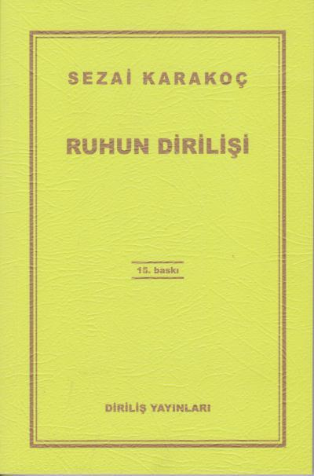

  
# Ruhun Dirilişi - Sezai Karakoç
## 174 Sayfa
### 01.06.2021
  
 

  

    
     

 
 

____

**Af , merhamet... Ve hüzünün sona erişi, ayrı­lığın bitişi. Yanlış anlamaların tükenişi. Hz. Yusuf'un Filistin'e, babasına kavuşması, Mekke fethi gibidir. Nasıl ki, Peygamber de Mekke'yi fet­ hettikten sonra konuşmasında Mekkelilere: "Ben de size Yusufun kardeşlerine dediği gibi derim ki, geçmişte olanlardan dolayı hiçbirinize bir kınama yoktur. " demiştir.**

_____

> ***Sf 112.***

**Evet, biz Arzın bir sivilcesinden ibaret değiliz.  
Biz, Arzın konuğuyuz. İçimizde dönüş arzuları  var. Götüreceklerimize göre ağırlanacağımız bir "yuva" var. Bir Döndürücü var, bir "aslına çeviri­ci" var. Ne yana dönersek dönelim, hangi bucağa gidersek gidelim, bizimle olan, bizi gücüyle çevi­ren, korktuğumuzda andığımız, yüceldiğimizde zikrettiğimiz, inandığımızda önüne kapandığımız, günün beş vaktinde önünde yere kapandığımız, bi­zi koruyan, bize acıyan, bizi cezalandıran, bizi ar­mağanlara boğan, yaratıcı, öldürücü, değiştirici, çarpıcı, gülü açan, bülbüle o ilahi sesi veren, bu­lutların binbir biçimiyle göğü zenginleştiren, sa­manyollarının sahibi, var edici ve yok edici Allah var.**

______

 

### Kitaptan Alıntılar ;
- ***"Ruh, kendi ce­hennemine düşmüştür. İnsanlık, kendi cehenne­minde kavrulmaktadır."***
- ***"İnsan, Allah'a inanmadan, Allah'ın varlığıyla var olmadan yaşayamadığını, daha doğrusu yaşa­yan bir ölüden farksız olduğunu anlamak ödevin­dedir.   
Bunun için yaratıldı.   
Allah'a, vahye, peygambere inanmayan akıl, ölü bir akıldır."***
- ***"Önce, insan, kendi kendinin düşmanı."***
- ***"Şeytan me­leği aldatamaz. Çünkü: meleğin nefsi yok. Nefs, şeytana tam karşılık ve denk düşen bir iç şeytan­dır adeta."***
- ***"Halbu­ki, putlaştırılan insanlar, Allah'ın önünde aciz de­ğiller midir? Allah onları da yaratmış, büyütmüş, onlara türlü nimetini vermiş, sonra öbür insanlar gibi onları da ölümle yakalamış, etlerini çürüt­müş, kemiklerini toz haline getirmiştir. Aklı olan, onlara saplanmaz. Saplananlar, şüphesiz şeytana tam teslim olmuş kişilerdir."***
- ***"İnsan bir nevi kendini Tanrı sandığından mı nedir, Tanrı'ya karşı eğilme borcunu unuttu. Yaradılış sebebini unuttu."***
- ***"Ama unutuluyor, her yaptığımız suni tabiat da, Tanrı'nın eseri. Çünkü biz, onun eseri­yiz. Bu isyan yarışmasını biz peşin kaybetmişiz.  
Daha doğrusu biz bir yarış duygusu içinde olmak­la yanılıyoruz. Kendimizi aldatıyoruz. Allah bizimle yarışmıyor. Haşa! O bundan yüksektir."***
- ***"Bize gücümüzü veren Yaratıcıya hamd etmemiz gere­kirken O'na başkaldırmaya çırpınıyoruz. Başkal­dırmak neye yarıyor? Bize ne kazandırıyor? Hiç. 
Şeytanın yakıcı ayak izlerine düşmekten başka ne geçiyor elimize? Elinde ansızın kırılan oyuncakla­rıyla başbaşa kalan çocuklar gibi boyuna sızlan­mamızdan gayri..."***
- ***"İnsan, sıkıntıya düştüğü her  anda geçmişteki mutlu zamanlarını hatırlar ve onların hemen gerçekleşmesini arzular."***
- ***"Dünyaya her gelen gider; her doğan ölür; en yüksek ve sağlam yapılar bile bir gün ge­lir yıkılır; en güçlü kubbeler çöker; en sağlam bo­ya solar. Madde ve eşya, zamanın önünde diz çök­müştür."***
- ***"Evet, ölümden sonra bir diriliş vardır ve öl­dükten sonra dirilenlerin bir toplumu olacaktır.    
İşte insanlar bu dünyada ister yalnız başlarına ya­şasınlar, ister kendilerine elverişli veya elverişsiz bir topluluk içinde bulunsunlar, o dünyada kendi­lerine uygun bir toplumun içine katılacaklar ve onlarla birlikte layık oldukları hayata yeniden ka­vuşacaklardır."***
- ***"İnsanlığın sonu, daha büyük ve ebedi bir insanlığa dönüşmektir, toza toprağa dönüşmek değil."***
