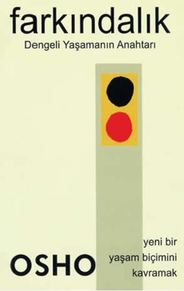

  
# Farkındalık - Osho
## 225 Sayfa
### 17.01.2021
  
 

  

    
     

 
 

***Karakterler;***
- ***:***
- ***:***
- ***:***
- ***:***

 

> ***(Tanıtım Bülteninden)***

Ben sana bir ahlak dersi vermiyorum. "Bu doğru, bu yanlış, bu ahlaklı, bu ahlaklı değil" demiyorum. Bunların hepsi çocukçadır. Ben sana çok basit bir kriter veriyorum: "Farkındalık"   Eğer farkındalıkla bir şey yaparsan doğru olmak zorundadır. Çünkü farkındalıkla hiçbir şeyi yanlış yapamazsın. Ve farkındalık olmadan da herkes tarafından takdir edilen kimi şeyleri çok iyi yapabilirsin. Ama ben hala ona yanlış diyorum çünkü farkında değilsin. Ve yanlış sebeplerden dolayı yapmış olmalısın. Farkındalık olmadan onların sadece gösteriş, ikiyüzlülük olduğunu biliyorum. Onlar seni yapmacık hale getirir. Seni özgürleştirmezler, seni özgürleştiremezler. Tam tersine seni hapsederler.
_____

 

### Kitaptan Alıntılar ;
- ***"İnsan hakkında anlaşılması gereken en önemli şeylerden birisi onun uykuda olduğudur.O kendisinin uyanık olduğunu düşünse bile öyle değildir."***
- ***"Doğumdan ölüme dek uyku alışkanlığını değiştirir durursun; geceleyin uyursun, gündüzleri uyursun ama sahiden hiç uyanmazsın. Sadece gözlerini açıp da uyanıkmışsın gibi kendini kandırma."***
- ***"Ve bir kez ellerin boş kaldığında, gerçek hazineleri arayabilirsin. Ve gerçek hazineler gelecekte değildir. Gerçek hazineler tam şimdi, buradadır."***
- ***George Gurdjieff'in tekrar tekrar söylediği de buydu:   "Var olduğu haliyle insan bir makinedir."***
- ***
- ***
- ***
- ***
- ***
- ***
- ***
- ***
- ***
- ***
- ***

