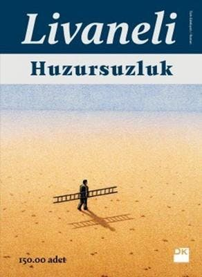

  
# Huzursuzluk - Zülfü Livaneli 
## 160 Sayfa
### 29.06.2021
  
 

  

    
     

 
 

***Karakterler;***
- ***İbrahim:*** Hikayeyi bize anlatan Gazeteci. Hüseyin'in arkadaşı.
- ***Hüseyin:*** İyi kalpli herkes tarafından sevilen ve öldürülen adam.
- ***Meleknaz:*** Hüseyin'in aşık olduğu, türlü türlü zulüme maruz kalmış kadın.
- ***Zilan:*** Yine türlü türlü zulüme maruz kalmış ve Meleknaz'ın çocukluk arkadaşı.
- ***Nergis:*** Zilan'ın 8. yaşındaki kız kardeşi.

 

> ***(Tanıtım Bülteninden)***

**Merhamet zulmün merhemi olamaz!**

**İstanbul'un kargaşası içinde sıradan bir yaşam süren İbrahim, çocukluk arkadaşı Hüseyin'in ölüm haberi üzerine doğduğu kadim kent Mardin'e gider. Onun, önce sevdaya sonra ölüme yazılmış, Mardin’de başlayıp Amerika’da sona ermiş hayatını araştırmaya koyulur. Böylece âdeta bir girdabın içine çekilir, tutkuyla ve hırsla gizemli bir kadının peşine düşer.** 

**Harese nedir, bilir misin? Develerin çölde çok sevdiği bir diken var. Deve dikeni yedikçe ağzı kanar. Tuzlu kanın tadı dikeninkiyle karışınca bu, devenin daha çok hoşuna gider. Kanadıkça yer, bir türlü kendi kanına doyamaz… Ortadoğu’nun âdeti budur, tarih boyunca birbirini öldürür ama aslında kendini öldürdüğünü anlamaz. Kendi kanının tadından sarhoş olur.**

**Mardinli Hüseyin ile IŞİD zulmünü misliyle yaşamış Ezidi kızı Meleknaz’ın ve kelamın çocuklarının hikâyesi... Livaneli okuru, sevda ile acının iç içe geçtiği bir Ortadoğu gerçeğiyle buluşturuyor.**
_____

Kitabımız Hüseyin ismindeki bir gencin Amerika'da öldürülmesiyle başlıyor. Hüseyin'in cenazesi memleketi olan Mardin'e defnedilmek için getiriliyor. Ne oluyorsa Hüseyin'in arkadaşı olan gazeteci İbrahim, bu cenazenin arkadaşı Hüseyin'in olduğunu fark etmesiyle başlıyor.   ***Abisinin Mardin'e cenazeyle birlikte getirdiği raporda, Türkiye Cumhuriyeti yurttaşı, 32 yaşında, erkek, beyaz (caucasian diye yazıyordu raporda) Hüseyin Yılmaz'ın, 26 Eylül 2016 gecesi saat 23.44'te karın bölgesine ve böbreklerine aldığı bıçak darbeleri sonucunda öldüğü belirtiliyordu. (s.19)***     İbrahim, arkadaşı Hüseyin'in hikayesini öğrenmeye kararlıydı ve cenazeden itibaren araştırmaya başladı. Hüseyin'in ablasıyla konuştu ve ondan bir çok bilgi aldı.   Öncelikle Hüseyin kendi köylerinden bir tane kız ile nişanlıymış ve ne olduysa bir anda o kızdan ayrılmış. Hüseyin, Meleknaz isimli Ezidi dinine mensup bir göçmen kıza aşık olmuş ve gözü ondan başka bir şeyi görmemiş. Hüseyin bu kız ile toplama kampında tanışmış ve kızın bir tane gözleri kör bebeği varmış.    Aynı zamanda Müslüman ile Ezidi dinine sahip insanlar kesinlikle evlenemezmiş. Üstelik bu Ezine dinine mensup kişilerin şeytana taptığına dair söylentilerde varmış.

Hüseyin, Meleknaz'ı o kamptan almış ve ailesinin evine getirmiş. İlk başta ailesi kızı istemesede bir süre sonra alışmışlar ama kesinlikle kızın Ezidi dininden olduğunu bilmiyorlarmış. Bir gün Hüseyin'in kardeşi salata hazırlarken Marul doğramaya başlamış ve bir anda bu marulu gören Meleknaz bir anda delirmiş ve evden o esnada kaçarak uzaklaşmış. Bunun ardından neler olduğunu anlayan Hüseyin'in ailesi kızın ardından bir sürü beddua etmişler.. Hüseyin bir süre sonra yeniden bulabilmiş.

____

İbrahim yine bilgi edinebilmek için toplama kampına gitti ve orada Zilan ismindeki bir kız ile konuştu. Zilan, Meleknaz'ı çocukluktan beri tanıyordu ve başlarından geçenleri anlattı...

Köylerindeyken adamlar gelmiş ve onları almış. Zilan'ın bir de Nergis ismindeki 8 yaşındaki kardeşi varmış. Hepsini götürmüşler ve ticaret amaçlı herkese satmışlar. Her sahibi bir başkasına satmış ve bu böyle sürmüş gitmiş. Herbir genç kıza her türlü zorbalığı ve tecavüzü yapmışlar. Bir süre sonra Zilan yeniden kardeşi Nergis ile bir araya gelmiş. Ama Nergis eski nergis değilmiş ve hiçbir şekilde konuşmuyor ve gülmüyormuş.. Bir süre yine iki kardeşi birlikte oradan oraya sattıklarından sonra Meleknaz ile bir satış alanında bir araya gelmişler. Meleknaz o esnada hamile ve doğurmak üzereymiş.. Bir tane yaşlı adam gelmiş ve bu üçünü satın almış.. Uzun bir yol gittikten sonra bu yaşlı adam onlarla birlikte Ezidi dinindenmiş ve onları kurtarmak için satın almış... Bu kızlara yetecek kadar yiyecek verdikten sonra yolu tarif etmiş ve bu yolu takip ederek en sonunda Türkiye'ye sığınmalarını söylemiş.. 

Kızların bu yolculuğu elbette çok zor olmuş. Bir süre sonra Meleknaz doğurmuş ve bir kız çocuğu olmuş. Fakat Meleknaz bu kızın yüzüne bile bakmıyor, o derece bebekten nefret ediyormuş.. Bir süre daha yolculuğa devam ettiklerinde, bir sabah uyandıklarında Nergis'in yanlarında olmadığını fark ediyorlar. Nergisi en sonunda yüksekten kendini atmış bir şekilde buluyorlar. Henüz ölmemiş ama tüm kemikleri kırılmış acı içerisinde yatıyormuş. Nergis'in ölmeden önceki son sözleri ise ***`"Ben bir insandım abla!"`*** oluyor ve oracıkta ölüyor.

Meleknaz ve Zilan yollarına devam ediyorlar ve öncesinde bu bebeğin ismini Nergis koyuyorlar.. Bu zorlu yolda, en sonunda o kadar aç kalıyorlar ki, Meleknaz'ın memesinden gelen sütü içerek hayatta kalıyorlar... En sonunda Türkiye'deki sığınma kampına geliyorlar. Bir süre sonra zaten Meleknaz, Hüseyin ile tanışıyor...

____

Ne yaptılarsa Hüseyin'i Meleknaz'ın sevdasından vazgeçiremiyorlar.. Hüseyin Meleknaz'ı güvende olması için İstanbuldaki bir arkadaşına gönderiyor..   Bir süre sonra ise Hüseyin Mardin'de silahlı saldırıya uğruyor ama neyseki kurşunlar ölümcül bir şekilde onu yaralamıyor ve hayatta kalıyor.. Güç bela Amerika'daki kardeşleri Hüseyin'i yanlarına çağırmaya ve ardından Meleknaz'ı da oraya getireceklerini söyleyerek ikna ediyorlar... Zorla ikna olan Hüseyin Amerika'ya gidiyor.. Bir süre abilerinin yanında çalışan Hüseyin, bir gece saldırıya uğruyor ve öldürülüyor...

____

Tüm bunlardan sonra ise İbrahim, İstabul'un her yerinde Meleknaz ve bebeğini arıyor ve en sonunda onların izine ulaşıyor. İbrahim'de Meleknaz'a ait bir mendil vardır ve Meleknaz'a bu emaneti vermek için birkaç kez bir araya geliyorlar.. Ama Meleknaz'ın kararı kesindir ve kimsenin kendisine acımasını istemez...

***- SON -***

___________________

***Harese nedir bilir misin oğlum? Arapça eski bir kelimedir. bildiğin o hırs, haris, ihtiras, muhteris sözleri buradan türemiştir.
Harese şudur evladım: develere çöl gemileri derler bilirsin, bu mübarek hayvan üç hafta yemeden içmeden, aç susuz çölde yürür de yürür; o kadar dayanıklıdır yani. Ama bunların çölde çok sevdikleri bir diken vardır. Gördükleri yerde o dikeni koparır çiğnemeye başlarlar. Keskin diken devenin ağzında yaralar açar, o yaralardan kan akmaya başlar. Tuzlu kan dikenle karışınca bu tad devenin daha çok hoşuna gider. Böylece yedikçe kanar, kanadıkça yer, bir türlü kendi kanına doyamaz ve engel olunmazsa kan kaybından ölür deve. Bunun adı haresedir.
Demin de söyledim, hırs, ihtiras, haris gibi kelimeler buradan gelir. Bütün Ortadoğu’nun âdeti budur oğlum, tarih boyunca birbirini öldürür ama aslında kendini öldürdüğünü anlamaz.
Kendi kanının tadından sarhoş olur. (s.15)***
____

***O sırada Aysel'in, çocukluğundan beri dokunmadığı belli olan, beline kadar inmiş iki örgü saçını kestiğini ve abisinin mezarına attığını gördük." (s.32)***

___

***Bu gözler çok kan gördü oğlum, çok zulüm gördü. Bu topraklar böyledir, kan hiç eksilmez, ölmeyince kan kesilmez, neden mi? Âdet böyle oğlum, buralarda âdet böyle. Hele namus meselesi olunca, kimsenin aklına silahtan başka bir şey gelmiyor. (s.44-45)***

____

***Sonunda dayanamadı, hocam ver elini öpeyim, bana müsaade et gideyim dediği zaman, döktüğüm dillerin hiçbir işe yaramadığını anladım oğlum. Zavallı çocuk elimi öptü, kapıdan koşar gibi çıktı, kendisini bekleyen ölüm meleğine koştu. (s.50)***

___

***İşte şimdi zor bir şey sordunuz bana. Yezidiler, yaratıcımızın bu yüce isimlerin hiç birini kullanmıyor. Zaten ona inanmıyorlar bence Melek Tavus'ları var. Allah onları bu sapkınlıktan kurtarsın evladım, çünkü günah içindeler. Evet evet, İslam gibi bizim dinimize göre de sapkınlar, Yahudilere göre de. Ama ne kadar gayet ederseniz edin o kör inançlarından vazgeçmiyorlar. Siz aklı başında bir müslümansınız, söyleyin Allah aşkına, ne biçim bir inanç bu? Yanlarında hangi dinden olursa olsun şeytan adını ağzına alamazsınız, Satan diyemezsiniz. Yüce yaradan bir an önce doğru yola döndürsün onları diyeceğim ama çok inatçılar. Tarihin en çok soykırıma uğramış halkı onlar ama Nuh diyor peygamber demiyorlar.  İnançları çok katı. (s.57)***

 ___

 

### Kitaptan Alıntılar ;
- ***"Şu küçücük dünyada herkes incitilmiş, isimsiz, herkes yanlış yerde."   | Fernando Pessoa, Huzursuzluğun Kitabı (s.11)***
- ***"Kendi yüzümü gördüm senin yüzünde.   Kendi sesimi duydum senin dudağında.   | Muhyiddin Arabi (s.11)***
- ***"Beni alıp tekrar karnına soksan bile koruyamazsın artık anne!" (s.17)***
- ***"Boş inançlar derdi basın yayın okulundaki hocam, boş inançlar sahiden boştur, gerçeği yansıtmazlar ama  yine de insanlık bütün yaratısını, sanatını ona borçludur." (s.54)***
- ***"Bu yüzden bazı şeyleri boş inanç diye küçümsemeyin, onlarsız insan kültürü olmazdı; ne mimari, ne müzik, ne edebiyat." (s.54)***
- ***Uzaklarda bir kadın, "İnsanlık ağacının kırılmış dalıyız biz" diyerek ağlıyor. (s.55)***
- ***"Demek ki bazı acıları ölüm bile unutturamıyor, bazı davranışlar ölümden sonra bile bağışlanmıyor." (s.61)***
- ***`"Şikâyet ettiğimi sanma sakın,`   `sevgilinin ayakları altında ezilen üzüm gibi`   `Lal renkli şaraba dönüştüm ben`  ` Bu yüzden razıyım ezilmeye.` (s.63)***
- ***`"Daha üzüm asması yaratılmadan sarhoş olanım ben`   `Sen doğmadan önce aşkınla berduş olanım ben."` (s.63)***
- ***"Bu dizeleri yazdıracak bir sevda nasıl bir şey olmalıydı ki sonunda onu kızgın çöllerdeki Mecnun misali ölüm vadisine sürüklemişti." (s.64)***
- ***`"Bir yer var`   `İyiliğin ve kötülüğün ötesinde`   `Seninle orada buluşacağız"` (s.86)***
- ***Daha sonra Meleknaz'da da aynı şeyi gördüğüm için biliyorum.   "Kardeşine, anana babana bile güvenemezsin, insan kılığındaki her yaratığın içindeki canavarı görürsün hep, başka bir şey görmezsin." (s.95)***<>
- ***"Bizim türümüzün bu dünyada yaşamaya, hem birbirini hem dünyayı yok etmeye hakkı yok, hepimizin içinde korkunç bir canavar yaşadığı yadsınamaz bir gerçek." (s.99)***
- ***"...kendimizi hayvanlardan ve bitkilerden üstün görmemiz büyük bir aldatmaca, insanlık diye yücelttiğimiz şey aslında ne aşağılayıcı bir kavram diye düşündüm." (s.99)***
- ***"Huzursuzdum, İstanbul'daki huzursuzluğumdan farklı bir şeydi bu ancak yine de huzursuzluktu. Tam tersi sanılır ama zaten hayatta normal olan huzursuzluk durumudur, huzur ise çok ender yakalanan geçici anlardır olsa olsa." (s.99)***
- ***"Ben bir insandım abla!" (s.106)***
- ***`"Bu dünya bir penceredir`   `Her gelen baktı geçti"` (s.109)***
- ***`"Bu dünya yalan dünya`   `Öteki de şüpheli"` (s.110)***
- ***"Bir şeyler yapıyorum, yürüyorum, konuşuyorum, yemek yiyorum yani her zaman yaptığım işleri sürdürüyorum ama nasıl anlatsam, bir boşluk duygusu içinde. Sanki içimde derin bir hiçlik var." (s.110)***
- ***"İbn Haldun ne kadar haklıymış diye düşündüm, coğrafya kaderdir derken ne kadar haklıymış.   Amerika'da doğanlar mutlu ve zengin bir hayat sürerken bizim kaderimize Fuat Amca'nın anlattığı harese düşmüş, diken yedikçe kanayan, kanadıkça yemeye devam eden, kendi kanında boğulan develer gibiyiz." (s.121)***
- ***"Merhamet istemiyorum, hiç kimsenin acımasına ihtiyacım yok, merhamet de zulmün bir parçası; ne bana acıyın ne de çocuğuma. Merhamet zulmün merhemi olamaz." (s.139)***
- ***"Belki de her şeyini yitiren bir insanın son sığınağı insan onurudur, elinde kalan tek şey budur." (s.143)***
- ***"...içimde büyük bir huzursuzluk var, beni yavaş yavaş öldüren bir huzursuzluk." (s.148)*** 