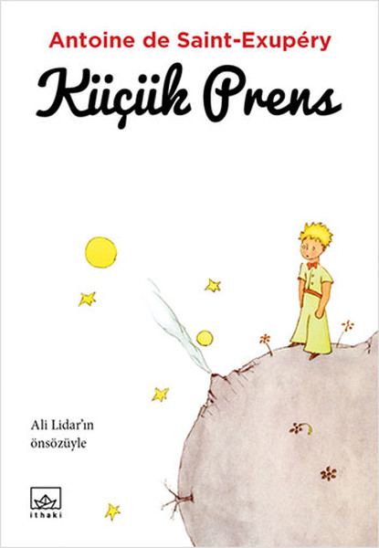

  
# Küçük Prens - Antoine de Saint-Exupêry
## 110 Sayfa
### 01.07.2021
  
 

  

    
     

 
 

> ***(Tanıtım Bülteninden - İthaki Yayınları)***

***"Büyürken yitirdiğimiz değerleri, saf ve masum bir çocuğun gözüyle bakıldığında pek çok yetişkin kaygısının aslında ne kadar da boş ve anlamsız olduğunu, yazdığı hacmen küçük ama aslında kocaman olan kitapla insanlığın kolektif bilinçaltına kazıyan Exupêry, hepimizi yaşantımız boyunca unutamayacağımız bir yolculuğa davet ediyor. Hadi hep beraber yola koyulalım     Not: Bu kitabı okurken nerede olursanız olun, lütfen kemerlerinizi bağlayın!"***
_____ 

Kahramanımız küçük bir çocukken, bir gün fil yemiş boa yılanı çizdi ve onu ailesindekilere ve çevresindeki herkese gösterdi fakat herkes ilk bakışta onun bir şapka olduğunu söylediler. Bunun üzerine kahramanımız bu sefer yine bir yılan çizdi fakat midesindeki fili de görünür yaptı. Bu sefer herkese gösterdiğinde ise, böyle şeylerle uğraşamaması gerektiğini ve coğrafya, tarih gibi diğer alanlara yönelmesi gerektiğini söylediler ve kahramanımızın hevesi kırıldığı için belki de geleceğin ressamlarından biri olamadı. Bunun üzerine ise pilot oldu..

Bir gün kahramanımızın uçağı bozuluyor ve çölün ortasında mahsur kalıyor. Yakınlarda ise herhangi bir yerleşim yeri bulunmuyor. Kahramanımız uykuya dalıyor ve bir süre sonra uyandığında ise başında bir çocuk ve kendisinden koyun çizmesini istiyor.. İlk başta ne olduğunu anlayamayan kahramanımız, sonradan bir şeyler karalıyor ama küçük dostu bunu kabul etmiyor. Bunun üzerine kahramanımız yıllar önce çizdiği yılan yemiş bao yılanını gösteriyor. Küçük dostumuz ise yılan yutmuş bir bao yılanı istemediğini söylüyor.. İlk defa kahramanımızın yaptığı resmi birisi doğru cevaplamış oluyor.. Bunun üzerine birkaç denemeden sonra, kahramanımız bir kutu çiziyor ve koyunun içerisinde olduğunu söylüyor.. Küçük dostumuz ise büyük bir keyifle bunu kabul ediyor.

Daha sonrasında kahramanımız küçük prens ismi verdiği bu küçük dostumuzla arkadaş oluyorlar.

___

Küçük Prens, kendi gezegeninde yanardağları temizliyor. Bir gün ise çok farklı bir çiçek keşfetti. Günlerce o çiçeğin doğmasını bekledi.
___

Küçük Prens gezegenleri gezmeye başladı. İlk gezegende bir tane krala rastladı ve bu kralın herkese ne kadar emir vermekten hoşlandığını fark etti.   İkinci gezegende ise kendini beğenmiş bir adama rastladı ve bu adamda sadece kendisine iltifat edilmesini istiyordu.   Üçüncü gezegende ise bir tane ayyaş adama rastladı ve bu adam ise kendisinin bu kadar içtiğinden utanıyordu. **Dördüncü gezegen bir iş adamının gezegeniydi. Bu adam o kadar meşguldü ki Küçük Prens geldiğinde başını kaldırıp bakmadı bile. (s.61)**   **Beşinci gezegen oldukça garipti. Gezdiği bütün gezegenler arasında en küçüğüydü. Sadece bir sokak feneri ve bir de onu yakmak için fenercinin duracağı kadar yer vardı. Küçük Prens uzayda bir yerlerdeki, üzerine ne bir ev ne de bir insan olan bu gezegende bir sokak fenerinin ve onu yakacak bir fenercinin ne işe yarayacağını anlayamıyordu. (s.65)**
  **Altıncı gezegen, bir öncekinden on kat daha büyüktü. Burada kalın kitaplar yazan yaşlı bir Bey oturuyordu. (s.69)**   **Böylece geldiği yedinci gezegen ise Dünya oldu. (s.73)**

Küçük Prens, adım adım dünyayı keşfetmeye başladı. Dağlar, taşlar, hayvanlar ile tanıştı. Güller ile konuştu. Tilki ve yılan ile arkadaş oldu. En sonunda ise bizim kahramanımıza rastladı. Birlikte kahramanımızın aracını tamir etmeye çalıştılar. Birlikte geçirdikleri sekiz günün ardından ise hiç suları kalmadığı için, yavaş yavaş yürüyerek bir kuyu aradılar. En sonunda o kuyuyu da buldular.. Ertesi gün için kahramanımız aracını tamir etti. Artık Küçük Prens'in gitme vaktiydi.

Küçük Prens, yukarıdaki yıldızlardan bizleri izliyor...

***- SON -***

 

### Kitaptan Alıntılar ;

_____

*Çavdar Tarlasında Çocuklar* **şöyle başlar: "Anlatacaklarımı gerçekten dinleyecekseniz, herhalde önce nerede doğduğumu, rezil çocukluğumun nasıl geçtiğini, ben doğmadan önce annemle babamın nasıl tanıştıklarını, tüm o David Copperfield zırvalıklarını falan da bilmek istersiniz ama ben pek anlatmak istemiyorum. Her şeyden önce bu zırvalıklardan sıkılıyorum." (s.7)**

____

**"Büyükler asla hiçbir şeyi tek başlarına anlayamıyorlar. Çocuklar için sürekli olarak onlara açıklama yapmak oldukça yorucu." (s.18)**
____

**Büyükler sayıları pek severler. Ne zaman onlara yeni bir arkadaşınızın olduğundan bahsetseniz, size asla esas konu hakkında soru sormazlar. Asla "Sesinin tınısı nasıl? Sevdiği oyunlar neler? Kelebek koleksiyonu yapıyor mu?" diye sormazlar. Onun yerine, "Kaç yaşında? Kaç kardeş? Kaç kilo? Babası ne kadar kazanıyormuş?" derler. Sadece bu sorularla onu tanıyabileceklerine inanırlar. (s.30)**
_____

**"Bir keresinde kırk üç kez günbatımını seyretmiştim!"   dedin.   Çok geçmeden ekledin:  "Biliyor musun... çok üzgün olduğumuzda günbatımlarını daha çok severiz..."   "O halde günbatımını kırk üç kez izlediğin gün oldukça üzgün olmalıydın?" diye sordum.   Ama Küçük Prens bana karşılık vermedi. (s.37-38)**

___

**"Al yanaklı bir beyefendinin yaşadığı bir gezegen biliyorum. Tek bir çiçek bile koklamamış. Bir kez bile bir yıldıza bakmamış. Kimseyi sevmemiş. Hayatı boyunca hesap kitap dışında hiçbir şey yapmamış ve bütün gün senin gibi söylenip duruyordu: 'Ben önemli bir insanım! Ben önemli bir insanım!'" (s.40)**

____

**"Eğer biri, milyonlarca yıldız arasında sadece tek bir örneği olan bu çiçeği seviyorsa, bu, yıldızlara baktığında mutlu olması için yeterli bir sebeptir. Kendi kendine, "Benim çiçeğim oralarda bir yerlerde..." diyecek ancak bu koyun gelip onu yerse, bu durum o kişi için aniden tüm yıldızların sönmesine sebep olacaktır!" (s.41)**

___

**"Gözyaşları ülkesi, oldukça gizemli bir yer." (s.42)**

___

**"Kelebeklerle dost olmak istiyorsam gelip giden iki üç tırtıla katlanmam gerek. Kelebekler çok güzel olmalılar. Yoksa kim benim ziyaretime gelecek? Sen uzakta olacaksın. Yırtıcı hayvanlar bile gelince, hiçbirinden korkmuyorum. Dikenlerim var." (s.50)**

____

**"Böyle oyalanıp durma, sinir bozucu bir durum. Gitmeye karar verdin, öyleyse haydi git."   Böyle söylemesinin sebebi kendisini ağlarken görmesini istememesiydi. Oldukça gururlu bir çiçekti bu. (s.50)**

___

**"O halde kendi kendini yargılayacaksın," dedi kral.   "Bu en zorudur. İnsanın kendini yargılaması, başkalarını yargılamasından daha zordur. Kendini güzelce yargılayabilirsen, gerçek bir bilge olduğunu kanıtlarsın." (s.55)**

____

**"Biri yıldızlara nasıl sahip olabilir ki?"   "Sahip olan kişi kim?" diye tersleyerek karşı saldırıya geçti iş adamı.   "Bilmem. Hiç kimse."   "O halde yıldızların sahibi benim işte çünkü bunu ilk ben düşündüm."   "Bu yeterli mi ki?"   "Elbette. Kimseye ait olmayan bir elmas bulursan, senindir. Kimsenin sahip olmadığı bir ada bulursan, senindir. İlk kez bir fikir bulursan, onu tescil ettirirsin, senin olur. Benden önce kimse onlara sahip olmayı düşünmediğinden, yıldızlar benimdir." (s.63)**

____

**"Peki "fani" ne demek? diye tekrarladı, hayatında bir kez bile sorduğu bir soruya yanıt almadan bırakmayan Küçük Prens.   "'Yok olma tehlikesiyle karşı karşıya olan," demektir."   "Şimdi benim çiçeğim yok olma tehlikesiyle karşı karşıya  mı yani?"   "Elbette."   "Çiçeğim fani öyleyse," dedi Küçük Prens kendi kendine, "ve dünyaya karşı korunmak için sadece dört dikeni var! Üstelik onu kendi gezegenimde tek başına bıraktım!" (s.72)**

___

**"Merak ediyorum da acaba bütün bu yıldızlar bir gün herkesin kendi yıldızını bulabilmesi için mi parlıyorlar? Gezegenime bak. Hemen üstümüzde... Oysa ne kadar da uzak!" (s.75)**

___

**"İnsanlar nerede?" diye tekrar söze başladı Küçük Prens. "Burada biraz yalnızız..."   "İnsanlar birlikteyden de yalnızdır," dedi yılan. (s.76)**

___

**"Evet," dedi tilki. "Benim için hâlâ diğer yüz bin küçük çocuktan farksızsın. Ayrıca sana ihtiyacım da yok. Senin de bana ihtiyacın yok. Senin için diğer yüz bin tilkiden farklı değilim. Ancak beni evcilleştirirsen, birbirimize ihtiyaç duyarız. Benim için dünyada tek olursun ve ben de senin için dünyada tek olurum..." (s.84)**

____

**"Örneğin öğleden sonra saat dörtte geleceksen, ben saat üçten itibaren mutlu olmaya başlayacağım. Saat ilerledikçe sevincim çoğalacak. Saat dörtte çoktan heyecanlanıp kaygılanmaya başlamış olacağım, mutluluğun sırrını bulacağım! Ama aklına estiği bir saatte gelirsen, kendimi ne zamana hazırlamam gerektiğini asla bilemeyeceğim..." (s.87)**

____

**"Yalnızca yüreğimizle görebiliriz. Esas olan göze görünmez." (s.89)**

___

**"Gülün için harcadığın zaman, gülünü önemli kılar." (s.89)**

____

**"İnsanlar bu gerçeği unuttular," dedi tilki. "Ancak sen hep hatırlamalısın. Evcilleştirdiğin her şey üzerine sorumluluk sahibi olursun. Gülünden de sorumlusun..."   "Gülümden de sorumluyum," diye yineledi Küçük Prens unutmamak için. (s.89)**

____

**"Gittikleri yerden memnun değiller miydi?"  "Asla olduğumuz yerde mutlu olamayız." (s.90)**

____

**"Çölü güzelleştiren," dedi Küçük Prens, "bir yerlere bir kuyunun saklanmış olmasıdır..." (s.94)**

___

**"Ev olsun, yıldız ya da çöl olsun, onları güzel kılan, görünmeyen bir tarafları olması!" (s.95)**

___

**"İnsanlar," dedi Küçük Prens, 'gelgitlerde sürüklenip kayboluyorlar ama ne aradıklarını bilmiyorlar. Hareket ediyor, dönüp duruyorlar..." (s.96)**

___

**"Senin dünyandaki insanlar," dedi Küçük Prens, "aynı bahçede beş bin gül yetiştiriyorlar... ve yine de aradıklarını bulamıyorlar..."   "Bulamayacaklar da," diye yanıt verdim. (s.97)**

___

**"Ama gözler kör. Yüreğimizle aramalıyız." (s.98)**

___

**"Sevgili küçüğüm, seni yeniden gülerken görmek istiyorum..." (s.103)**

___

**"Benim çiçeğimde olduğu gibi... Yıldızın birindeki bir çiçeği seversen, geceleyin gökyüzüne bakmak tatlıdır. Bütün yıldızlar çiçeklidir." (s.103)**

___

**"Geceleyin gökyüzüne baktığında, ben onlardan birinde oturduğum, onlardan birinde gülüyor olduğum için hepsi birden gülüyor gibi gelecek sana. Senin, sadece senin, gülen yıldızların olacak!" (s.104)**

___