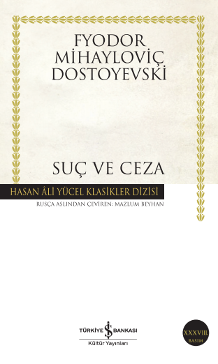

  
# Suç Ve Ceza - Fyodor Mihayloviç Dostoyevski 
## 687 Sayfa
### 09.07.2021
  
 

  

    
     

 
 

***Karakterler;***
- ***Raskolnikov | Rodion Romanoviç Raskolnikov:*** Kahramanımız. 23 yaşında üniversite öğrencisi bir genç.
- ***Pulheriya Aleksandrovna:*** Raskolnikov'un annesi.
- ***Avdotya Romanovna | Dunya:*** Raskolnikov'un kız kardeşi.
- ***Razumihin:*** Raskolnikov'un üniversiteden yakın arkadaşı.
- ***Nastasya:*** Yaşadığı yerdeki hizmetçi kız.
- ***Alyona İvanovna:*** Rehineci, saatini saattığı kadın.
- ***Lizaveta İvanovna:*** Rehineci kadın'ın kız kardeşi.
- ***Marmeladov:*** Meyhanedeki tanıştıkları memur. Sonya'nın babası.
- ***Sonya:*** Marmeladov'un kızı.
- ***Katerina İvanovna:*** Marmeladov'un karısı, Sonya'nın üvey annesi.
- ***Pyotr Petroviç:*** Dunya'nın evleneceği adam.
- ***Lebezyatnikov:*** Pyotr Petroviç'in ev sahibi.
- ***Zamyotov:*** Polis karakolundaki adam | polis yardımcısı.
- ***Zosimov:*** Raskolnikov'un doktoru.
- ***Porfiri Petroviç:*** Cinayet ile ilgili herkesi sorgulayan polis memuru.
- ***Svidrigayloy:*** Dunya'nın çiftliklerinde murabbiye olarak çalıştığı yerdeki ailenin kocası.

 

> ***(Tanıtım Bülteninden)***

**Fyodor Mihayloviç Dostoyevski (1821-1881): İlk romanı İnsancıklar 1846'da yayımlandı. Ünlü eleştirmen V. Belinski bu eser üzerine Dostoyevski'den geleceğin büyük yazarı olarak söz etti. Ancak daha sonra yayımlanan öykü ve romanları, çağımızda edebiyat klasikleri arasında yer alsa da, o dönemde fazla ilgi görmedi. Yazar 1849'da I. Nikola'nın baskıcı rejimine muhalif Petraşevski grubunun üyesi olduğu gerekçesiyle tutuklandı. Kurşuna dizilmek üzereyken cezası sürgün ve zorunlu askerliğe çevrildi. Cezasını tamamlayıp Sibirya'dan döndükten sonra Petersburg'da Vremya dergisini çıkarmaya başladı, yazdığı romanlarla tekrar eski ününe kavuştu.** 

**Suç ve Ceza Dostoyevski'nin bütün dünyada en çok okunan başyapıtıdır.**
_____

***Raskolnikov akıllı, aydın, dürüst bir gençtir. Eski bir Petersburg evinin bir dolabı andırır küçük çatı bölmesinde oturmaktadır. Çevresindeki yoksulların yaşamını gözlemlemekte, yalnızca kendisinin değil, binlerce başka insanın da bu düzen içinde yazgılarının  kaçınılmaz olarak yoksulluk, hastalık, erken ölüm olduğunu görmektedir. Bu durum onda yoğun düşünsel arayışlara yol açmıştır. Arayış peşindedir, ama hep yalnızdır. Kimselerle görüşmez. İnsanlardan kaçar. Sorunu kendi başına çözmek, yalnız kendi gücüne yaslanmak ister. (s.11)***

***"Delikanlı çoğunlukla kendini olduğu gibi atardı bu yatağa; çarşafı yoktu, üzerine eski, partal öğrenci paltosunu örter, küçücük yastığının altına da biraz daha yüksek olsun diye, temiz kirli ne kadar çamaşırı varsa sıkıştırırdı." (s.33)***
_____

> **Bölüm I --->  s.1**

Kahramanımız Raskolnikov ismindeki üniversite öğrencisi bir gençtir. Çok büyük bir yoksuluk içerisinde ve aynı zamanda cebinde parası bile yoktur. Uzun bir süredir kaldığı yerin kirasını bile ödeyemediği için ise ev sahibi ile karşılaşmamak için elinden geleni yapıyor. Üstelik kahramanımız insanlardan uzak ve tek başına yaşamayı seven bir karaktere sahip.

Raskolnikov'un parası olmadığı için daha önce de iş yaptığı Alyona İvanovna ismindeki kadına gidiyor ve baba yadigarı olan saatini bu kadına satıyor. Her ne kadar bu kadın saatine karşılık az para vermiş olsa da kabul etmek zorunda kalıyor. Az miktarda aldığı bu parayla ise bir tane meyhaneye gidiyor ve biraz alkol içiyor. Bir süre sonra meyhanedeki Marmeladov ismindeki bir memur Raskolnikov'un yanına geliyor ve konuşmaya başlıyor. Kendi hayat hikayesini anlatan bu memur ile birlikte uzun bir konuşmanın ardından bu memur'un evine gidiyorlar. Memurun karısı yine adamı yine paraları meyhanede içki içtiği için dövmeye başlıyor, Raskolnikov oradan kendini kurtarıyor ve ayrılırken ise cebindeki son kuruşları onlar için orada bırakıyor..

Ertesi gün Raskolnikov hizmetçi tarafından uyandırılıyor. Hizmetçi kız, dün Raskolnikov'a gelen mektubu kendisine veriyor. Raskolnikov, annesinden gelen mektubu açıyor ve okumaya başlıyor.   Birkaç ay önce Raskolnikov'un kız kardeşi Dunya bir tane ailenin yanında hizmetçi olarak çalışıyormuş. Bir süre sonra bu ailedeki koca, Dunya'ya kendisinden hoşlandığını ve kendisiyle kaçmasını söylemiş. Dunya ise bunun ne kadar yanlış olduğunu belirterek reddetmiş. Ama bir süre bu adamın karısı bir gün Dunya ve kocasını tartışırlarken duymuş ve tüm olanları Dunya'dan bilerek kızcağızı suçlamış. Aynı zaman Dunya'yı hemen oradan kovarak annesinin yanına göndermiş.. Üstelik bu kadın da tüm köylere bu olanları kötü bir şekilde yaymış. Bunun sonucunda ise Dunya ve annesinin yüzüne bile bakmaz olmuşlar. Bu olaylar böyle olunca, kocası dayanamamış ve Dunya'nın suçsuz olduğunu itiraf etmiş ve Dunya'nın kendisine yazdığı mektubu kanıt olarak göstermiş. Böyle olunca kadın ne kadar büyük bir hata yaptığının farkına varmış ve Dunya'dan özür dilemiş. Tekrardan doğru bir şekilde, bu sefer daha da abartarak, mektubu herkese okutarak olanları tüm köylere yaymış. Dunya ve annesine karşı bakışlar eskiye, hatta daha iyiye dönmüş... Bir süre sonra da Pyotr Petroviç ismindeki bir adam Dunya ile evlenemeye karar vermiş. Dunya'da bunu kabul etmiş.

Bir gün Raskolnikov uykusunda çok kötü bir rüya gördü. Bir tane eşeği gözlerinin önünde acımasızca öldürdüler ama neyseki bu bir rüyaydı. Tam olarak niye böyle bir şey gördüğünü anlayamadı. Bir süre sonra ise kendisini eve dönerken uzun yoldan dönerken buldu, kendi kendine buna da anlam veremedi. Ama o yoldan gelirken, saatini bıraktığı kadının kız kardeşini orada birileriyle konuşurken gördü. Ertesi gün akşam saatlerinde evde olmayacağını öğrenmiş oldu...   Raskolnikov, Alyona İvanovna'yı öldürmek istiyordu ve üstelik neredeyse kader de tam buna yönelik iş birliği yapıyor gibiydi...

Raskolnikov ertesi gün neredeyse akşama kadar uyumuştu. İşleyeceği cinayet hakkında neredeyse hiç detay düşünmeyip her şeyi akışına bırakarak hareket ediyordu. Aklında kaldığı evin mutfağındaki baltayı almak vardı. Mutfağa indiğinde ise hizmetçinin orada olduğunu gördü ve bu sebeple baltayı alamamıştı. Böyle olunca sokağa indi ve büyük bir panik içerisinde düşmüştü derken karşı apartmanın kapısının açık olduğunu ve metal bir şeyin parladığını gördü. Raskolnikov kapısı açık olan yerden girdi ve o parlayan şeyin balta olduğunu fark etti. Baltayı olduğu gibi oradan aldı ve yine kader Raskolnikov'la birlikte iş birliği yapıyordu. Raskolnikov hemen rehineci kadın Alyona İvanovna'nın evine doğru yola çıktı. Raskolnikov evin kapısına vardığında bir an vazgeçmeyi düşündü ama daha sonrasında vücudu istemsizce hareket etmeye başladı ve evin kapısını çaldı. Bir süre bekledikten sonra kapı açıldı ve kadının evine girdi. Raskolnikov bir süre kadınla konuştuktan sonra bir anda kadının kafasına baltayı indirdi ve kadını oracıkta öldürdü.. Raskolnikov, bir süre evdeki değerli eşyaları aradı ve cebine doldurdu. Aradan biraz zaman geçtikten sonra içeride bir ses duydu ve karşısında ölen kadının kardeşi olan Lizaveta İvanovna'yı gördü. Bu durumda Raskolnikov, bu kadının da öldürdü ve iki tane cinayet işlemiş oldu. Raskolnikov artık kontrolü kaybetmişti. Tam evden çıkarken eve birilerinin geldiğini görünce tekrardan eve girmek zorunda kaldı. Bir süre gelen bu adamlar kapıyı zorladı ve en sonunda kapıcıya haber vermeye gittikleri sırada Raskolnikov bir şekilde evden çıkıp kendisini sokağa attı. Raskolnikov tükenmişlik içerisinde kendi evine döndü...

__________

> **Bölüm II --->  s.107**

Raskolnikov'u polis karakolundan çağırıyorlarmış. Raskolnikov onun için polis merkezine gitti. İlk başta ne olduğunu bilmiyordu ve acaba işlediği cinayetlerle alakalı mı diye çok korkuyordu. Oraya vardığında ise çağırılma sebebinin ev sahibinin kendisi için borçlarını ödemediğinden dolayı karakola başvurduğunu anlayınca rahatladı.. Birkaç kağıt imzaladıktan sonra hiçbir sıkıntı yaşamadan karakoldan ayrıldı. Raskolnikov hemen evine döndü ve evinin içerisine sakladığı çalmış olduğu değerli eşyaları oradan alıp hemen evden ayrıldı ve onlardan kurtulmak istiyordu. Raskolnikov en sonunda bu eşyaları bir tane kullanılmayan harabenin oradaki 20-25 kg ağırlığındaki bir kayanın altına bıraktı..

Bir süre sonra bayılan Raskolnikov, neredeyse 3-4 gün boyunca kendinde değildi. Bu sürenin ardından kendine gelen Raskolnikov ilk başta neler olduğunu idrak edemedi. Raskolnikov'un arkadaşı Razumihin oradaydı ve birkaç gündür de başında beklemiş. Üstelik Razumihin artık Raskolnikov'a yakın bir yere taşınmış. Raskolnikov'un huysuzluğu yine üzerindeydi. Bir süre sonra yanlarına doktoru da geldi ve Raskolnikov'un durumunun iyi olduğunu görünce sevindi. Doktor ve Razumihin uzun bir sohbete daldılar. Bu geçen günkü işlenen cinayetler hakkında baya bir detaylı konuştular. Cinayetler oradaki boya yapan elemanın üzerine kalmış. Bir de bunların üzerine Raskolnikov'un kız kardeşiyle evlenecek olan adam geldi ve Raskolnikov bir de onunla tartıştı.. Sonrasında herkes Raskolnikov'un odasından ayrıldı. 

Bunu fırsat bilen Raskolnikov kimseye görünmeden hemen kendini sokağa attı. Bir süre sokakta öylesine dolaştıktan sonra Palace'a gitti.  Raskolnikov orada polis yardımcısı Zamyotov ile karşılaştı. Bir süre birlikte konuştular. Raskolnikov, adeta bu adamla dalga geçti. Aslında yaşlı kadını kendinin öldürdüğünü bile söyledi ama öyle bir havada söylüyordu ki karşısındaki adam, Raskolnikov'un deli olduğunu bile düşünüyordu. Raskolnikov oradan ayrıldı ve kendisiyle büyük bir kavga veriyordu çünkü karakola gidip teslim olmak ve tüm bu olanlara son vermek istiyordu. Raskolnikov kendini bilmez bir şekilde yürürken karşısına toplanmış bir kalabalık çıkmıştı. Raskolnikov ne olduğunu anlayabilmek için kalabalığa yaklaştı. Raskolnikov'un ilk günlerde meyhanadeki gördüğü ve arkadaş olduğu memur Marmeladov'u araba çarpmıştı ve arabanın altında kalmıştı. Marmeladov, yine her zamanki gibi sarhoş ve karşıdan karşıya geçmeye çalışırken bu olay başına gelmişti.. Raskolnikov hemen yaralı dostunu kucakladı ve 30-40 adım ilerideki evine götürdü. Ama maalesef bir süre sonra adam öldü. Raskolnikov' cebindeki tüm parasını bu adamın yoksul karısına ve çocuklarına bıraktı. Raskolnikov oradan ayrılırken, arkasından bu adamın kız çocuğu koştu geldi ve kendisine teşekkür etti. Kız, Raskolnikov'a sarıldı ve onu öptü.. Çok değişik duygular hisseden Raskolnikov oradan ayrıldı.. Raskolnikov, arkadaşı Razumihin'in evine gitti. Razumihin evine yeni taşınmanın şerefine parti veriyordu ve kafası bir o kadar güzeldi. Razumihin ve Raskolnikov birlikte yola çıktılar. Razumihin yoldayken kafası güzel olduğu için biraz fazla gevezelik etti. Raskolnikov'un evine vardıklarında, karşılarında ise Raskolnikov'un annesi ve kız kardeşiyle karşılaştılar. Raskolnikov ise bir kez daha bayılmıştı..

_____

> **Bölüm III --->  s.241**

Bir süre sonra Raskolnikov kendine geldi. Annesi, kız kardeşi ve Razumihin ile birlikte Raskolnikov'un yanına gelmişlerdi. Bir süre sohbet ettiler. Daha önceden Dunya'nın o adamla evlenmesine karşı çıkan Raskolnikov bu sefer hiçbir şey demedi ve kardeşine nasıl istiyorsa öyle yapmasını söyledi... Aradan biraz zaman geçtikten sonra o kalabalığın arasında bir tane kız odaya girdi. Bu kız ise ölen adamın kızı Sonya'ydı. Bunca kalabalığın arasında utanan Sonya, kendisini annesinin gönderdiğini söyledi. Raskolnikov'u yarınki cenazeye ve akşamki yemeğe çağırıyorlardı. Raskolnikov bunu seve seve kabul etti.  Annesi ve kardeşi oradan ayrıldı ve onların ardından ise Raskolnikov, Razumihin ve Sonya hep birlikte çıktılar ve sokakta Sonya onlardan ayrıldı.. 

Razumihin ve Raskolnikov, Porfiri Petroviç'in evine ziyarete gittiler. Zaten bir süredir Petroviç'de, Raskolnikov ile tanışmak istiyormuş. Petroviç dediğimiz adam, bu ölen yaşlı rehineci kadına rehine eşya bırakan herkesi sorgulayan adammış.. Raskolnikov bu adama şu amaçla gitmişti, ölen kadına iki tane rehine bıraktığı ve bu eşyaların saat ve yüzük olduğunu söyledi. Bu eşyaların maddi olarak çok bir değeri yoktu ama manevi değeri çok büyüktü. Saat Raskolnikov'a babasından kalan tek şeydi ve annesinin kendisine bu saati soracağından dolayı, bu saati alabilmeleri için Petroviç ismindeki bu adama gelmişti... Raskolnikov bu adamla uzun uzadıya konuştu ve hatta bu adam Raskolnikov'un 5-6 ay önce yazmış olduğu bir yazıyı okuduğundan bahsetti ve bu yazının konusu ise suçlarla ilgiliymiş.. Bu yazı üzerinden uzun uzun konuştular.. Raskolnikov'un o kadının evinde cinayetten 3 gün önce biliniyormuş. Bu sebeple Petroviç en sonunda Raskolnikov'u tuzağa düşürmek için bir soru sordu, o gün orada çalışan boyacı işçileri görüp görmediğini sordu. Raskolnikov bu tuzağa düşmeden düzgün bir şekilde cevap verdi ve olayı savuşturdu... Sonrasında Raskolnikov ve Razumihin, Raskolnikov'un ailesinin kaldığı evin oraya akşam yemeği için gelmişlerdi ama Raskolnikov bir anda yarım saate döneceğini söyleyerek oradan ayrıldı.. Raskolnikov, hemen kendi evine döndü ve duvardaki deliği güzelce kontrol etti, herhangi bir delil kalıp kalmadığını netleştirdi ve  neyse ki herhangi bir şey kalmamıştı... Sonrasında tam aşağı inip sokağa çıkmıştı ki, kapıcıya bir adam Raskolnikov'u soruyormuş. Kapıcı da bu yabancı adama işte Raskolnikov bu kişi diye işaret edip gösterdi. Bunun üzerine yabancı adam hiçbir şey demeden oradan uzaklaştı. Raskolnikov bu yabancı adamın peşinden gitti ve tam olarak ne olduğunu sordu.  Başta cevap vermeyen yabancı adam en sonunda Raskolnikov'un yüzüne baktı ve bir fısıltı edasıyla "Katil" şeklinde hitap etti. Ne olduğunu anlayamayan Raskolnikov, büyük bir dehşete kapıldı ve yabancı adam oradan uzaklaştı...

__________

> **Bölüm IV --->  s.349**

Raskolnikov evinde uyuyordu bir anda kapısı açıldı ve içeriye bir adam girdi. Bu adam Dunya'nın daha önce çiftlikte yanında çalıştığı adamdı. Hatırlarsanız daha önce bu adam Dunya'ya sarkıntılık etmişti.. Bir süre önce bu adamın karısı ölmüş... Bu adam bir süre Raskolnikov ile konuştu. Kendisinin bir kerecik olsun Dunya'yı görmek istediğinden, kendisinin Dunya'ya on bin ruble para vereceğinden, Dunya'nın o kötü adam Pyotr Petroviç ile evlenmemesi gerektiğinden ve son olarakta karısının ölmeden önce Dunya'ya üç bin ruble para bıraktığından söz etti. Tüm bunların ardından bu adam çekip gitti. Aynı zamanda ise Raskolnikov'ın yanına Razumihin gelmişti..

Raskolnikov ve Razumihin birlikte, Raskolnikov'un annesinin ve kardeşinin yanına gittiler. Buraya Dunya'nın evlenecek olduğu adam Pyotr'da gelmişti. Bir süre hep birlikte konuştular ama sonuç olarak ortam gerildi ve Pyotr'un ne kadar kötü bir adam olduğunu hepsi anlamış oldular ve Pyotr'u oradan kovdular... Bunun ardından bir süre hep birlikte sohbet ettiler, her ne kadar Raskolnikov bu sohbetlere çok fazla katılmasa da ara ara onlara karşılık vermişti. En sonunda Raskolnikov, bir anda oradan ayrılmaya karar verdi. "Hiç kimsenin kendisini arayıp sormamasını, yalnız kalmak istediğini ve gerekirse kendisinin onları ziyarete geleceğini," söyleyerek Raskolnikov oradan ayrıldı..  Raskolnikov, oradan ayrılırken Razumihin ile konuştu ve ona şunları söyledi:   ***"Son kez söylüyorum. Beni kesinlikle arayıp sorma. Sana verecek hiçbir cevabım yok... Evime de gelme! Ben belki buraya gelirim... Beni bırak, onları ise bırakma. Ne demek istediğimi anlıyorsun, değil mi?" (s.391)***   Şu kadarını söyleyeyim ki, o geceden sonra Razumihin onların oğlu ve kardeşi oldu.

Raskolnikov oradan ayrıldıktan sonra Sonya'nın evine gitti. Bir süre sonya ile konuştu.. Raskolnikov, Sonya'ya birbirlerine çok benzediklerini onları birbirinden başka kimsenin anlayamayacağını ve kendisiyle gelmesini söyledi.. Üstelik Sonya'ya yarın gelirse, Lizaveta'yı kimin öldüreceğini de söyledi..

Raskolnikov polis karakoluna gitti Petroviç ile görüştü. Petroviç ile Raskolnikov arasında çok hararetli bir konuşma geçti. Petroviç, çok fazla ikili oynadı ve psikolojik saldırıda bulundu. Petroviç, Raskolnikov'un hastalığını da kullanarak Raskolnikov'u çileden çıkardı. En sonunda Raskolnikov bağırıp çağırmaya başlamıştı ama herhangi bir şeyi ağzından kaçırmadı. Petroviç, Raskolnikov'a bir süprizi olduğunu söyledi. Kapının arkasında kendisini beklediğinden bahsetti. Tam bu süprizi göstereceği sırada, Nikolay ismindeki adam geldi ve kendisinin katil olduğunu itiraf etti. Böyle olunca Petroviç ve Raskolnikov'da şaşkınlardı. Bunun üzerine Raskolnikov, elini kolunu sallaya sallaya oradan ayrıldı. 

Raskolnikov hemen evine geldi ve bir süre yatağında oturdu. Raskolnikov'un tam dışarıya çıkacağı sırada bir anda odasının kapısı açıldı ve içeriye o dünkü kendisine katil diye hitap eden yabancı adam girdi. Yabancı adam hemen Raskolnikov'un ayaklarına kapandı ve af dilemeye başladı.. Bu yabancı adam ise geçen gün Raskolnikov'un cinayet yerine gittiğinde oradaki insanlara hadi gelin karakola gidelim dediğinde oradaki esnaflardan biriymiş. Raskolnikov'un o günkü hareketlerinden sonra şüphelenip polise gitmiş. Bugün ise Raskolnikov tam karakola geldiği sırada, bu yabancı adam olanları Petroviç'e anlatıyormuş. Petroviç sırf bu yüzden Raskolnikov'un üzerine baskı kurmuş. Ama Nikolay itirafta bulununca ilk önce Raskolnikov'u serbest bıraktı, ardından ise bu yabancı adamı serbest bıraktı.. Bunun üzerine yabancı adam da gelip Raskolnikov'dan af diledi..

______

> **Bölüm V --->  s.449**

Sonya, Pyotr Petroviç'in kendisini çağırması üzerine onu ziyarete gitmişti. Pyotr, daha öncesinde Sonya'nın ailesi ile bir yakınlığı olduğunu dile getirerek onlara yardım etmek adı altında Sonya'ya 10 banklot para vermişti. Bu esnada Lebezyatnikov'da orada bulunuyordu ve tüm olanları gördü.. Ardından Sonya oradan ayrıldı.

Daha sonrasında Katerina İvanovna, kocası için yas yemeği düzenlemişti ve çok tüm komşular oradaydı. Bir süre sonra buraya Pyotr geldi ve Sonya'yı 100 banklot para çalmak ile suçladı. Pyotr, Sonya ayrıldıktan sonra masanın üzerindeki paraları saydığını ve paraların eksik olduğunu herkesin içinde iftira atarak söylüyordu.. Uzun bir süre Sonya'yı suçladı ve en sonunda arkadan birisi tüm bu olanların doğru olmadığını Pyotr'un Sonya'yı suçladığını söyledi. Bu kişi  Lebezyatnikov'du. Pyotr'un Sonya ile vedalaşırken, Sonya fark etmeden onun cebine bu paraları gördüğünü söyledi ve olanları tüm detayları ile anlatarak kanıtlamış oldu.. Bir süre Pyotr ne yapacağını bilemedi. Tüm bu olanların ardından Pyotr oradan ayrıldı... Tüm bunların üzerine ev sahibi Katerina İvanovna ve çocuklarını evden kovdu.

Sonya'da evine gitmişti. Bir süre sonra ise Raskolnikov'da Sonya'nın evine gitti. Bir süre birlikte konuştular, Raskolnikov, Sonya'ya işlediği cinayetleri anlattı. İkisi de birbirini anlıyorlardı. Raskolnikov, Sonya'nın gözlerinden ve davranışlarından kendisini sevdiğini anlayabiliyordu.. Aradan biraz zaman geçtikten sonra Lebezyatnikov geldi ve Katerina İvanovna'ın delirdiğini söyledi. Bunun üzerine hep birlikte oradan ayrıldılar.. Katerina İvanovna çok hastaydı. Sonya'nın evinin yakınlarında fenalaştı ve yere yığıldı, üstelik ağzından kanlar geliyordu. Hemen Katerina İvanovna'yı Sonya'nın evine getirdiler. Bir süre sonra maalesef Katerina İvanovna öldü...

_______

> **Bölüm VI --->  s.547**

Raskolnikov'un aklını karıştıran şey ise Sonya ile konuşurken, Sonya'ya işlediği cinayetleri işlerken komşusu olan Svidrigayloy'un kendisinin söylediklerini duymuş olması ve tüm bunları ima etmiş olduğuydu.. Raskolnikov, bu adamın icabına bakması gerektiğini düşünüyordu.

Raskolnikov'u ziyarete Razumihin gelmişti. Bir süre birlikte konuştular ve ardından Razumihin oradan ayrıldı.. Raskolnikov biraz zaman geçirdikten sonra tam evinden ayrılacaktı ki Porfiri Petroviç ile karşılaştı. Porfiri, Raskolnikov'u görmeye geliyordu. Bu ikisi uzun süre konuştular. Daha çok Porfiri anlattı. Porfiri en sonunda ise, bu cinayetleri işleyen kişinin Raskolnikov olduğunu açık açık söyledi. Elinde küçük bir delil olduğunu, birkaç gün içerisinde kendisini tutuklayacağını ama yine de Raskolnikov'un  yaptıklarını kendisinin itiraf etmesininin herkes için daha iyi olacağından bahsetti. Porfiri oradan ayrıldı. Bir süre Raskolnikov da bekledikten sonra evden çıktı.

Raskolnikov bir süre sokakta gezdikten sonra kendisini bir meyhanenin önüde buldu ve burada da Svidrigayloy vardı. Onun yanına gitti ve uzun bir süre konuştular. Svidrigayloy yaptığı alçaklıkları anlattı. Kendisinden yaşça küçük kızlar hakkında yaptıklarını anlattı... Svidrigayloy'un kendisi 50 yaşındaydı ve nişanlısı 16 yaşındaydı.. Bir süre sonra oradan ayrılıp Svidrigayloy'un evine gittiler. Sonrasında Svidrigayloy adaya gideceğim yalanını söyleyerek Raskolnikov'dan kurtuldu... 

Svidrigayloy, Dunya'ya mektup yazmıştı ve hemen kısa bir süre sonra Dunya ile buluştu.Svidrigayloy, Dunya'yı kandırarak onu kendi evine getirdi ve kapıları kilitledi. Bir süre Dunya ile tartıştılar, Dunya kendisini bırakması için ona yalvarıyordu.. Dunya en sonunda cebinden revolver çıkardı ve Svidrigayloy'a doğru ateş etti. Silahın mermisi Svidrigayloy'un başını sıyırdı ve kanamaya başladı.. Tüm bunların üzerine Svidrigayloy, Dunya'ya anahtarı verdi ve serbest bıraktı ve Dunya'nın unuttuğu revolveri cebine koydu... Svidrigayloy oradan ayrıldı ve bir süre sonra karşısına çıkan bir tane adamı revolver ile öldürdü...

Raskolnikov ilk önce annesinin yanına gitti ve onu ziyaret etti. Annesiyle konuştular, sarıldılar, ağlaştılar ve en sonunda vedalaştılar.. Raskolnikov, annesinin evinden ayrılıp kendi evine gitti. Saatlerdir Dunya, Raskolnikov'u bekliyormuş. İki kardeş bir süre konuştular ve onlarda vedalaştı. Son olarak ise Raskolnikov, Sonya'nın evine gitti. Son kez Sonya ile de konuştu ve en sonunda evden çıktı gitti.. Raskolnikov, karakola teslim olmak için gitti. İlk önce Svidrigayloy'un kafasına bir mermi ile kendini öldürdüğünü öğrendi... Ardından ise cinayetleri ve soygunu kendisinin yaptığını itiraf etti.

______

> **Sonsöz --->  s.667**

Tüm bu itirafların ardından dava sonuçlandı ve Raskolnikov, beklenenden daha az bir ceza aldı. Bu cezanın süresi 8 yıl oldu... Bu kadar az ceza almasının sebebi ise, kendi aleyhinde hiçbir delil yokken gelip teslim olması ve kendi haklı çıkarma gibi bir derdi olmadan her şeyi olduğu gibi anlatmasıydı.. Üstelik Razumihin'in sunduğu deliller ile bu kadar yoksul olduğu halde, insanlara yaptığı yardımlarında etkisi çok büyüktü...

Tüm bu olanlardan sonra ise Raskolnikov, Sibirya'ya gönderildi ve orada çalışarak cezasını çekmeye başladı... Sonya'da Raskolnikov'un ardından oraya gitti ve hergün kendisini ziyaret ediyordu.. En sonunda birbirine ne kadar aşık olduklarını fark ettiler ve 7 yılın bitmesini büyük bir umutla birlikte bekleyeceklerdi... Raskolnikov'un artık, hayata dair bir amacı olmuştu...

***Beklemeye ve dayanmaya karar verdiler. Önlerinde daha yedi yıl vardı, o zamana kadar ne dayanılmaz acılar çekecekler, ne sonsuz mutluluklar yaşayacaklardı, kimbilir! Ama Raskolnikov dirilmişti, bunu biliyordu, yenileşen varlığıyla bunu çok iyi hissediyordu; Sonya'ya gelince; o zaten yalnızca onun varlığıyla yaşıyordu! (s.686)***

> ***- SON -***
____

 

### Kitaptan Alıntılar ;
- ***"Dostoyevski hayatının son günlerinde bir insan ve bir yazar olarak emelinin Rusya'da ve tüm dünyada ezilen insanlara yardım etmek, "düşünce ve ışık ülkesi"ne giden yolu bulmak olduğunu yazmıştı." (s.9)***
- ***"Arayış peşindedir, ama hep yalnızdır. Kimselerle görüşmez. İnsanlardan kaçar. Sorunu kendi başına çözmek, yalnız kendi gücüne yaslanmak ister." (s.11)***
- ***"Öylesine kendi içine kapanmış, öylesine herkesten kopmuştu ki, yalnızca ev sahibi kadınla değil, kiminle olursa olsun, karşılaşmaktan kaçınıyordu." (s.1)***
- ***"Ne denli zorlu bir işe girişmek istiyorum, ama aynı zamanda da ne denli boş şeylerden korkuyorum." (s.2)***
- ***"Hem her şey insanın kendi elinde, hem de insan yalnızca korkaklığı yüzünden ne fırsatlar kaçırıyor." (s.2)***
- ***"İlginç bir şey, acaba insanlar en çok neden korkarlar? (s.2)***
- ***"Biliyordum böyle olacağını! Olabileceklerin en kötüsü bu! Böyle bir saçmalık, böyle bir anlamsız ayrıntı her şeyi altüst edebilir!" (s.4)***
- ***"Ayrıntılar çok önemli! Ayrıntılar mahveder her zaman her şeyi..." (s.4)***
- ***"Ya gideceğiniz başka bir yer, çalacağınız başka hiçbir kapı yoksa? Her insanın çalabileceği hiç değilse bir kapı olmalıdır. İnsanın ne yapıp edip başvuracak bir yerinin bulunması gereken zamanlar oluyor." (s.15)***
- ***"Ah sayın bayım, ah, her insanın, başkalarının kendisine acıyabilecekleri bir yanı olmalı!" (s.16)***
- ***"İnsanoğlu denen aşağılık yaratığın alışamayacağı hiçbir şey yok galiba!.." (s.32)***
- ***"Delikanlı çoğunlukla kendini olduğu gibi atardı bu yatağa; çarşafı yoktu, üzerine eski, partal öğrenci paltosunu örter, küçücük yastığının altına da biraz daha yüksek olsun diye, temiz kirli ne kadar çamaşırı varsa sıkıştırırdı." (s.33)***
- ***"Kaldı ki, daha sonra düzeltilmesi olanaksız birtakım yanlışlara düşmemek için, bir insanı değerlendirirken hiç acele etmemek ve ona karşı son derece dikkatli, temkinli davranmak gerek." (s.42)***
- ***"Biz burada gerektiği zaman tüm ahlaki duygularımızı bastırır, özgürlüğümüzü, huzurumuzu, hatta vicdanımızı, her şeyimizi bitpazarında satışa çıkarırız! Yeter ki, sevdiğimiz varlıklar mutlu olsun." (s.53)***
- ***"Ah sevgili ve adaletsiz yürekler!" (s.53)***
- ***"Anlıyor musunuz, anlıyor musunuz sayın bayım, bir insanın artık gidebileceği hiçbir yerinin olmaması ne demektir, anlıyor musunuz? Çünkü her insanın gidebileceği hiç değilse bir yerin olması gerekmez mi?.." (s.55)***
- ***"Yapayalnızlığın, tek başına kalmışlığın sonsuz acılar veren karanlık duygularıyla doluvermişti birden yüreği." (s.125)*** 
- ***"...onunla yüzyüze gelmek zorunda kalacağını hiç düşünmemişti.   Şu anda ise kendi deneyimiyle anlamıştı ki, dünyada kiminle olursa olsun yüz yüze gelmek, onun en son isteyebileceği bir şeydi." (s.135)***
- ***"Madem gidecektin, ne halt etmeye geldin?" (s.135)***
- ***"Kimsenin, hiç kimsenin yardımına, ne ilgisine ihtiyacım var... Ben... Yapayalnız... Neyse, yeter artık! Beni rahat bırakın!" (s.135)***
- ***"Hiçbir eksiği bulunmasın diye bakacak olursak, dünyada kaç tane iyi insan kalır dersin?" (s.163)***
- ***"...yalan her zaman bağışlanabilir; tatlı bir şeydir çünkü yalan, insanı eninde sonunda gerçeğe götürür." (s.165)***
- ***"Burada insanın ağrına giden şey, onların yalan söylemeleri değil, söyledikleri yalana kendilerinin de inanmaları..." (s.165)***
- ***"İyi ama, gerçek  her şey demek değildir ki...   Hiç değilse işin yarısı, bu gerçeklere nasıl bakıldığına bağlıdır." (s.166)***
- ***"Biliyor musun, bir şeyler var kafasında! Hiç değişmeyen, sürekli acı veren bir şeyler..." (s.189)***
- ***"Hastalandığım gün ne diye gelip beni buldun? Belki de ölüm beni çok daha sevindirecekti?" (s.206)***
- ***"Yakamı bırakman, bana iyilik etmekten vazgeçmen için, söyle, söyle, sana nasıl yalvarayım?  Varın bana nankör deyin, alçak, aşağılık deyin, ama Tanrı aşkına yakamı bırakın! Bırakın! Bırakın!" (s.206)***
- ***"Kendine ait bir yalan, başkalarına  ait gerçekleri tekrarlamaktan belki de daha iyidir. Birincisinde sen bir insansın, ikincisinde ise bir papağan!" (s.249)***
- ***"Evet, belki namuslu bir insansın, ama namuslu bir insanım diye övünülür mü hiç? Herkes namuslu olmak zorunda değil midir?" (s.261)***
- ***"Yine o bir süre önceki korkunç duygu ölümcül soğukluğuyla gelip çökmüştü içine; şu anda korkunç bir yalan söylediğini, oturup bol bol konuşmak şöyle dursun, hiç kimseyle hiçbir zaman hiçbir şey konuşamayacağını anlamıştı.   Öylesine acı verici bir düşünceydi ki bu, etkisi öylesine güçlüydü ki, bir an kendini, her şeyi unuttu, yerinden kalkıp kimseye bakmadan odadan dışarı çıktı." (s.284)***
- ***"Tuhaf!" dedi.   "Ne demeye böyle çırpınıp duruyorum? Bütün bu bağırış çağırış ne için?" (s.289)***
- ***"Kapıyı kilitlemiyor musun?" diye sordu.   "Hiçbir zaman kilitlemedim ki! Sözde iki yıldır kilit alacağım..."   "Kilitleyecek hiçbir şeyi olmayan insanlar mutludurlar herhalde, öyle değil mi?" (s.301)***
- ***"Öylesine kabuğunuza çekilmişsiniz ki, sizi doğrudan ilgilendiren şeylerden bile haberiniz yok." (s.321)***
- ***"Vicdanı olan, hatasının da bilincindeyse, varsın acı çeksin.   Bu kürek  cezasına ek olarak ona ikinci bir cezadır." (s.329)***
- ***"Bu dünyada insan insana ancak kötülük edebiliyor, anlamsız birtakım biçimcilikler nedeniyle bir damla olsun iyilik yapabilme hakkına sahip değiliz." (s.365)***
- ***"Ne çok şey önemini yitirmişti birdenbire ve ne çok yeni ve önemli şey ortaya çıkmıştı!.." (s.369)***
- ***"Öyle bazı aşağılamalar vardır ki, Avdotya Romanovna," dedi.   "İnsan ne kadar isterse istesin, unutması olanaksızdır. Her şeyin, geçilmesi tehlikeli olan bir sınırı vardır. Bu sınır aşıldı mı artık geriye dönüş yoktur." (s.375)***
- ***"Aslında kendi hayallerinden bile korkuyor, kafasından gelecekle ilgili düşünceleri uzaklaştırıyordu." (s.385)***
- ***"Kimbilir, belki de son kez görüşüyoruzdur!" (s.389)***
- ***"Başıma ne gelirse gelsin, ölsem bile hatta, yalnız olmak istiyorum. Daha iyisi, siz beni tümden unutun! Kimseye sormayın, aramayın beni." (s.390)***
- ***"Oysa sırtına giyecek tek bir kat elbisesi yoktu.  Kaç yıldır böyleydi bu! Hiç kimseden hiçbir şey istememiştir. Gururludur, birinden bir şey istemektense, kendi elindeki son şeyini verir." (s.398)***
- ***"Ben senin önünde değil, insanlığın çektiği acıların önünde eğildim," dedi. (s.401)***
- ***"Öylesine sınırsız bir biçimde nefret ediyordu ki ondan, ona karşı nefreti öylesine sonsuzdu ki, nefretinin kendisini ele vereceğinden korkuyordu." (s.414)***
- ***"Tanrı nasıl isterse öyle olur!" dedi. (s.441)***
- ***"Şu anda bütün dünyada sizden daha mutsuz hiç kimse yoktur!" (s.514)***
- ***"Yani beni bırakmıyor musun Sonya?" dedi.   "Hayır, hayır!"  diye bağırdı Sonya.   "Hiçbir zaman, hiçbir yerde. Nereye gidersen peşinden geleceğim!.." (s.514)***
- ***"Dün seni benimle birlikte gelmen için çağırmamın tek nedeni, senden başka kimsemin olmayışıydı." (s.517)***
- ***"İnsanların değişmeyeceğini, onları değiştirebilecek kimsenin bulunmadığını ve bunun için çaba göstermeye değmeyeceğini!" (s.521)***
- ***"Ben o gün kocakarıyı değil, kendimi öldürdüm! Kendimi sonsuzcasına mahvettim!" (s.524)***
- ***"Raskolnikov, Sonya'ya bakıyor ve genç kızın kendisini ne kadar çok sevdiğini hissediyordu; ama tuhaf şey, böylesine çok sevilmek ona birden acı vermişti. Gerçekten de çok tuhaf, korkunç bir duyguydu bu! Kendisi için son umut, son çıkış yolu olduğunu düşünerek gelmişti Sonya'ya; acılarının hiç değilse birazını burada bırakacağını düşünmüştü, ama genç kızın bütün kalbini kendisine verdiğini anladığı şu anda, kendini birden eskisinden çok, ama çok daha mutsuz hissetmişti." (s.527)***
- ***"Kendisini hiçbir zaman böylesine yalnız hissetmemişti!" (s.530)***
- ***"Bu adam bir cinayet işlemiş olmasına rağmen, kendisini dürüst, namuslu bir insan saymakta, herkesi küçümsemekte ve neredeyse kanat takıp melekliğe soyunmaktadır!.." (s.570)***
- ***"İnsan boğulmamak için nasıl bir saman çöpüne bile sarılabiliyor!" (s.579)***
- ***"Kendi düşüncelerine karşı öyle büyük korkuları oluyor ki insanların Rodion Romanoviç, tahmin edemezsiniz!" (s.583)***
- ***"Ben nasılsa senin beni sevdiğini bileceğim, eh, bu da bana yeter..." (s.643)***
- ***"Çünkü başarısızlığa uğramazdan önce, hiç de şu anda göründüğü gibi aptalca görünmüyordu yaptığım iş. Başarısızlığa uğradı mı, her şey aptalcadır!"  (s.649)***
- ***"Ah, tek başıma olsaydım, kimseler sevmeseydi beni, ben de kimseleri sevmezdim!" (s.651)***
- ***"Yalnızca ölümden korktuğu için yaşayabilir mi bir insan?" (s.653)***
- ***"Bütün bir ahmaklar sürüsü, aşağılık bir takım insanlar, gözlerini devire devire bana birtakım sorular soracaklar ve ben de bu sorulara cevap vermek zorunda kalacağım..." (s.653)***
