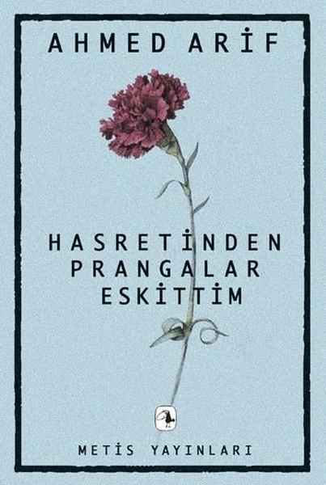

  
# Hasretinden Prangalar Eskittim - Ahmed Arif
## 184 Sayfa
### 12.07.2021
  
 

  

    
     

 
 

> ***(Tanıtım Bülteninden)***

**Hasretinden Prangalar Eskittim, ilk kez 1968 yılında yayımlandı. O tarihten günümüze defalarca baskı yaptı. Birbirini takip eden birkaç kuşak sosyalist ve devrimcinin ellerinde, sözlerinde ve şarkılarındaydı. Birçok kişinin acı tatlı hatıralarında unutulmaz, özel bir yeri oldu.** 

**Ahmed Arif şiirleri bizce, hem şairin kendi kuşağının hem de ardından 68-78 kuşaklarının memleket ve halk sevgisini, isyancı ruhunu ve başkaldırı etiğini simgeliyor. Kitabın bu 40. yıl özel basımıyla Ahmed Arif'in dizeleriyle, eski kuşaklara bir kırmızı karanfil vermek istedik. Daha da önemlisi, gözlerden silinmeye çalışıldıkları bu çağda, bu fikirleri ve değerleri genç okurlara taşımak, hatırlatmak istedik.**
_____

***"Ölüm bu,  
Fıkara ölümü  
Geldim, geliyorum demez.  
Ya bir kuşluk vakti, ya akşam üstü,  
Ya da seher, mahmurlukta,  
Bakarsın, olmuş olacak.  
Bir hastan vardı umutsuz,  
Hasreti uykularda,  
Hasreti soğuk sularda.  
Gayrı, iki korku çiçeğidir gözleri,  
İki mavi, kocaman korku çiçeği,  
Açar derin kuyularda..." (s.51)***

____

> ***HASRETİNDEN PRANGALAR ESKİTTİM***

***Seni, anlatabilmek seni.  
İyi çocuklara, kahramanlara.  
Seni, anlatabilmek seni,  
Namussuza, haldan bilmez,  
Kahpe yalana.***

***Ard - arda kaç zemheri,  
Kurt uyur, kuş uyur, zindan uyurdu.  
Dışarda gürül - gürül akan bir dünya...  
Bir ben uyumadım,  
Kaç leylım bahar,  
Hasretinden prangalar eskittim.  
Saçlarına kan gülleri takayım,  
Bir o yana, bir bu yana...***

***Seni bağırabilsem seni,  
Dipsiz kuyulara,  
Akan yıldıza,  
Bir kibrit çöpüne varana,  
Okyanusun en ıssız dalgasına  
Düşmüş bir kibrit çöpüne.***

***Yitirmiş tılsımını ilk sevmelerin,  
Yitirmiş öpücükleri,  
Payı yok, apansız inen akşamdan,  
Bir kadeh, bir cıgara, dalıp gidene,  
Seni, anlatabilsem seni...  
Yokluğun, Cehennemin öbür adıdır  
Üşüyorum, kapama gözlerini..." (s.91)***

 

### Kitaptan Alıntılar ;
- ***"Ve hep olmayacak şeyler kurarım,   Gülünç, acemi, çocuksu..." (sf.36)***
- ***"Ve dışarda delikanlı bir bahar,  
Seviyorum seni,  
Çıldırasıya..." (s.38)***
- ***"Bilmezler nasıl aradık birbirimizi,  
Bilmezler nasıl sevdik,  
İki yitik hasret,  
İki parça can." (s.41)***
- ***"Gitmek,   Gözlerinde gitmek sürgüne.   Yatmak,   Gözlerinde yatmak zindanı.   Gözlerin hani?" (s.58)***
- ***"İçmek,   Gözlerinde içmek ayışığını.   Varmak,   Gözlerinde varmak can tılsımına.   Gözlerin hani?" (s.59)***
- ***"Sevdan ölünecek kadar güzel" (s.165)***
- ***"Vurun ulan,   Vurun,   Ben kolay ölmem." (s.169)***
- ***"Kalmışım bir başıma,  
Bir başıma ve uzak.  
Biliyor musun?"***
- ***"Dağlarının, dağlarının ardı nasıl anlatsam..   
Ağaçsız, kuşsuz, gölgesiz. Çırılçıplak.."***
