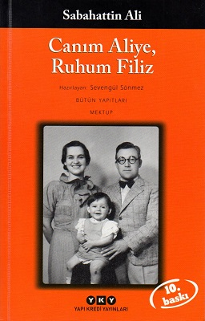

  
# Canım Aliye, Ruhum Filiz - Sabahattin Ali
## 160 Sayfa
### 14.07.2021
  
 

  

    
     

 
 

***Karakterler;***
- ***Sabahattin Ali:***
- ***Aliye Ali:*** Sabahattin Ali'nin sevgili eşi.
- ***Filiz:*** Sabahattin Ali'nin sevgili kızı.

 

> ***(Tanıtım Bülteninden - Yapı Kredi Yayınları)***

***Büyük sıkıntıların yaşandığı çalkantılı dönemlerde bile ailesinin sorumluluğunu taşıyan bir yazarın eş ve baba olarak portresini çizen bu mektuplar, Sabahattin Ali'yi yakından tanımamızı sağlıyor.*** 

***"Bundan sonra hiç kimse sana benim kadar yakın olmayacak. Beraber Almanca öğreneceğiz, ben İngilizce öğrenmek istiyorum, beraber İngilizce dersi alacağız, ben kitaplar tercüme edeceğim, bunları beraber okuyacağız, neşeli ve kederli olacağız, ne olursa olsun, bütün bunlar hep beraber, hep ikimizin iştirakiyle olacak ve başka hiç kimse karışmayacak."*** 

***Tarihsiz bir mektuptan...***

***"Sen nasılsın? Keyfin yolunda mı? Sevgilim, Filiz'im nasıl? Onun bir fotoğrafçıda, hiç olmazsa vesikalık bir resmini çıkartıp gönder. Kendinin de bir resmini yolla. İkinizi de fevkalade göreceğim geldi."***
***-24. VIII. 1944 tarihli mektuptan-***
_____

Sabahattin Ali'nin askerlik yıllarından itibaren o zamanlar nişanlı olduğu sevgilisi Aliye ile arasında geçen mektuplaşmaları içeren bu eser gerçekten çok değerli. İlk başlarda askerlik zamanlarında nişanlı olan bu çift sonrasında evleniyorlar ve Filiz isminde çocukları oluyor.. Sabahattin Ali'nin Aliye ve Filiz ile arasında geçen mektuplaşmalar, zaman zaman rahat durumda olsalarda sonlarına doğru çok büyük sıkıntı çektikleri ortada. Sonlara doğru Sabahattin Ali yazdığı yazılar sebebiyle hapishanede yatmaya mahkum edilmiştir.

> **Bu eserde, yazarın hayatını, hayat mücadelesinde karşısına çıkan zorlukları, maddi sıkıntılarını, gazete çıkarma deneyimlerini, hapishane yıllarına dair duygu ve düşüncelerini görüyoruz.**

***Sabahattin Ali, 1948'de bir yazısı yüzünden tutuklandı, üç ay kadar hapis yattı. Sürekli izlendiği için yurdışına kaçmak istedi, ancak Kırklareli dolaylarında öldürüldü...***

> Sabahattin Ali, "Sırça Köşk" hikaye kitabını 1947 yılında hapishaneye girmeden kısa bir süre önce yayınlamıştır.

 

### Kitaptan Alıntılar ;
- ***"Şunu esas olarak kabul etmeliyiz ki insanların hemen ekserisi yalnız kendilerini düşünürler. Dünyadaki bütün felaketlerin, uygunsuzlukların, bayağılıkların sebebi işte bu her şeyden evvel kendini düşünmek illetidir." (s.11)***
- ***"Çünkü dünyada bir insanın başka bir insanın yardım ve alakasına muhtaç olmadan yaşaması mümkün olamayağına, hatta en kötü hayvanlarda bile biribirlerine yardım hissi mevcut bulunduğuna göre, sadece kendini düşünmek ve başkalarının da böyle yapmasını istemek kendi kendisinin kuyusunu kazmaktır." (s.11)***
- ***"İnsan başkalarına yardım ettiği, başkalarını sevdiği kadar yükselir. Dünyada hayatın tek bir manası varsa o da sevmektir." (s.11)***
- ***"Hayatta en büyük vazife ve saadet olarak şunu almak lazımdır: bize yakın ve uzak bütün insanlara yardım etmek, bütün insanların iyiliğine çalışmak..." (s.11)***
- ***`"Yalnız senin için yaşamak, hayatımda senden başka her şeyi silip atmak istiyorum. Fikirlerimi, gayeleri seninle paylaşmak, doğru bulduğumuz şeylere beraber inanmak istiyorum." (s.17)`***
- ***`"Etrafın seni sıktığı zaman kitap oku... Ben şimdiye kadar her şeyden çok kitaplarmı severdim. Bundan sonra her şeyden çok seni seveceğim ve kitapları beraber seveceğiz." (s.17)`***
- ***`"Bana en felaketli günlerimde kitaplarım arkadaş olmuştu. Fakat bu yetmiyor. Şiirlerimde de gördün ki kitaplara rağmen çok ıstırap çektim. Çünkü candan bir insanım yoktu. Sen benim yarım kalan tarafımı ikmal edeceksin." (s.18)`***
- ***`"Küçük resim öyle gözümü yumup bakacak gibi fena değildi. Sen en fena resimde bile güzelsin Aliye. Sen her zaman herkesten güzelsin." (s.21)`***
- ***"Doğrusu, dünyada rahat yaşamak için aptal olmak lazım. Fakat aptal olmaktansa biraz daha rahatsız yaşamak daha iyidir bence..." (s.21)***
- ***"Bu gibi işler beni hiç üzmez: Çünkü sana ait işlerdir. Bu can sıkıcı kırtasiyeciliğin bizi birleştirmek için olduğunu düşündükçe can sıkıntısı filan kalmıyor. Sana ait olan her şey gibi bu da bana güzel geliyor." (s.23)***
- ***`"Ben son zamanlarda her şeyden ümidimi kesmiş, kendimi gülen, oynayan hayattan ayırarak birkaç türlü kitabın arasına atmış bulunuyordum. Sen bu karanlık ömrümün içine bir sevinç ışığı gibi, kurumaya yüz tutan ekinlere can veren bir nisan yağmuru gibi birdenbire geldin." (s.25)`***
- ***"Senden ayrı, senden uzak bulunurken benden nasıl neşeli şeyler istiyorsun?" (s.25)***
- ***Sonra öyle "Ben resimdeki gibi güzel değilim" diye yazma. Sen benim için her halinle güzelsin. Seni her halinle seveceğimden bir an bile şüphe etmeni istemem." (s.27)***
- ***"Yaşımın yirmi sekiz olması bir şey ifade etmez, dertli seneler beni belki kırk yaşına gelmiş kadar ihtiyarlattılar. Senin cildin iyi kremler kullanarak güzelleşir, fakat benim kayıp olan senelerimin geri gelmesine imkân yok. (s.27)***
- ***`"İnsan alıştığı, güzel bulduğu, kendine yakın bulduğu yerleden ayrılırken sanki vücudunun bir kısmını orada bırakıyormuş gibi üzülür." (s.29)`***
- ***"Gözlerimi kapadığım zaman senin hayalini görüyorum diyorsun..." diyorsun.   Ah Aliye, ben gözlerim açıkken bile hep seni görüyorum. (s.35)***
- ***"Sana Almanca öğretmek benim de emelimdir. Müşterek bildiğimiz bir lisanda kitaplar okumayı ne kadar isterdim." (s.37)*** 
- ***`"Ben dünyada bu kadar güzel gülen, güldüğü zaman bu kadar güzel olan insan görmedim." (s.39)`***
- ***"İnsanların hepsi hayatı karın doyurmak ve lalettayin biriyle yatmaktan ibaret farz ederler. Halbuki bu takdirde insanın diğer hayvanlardan ne farkı vardır, onların dimağları da karınlarını doyurmak ve kendilerine eş bulmak hususunda kâfi derecede hizmet görüyor, ancak bunları düşünmek, onlardan hiç ayrı olmamak demektir." (s.49)***
- ***`"Etrafa kırıldığım zaman beni sen teselli edeceksin, işte o zaman ben her şeyi unutarak senin boynuna sarılacağım." (s.53)`***
- ***"Miyop gözlerinden hasretle öperim sevgili kızım." (s.105)***