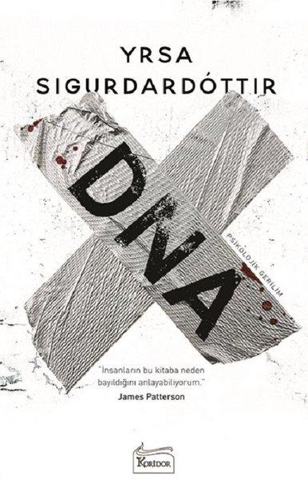

  
# DNA - Yrsa Sigurdardottir
## 486 Sayfa
### 22.07.2021
  
 

  

    
     

 
 

***Karakterler;***
- ***Elisa:*** İlk öldürülen kadın, Sigvaldi'nin karısı.
- ***Sigvaldi:*** Doktor, Elisa'nın kocası.
- ***Margret:*** Elisa ve Sigvaldi'nin 7 yaşındaki kız çocukları. 
- ***Stefan | Bardur:*** Elisa ve Sigvaldi'nin oğlan çocukları. 
- ***Karl:*** Arnar'ın üvey kardeşi | Evlatlık edinilmiş.
- ***Arnar:*** Karl'ın üvey kardeşi | Evlatlık edinilmiş.
- ***Astros:*** Öldürülen ikinci maktül, kadın.
- ***Huldar:*** Soruşturmayı sürdüren dedektif.
- ***Freyja:*** Sosyal hizmetlerden bir kadın.
- ***Rikhardur:*** Huldar'ın yardımcısı, polis.
- ***Halli:*** Öldürülen üçüncü maktül, erkek | Karl'ın arkadaşı.

 

Kitap biraz uzun olmuş. Bunca betimlemeye gerek olmayabilirdi, bazı noktalarda sıkıcı olabiliyor. Kitabı okumadan önceki yorumlara baktığımda, kitabının sonundan büyük bir övgüyle bahsediyorlardı ama ben hiçbir şekilde sonundan etkilenmedim. Sonunun böyle olmasını olumsuz anlamda beklemiyordum, çok daha büyük beklentilerim vardı... Açıkçası kitabın sonu beni tatmin etmedi.

> ***(Tanıtım Bülteninden - Koridor Yayıncılık)***

**Monoton bir hayat süren otuzlu yaşlardaki Elísa bir gün kendi evinde akıl almaz bir biçimde öldürülür ve olayın tek tanığı o geceden sonra hiç konuşmayan yedi yaşındaki kızıdır. Çok geçmeden aynı yöntemle işlenen bir başka cinayeti soruşturan Dedektif Huldar’a göre katilin zihnini çözebilecek ve arkasında neden şifreli mesajlar, anlamsız sayılar ve olasılık hesapları bıraktığını söyleyebilecek tek kişi bu kızdır.**

**Huldar ve ona yardım eden travma uzmanı psikolog Freyja, küçük bir kızın karanlık hikayesindeki bilinmeyenleri araştırırken şehrin diğer ucunda amatör bir radyo programcısı ölümcül bir paranoyayla karşı karşıyadır: Aldığı gizemli mesajlar onu korkunç bir caninin peşinde av mı yapacaktır avcı mı?**

_____

Her şey Elisa ismindeki kadının öldürülmesiyle başlıyor. Katilin ise öldürme yöntemi çok değişik... Kurbanlarının ellerini ve ayaklarını bağlıyor. Sonrasında ise tüm yüzünü koli bandı ile güzelce bantlıyor. En sonunda ise elektrik süpürgesini kurbanlarının ağzına sokuyor ve makinayı çalıştırıyor.

Elisa yatak odasında öldürülürken, küçük kızı Margret yatağın altındaydı. Bu yüzden olaylar bittikten sonra polis gelip kızı yine yatağın altında  buluyor. Bu yüzden Margret, bu olayı aydınlatmaktaki en büyük tanık olarak defalarca sorgulanıyor...

Aynı katil ilk önce Astros ismindeki emekli biyoloji öğretmenini aynı yöntem ile öldürüyor. Sonrasında ise katilimiz, son olarak Karl'ın arkadaşı Halli'yi öldürüyor ve cesedi ise Huldar'ın evinin oraya bırakıyor. Aynı zamanda tüm cinayetlerden birkaç tane delili Karl'ın evine ve arabasına bırakıyor. Yani katilimiz tüm suçları Karl'ın üzerine yıkmayı çalışıyor.

Tüm bunların ardından polis Karl'ı tutukluyor.  
**Karl Petursson, sizi Elisa Bjarnadottir ve Astros Einarsdottir cinayetlerine dahil olma şüphesiyle tutukluyoruz.**

Kitabın sonunda ise katil, Huldar'ın çalışma arkadaşı Rikhardur çıkıyor. Tüm bu cinayetlerin sebesi ise şu şekilde, ilk olarak Elisa'nın kocası; Rikhardur'un bebeğini karısının isteği ile aldığı için onu suçlu görüyor. Katil bu sebeple Elisa'nın kocasını cezalandırmak için Elisa'yı öldürüyor.   İkinci olarak Astros ismindeki biyoloji öğretmenini öldürme sebebi ise yanlış olasılık hesabı yapmış olması.. Rikhardur ve karısı, çok uzun zaman önce ayrılan iki öz kardeşmiş, bu sebeple çocukları sakat ve engelli doğacakmış. Bu yüzden Astros, Rikhardur'un karısına bu işten vazgeçmesi gerektiğini ve çocuğun belli bir olasılıkta engelli olacağını söylediği için katil bu yüzden Astrosu öldürüyor.   Son öldürülen Halli ise, Karl'ın arkadaşı olduğu için...

***"Çocuklarla ilgili kayıtlar sistemden değiştirilecek ve korkunç geçmişleri zamanla unutulup gidecek. Geçmişlerini bilmemeleri onlar için en iyisi ve birbirlerinden ayrılmaları da unutmalarını kolaylaştıracak. Yeni hayatlarına ne kadar erken başlarlarsa herkes için o kadar iyi olur." (s.13)***

_____

**Sonuç olarak bu olay örgüsünün bu şekilde bağlanılarak bitmesi, açıkçası beni hiç tatmin etmedi...**

 

### Kitaptan Alıntılar ;
- ***"Keşke zaman, olayların izlerini çocukların zihinlerinden silecek kadar merhametli olabilseydi." (s.11)***
- ***"Ona ne diyebilirdi ki? Seneler boyunca tam aksi davranışlar sergiledikten sonra birine onu gerçekten sevdiğini anlatmak için hangi kelimeler yeterli gelirdi?" (s.47)***
- ***"Tek bir olayın insanın hayatını mahvedebilmesi, onu dönüşü olmayan bir yola girmeye zorlayabilmesi ne tuhaftı!" (s.48)***
- ***"...belli ki bilgi almak için evden bir anda fırlamak önce çok iyi bir fikir gibi gelmişti ama aceleyle verilen kararların çoğunda olduğu gibi uygulamaya geçtiğinde o kadar da mantıklı olmadığını fark etmişti." (s.109)***
- ***"Keşke istenmeyen anıları da eski bilgisayar dosyaları gibi silmek mümkün olsaydı." (s.118)***
- ***"Genellikle önemli bilgiler, o anda önemliymiş gibi  görünmeyen olayların ardında gizlenmiş olabilir." (s.163)***
- ***"Tanrım! Hayır. Evet. Bilmiyorum. Artık neyi bilip neyi bilmediğimden emin olamıyorum, kafam çok karışık." (s.168)***
- ***"Eğer onu terk edecek olursa hiç kimsesi kalmazdı. Tek bir kişi bile." (s.177)***
- ***"Sen hiç dışarı da mı çıkmıyorsun? Evde boş boş oturarak kimseyle tanışamazsın." (s.215)*** 
- ***"Bazen en iyisi mümkün olduğunca az şey bilmekti." (s.239)***
- ***"Hayatta en çok arzulanan şeyler her zaman beklenildiği gibi çıkmaz." (s.247)***
- ***"İçimde kötü şeyler hissediyorum. Kafamın içinde. Sanki her şey kırılıp parçalanmış gibi."   "Başın mı ağrıyor?"   "Baş ağrısı gibi bir şey değil. Sanki bir yerimi incitmişim gibi ama bu yer kafamın içinde olduğu için yara bandı yapıştırmak mümkün değil." (s.274)***
- ***"Daha fazla gözyaşı dökmesinin bir anlamı yoktu. Gidecek bir yerleri yoktu ve ağlamak gözlerini acıtmaktan başka bir işe yaramıyordu." (s.367)***
- ***"Tek sorun artık neyin önemli neyin önemsiz olduğunu ayırt edebilecek durumda olmamasıydı." (s.423)***
- ***"Hiç kimsesi yoktu. Hayatta yapayalnızdı." (s.431)***
- ***"Artık  dünya üzerinde onu ziyarete gelecek hiç kimse kalmamıştı. Tek bir kişi bile." (s.478)***
