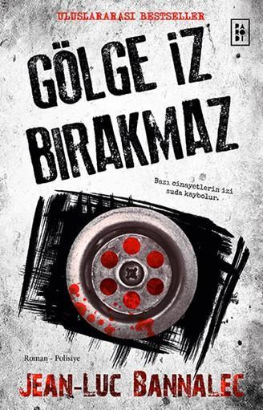

  
# Gölge İz Bırakmaz - Jean-Luc Bannalec
## 344 Sayfa
### 26.07.2021
  
 

  

    
     

 
 

***Karakterler;***
- ***Pierre-Louis Pennec:*** Öldürülen otel sahibi, 91 yaşında.
- ***Andre Pennec:*** Pierre-Louis Pennec'in üvey kardeşi.
- ***Komiser Georges Dupin:*** Soruşturmayı yürüten, Concarneau Emniyet Müdürlüğünde görev yapıyor.
- ***Labat:*** Yardımcı komiser.
- ***Madam Lajoux:*** Cesedi bulan ve otel'de yetkili bir isim. 
- ***Loic Pennec:*** Pierre-Louis Pennec'in öz oğlu.
- ***Catherina Pennec:*** Loic'in karısı.
- ***Delon:*** Pierre-Louis Pennec'in çocukluktan beri dostu.
- ***Madam Denis:*** Noter, Pierre-Louis Pennec'in vasiyetnamesini hazırlayan kadın.
- ***Frederic Beauvois:*** Pierre-Louis Pennec'in yıllardır sanat konusunda fikrini aldığı adam.
- ***Maria Morgane Cassel:*** Sanat tarihçisi
- ***Charles Saure:*** Koleksiyon yöneticisi, Pierre-Louis Pennec ölmeden önce onunla görüşmüş.
___

- **Tablo: Gauguin - Vaazdan Sonraki Hayal**
- **Yer: Concarneau**
- **Yer: Pont-Aven**
- **Yer: Port Manech**
- **Yer: Le Pouldu**

 

> ***(Tanıtım Bülteninden - Parodi Yayınları)***

**En yakınınızı kırk milyon avro için incitir misiniz?
Elinizdeki kitabı okuyan bir milyondan fazla kişi de 
aynı soruyu soruyor kendine.**

**Fransızların büyülü kasabası Pont-Aven'e sürgün edilmiş 
asi Komiser Georges Dupin, kahvesini yudumlarken şaşırtıcı bir cinayet 
haberi alır. Olayı araştırdıkça hem maktulün ailesini hem de tüm dünyayı şaşırtacak bir sırrı ortaya çıkartır.  
Üstelik bir cinayet daha işlenecek; aynı aileden bir kişi daha 
bu gizem yüzünden hayatını kaybedecektir.**

**Fransa'nın muhteşem doğası, yabancıları şaşırtan gelenekleri, 
benzersiz bir aile sırrı ve Komiser Dupin'in alışılmışın 
dışındaki teknikleri...**

**Okuyucular bu yetenekli yazarın 
diğer kitaplarını dört gözle bekleyecekler.     | Publishers Weekly**

**Kesinlikle beklemediğiniz bir sonla karşılaşacaksınız. 
Son sayfasına kadar nefesinizi tutarak okuyacaksınız.    |  That is the day**

**Bannalec, okuru büyüleyici bir kültürle tanıştırıyor.   |  Booklist**

____

> ***Birinci Gün***

Hikayemiz, **Pont-Aven'de, Central otelinin sahibi Pierre-Louis Pennec, birkaç dakika önce restaurantta ölü bulundu. (s.13)** bu şekilde başlıyor.   91 yaşındaki bir otel sahibi ansızın otelinde öldürülüyor. Bu cinayet vakası ile Komiser Georges Dupin ilgileniyor. Dupin ve ekibi, başta oteldekiler olmak üzere; öldürelen adamın oğlu ve gelini, öldürelen adamın en yakın arkadaşıyla konuşuyor ama herhangi bir şey elde edemiyor.   Doktor Pelliet'in Dupin'e o adamın ciddi rahatsızlığı olduğu ve neredeyse yakın zamanda öleceğini söylüyor. Tesadüf bir şekilde ise bu cinayet işleniyor ve adam ecelinden önce ölmüş oluyor.

____

> ***İkinci Gün***

Dün geceden olay yeri kilitli olduğu için, camı kırarak olay yerine birisi girmiş. Ardında herhangi bir ipucu bırakmamış. Fakat bu yapılan şeyin sebebini ise hiçbir şekilde anlayamıyorlar...

Dupin, bugün ise notere giderek, Pierre-Louis Pennec'in vasiyetini nasıl hazırladığını öğreniyor. Pierre-Louis Pennec vasiyetini, en yakınları olan Madam Lajoux ve Delon'a birer tane çok değerli ev bırakıyor ve bunun yanında ise hayır kurumunda bir şeyler bırakıyor. Yani 5 şeyden 3'ünü başkalarına bırakıyor. Kendi öz oğluna ise oteli ve bir miktar da değerli şeyler bırakıyor... 

Dupin aynı şekilde Beauvois ismindeki adamla da konuşup, Pierre-Louis Pennec hakkında bilgi edinmeye çalışıyor. Bu adam Pierre-Louis Pennec'la iş yapan birisi ve havalandırma sisteminden, binanın tadilatından ve Pierre-Louis Pennec'un yaptığı yüksek meblağdaki bağışlarından bahsediyor.

Tüm bunların üzerine Duplin bir şeylerden şüpheleniyor. Tekrardan restaurant'a geliyor yani olay yerine ve tek başına içeriyi  güzelce inceliyor. Bunun ardından ise bir tane alanında uzman olan sanat tarihçisi getirilmesini istiyor. Birkaç saat içerisinde bu sanat tarihçisi olan Madam Maria Morgane Cassel olay yerine geliyor..

Cassel ve Duplin olanları tartışıyorlar. Bu restaurantta olması gerekenden fazla gelişmiş bir havalandırma kullanıldığını fark ediyorlar, havayı ve nemi iyi ayarlayabilmek için... Bunun sebebinin ise restauranttaki tabloların arasında yıllar öncesine ait  Orijinal Gauguin Tablosu olabileceği ihtimali üzerinde duruyorlar ve eğer böyle bir şey varsa bu tablonun değeri 40 milyon avro... İşte cinayetin işleniş sebebi de bu olabilir...

_____

> ***Üçüncü Gün***

Bu güne ise Pierre-Louis Pennec'in oğlu Loic Pennec'in ölmesiyle başlıyoruz. Loic Pennec, deniz kenarında kayalıklardan düşerek veya itilerek öldürülmüş. Olay yerinde herhangi bir ize rastlanmadı. 

Bunun ardından Dupin, Pierre-Louis Pennec'in ölmeden önce koleksiyon yöneticisine gittiğini öğreniyor. Bunun üzerine Dupin koleksiyon yöneticisi olan bu adam, Charles Saure, ile konuşmaya gidiyor.. Bu konuşmanın sonucunda oradaki Gaugin tablosunun gerçek olduğu sonucunu çıkarıyorlar. Pierre-Louis Pennec ölmeden önce 40 milyon avroluk bu aile yadigarı tabloyu müzeye bağışlamaya karar vermiş ve bunun içinde Saure ile görüşmek istemiş. Saure, otele gidip Pierre-Louis Pennec ile görüşmüş ve o esnada tablonun orijinalini duvarda incelemiş.. Bunun sonucunda bu tablonun orijinal Gauguin tablosu olduğu kesinleşiyor..

Dupin sonrasında otele dönüp madem Lajoux ile konuşuyor, Lajoux ile Pierre-Louis Pennec arasında bir ilişki varmış, tüm bunları konuşuyorlar ama en sonunda Dupin tüm bunların aralarında kalacağını söylüyor ve kadın rahatlıyor... Bir de Dupin ikinci olarak Loic Pennec de öldükten sonra onun karısıyla konuşuyor. Az da olsa onun karısından bilgi topluyor..

Son olarak Cassel ile birlikte oteldeki tabloya inceliyorlar ve bu tablonun kopya olduğunu aynı zamanda kopyayı yapan kişinin ise Frederic Beauvois olduğunu fark ediyorlar.  Frederic Beauvois imzasını bu kopya tabloya atmış. Bunun ardından Dupin, Frederic Beauvois'i ziyarete gidiyor ve aynı zamanda Frederic'i suçluyor. Ama Frederic Beauvois, onları bodrum kata indiriyor ve tablonun bir kopyası daha olduğunu gösteriyor. Bu kopya ise bir başkasına aitmiş... Cinayetin işlendiği gece olay yerine gizli bir şekilde girip tabloları değiştiren ise Frederic Beauvois'miş. Bunun sebebi ise Pierre-Louis Pennec'in tablonun oğluna kalmak istememesiymiş. Çünkü oğlu hemen bu tabloyu satarmış. Tabi bunun sonucunda Frederic Beauvois, tabloyu değiştirmek için girdiğinde zaten bir başka kopya ile karşılaşmış...

Bunun sonucunda muhtemelen katil cinayeti işledikten sonra orijinal tabloyu kendindeki kopya tablo ile değiştirmiş...

____

> ***Dördüncü Gün***

Dupin bu sabah ormanda tek başına yürüyüş yaparken, dün gece kafasını karıştırmış olan düşüncenin ne olduğunu anlamaya çalışıyordu. Bir anda o detayın ne olduğunu fark etti. Dupin hemen noteri aradı ve Pierre-Louis Pennec'in sahip olduğu, aileden başka kimsenin bilmediği depoların adreslerini istedi.   İki yer vardı Dupin ilk önce Port Manech'e gitti buradaki depoyu kontrol etti ama burası boştu. Sonrasında ise Le Pouldu'daki diğer depoya gitti. Dupin'in yanında yardımcısı ve Cassel vardı. Buradaki depo ağzına kadar doluydu ve içeride bir sürü eşya vardı. Dupel en sonunda tam oradan çıkarken köşede bir şeyin olduğunu fark etti ve o şeyi oradan alıp çıkardı. İşte tablonun orijinali buradaydı. 40 milyon avro değerindeki tablo ellerindeydi. 

Dupin tabloyla birlikte diğerlerini gönderdikten sonra ise tek başına katilin gelmesini beklemeye başladı. Uzun bir sürenin ardından buraya Andre Pennec geldi. Bunun üzerine Andre Pennec'i tutukladılar. Tüm bunlardan sonra artık olay çözülmüştü.

Pierre-Louis Pennec'in yıllardır kendi öz oğlunu küçük düşürmesi ve onu her zaman aşağılaması Loic Pennec'in sabrını taşırmıştı. Pierre-Louis Pennec'i öldüren kişi kendi öz oğlu Loic Pennec'ti... Loic Pennec'in ölümünün ardında da yine karısı Catherina vardı... Catherina tabloyu satması için Andre Pennec ile anlaşmıştı...
Tüm bu olanların bir diğer suçlusu ise Catherina Pennec'ti...

Bu şekilde olay aydınlanmış oldu...

> ***- SON -***

________

 

### Kitaptan Alıntılar ;
- ***"Une mer calme n'a jamais fait un bon marin."   "Sakin bir denizde usta bir denizci yetişmez."   | Breton Atasözü (s.5)***
- ***"Sebebi ne olursa olsun, o anda önemli olduğunu düşündüğün her şeyi not al!" (s.71)***
- ***"Dünyanın 'mühim' insanlarıyla ilgili sadece şu iki şeyin önemli olduğu kesindi: Para ve kişisel şöhret." (s.72)*** 
- ***"Madam Lajoux, polisiye romanlarda okuduğunuz şeyleri çok ciddiye almamalısın." (s.97)***
- ***"iki kişinin bildiğişey  sır değildir ve eninde sonunda bunu herkes öğrenir." (s.248)***
- ***"Eh... O hâlde, şey... Sanırım bir ara yine görüşürüz. Dünyanın öteki ucunda yaşayan biriyle iletişimi koparmak epey zordur." (s.337)***
