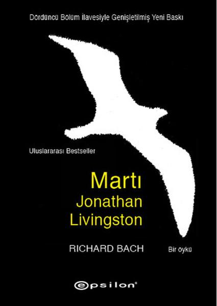

  
# Martı Jonathan Livingston - Richard Bach
##  147 Sayfa
### 27.07.2021
  
 

  

    
     

 
 

***Karakterler;***
- ***Martı Jonathan:*** Kahramanımız.
- ***Martı Chiang:*** Jonathan'a öğretmenlik yapan yaşlı martı.
- ***Martı Sully:*** Jonathan'ın dostu.
- ***Genç Martı Fletcher Lynd:*** Jonathan'ın ilk öğrencisi.

 

> ***Kitap Hakkında Yaptığım İnceleme***

1970'de yazılmış bir eser ama aynı zamanda hala günümüze büyük bir kararlılıkla ışık tutabilen adetâ bir baş yapıt...  
Bu eser her ne kadar bir hikaye şeklinde martı olarak anlatılsa da, aslında tam olarak bizi yansıtıyor... Aslında tam olarak kendimizi okuyoruz ve hissediyoruz... Ya da bilemiyorum, ben öyle olduğunu düşünüyorum...   
Martı Jonathan Livingston...  
Umarım hepimiz Martı Jonathan Livingston gibi olabiliriz...  

Martı Jonathan, ilk baştan itibaren hep yeni şeyler öğrenmeyi deneyen, araştıran ve vazgeçmeyen bir martıydı. Her zaman daha fazla şey öğrenmek isteyen ve her ne kadar yere düşse de her zaman ayağa kalkmasını bilen bir martıydı... Martı Jonathan diğerlerinden farklıydı. Martı Jonathan herkes gibi olmamayı seçti, hayatta daha önemli amaçları vardı. Diğer martıların amacı ise sadece yiyecek bir şey bulmak ve daha fazla yaşamaktı. 

Nereden geldiğimizi hemen unutup nereye gittiğimizi merak bile etmeden, günübirlik yaşayarak çoğu kez birbirinin aynısı olan şeyi yapıyoruz.  
Biz onlar gibi  olmamalıyız... Sıradan olmamalıyız...   
Diğerlerinden farklı olmanın elbette getirdiği bazı şeyler vardır. "Yalnız kalmak ve dışlanmak..."   
Olsun bu yola çıktığımızda yalnız olalım, yalnız ilerleyelim. Bırakalım bize bizim gibiler eşlik etsin. Etrafımızdakiler bizim kim olduğumuzu belirler...  
Vazgeçmemeli, kaç defa yere düşersek aynı şekilde ayağa kalkabilmeliyiz... Bu oyun biz kazanana kadar bitemez!  
Öğrendiğimiz şeylerin her zaman daha fazlasını öğrenmeli ve yeni şeyler denemeliyiz...   Hiçbir zaman olduğumuz yerde duramayız ve durmamalıyız...  
Hayat boşa zaman geçirmek için çok kısa! 

Bu üç şeyin cevabını çok iyi bilmeliyiz...  
-  Sen kimsin ve değerin nedir?  
-  Bu hayattaki amacın nedir?  
- Öldükten sonra ise geride bırakacağın şey nedir?    
Bu soruların cevabını bilmeden geçirdiğimiz her saniye boşa gidiyor demektir...   
Umarım bu soruların cevabını bulur ve hayallerimizin peşinden hiç yorulmadan koşabiliriz... Ta ki, hayallerimizi ulaşana kadar...

______

> ***(Tanıtım Bülteninden - Epsilon Yayınevi)***

**"Cehaletimizi kırabiliriz, becerilerimizi, yeteneklerimizi ve zekâmızı kullanarak kendimizi bulabilir, kendimiz olabiliriz. En önemlisi, özgür olabiliriz! Uçmayı öğrenebiliriz!"**
_____

> ***Birinci Bölüm (s.13)***

Martı Jonathan, ilk baştan itibaren hep yeni şeyler öğrenmeyi deneyen, araştıran ve vazgeçmeyen bir martıydı. Martı Jonathan diğerlerinden farklıydı. Martı Jonathan herkes gibi olmamayı seçti, hayatta daha önemli amaçları vardı. Diğer martıların amacı ise sadece yiyecek bir şey bulmak ve daha fazla yaşamaktı.

Martı Jonathan, onlar gibi olmayacaktı. Defalarca uçarken yüksek hıza nasıl ulaşabileceğini denedi. Gökyüzünde yüksek bir noktaya çıktı ve kendini aşağı bıraktı, her seferinde bir türlü başarılı olamıyordu ve yere çakılıyordu. Ama Martı Jonathan hiçbir zaman vazgeçmedi, yere düştü yeniden ayağa kalktı. Yere düştü ve yeniden ayağa kalktı. Bu böyle hep devam etti. Martı Jonathan hiçbir zaman vazgeçmedi ve en sonunda başardı. Artık saatte 240 mil hız ile uçabilmeyi öğrendi. Bunu yer yüzünde yapabilen başka bir martı yoktu..

Bir gün yine gururla uçarken tüm martıların toplantı yaptığını ve en sonunda Martı Jonathan'ı çağırdıklarını duydu... Martı Jonathan onların yanına adeta büyük bir sevinç ile gitmişti çünkü diğer martıların kendisini bu yaptığı şeyler sebebiyle tebrik edeceğini düşünüyordu ama umduğu gibi olmadı. Tüm martılar, Martı Jonathan'ı sürgüne gönderdiler, artık onların yanına bir daha gelmemesini söylediler ve arkalarına bile bakmadan oradan ayrıldılar. 

Martı Jonathan, yalnız kalmıştı. İşte diğerlerinden farklı olmanın sonucu buydu, yalnız kalmak!   Bu süre içerisinde Martı Jonathan, kendini çok fazla geliştirdi ve bir çok yeni şey öğrendi...

_____

> ***İkinci Bölüm (s.53)***

Bir önceki bölümün sonunda Martı Jonathan'ın yanına 2 tane yeni martı gelmişti ve onlarda Martı Jonathan gibi uçabiliyorlardı. Bu martılar Martı Jonathan'ı yeni bir yere götürmeyi ve çok daha fazla şey öğrenmeyi teklif ettiler. Martı Jonathan'da bunu seve seve kabul etti.

Martı Jonathan bu geldiği yeri adetâ cennete benzemişti. Dünyadan o kadar uzaktı ki...   Burada kendisi gibi uçabilen ve amaçları her zaman daha yeni keşfetmek, öğrenmek olan martılar vardı. Ama sayıları da bir o kadar azdı...

Martı Jonathan, buradayken martıların en yaşlısı ve en hızlı uçanı olan Martı Chiang ile tanıştı. Bu yaşlı martı Martı Jonathan'a bir sürü yeni şey öğretti. Martı Jonathan'da aynı zamanda tüm bunları çok kısa sürede öğrendi ve asla vazgeçmiyordu her zaman daha fazla şey öğrenmek istiyordu... En sonunda Martı Jonathan dünyaya dönmeye karar verdi ve dostu Sully ile vedalaştı..

_____

> ***Üçüncü Bölüm (s.87)***

Martı Jonathan tekrardan dünyaya döndükten sonra, ilk başta kendisinin terk edildiği, yanlız kaldığı kayalıklara gelmişti. Tam orada kendisi gibi yolun başında olan öğrenmeye aç ve diğerlerinden farklı olan bir martı vardı. Bu genç martı Fletcher'di. Fletcher'da, Martı Jonathan gibi sürüden dışlanmıştı... Bu yüzden Fletcher, Martı Jonathan'ın ilk öğrencisi oldu. Martı Jonathan' ona bir sürü şey öğretti. Bu süreçte ekiplerine öğrenmeye aç yedi farklı martı daha katılmıştı... Martı Jonathan, çoğu şeyi Fletcher'a öğretmişti. Tüm bunların ardından birbirlerinden ayrıldılar. Martı Jonathan, başka öğrenmeye ihtiyacı olan martılarında olabileceğini bu yüzden gittiğini söyledi. Artık Fletcher'da bir öğretmendi ve öğrenmeyi bekleyen diğer martılara öğretmenlik yapmaya başladı...

_____

> ***Dördüncü Bölüm (s.113)***

***Martı Fletcher Lynd ve Jonathan'ın diğer öğrencileri, öğretmenlerinin özgürlük ve uçma öğretilerini uzun misyoner yolculuklarla sahil boyunca uzanan bütün sürülere yayıyorlardı. (s.115)***

Ama bir süre sonra işler değişti, ilk başta tüm martılar uçmak ve yeni şeyler öğrenmek için hevesliydi ve öyle de oldu aslında. İlk başta bir sürü yeni öğrenci ve öğretmen yetiştirildi. Ama sonrasında bunlar bir bir ölmüşlerdi. Bir noktadan sonra Martı Jonathan'ı tanrılaştırmaya başladılar. Aynı şekilde Fletcher'i de o şekilde görüyorlardı. Tüm bunlar martıları asıl amaçlarından saptırdı.. Artık Martı Jonathan'ı tanrı olarak görüyorlar ve kendilerinin hiçbir şey yapamayacaklarını, onun gibi olamayacaklarını düşünüyorlardı...   Bir süre sonra Fletcher ölmüştü...

______

> ***Sonsöz (s.113)***

***O sırada dördüncü bölümü tekrar tekrar okudum. Bu asla gerçek olamazdı. Jonathan'ın cevaplarını takip eden martılar, uçmanın ruhunu ritüellerle öldürürler miydi?   O bölüm, bunun olabileceğini söylüyordu. Ben buna inanmadım. Üç bölüm hikâyeyi tamamen anlatıyor, diye düşündüm, dördüncü bir bölüme gerek yok: Çöl gibi bir gökyüzü ve neşeyi neredeyse boğacak tozlu sözcükler.   Bu bölümün basılmasına gerek yok.   Peki o zaman neden o bölümü yakmadım?    Bilmiyorum. Bir kenara kaldırdım, ben ona inanmasam da, kitabın son kısmı kendine inandı. Bu bölüm, benim reddettiğim şeyi biliyordu: Yöneticilerin ve ritüellerin gücü, yavaşça, çok yavaşça istediğimiz gibi yaşama özgürlüğümüzü öldürecekti. (s.146)***

***Tekrar o çocuğun dilini, kitabın son bölümünü düşündüm. Acaba biz, dünyamızdaki özgürlüğün bitişini izleyen martılar mıydık?   Nihayet ait olduğu yere basılmış olan Dördüncü Bölüm, belki de öyle olmadığını söylüyor. Bu bölüm, daha kimse geleceği bilmiyorken yazılmıştı. Şimdi ise geleceği biliyoruz. (s.147)***
 
____

 

### Kitaptan Alıntılar ;
- ***"Yaşamak için ne çok neden var!" (s.31)***
- ***"Cehaletimizi kırabiliriz, becerilerimizi, yeteneklerimizi ve zekâmızı kullanarak kendimizi bulabilir, kendimiz olabiliriz. En önemlisi, özgür olabiliriz! Uçmayı öğrenebiliriz!" (s.31)***
- ***"Fakat onurlandırılmak istemiyorum ben. Lider olmayı arzulamıyorum. Ben sadece öğrenmek istediğim şeyleri onlarla paylaşmak, ufkumuzun hiç de dar olmadığını göstermek istiyorum." (s.31)*** 
- ***"Bin yıldır yaptığımız tek şey balık peşinde koşmak. Artık yaşamak için bir nedenimiz olmalı; öğrenmek, keşfetmek, özgür olmak gibi. Bana bir şans verin, öğrendiklerimi size göstereyim." (s.39)***
- ***Martı Jonathan bezginliğin, korkunun ve öfkenin bir martının ömrünü kısalttığını, bunları zihninden uzaklaştırdığında ise hoş ve uzun bir yaşam sürebileceğini de fark etmişti." (s.40)***
- ***"Nereden geldiğimizi hemen unutup nereye gittiğimizi merak bile etmeden, günübirlik yaşayarak çoğu kez birbirinin aynısı olan şeyi yaptık; bir dünyadan gelip diğerine gittik." (s.58)***
- ***"Fakat hiçbir şey öğrenilmemişse, sonraki yaşam öncesinin aynısı olacaktır; aynı sınırlar ve kazanmak için yüklenilen aynı sıkıntılar..." (s.59)***
- ***"Çünkü rakamlar sınırları belirler; iyinin, mükemmelin sınırları yoktur. Mükemmel hıza ulaşmak oğlum, orada olmak demektir." (s.60)***
- ***"Tabii ki başardın Jon," dedi Chiang.   "Eğer ne yaptığını biliyorsan her zaman başarırsın. Başarmak için ne yaptığını bilmek gerek." (s.73)***
- ***Chiang, hepsiyle sükûnet içinde konuştu ve onlara öğrenmeyi, öğrendiklerini uygulamayı ve yaşamın gizli saklı kalmış tüm mükemmel ilkelerini anlama çabalarını hiçbir zaman bırakmamalarını tembih etti. (s.74)***
- ***"Jonathan," dedi "sevgiyi sakın ihmal etme."   Ve bunlar, onun son sözleri oldu. (s.74)***
- ***"En yüksekten uçan martı, en uzağı görendir." (s.76)***
- ***"Mantıklı ol lütfen! Onca zaman neyi öğrenmeye çalıştık?   Dostluğumuz zaman ve mekânla sınırlıysa, zamanı ve mekânı aştığımız an, kardeşliğimizin bitmesi gerekir." (s.76)*** 
- ***"Düşüncelerinizin zincirlerinden kurtulun, bedenlerinizin zincirlerini kırın..." (s.91)***
- ***"Fletcher'a, Lowell'a bak. Ya Charles-Rolland, Judy Lee?   Onlar da mı farklı, yetenekli ve mükemmel? Senden,  benden ne farkı var onların?   Onların tek farkı, gerçekten kim olduklarını anlamaya ve bunu bilerek yaşamaya başlamaları." (s.99)*** 
- ***"Bir kuşu özgür olduğuna ikna edebilmek niye dünyanın en zor işi?" (s.106)***
- ***"Seni öldürmeye kalkışan bir kuş sürüsünü hâlâ nasıl sevebildiğini hiç anlamıyorum."   "Of Fletch, tabii ki sevdiğim bu değil. Kin, nefret ve düşmanlığı sevmekten söz ediyorum ben. Gerçek martıları, onların her birinin içindeki güzellikleri görmeye çalışmalı, bunu onların da görmesine yardımcı olmalısın. Sevgiden kastettiğim şey bu benim. Bu işin sırrını çözdün mü, gerçekten sevebilirsin." (s.107)***
- ***"Hakkımda saçma sapan söylentiler çıkarmalarına ya da beni Tanrılaştırmalarına sakın izin verme, olur mu Fletch? Ben, belki de sadece uçmayı çok seven bir martıyım..." (s.108)***
- ***"Gözünle gördüklerine sakın inanma.   Görünenlerin hepsi sınırlıdır. Anlayarak bakmaya, bildiklerinin ötesine geçmeye çalış. O zaman uçmanın anlamını da daha iyi öğreneceksin." (s.108)***
