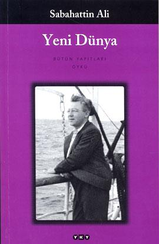

  
# Yeni Dünya - Sabahattin Ali
##  128 Sayfa
### 31.08.2021
  
 

  

    
     

 
 

> ***(Tanıtım Bülteninden - Yapı Kredi Yayınları)***

***1930’lu yıllarda öyküye taze bir soluk getiren Sabahattin Ali, hikâyelerinde insanın zavallılığını ve gücünü sarsılmaz bir üslupla, masalsı ve destansı biçimde yansıtmayı başardı. Şiir, hikâye ve roman yazan, çeviriler yapan Ali, tüm eserlerinde insan ruhuna ayna tuttu ve gerçeğe bu aynadan baktı. Türk edebiyatının büyük yazarından, içinde sinemaya da aktarılan Hasanboğuldu’nun olduğu 13 düşünen öykü...***
_____

> ***Asfalt Yol (s.7)***

Bir köy öğretmeni, bir tane köye öğretmenlik için gelmiştir. Bir süre sonra bu köyün kullandığın yolun gerçekten çok berbat olmasından dolayı çok büyük üzüntü duyar ve bu konuda kendine dert edinir. Bu yolu yaptırmak için o kadar çok uğraşır ki, nereye gittiyse fayda etmez. Ama bir süre sonra bu köye çok zengin bir adam lüks arabasıyla gelirken bu yoldan geçtiği için rahatsız olur. Bu zengin adam valiye bunu dile getirir. Öyle olunca valilik, sırf bu zengin adam yine gelecek diye yol çalışmalarına başlanır.. Güç bela, borç bularak bu yolu yaparlar. İlk başta tüm köy halkı mutludur, ama birkaç hafta içerisinde bu yolu kullandıkça yol çok kaliteli yapılmadığı için bozulmalar olur.. Böyle olunca da köylünün bu yolu kullanmasını yasaklarlar, artık köylü halkı dağın ardından eski yoldan daha kötü olan yoldan 6 saat daha fazla sürede dolanarak şehre gitmek zorunda kalırlar.. Tüm bunların sonunda ise tüm köy halkı bu öğretmenimizi suçlarlar ve ona düşman olurlar.. Öğretmen ise en sonunda köyü terk ederek ayrılmak zorunda kalır.

____

> ***Hanende Melek (s.15)***

____

> ***Çaydanlık (s.24)***

____

> ***Ayran (s.32)***

____

> ***Isıtmak İçin (s.40)***

Bir tane genç delikanlı vardı. Gündüzleri çalışmaya gidiyordu, her ne kadar ev sahibinin hareketlerini sevmese de evden bir türlü ayrılmak zor geliyordu... Bu delikanlının çamaşırlarını yıkayan bir tane teyze vardı. Yine bir gün delikanlı çamaşırlarını yıkatmıştı.. İki gün içerisinde delikanlı işten dönerken çamaşırcı kadın, kendi evinin kapısındaydı.. Çamaşırcı kadının evde hasta yatan 8-10 yaşlarında bir kızı vardı. Bu kış gününde ona bakabilmek için yine kapı kapı çamaşır yıkatacak var mı diye dolaşmıştı, ama kimse ona bir şey yaptırmamıştı. Delikanlı da çamaşırlarının olmadığını sert bir dille belirtmiş ve kadın oradan ayrılmıştı.. 

Bunun üzerine delikanlı kendini çok kötü hissetti. Delikanlı, ev sahibine çamaşırcının ertesi günü gelmesini ve kendisini görmeden gitmemesini söylemişti.. Ama aradan iki gün geçti çamaşırcı kadın gelmemişti... Bunun üzerine bu soğuk kış gününde delikanlı araya araya zorda olsa çamaşırcı kadının evini bulmuştu... Delikanlı kadının evine girdiğinde ise içerisi çok soğuktu, köşede paramparça yorganın içerisinde küçük kız yatıyordu... Kadıncağızın odun alacak parası olmadığı için günlerce, bir deri bir kemik kalmış olan kızını ısıtmak için birlikte yattıklarını ve kızına sıkı sıkı sarıldığını anlattı... En sonunda kız ölmüştü, kadın en sonunda rabbinin kızının acı çekmesine daha fazla izin vermediği için şükretti...

Delikanlı geri döneceğini söyleyerek evden ayrıldı. Koştu, koştu, koştu...
_____

> ***Uyku (s.50)***

____

> ***Selam (s.59)***

____

> ***Bir Mesleğin Başlangıcı (s.68)***

____

> ***Bir Konferans (s.75)***

____

> ***Yeni Dünya (s.79)***

____

> ***İki Kadın (s.93)***

____

> ***Sulfata (s.101)***

____

> ***Hasanboğuldu (s.110)***

______

> ***- SON -***

 

### Kitaptan Alıntılar ;

- ***"Bıraktığın işi yarıda bırakma iki gözüm sana yakışmaz!" (s.9)***
- ***"Düşünmesi ve tahayyül etmesi kendisine hoş gelecek hiçbir şey mevcut olmadığı için, bu boşluk ona bir dinlenme gibi geliyordu." (s.36)***
- ***"Sanki dünyada, beni işime götüren tozlu veya çamurlu yoldan, kerpiç duvarlardan ve ne söylediklerini yarım saat sonra bile hatırlamaya imkân olmayan birkaç iyi kalpli arkadaştan başka bir şey mevcut değildi..." (s.41-42)***
- ***"Kim olursan ol... Dünyada kendisi için hiçbir şeyi olmayan bir insanın bile başkalarına yardım edebilecek bir şeyi vardır... Hiç olmazsa bir tek sözü..." (s.45)***
- ***"Kaçmak, her zamanki gibi, her şeyden kaçmak... Görmekten, duymaktan ve beraber ıstırap çekmekten kaçmak." (s.47)***
- ***"İnsan hali işte böyle.   On beş günlük ömrü on beş seneye sığdıramazsın da, on beş senelik ömrü on beş günde yaşayıverirsin!" (s.66)***
- ***"İnsanın iyi günü de, kötü günü de geçer, elverir ki bugünlerden anacak bir şey kalsın!" (s.66)***
- ***"Az konuşmuşlar, çok bakışmışlar; ama ikisinde gönlü birbirini sevmiş." (s.117)***
- ***"İnsan nereye giderse rızkı da beraber gidermiş." (s.118)***
