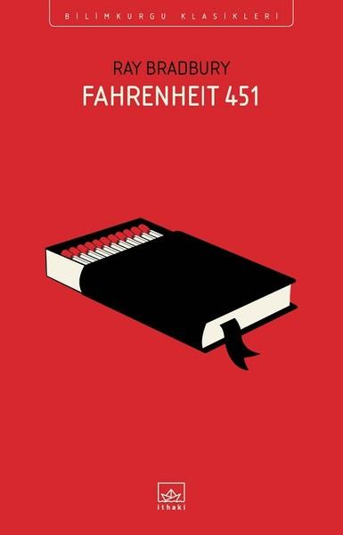

  
# Fahrenheit 451 - Ray Bradbury
##  208 Sayfa
### 04.08.2021
  
 

  

    
     

 
 

***Karakterler;***
- ***Guy Montag:*** Kahramanımız, aynı zamanda itfaiyeci. 
- ***Mildred:*** Montag'ın karısı.
- ***Clarisse McClellan:*** Montag'in komşusu, 17 yaşındaki kız.
- ***Beatty:*** Montag'ın patronu.
- ***Faber:*** Profesör, yaşlı adam.

 

 ***Fahrenheit 451:   Kitap kâğıdının tutuşup yanma sıcaklığı..."***
 
 

 Bir Dünya düşünün. Artık kitap okunmayan, bir şeylerden zevk alınmayan, ot gibi yaşanılan ve hiçbir şey düşünmeden hayata gözlerinizi kapattığınız. Fahrenheit 451, işte bize bunu anlatıyor. Yazar bu kitabı 1953 yılında geleceğin kâbus senaryosu olarak kaleme almıştır. Distopik bir kitaptır. Ray Bradbury, itfaiyecileri gelecekte farklı bir kalıbı sokmuştur. Evet, yine itfaiyecilerin işi ateşle alakalıdır. Fakat artık bu iş yangını söndürmek değil, yangın çıkartmak üzerine kuruludur. Yanan şey artık evler, arabalar ya da maddi şeyler değildir. Daha manevi olan, ruhumuzu besleyen ve tam olarak bu nedenden dolayı da yakılan kitaplardır.

 _____

> ***(Tanıtım Bülteninden - İthaki)***

**“Yazılmış en iyi bilimkurgu romanı. İlk okuduğumda, yarattığı dünyayla kâbuslar görmeme sebep olmuştu.” -Margaret Atwood**
 
**“Öyle bir eser ki, hakkında ne söylesem eksik kalır.” -Neil Gaiman**
 
**Hugo En İyi Roman Ödülü  
Prometheus Şeref Kürsüsü Ödülü**
 
**Ray Bradbury sadece bilimkurgunun değil fantastik edebiyatın ve korkunun da yirminci yüzyıldaki ustalarından biri. Bilimkurgunun “iyi edebiyat” da olabileceğini kanıtlayan belki de ilk yazar. Yayımlandığı anda klasikleşen, distopya edebiyatının dört temel kitabından biri olan Fahrenheit 451 ise bir yirminci yüzyıl başyapıtı.**
 
**Guy Montag bir itfaiyeciydi. Televizyonun hüküm sürdüğü bu dünyada kitaplar ise yok olmak üzereydi zira itfaiyeciler yangın söndürmek yerine ortalığı ateşe veriyordu. Montag’ın işi ise yasadışı olanların en tehlikelisini yakmaktı: Kitapları.**
 
**Montag yaptığı işi tek bir gün dahi sorgulamamıştı ve tüm gününü televizyonla kaplı odalarda geçiren eşi Mildred’la beraber yaşıyordu. Ancak yeni komşusu Clarisse’le tanışmasıyla tüm hayatı değişti. Kitapların değerini kavramaya başlayan Montag artık tüm bildiklerini sorgulayacaktı.**
 
**İnsanların uğruna canlarını feda etmeyi göze aldığı bu kitapların içinde ne vardı? Gerçeklerin farkına vardıktan sonra bu karanlık toplumda artık yaşanabilir miydi?**
 
**Fahrenheit 451, yeryüzünde tek bir kitap kalacak olsa, o kitap olmaya aday.**
 
**“Mutlu olmamız için gerekli her şeye sahibiz, ama mutlu değiliz. Bir şey eksik. Etrafa bakındım. Ortadan kaybolduğunu kesinlikle bildiğim tek şey, on-on iki yıldır yaktığım kitaplardı.”**
_____

> ***Birinci Bölüm - Şömine ve Semender (s.21)***

Montag, bir itfaiye görevlisidir. Bu itfaiyecilerin görevi günümüzden çok daha farklı olarak, yani yangın söndürmek değil de, tam aksine kitapları ve kitap bulunan evleri yakmaktır. Montag aynı şekilde, hiçbir şeyi gözü görmeyen, televizyonların ve dört duvarın arasında sıkışıp kalan biridir. Montag bir gün komşuları olan Clarisse McClellan ismindeki 17 yaşındaki kız ile tanışır. Montag, bu kız ile birlikte bir süre sohbet eder ve çok etkilenir. Clarisse diğer insanlara nazaran çok ilginç bir kız, hayatını dolu dolu yaşayan, kitapları seven ve aynı zamanda sorgulayan birisidir.   Montag, bunları görünce bir anda Clarisse'ye ilgi duymaya başlar. Aynı zamanda Montag de bazı şeyleri sorgulamaya ve kitaplara da ilgisi artmaya başlar. **İnsanlar kitapları neden yakıyorlardı, insanların birbiri ile sohbet etmesi neden yasaktı?**  

***Bir gün alarmlar çalar ve Montag ve itfaiyeciler bir tane kitap dolu evi yakmak için giderler. Oradaki yaşlı kadın evden ayrılmak istemez. Eğer madem kitaplarını yakıyorlardı, yaşlı kadın için artık yaşamanın bir önemi yoktu. İtfaiyeciler evi ateşe vermişti, Montag yaşlı kadını evden çıkartmak için çok çaba sarf etti ama ne yaptıysa başaramadı. Kadın kitaplarıyla birlikte ölmeyi seçmişti... Montag bunun ardından ise düşünmeye başladı, bir kadın kitaplar için ölebiliyorsa eğer bu kitaplarda bir şeyler olmalıydı...***

 Ama maalesef bir süre sonra Clarisse'den haber alamaz ve bu kızın öldüğü haberini alır. Montag artık kitapları yakmak değil onları okumak istemektedir.

_____

> ***İkinci Bölüm - Elek ve Kum (sf.91)***

Montag, uzun zamandır biriktirdiği kitapları sakladığı yerden çıkarmıştı. Bunun ardından Montag'in karısı ona karşı çıktı ve çok yanlış yaptıklarını anlatmaya başladı... Montag kitaplardan belli bölümleri okumaya başladı ama bir şey anlayamadı. Bunun üzerine Montag, İngiliz profesör Faber’e gider. Birlikte bir plan  yaparlar ve bunu uygulamaya koyarlar. Montag bir tane itfaiye görevlisinin evine kitap saklar ve onu ihbar ederler. Montag, bu görevlinin evinin yanışını izler ve  bu şekilde tüm şehri kazanabileceğini düşünür.   Bir gün yine alarmlar çalmaya başlar.  Montag ve itfaiyeciler bir evi yakmak için yola çıkarlar. Ama Montag'in evinin önünde dururlar. Montag, anlamıştır ki karısı kendisini ispiyonlamıştır.

__________

> ***Üçüncü Bölüm - Işıl Işıl Yanan (s.137)***

Beatty, Montag'in amiri ona emir verdi. Montag'ın kendi evini kendisinin yakmasını ve işi bittikten sonra kendisinin tutuklanacağını söyledi.. Montag evini yakmıştı. En sonunda dışarıda dururken hala alev silahı elindeydi. Montag bu silah ile Beatty'i ateşe verdi ve onun öyle çırpınarak ölmesini izledi. Montag ardından şu cümleleri söyledi: ***"Beatty, artık bir sorun değilsin, diye düşündü. Sorunlarla yüzleşmeyeceksin, onları yakacaksın, derdin hep. Eh, şimdi ikisini de yaptım. Elveda Yüzbaşı."***

Olay yerinden koşarak uzaklaşan Montag, acı içerisinde topallayarak ilerlemeye çalışır. Montag, bir süre sonra Faber'in evine varır. Birlikte olanları gözden geçirirler ve ardından Montag, Faber'in kirli kıyafetlerini yanına alarak kaçmak için yola çıkar. Kıyafetleri almasının sebebi ise, kendi kokusunu Tazı ismindeki makina köpeklerden saklamaktır. Montag, nehre girer ve akıntıyla birlikte nehirde uzun bir mesafede sürüklenir. Montag, En sonunda tren raylarının olduğu bir yerde kendisi gibi bir topluluk ile bir araya gelir. Bu topluluk Montag'ı arasına alırlar.   Tüm bu insanlar kitapları yakılan ve aynı zamanda bu kitapları akıllarında tutan insanlar.. Bu akıllarında tuttukları kitapları, geleceğe aktarmaya ve eğer uygun şartlar olursa ezberlediklerini yeniden kitaplara dönüştürmeyi amaçlıyorlar... Montag'de artık onlardan biridir. Üstelik en değerli kitap Montag'in hafızasındadır...

***- SON -***

______

***"Nasıl başladı? O işe nasıl girdin? Mesleğini nasıl seçtin ve bu işi yapmayı neden düşündün? Sen diğerleri gibi değilsin. Onlardan epey gördüm; biliyorum. Konuştuğumda bana bakıyorsun. Dün gece, aydan bahsettiğimde aya baktın. Diğerleri bunu asla yapmazdı. Diğerleri ben konuşurken çekip giderdi. Veya beni tehdit ederdi. Kimsenin kimseye ayıracak vakti yok artık. Sen bana katlanan çok az kişiden birisin. İtfaiyeci olmanı bu yüzden çok tuhaf buluyorum; sana uymuyor sanki." (s.43-44)***

____

***Granger, Montag'ın koluna girip onunla birlikte yürüdü ve geçmesi için çalılara yana çekerken, "Dinle," dedi.   "Ben çocukken dedem ölmüştü; kendisi heykeltraştı. Ayrıca dünyaya verecek bol bol sevgisi olan, çok iyi bir adamdı ve kasabamızın gecekondu mahallesinin temizlenmesine yardım ederdi; bizim için oyuncaklar yapardı ve hayatında milyonlarca şey yaptı; elleriyle bir şeyler yapardı hep. O öldüğünde, aslında onun için değil de yaptığı onca şey için ağladığımı fark ettim birden. Ağladım, çünkü onları bir daha asla yapmayacaktı; bir daha asla bir odun parçasını yontmayacak, arka bahçede kumru ve güvercin yetiştirmemize yardım etmeyecek, kendi tarzıyla keman çalmayacak ve bize fıkra anlatmayacaktı. O bizim parçamızdı ve öldüğünde bütün eylemleri bıçak gibi kesildi, o işleri tam onun gibi yapacak kimse yoku. O bir bireydi. Önemli bir adamdı. Ölümünün etkisinden hâlâ kurtulamadım. O öldüğü için kim bilir ne muhteşem oymalar asla yapılmadı, diye düşünürüm sık sık. Dünyada kim bilir kaç fıkra eksik ve dedemin elleri kim bilir kaç posta güvercinine dokunmadı. O dünyayı biçimlendirdi. Dünyaya bir şeyler yaptı. Onun öldüğü gece, dünya on milyon iyi eylemden mahrum bırakıldı." (s.183)***

____

 

### Kitaptan Alıntılar ;

- ***"Sahip olduğumuz şeylerin değerli olduğunu ve değer verdiğimiz şeylerin bazen kıymetini bilmediğimizi hatırlatır." (s.11)***
- ***"Neden kitaplardaki şeylere ihtiyacımız var? O şiirlere, denemelere, öykülere? Yazarlar bu konuda görüş birliğinde değildir. Yazarlar insandır, yanılabilir ve aptaldır. Sonuçta öyküler yalandır; asla var olmamış insanları ve asla başlarına gelmemiş şeyleri anlatırlar." (s.16)***
- ***"Fikirler -yazılı fikirler- özeldir. Öykülerimizi ve düşüncelerimizi nesilden nesile aktarmamızın yoludurlar. Onları yitirirsek ortak tarihimizi yitiririz. Bizi insan yapan şeyin çoğunu yitiririz." (s.16)***
- ***"Ayrıca kurgu empati kurmamızı sağlar: Bizi başka insanların zihnine sokar, dünyayı onların gözünden görme olanağı verir. Kurgu, doğru şeyleri bize anlatıp duran bir yalandır." (s.16)***
- ***"Yakmak bir zevkti.   Bir şeylerin yendiğini görmek, karardığını ve değiştirildiğini görmek özel bir zevkti." (s.23)***
- ***"Bu imkânsızdı; ne de olsa insan kendi ışığını ona yansıtan kaç kişi tanırdı ki?" (s.31)***
- ***"Kimsenin kimseye ayıracak vakti yok artık." (s.44)***
- ***"Neden seni yıllardır tanıyormuşum gibi hissediyorum?" (s.48)***
- ***"Ama tanıdığım herkes ya bağırıyor ya ortalıkta çılgınca dans ediyor ya da birbirini dövüyor. Bugünlerde insanların birbirini nasıl incittiğini fark ediyor musun?" (s.50)***
- ***"Çimenlik boştu, ağaçlar boştu, sokak boştu ve Montag, başta bunun farkında bile olmasa da, kızı özlüyordu ve hatta onu arıyordu." (s.52)***
- ***"İkindi gün ışığında zaman uykuya daldı." (s.57)***
- ***"Sen orada değildin, görmedin," dedi Montag.   "Bir kadının yanan bir evde kalmasına yol açtıklarına göre, kitaplarda bir şeyler olmalı... Hayal edemeyeceğimiz bir şeyler; orada bir şey olmalı. İnsan bir hiç uğruna kalmaz." (s.72)*** 
- ***"Kitapları da düşündüm. Ve o kitapların her birinin ardında bir insan olduğunu ilk kez fark ettim. Onları düşünüp yazmak için epey zaman gerek. Bu daha önce aklımın ucundan bile geçmemişti." (s.72)***
- ***"Ama kendimi nasıl rahat bırakabilirim peki? Rahat bırakılmamıza gerek yok. Aslında arada sırada rahatsız edilmemiz gerek. En son ne zaman gerçekten rahatsız oldun? Önemli bir konuda, gerçek bir konu?" (s.73)***
- ***"İnsan bilmediği şeyden korkar hep." (s.79)***
- ***"Öyle mutsuzum ki, öyle kızgınım ki... Ve sebebini bilmiyorum." (s.86)***
- ***"Belki kitaplar bizi mağaradan biraz çıkarabilir. Belki hep aynı, lanet olası, çılgınca hataları yapmaktan alıkoyabilirler bizi!" (s.95)***
- ***`"Onsuz kaybolmuş haldeydim."` (s.99)***
- ***"Mutlu olmamız için gerekli her şeye sahibiz, ama mutlu değiliz." (s.104)***
- ***"Öyle bir çağda yaşıyoruz ki çiçekler bereketli topraklarda, iyi yağmurlarda büyümek yerine çiçeklerden beslenerek yaşamaya çalışıyoruz." (s.105)***
- ***"Televizyon alıcısı 'gerçektir.' Anlıktır, boyutu vardır. Sana ne düşüneceğini söyler, bangır bangır kafana sokar. O haklı olmalıdır. Öyle haklı görünür ki. Vardığı sonuçları sana öyle peş peşe söyler ki zihninin itiraz etmeye, 'Ne saçma!' demeye vakti olmaz." (s.106)***
- ***`"Ölmenin güzel tarafı bu; kaybedecek bir şeyin olmayınca, istediğin riske girebiliyorsun."` (s.107)***
- ***`"Kitaplar aptal, salak olduğumuzu bize hatırlatmak için var."` (s.108)***
- ***"Çoğumuz ortalıkta koşturup herkes ile konuşamayız, dünyanın bütün şehirlerini tanıyamayız; zamanımız, paramız veya o kadar çok arkadaşımız yoktur. Senin aradığın şeyler dünyada Montag, ama sıradan insan onların yüzde doksan dokuzunu ancak bir kitapta görebilir." (s.108)***
- ***"Bana inanman gerekecek."   "Başkalarına da inanmıştım!" (s.115)***
- ***`"İnsanlar neden insanlara acı vermek istiyor? Dünyada yeterince acı yokmuş gibi."` (s.124)***
- ***`"Cehaletini gizlersen kimse sana vurmaz ve asla öğrenemezsin."` (s.128)***
- ***"En büyük aptallar biraz akıllı olanlardır." (s.129)***
- ***"Gerçek gerçektir, kıyamete kadar." (s.129)***
- ***"Soylu düşüncelerin eşlik ettiği kişiler asla yalnız değildir." (s.129)***
- ***"Bir insana üç beş dize verirsen kendini tüm Yaradılış'ın Tanrısı sanır." (s.143)***
- ***"Bir insan kaç kez dibe vurup da yaşamayı sürdürebilir?" (s.157)***
- ***"Kendimize kabul ettirmemiz gereken en önemli şey önemli olmadığımızdı, ukalalık taslamamız gerektiğiydi; kendimizi dünyadaki başka hiç kimseden üstün görmemeliydik. Bizler kitap kabından başka bir şey değiliz, kendi içimizde önem taşımıyoruz." (s.180)***
- ***"Bir kitabı kapağına göre yargılama." (s.182)***
- ***`"Herkes ölünce ardında bir şeyler bırakmalı, derdi dedem.   Bir çocuk, bir kitap, bir tablo, inşa edilmiş bir ev veya duvar, yapılmış bir çift ayakkabı. Veya ekilmiş bir bahçe. Elinin bir şekilde dokunduğu bir şey, öldüğünde ruhunun gideceği bir yer olsun diye; böylece insanlar ektiğin o ağaca veya çiçeğe baktığında, sen orada olursun. Ne olduğu önemli değil, dokununca onu değiştirdiğin ve ellerini çektiğinde sana benzeyeceği bir şeye dönüştürdüğün sürece, derdi."` (s.184)***
- ***"Her şeyin bir mevsimi vardır." (s.192)***
- ***`"Gözlerini mucizelerle doldur, hayatı on saniye sonra ölecekmiş gibi yaşa."` (s.185)***
