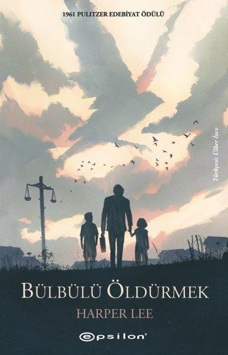

  
# Bülbülü Öldürmek - Harper Lee
##  360 Sayfa
### 12.08.2021
  
 

  

    
     

 
 

***Karakterler;***
- ***Jean Louise Scout Finch:*** Kahramanımız, 6 yaşında bir kız.
- ***Jem | Jeremy Atticus Finch:*** Jean'in erkek kardeşi. 10 yaşında.
- ***Atticus:*** Çocukların babası, avukat.
- ***Calpurnia:*** Evdeki siyahi hizmetçi kadın.
- ***Dill Harris:*** Yeni tanıştıkları arkadaşları, 7 yaşında.
- ***Radley Ailesi:*** Sıkıntılı bir aile, köydekilerden çok farklılar, insanlar onlardan korkuyor
- ***Bay Arthur Radley:*** Hiç dışarıya çıkmayan Radley ailesinin bireyi.
- ***Bayan Maudie:*** Jean'lerin komşusu. Toprak sahibi bir komşunun, Dr. Frank Buford'un kızıydı.
- ***Bayan Dubose:*** Jean'lerin komşusu.
- ***Jessie:*** Bayan Dubose'nin kızı.
- ***Alexandra Hala:*** Jean'in halası.
- ***Tom Robinson:*** Siyahi, Atticus'un müvekkili.
- ***Mayella Ewell:*** Tacize uğradığını söyleyen kız.
- ***Bob Ewell:*** Mayella'nın babası
- ***Bay Dolphus Raymond:***  Ayyaş numarası yapan, melez çocuk dünyaya getiren adam.

> ***YER:***
- ***Maycomb:*** Olay bu kasabada geçiyor.

___

 

> ***(Tanıtım Bülteninden - Epsilon)***

***1961 Pulitzer Edebiyat Ödülü***

***“İstediğin kadar saksağan vur vurabilirsen, ama unutma, bülbülü öldürmek günahtır.”***

***Tüm zamanların en sevilen hikâyelerinden biri olan, kırktan fazla dile çevrilen, Oscar ödüllü bir sinema filmi için temel oluşturan ve yirminci yüzyılın en iyi romanlardan biri seçilen Pulitzer ödüllü Bülbülü Öldürmek, Amerika'nın acımasız bir önyargı ile zehirlenmiş güneyinde geçen, sürükleyici, yürek burkan ve dikkat çekici bir büyüme hikâyesi. Büyüleyici güzellikler ve vahşi eşitsizlikler dünyasında haksız yere korkunç bir suçla suçlanan bir “zenci”yi savunmak için her şeyi riske atan bir adamın hikâyesi çocuk kahramanın gözünden anlatılıyor.***

***Şefkat dolu, dramatik ve düşündürücü Bülbülü Öldürmek okurları insan doğasının köklerine; masumiyet ve deneyime, nezaket ve zulme, sevgi ve nefrete, mizah ve pathosa götürüyor. Harper Lee'nin her zaman basit bir aşk hikâyesi olarak gördüğü romanı bugün Amerikan edebiyatının bir şaheseri olarak kabul ediliyor.***

***“Lee estetiğin arkasına sığınmayı reddediyor. Kalemi öyle güzel, güçlü, ölçülü ki zor konuları doğrudan ele almak zorunda olmamasına rağmen Bülbülü Öldürmek'te tam olarak bunu yapmış.”***  
***–Chimamanda Ngozi Adichie***

***“Yaşama sevinciyle dolu, dokunaklı ve nadiren rastlayacağınız türden bir roman.”***  
***–Truman Capote***
_____

> ***Birinci Kısım (s.9)***

Jean Louise ismindeki kahramanımız 6 yaşındadır. Jean'ın abisi Jem ise kendisinden 4 yaş büyüktür. Jean ailesiyle birlikte Maycomb'da yaşamaktadır. Bir gün Dill Harris ismindeki 7 yaşındaki bir çocuk ile tanışırlar. Bir süre sonra arkadaş olurlar. Oturdukları yerde Radley Ailesi'nin oturduğu ev vardır.  Bu aile çok ilginçtir, çok değişik hareketleri vardır. Bu aile çoğu zaman dışarıya çıkmaz. Çocuklar bu ailenin evine yaklaşmaktan korkar, hatta bahçesine bile yaklaşamazlar.. Bir süre sonra bu ailedeki Bay Radley ölür.

Jean artık büyük bir heyecan ile okula başlamıştır. Ama ilk günleri çokta istediği gibi gitmemektedir. Öğretmeni kendisini azarlayıp, cetvel ile ellerine vurarak ve sınıfın önünde ayakta bekleterek ceza vermektedir.

Jean hiç mutlu olmasa da bir şekilde o yılki okul bitmişti. Yaz tatilinin gelmesiyle, Dill yeniden Jem ve Jean'ın yanına gelmişti. Artık yeniden birlikte üç kişilik bir grup olmuşlardı.. Çocuklar Radley ailesini karakterlerini canlandırarak bir oyun oynamaya başlamışlardı, her ne kadar babaları kızmış olsa da oynamaya devam ettiler.. Bu sıralarda mahalledeki Bayan Maudie ile iyi dost olmuşlardı. Bayan Maudie çocuklara hep kek filan veriyordu...

Bir gün çocuklar Bay Radley'in kapısına mektup bırakmaya karar verdiler. Mektupta ise Bay Radley'in dışarıya çıkmasını ve kendileriyle konuşmasını istiyorlardı. Aynı zamanda ona zarar vermeyeceklerini de belirtmişlerdi.. Mektubu sopayla pencereye iliştirmeye çalışırlarken babaları Atticus'a yakalandılar. Babaları ise böyle bir şeyi yapmayı hemen kesmelerini ve Radley ailesini rahatsız etmeyi bırakmalarını söylemişti. 

Artık yaz tatilinin sonu gelmişti. Yine Jean, Jem ve Dill son kez Radley ailesinin bahçesine girmeye karar verdiler. Gece olunca hep birlikte sessizce bahçeye girdiler, pencerelerden içeriye bakmaya çalıştılar ama bir şey göremediler. Sonrasında ise bir gölgenin onların yanına kadar geldiğini fark ettiler ve hemen ardından kaçmaya çalıştılar, çocuklar tam kaçarken arkalarından bir silah sesi patladı.. Jem, çitlerden atlarken pantalonu takılmıştı, pantalonunu kurtaramadı ve pantalonu orada kaldı... Silah sesinin ardından tüm mahalledekiler Radley ailesinin evinin önünde toplandı.. Bay Radley eğer bir şeyin bir daha bahçesine girerse bu sefer havaya ateş etmeyip, ne olursa olsun onu vuracağını söylemişti... Gece uyumak için evlere geçmişlerdi, Jem dayanamadı ve pantalonunu almak için yeniden gitti... Gitmeden önce çok korkuyordu ama ilginç bir şeyle karşılaşmıştı. Pantalonu katlanmış bir şekilde ve üstelik yırtık olan yeri yamalanmış bir şekilde çitlerin üzerinde duruyordu. Sanki birisi Jem'in geri döneceğini biliyordu...

1800'lü yıllardan beri kar yağmıyordu. İlk defa kar yağınca Jem ve Jean çok şaşırdılar. Kardan adam yaptılar... Bir süre sonra ise üzücü bir şekilde  Bayan Maudie'nin evi yanmaya başlamıştı ve kısa bir süre içerisinde tüm ev kül oldu.. Yangın esnasında Jean ve Jem yangını Radley ailesinin evinin önünden izliyorlardı. Üstelik hava da çok soğuktu ve üşüyorlardı.. Çocuklar eve döndüklerinde üzerlerindeki battaniyeyi yeni fark etmişlerdi. Çocuklar bunun nereden geldiğini bilmediklerini söyledi... Babaları bu battaniyeyi, onlar yangını izlerken o kadar dalmışlardı ki, Bay Radley'in, Jean'in sırtına örttüklerini bile fark  etmediklerini söyledi...

Jem ve Jean bir gün şubat ayında sokakta yaşlı bir kuduz köpek gördüler ve köpek neredeyse yürüyemiyordu. İlk başta çocuklar bu köpeğe ne olduğunu anlamamışlardı. Bunu hemen Calpurnia'ya haber verdiler. Calpurnia köpeği görünce hemen kuduz olduğunu anladı. Cal ilk önce Atticus'u arayarak haber verdi ve sonra tüm mahalleyi dışarı çıkmamaları için uyardı... Bir süre sonra mahalleye gelen Atticus, başkaları yapmadığı için köpeği kendi vurmak zorunda kaldı. Tek atışta vurmuştu...   Bunun ardından Bayan Maudie ile sohbet eden çocuklar, gençliğinde babalarının oranın en iyi nişancısı olduğunu ve lakabınında tek kurşun olduğunu öğrendiler...   Yeni yılın başında çocuklara havalı tüfek hediye etmişlerdi ama tek bir şey için tembihlediler. Kesinlikle bülbül vurmamaları gerektiğini ve günah olduğunu söylediler. Bülbüller sadece şarkı söyleyip insanları neşelendirmekten başka bir şey yapmıyorlar ve aynı zamanda insanların bir şeylerine zarar vermiyorlardı...

İlerleyen zamanlarda Jean ve Jem Bayan Dubose'nin evinin önünden geçerken, deli gibi olan bu kadın çocuklara laf atıyordu ve babaları hakkında kötü şeyler söylüyordu.. Avukat olan babaları zenci birisini savunduğu için, babaları hakkında Bayan Dubose zenci hayranı diyordu... Bunun üzerine Jem dayanamadı ve Bayan Dubose'in evinin önündeki çiçeklere zarar verdi.  Bayan Dubose ise silah ile karşılık verince işler karıştı...   Akşam olunca Atticus olanları çocuklardan dinledi ve Jem'i Bayan Dubose'nin evine özür dilemesi için gönderdi. Jem döndüğünde ise biraz şaşkındı. Bayan Dubose, Jem'den her gün gelip kendisine bir ay boyunca kitap okumasını istemişti. Jem her ne kadar bunu istemiyor olsa da babasının ısrarı ile kabul etti... Ertesi günden itibaren Jem ve Jean birlikte Bayan Dubose'nin evine gittiler. Her geçen gün biraz daha fazla süre orada kaldılar... İlk başta Bayan Dubose'nin krizleri tutuyordu ve çocuklar evden ayrılıyorlardı. Aynı şekilde Bayan Dubose'nin ilaç kullanması için her gün çalar saat çalıyordu ve saat çaldıktan sonra çocuklar özgür kalıyordu.. Ama her geçen gün bu saatin süresi çalma süresi gecikti.. En sonunda neredeyse gece yarılarına kadar Bayan Dubose'in evinde kalmaya başlamışlardı... Ama 1 ay 1 hafta gibi gibi bir sürenin ardından kitap okuma işi bitmişti. Artık Bayan Dubose'nin de krizleri gelmiyordu...

Aradan bir ay gibi bir süre geçtikten sonra Bayan Dubose, Atticus'u yanına çağırttı. Atticus biraz fazla kalmıştı orada. Döndüğünde ise Bayan Dubose'nin öldüğünü söyledi...

____

> ***İkinci Kısım (s.147)*** 

İkinci kısmın başında, Atticus iş için evden uzak bir yere gitmişti ve bir süre dönmedi. Bu sebeple Cal, Jean ve Jem'i kiliseye götürdü. Cal'ın çocukları götürdüğü kilise diğerlerinden farklıydı. Cal'ın kendisi siyahi olduğu için çocukları da kendi kilisesine götürmüştü. Bir tane kadın, çocukların beyaz oldukları için her ne kadar buradan gitmelerini söylese de, diğer insanlar çocuklara, buraya geldikleri için kendilerini mutlu ettiklerini söylediler. Bir de çocukların babası siyahi bir adamın avukatlığını yaptığı için de oradaki insanlar tarafından seviliyordu. Çocuklar kilise de güzel zaman geçirdiler.

Hep birlikte eve döndüklerinde ise Alexandra Hala'nın onları holde beklediklerini görürler. Alexandra Hala'ları artık onlarla birlikte yaşayacaktır. Çocuklara bir şey öğretmek ve onları hayata daha iyi hazırlamak için.. Ama Alexandra Hala, bir o kadar aksi ve zıt bir karakterdir. Atticus döndükten sonra ise Alexandra Hala ile birçok kez tartıştılar.. Alexandra Hala artık Cal'in onlarla kalmamasını istemektedir, neyse ki Atticus buna karşı çıktı.. Alexandra Hala, çocuklar tarafından da sevilmemektedir...

Bir gün Atticus'u görmek için bir sürü adam evlerine geldi. Konu tamamen avukatlığını yaptığı Siyahi Tom Robinson ile ilgiliydi. Bir süre bu adamlar ile tartıştıktan sonra adamlar ayrılmıştı... Akşam olunca Atticus evden ayrılmıştı. Çocuklar; Jean, Jem ve Dill, hep birlikte Atticus'u aramaya gecenin bir vakti köyün merkezine geldiler. Atticus, hapishanenin önünde tek başına bekliyordu.. Bir süre sonra dört araba adam geldi.. Atticus'un önlerinden çekilmesini istiyorlardı, Atticus tek başına Tom Robinson'u korumak için oradaydı.. Bir süre tartışma alevlenince Jean koşarak babasının yanına geldi ve ardından diğer çocuklarda geldi. Atticus ilk başta şaşırdı ve ardından çocuklardan eve gitmelerini istedi ama söz dinletemedi..  Bir süre sonra Jean oradaki adamlardan biriyle konuşmaya başladı ve bir süre bir şeyler anlattı.. Bunun üzerine adamlar çekip gitti.. Atticus ve çocuklar eve dönüş yoluna geçtiler ve Atticus çocuklara karşı sevgisini gösterdi..

Ertesi gün mahkeme vardı. Tüm Maycomb halkı mahkemeye doluşmuştu. Üst katta sadece siyahiler vardı ve balkondan takip ediyorlardı... Mahkeme esnasında, Irzına geçildiği iddia edilen Mayella Ewell, babası olan Bay Ewell ve polis memuru Tom Robinson aleyhinde açıklamalarda bulundular.. Sonrasında ise Tom Robinson çağırıldı. Tom'un bir kolu sakattı, üstelik Tom olayları tüm doğruluğuyla anlattı.   Bir gün Tom yine çalışmadan dönerken Mayella içeride yardım edilmesi gereken bir iş olduğunu, kapıyla alakalı bir durumun olduğundan bahsetmiş. Bunun üzerine içeri girdikten sonra Mayella Tom'a sarılıp onu öpmeye çalışmış. Tom her ne kadar kendisini kurtarmaya çalışsa da o esnada kızın babası camdan içeride olanları görmüş. Tom zenci olduğu için bu kabul edilebilir bir şey değilmiş...   Atticus her şeyi çok güzel açıkladı, Tom'un ne kadar suçsuz olduğunu gün yüzüne çıkarmıştı. Olumlu bir kararın da çıkacağına inanıyordu. Ama iki-üç saatlik bir zamanın ardından juriden çıkan karar Tom'un suçlu olduğuydu...

Aradan biraz zaman geçtikten sonra, kötü bir haber geldi.. Tom hapihanedeki antreman sahasının çitlerine tırmanarak kaçmayı denemiş. Eğer kolu sağlam olsaymış belki de bunu başarabilecekmiş, fakat yapılan ikazlara rağmen Tom durmayınca, 17 mermi ile Tom'u öldürmüşler... Tom belki de beklese, Atticus'un bir üst mahkemeye başvurmasının sonucuyla birlikte dışarıya çıkma ihtimali yüksekti. Ama maalesef bekleyemedi..

Aradan uzun bir zaman geçmişti. Jane'in okulda gösterisi vardı ve sahnede görevliydi.. Bu sebeple gece vakti Jane ve Jem karanlık yoldan geçerek okula ulaşmak zorundaydılar.. Okula gitmek için gece vakti Radley'lerin evinin önünden geçerken korkarak geçmişlerdi...   Okula ulaştılar. Jane, sahneye çıkmakta biraz gecikti. Bu sebeple gösteri bittikten sonra çok utanıyordu ve kostümünü çıkarmadan insanların oradan ayrılmasını beklediler.. İnsanlar dağıldıktan sonra Jane ve Jem eve dönmek için yola çıktılar.. Yolun yarısına ve en karanlık kısmına geldiklerinde Jem bir ses duymaya başladı, durdular dinlediler, sonra yine devam ettiler ve bir süre sonra bu sesi Jane'de duyuyordu artık. Peşlerinde birisi onları takip ediyordu... Bu sebeple koşmaya başladılar. Bir süre sonra zifiri karanlıkta arkadan birisi çocukları yakaladı. Jane yere düşmüştü, Jem yabancıyla boğuşmaya başladı. Aynı zamanda çocuklar bağırarak yardım istiyorlardı.. Bir süre sonra Jem'in acı bir çığlığından sonra sessizlik oldu..    Ardından Jean bir şekilde anayolu bulmayı başardı, bir tane adam kucağında Jem ile birlikte evlerine doğru gidiyordu ve aynı zamanda babaları da oraya doğru gelmeye başlamıştı..

Neyse ki eve vardılar. Hemen ardından doktor çağırıldı.. Jem ve Jean yaralanmıştı, üstelik çok kötü bir şekilde Jem'in kolu kırılmıştı... Aynı zamanda polis memuruda gelmişti. Bir süre Atticus ile olayı konuştular ve Jean başına gelenleri onlara anlattı... Bunu yapan Mayella'nın babası olan Bob Ewell'di daha önce de Atticus'u tehdit etmişti. Ama Atticus olsa olsa kendi peşine düşeceğini düşünmüş ve bu kadar alçak davranabileceği ihtimalini vermiyordu...Bob olay yerinde kaburgasından tamamen içeriye kadar saplanan bir bıçak sonucu ölmüştü... 

Jem'i kucağında eve getiren Bay Arthur Radley'di. Çocukların uzun zamandır görmek için, evden çıkarmak için uğraştığı ve öcü olarak tabir ettikleri adam, onların hayatını kurtarmıştı... Jane Bay Arthur Radley ile tanıştı. Arthur'un bembeyaz yıllardır güneş görmemiş bir teni vardı.. Bir süre Jane ile Bay Arthur Radley birlikte oturdular. Ardından Arthur, Jane'den kendisini eve bırakmasını istedi. Jane, Bay Arthur Radley'i evine kadar bıraktı...

***- SON -***

_____

**"-Sen zencileri mi savunuyorsun, Atticus?**  
**-Elbette savunuyorum. Zenci deme, Scout. Bu kabalıktır.**  
**-Okulda herkes öyle diyor.**  
**-Bundan böyle o herkesten bir kişi eksilecek."**
____

"Bülbüller bizi eğlendirmek için şarkı söylemek dışında bir şey yapmaz . İnsanların bahçelerindeki bitkileri yemezler , mısır ambarlarına yuvalanmazlar , tek yaptıkları iş bize içlerini dökmektir . İşte bu yüzden bülbülleri öldürmek günahtır . "
____

***Atticus hemen ayağa fırladı, Jem'in yanına gidip durdu. Jem yüzünü onun göğsüne gömdü. "Şşşt," dedi Atticus, "bence sana bir şey söylemek istiyor, artık sorun yok Jem, artık sorun yok, demek istiyor. Biliyorsun, o tam bir hanımefendiydi."   "Hanımefendi mi?" Jem başını kaldırdı. Yüzü kıpkırmızıydı. "Senin için o kadar kötü şeyler söyleyen bir kadın, nasıl hanımefendi olur?"   "Hanımefendiydi. Pek çok konuda onun benden farklı görüşleri vardı belki... oğlum, sana söylemiştim, sen o çılgınlığı yapmasaydın bile ben sana gidip ona kitap okumanı söyleyecektim. Onunla ilgili bir gerçeği görmeni istiyordum, gerçek cesaretin ne olduğunu görmeni istiyordum, gerçek cesaretin eli tüfekli bir adamla ilgisi olmadığını. Daha başlamadan yenildiğini bile bile başlamak ve her ne pahasına olursa olsun sonuna kadar devam etmek olduğunu. Nadiren de olsa bazen kazanırsın. Bayan Dubose kazandı, kırk sekiz kilosunun kırk sekizini de kazandı. Hiç kimseye, hiçbir şeye bağlı olmadan öldü. Hayatımda tanıdığım en cesur kadındı."   Jem şeker kutusunu yerden aldı, ateşe attı. Kamelyayı da yerden aldı, yatmaya giderken çiçeğin geniş taşyapraklarıyla  oynadığını gördüm. Atticus gazetesini okuyordu. (s.146)***

____

***"Oo, evet, neden numara yaptığımı soruyorsun? Çok basit," dedi. "Bazı insanlar... Yaşam tarzımdan hoşlanmıyor. E, ben de cehenneme kadar yolunuz var diyebilirim, hoşlanıp hoşlanmamanız umurumda değil, diyebilirim. Hoşlanıp hoşlanmamanız umurumda değil diyorum demesine ama cehenneme kadar yolunuz var demiyorum, anlıyor musun?"   Dill'le ikimiz, "hayır efendim," dedik.   "Benden hoşlanmamak için bir nedenleri olsun istedim, anlıyor musunuz? Bir nedene sığınmak insanlara iyi geliyor. Pek ender geliyorum ama kasabaya geldiğimde , bu kesekağıdından biraz içer, biraz zikzak yaparsam insanlar Dolphus Raymond viskinin kölesi olmuş diyebiliyorlar... Bu yüzden alışkanlıklarını değiştirmesine olanak yok. Elinde değil. Böyle yaşamasının nedeni bu." (s.256)*** 

____

***"Ayrıca beyaz bir kadına üzülecek kadar iyi yürekli ve cesur bir  insan, böylesine halim selim, saygın, alçakgönüllü bir zenci iki beyazın karşısında ifade vermek zorunda kaldı. O iki beyazın tanık kürsüsüne nasıl çıktıklarını, nasıl davrandıklarını size hatırlatmak gereği duymuyorum - kendi gözlerinizle gördünüz. Maycomb İlçesi şerifi dışında kalan mahkeme tanıkları, karşınıza, yani bu duruşmaya arsızca bir güvenle çıktılar: Kimse onların tanıklıklarından kuşku duymayacaktı, siz baylar onlar ne derse inanacaktınız çünkü onların varsayımına göre -o talihsiz varsayımlarına göre- bütün zenciler yalan söyler, bütün zenciler temelde ahlaksız yaratıklardır, kadınlarımızın yakın çevresinde hiçbir zenciye güven olmaz, insanların zihinlerinin çapını gösteren bir varsayım bu." (s.260)***

***"Ama bu ülkede insanlar ancak bir tek durumda eşit yaratılmış kişiler haline gelirler - bir yoksulu Rockefeller Ailesi'nin bir ferdiyle, bir budalayı Einstein ile, cahil bir kişi bir kolej müdürüyle eşit gören bir tek kurum vardır. Bu kurum da, baylar, hukuk kurumudur. Birleşik Amerika'nın Yüksek Mahkeme'si gibi ya da ülkenin en basit herhangi bir Sulh Ceza Mahkemesi gibi ya da sizin de hizmet verdiğiniz bu onurlu mahkeme gibi. İnsanlarca kurulmuş bütün kurumlar gibi bunların da kusurları vardır ama bizim ülkemizde mahkemeler insanların arasında en üst düzeyde eşitliğin gözetildiği kurumlardır, bizim mahkemelerimiz açısından insanlar eşit yaratılmıştır.   Mahkemelerimizin dürüstlüğüne ve jüri sistemine fazlaca inanan bir idealist değilim - bunları kusursuz bulduğumu söyleyemem, benim açımdan işler durumda somut bir gerçekliktir bu. Baylar, mahkeme bu jüride yer alan ve karşımda oturan sizlerin tek tek hiçbirinizden daha iyi değildir. Bir jüri ne kadar güvenilirse mahkeme de o kadar güvenilirdir, jüriyi oluşturan insanlar ne kadar güvenilirse bir jüri de o kadar güvenilirdir. Sizlerin size sunulan kanıtları öfkeye kapılmadan değerlendireceğinize, bi karara varacağınıza ve davalıyı ailesinin yanına göndereceğinize güveniyorum. Yüce Tanrı adına görev yapın."   Atticus'un sesi düştü, jürinin karşısından çekilirken bir şey söyledi ama duymadım. Sanki jüriye söylermiş gibi değildi, kendi kendine konuşurmuş gibiydi. Jem'e hafif bir yumruk attım, "Ne dedi?"   `"Yüce Tanrı adına, ona inanın."` "Galiba öyle dedi." (sf.262)***   

____

***Maycomb, Tom'un ölüm haberiyle belki iki gün ilgilendi; haberin bütün yöreye yayılması için iki gün yetti. "Duydun mu?.. Hayır mı? Dediklerine göre yıldırım gibi koşarak kaçmış..." Maycomb için Tom'un ölümü normal bir ölümdü. Bir zencinin birdenbire aklına gelip firara kalkışması normaldi. Hiçbir planı, gelecekle ilgili hiçbir düşüncesi olmadan eline geçen ilk fırsatta nereye gittiğini bilmeden kaçma zihniyeti bir zenci için normaldi. İşin komik tarafı Atticus onu oradan sağ salim çıkarttırabilirdi ama beklemek mi?.. Kim bekler ki? Onlar nasıldır bilirsiniz. Kolay kazanılan, kolay kaybedilir. Görüyorsunuz, Robinson yasal olarak evliydi, dediklerine göre temiz biriydi, kiliseye filan gidiyordu ama işler bir noktaya geldiği zaman cila çabuk dökülür. İçlerindeki zenci ortaya çıkar. (s.306)*** 

____

***"Komşular ölüm olduğu zaman yiyecek getirirler, hastalık olduğunda çiçek, ikisinin arasında da bazı ufak tefek şeyler. Öcü bizim komşumuzdu. Bize sabundan yapılmış iki küçük bebek, bozuk bir saat ile saat zinciri, iki tane uğur parası vermişti ve hayatlarımızı bağışlamıştı. Ama komşular kendilerine verilenlerin karşılığını verir. Ağaçta bulup aldığımız şeylerin yerine biz hiçbir şey koymamıştık; ona hiçbir şey vermemiştik ve buna üzülüyordum." (s.355)***
___

 

### Kitaptan Alıntılar ;
- 
- ***"Bir insanı anlayabilmek için, o insanın baktığı açıdan bakmayı becerebilmelisin..." (s.44)***
- ***"Ama bazen bir adamın elindeki İncil... Babanın elindeki viski şişesinden daha tehlikeli olabilir." (s.63)***
- ***"İnsanların başına ne geldiğini asla bilemeyiz. Kapalı kapılar ardında evlerde nelerin olup bittiğini, ne sırların gizlendiğini..." (s.64)***
- ***"Atticus bana, sıfatları kaldırırsan geriye gerçekler kalır demişti." (s.82)***
- ***"Daha başlamadan yüzyıl önce davayı kaybetmiş olmamız demek kazanmaya çalışmayacağız anlamına gelmez." (s.103)***
- ***"Bu kez Yankilerle savaşmıyoruz, dostlarımızla savaşıyoruz. Ama şunu unutma, işler ne kadar kötüye giderse gitsin, onlar yine de bizim dostumuz, burası da bizim ülkemiz." (s.103)***
- ***"Aklı başında hiç kimse yeteneği var diye gururlanmaz." (s.130)***
- ***"Ama başka insanların yüzüne bakabilmek için ilk önce kendi yüzüme bakabilmeliyim. Başka insanların çoğunluğunun düşüncelerinden bağımsız hareket eden tek şey insanın vicdanıdır." (s.138)***
- ***"Bak yavrum,   birinin kötü olduğunu düşündüğü bir şeyle seni nitelendirmesi hiçbir zaman hakaret değildir. O kişinin ne kadar zavallı olduğunu gösterir, seni incitmez." (s.142)***
- ***"Daha başlamadan yenildiğini bile bile başlamak ve her ne pahasına olursa olsun sonuna kadar devam etmek..." (s.146)***
- ***"Onsuz hayat dayanılmaz bir şeydi." (s.150)***
- ***"Bildiğin her şeyi söylemek zorunda değilsin. Ayrıca, insanlar kendilerinden daha çok bilen birini çevrelerinde görmekten hoşlanmazlar. Sinirlenirler.  
Doğru konuşarak onları değiştiremezsin, kendileri öğrenmek istemelidir, onlar öğrenmek istemiyorlarsa bir şey yapamazsın, ya çeneni kapar ya da onlar gibi konuşursun." (162)***
- ***"Çok iyi olacağını söyledim, tabii bu yalandı ama belli koşullarda, insanın hiçbir şekilde değiştiremeyeceği koşullarda yalan söylemesi gerekir." (s.166)***
- ***`"Kitap okumak ve tek başına bir yerlere gitmek dışında bir şey yapmak istemiyordu."` (s.178)***
- ***"Bazı zenciler yalan söyler, bazı zenciler ahlaksızdır, kadınlarımızın yakın çevresindeki bazı erkeklere güvenmememiz gerekir - ister siyah olsun ister beyaz. Ama bu her türlü insan soyu için geçerlidir, belli bir insan soyu için değil. Bu mahkeme salonunda hayatında hiç yalan söylememiş, ahlaksızca bir şey yapmamış kimse yoktur, bir kadına hiç arzuyla bakmamış tek bir erkek yoktur." (sf.261)***
- ***"Bunu nasıl yapabilirler, nasıl?"   `"Bilmiyorum ama yaptılar. Daha önce de yaptılar, bu gece de yaptılar, yine yapacaklar ve yaptıkları zaman... Öyle görünüyor ki yalnızca çocuklar ağlayacak."` (s.271)***
- ***"Bizim mahkemelerimizde, beyaz adamın dünyasıyla siyah adamın dünyası karşı karşıya geldiğinde, her zaman beyaz adam kazanır. Bu ne kadar çirkin olursa olsun hayatın bir gerçeği." (s.281)***
- ***"Ama sana bir şey söyleyeyim ve bu söyleyeceğim şeyi hiç unutma;   beyaz bir adam siyah bir adamı aldattığı zaman, o beyaz adam kim olursa ve ne kadar zengin olursa olsun, ne kadar iyi bir aileden gelirse gelsin, beş para etmezin tekidir." (s.281)***
- ***`"Bana kalırsa tek tür insan var. İnsanların hepsi insan."` (s.289)***
- ***"Yalnızca tek bir tür insan varsa, o zaman neden hiç geçinemiyorlar? Hepsi birbirine benziyorsa, niçin özel bir çaba harcayarak birbirlerini aşağılıyorlar, Scout, galiba bir şeyleri anlamaya başlıyorum.   Galiba Öcü Radley'nin bunca zamandır evden çıkmamasını anlamaya başlıyorum... Dışarı çıkmamak istediği için içeride kalıyor." (s.289)***
- ***`"Hayatımdan çıkıp gitti ama aklımdan çıkmış değildi."` (s.304)***
- ***"Nasıl böyle Hitler'den nefret edersin de sonra dönüp kendi ülkendeki insanlara bu kadar çirkin davranırsın?" (s.314)***
- ***"Atticus haklıydı.   Bir keresinde, kendinizi bir adamın  yerine koymadıkça, o adamın yerinde olmanın nasıl bir şey olacağını anlamaya çalışmadıkça o adamı gerçekten tanıyamazsınız." (s.356)***
- ***`"İnsanların çoğu iyidir, Scout, yeter ki sen onları bir gün gör."` (s.358)***
