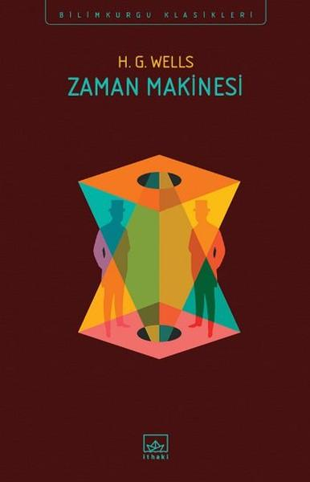

***  
# Zaman Makinesi - H. G. Wells
##  140 Sayfa
### 14.08.2021
  
 

  

    
     

 
 

***Karakterler;***
- ***Weena:*** Zaman Yolcusu'nun kurtardığı ve aşık olduğu kadın.

Morlocklar: yer altında yaşayanlar  
Eloiler : yer üstünde yaşayanlar

 

> ***(Tanıtım Bülteninden - İthaki)***

***Wells'in ilk olarak okul gazetesinde yayınladığı bir öyküden hareketle kaleme aldığı kısa romanı Zaman Makinesi, 1895'ten beri bilimkurgunun önde gelen eserlerinden biri oldu. Hem geleceği hayal etmek hem de biliminsanının karakterini göstermek adına derin saptamalarda bulunan, politik göndermelerle yüklü bu distopya, hâlâ gerçekleştiremediğimiz bir fantezinin peşinden yıllardır sürüklüyor bizi. Volkan Gürses'in Türkçeye çevirdiği Zaman Makinesi'nin bu yeni baskısı, roman tarihi ve H.G. Wells üzerine yaptığı çalışmalarla tanınan akademisyen Patrick Parrinder'ın önemli makalelerinden biriyle zenginleşiyor. Elif Ersavcı'nın Türkçeye kazandırdığı bu makalede Parrinder, Wells'in Zaman Makinesi'ni yazarken, "yaratıcılık düzeyinde de olsa, kendi ölümünün ötesine geçmeyi" öğrendiğini iddia ediyor. Zamana karşı bir makinenin, ölümlülüğe karşı bir yaşamın hikâyesi bu. Wells'in en büyük üç romanından biri olan Zaman Makinesi'ni okurken, hepimiz bir Zaman Yolcusu'yuz!***
_____

Zaman Yolculusu olarak isimlendirdikleri bir adam, oradaki insanlara zamanda yolculuğun mümkün olduğunu anlatmaya çalışıyordu. Her ne kadar Zaman Yolculusu'na inanmasalarda, Zaman Yolculusu elindeki küçük makinanı'yı çalıştırarak oradaki insanları hayrete düşürdü. Zaman Yolculusu, küçük makinasının kolunu çevirdikten sonra makina bir süre kendi etrafında döndü ve ortadan kayboldu. Oradaki herkesin dili tutulmuştu.. Zaman Yolculusu, oradakileri kendi çalışma alanına götürdü ve asıl üzerinde çalıştığı büyük makinasını tanıttı. Henüz tamamlanmamış makinanın bitmesine az kalmıştı..

Aradan biraz zaman geçti, Zaman Yolculusu'nun evinde herkes birlikte akşam yemeği yiyeceklerdi. Zaman Yolculusu, gecikmişti, bu sebeple diğerleri yemeğe başladılar. Bir süre sonra içeriye Zaman Yolculusu girmişti, ama o kadar perişan haldeydi ki, vücudu toz, toprak ve yara bere içerisindeydi.. Üzerini değiştirip, bir şeyler yedikten sonra her şeyi anlatacağını söyledi.. Zaman Yolculusu, yemeğini yedikten sonra başından geçenleri anlatmaya başladı...

Zaman Yolculusu bir hafta içerisinde  üzerinde çalıştığı makinasını bitirmişti. Bunun üzerine makinayı denemeye karar verdi. Makinayı çalıştırdıktan sonra bir anda her şey ışık hızıyla hareket etmeye başladı, bu his gerçekten çok korkutucuydu.. Etrafındakiler değişmeye başladı, ardından gece gündüz değişmeye başladı, bir süre günler, aylar hızlı bir şekilde değişmeye başladı. Her şey adeta ışık hızında ilerliyordu.. Zaman Yolculusu en sonunda makinayı durdurdu.. Kendini dolu yağan bir açık alanda buldu ve kısa sürede sırılsıklam olmuştu.. Etrafı çok güzeldi, çok güzel çiçekler vardı. Ama binaların bir kısmı yıkık döküktü. Zaman Yolculusu, tam makinayı ayarlayıp oradan ayrılacaktı kendi kendisine doğru gelenlerin olduğunu fark etti. İlk başta neler olacağından korksa da sonrasında her şeyi akışına bıraktı... Bu yaklaşanlar neredeyse 1.20 metre civarında insanlardı. Bir süre sonra etrafını sarmışlardı ve Zaman Yolculusu'nun ne olduğunu anlamaya çalışıyorlar ve ona dokunuyorlardı... Zaman Yolculusu burada kaldığı süre boyunca bir çok şeyin değiştiğini fark etmişti.. Hiçbir şekilde zorbalık, otorite, mücadele, ekonomik mücadele, adına bir şey kalmamıştı.. Çoğu hayvanın nesli tükenmiş, besin kaynakları sadece meyvelermiş... Ama üzücü bir şekilde bu insanların akılları neredeyse hiç gelişmemiş ve bir o kadar tembellermiş. Hiçbir şeyleri takmıyorlarmış... ***Tüm zamanlarını tatlı tatlı oynamakla, nehirde yıkanmakla, yarı oynaşıp yarı sevişmekle, meyve yemek ve uyumakla geçiriyorlardı. İşlerin nasıl yürüdüğünü anlayamıyordum. (sf.78)***

Zaman Yolculusu, oradaki insanlara güvenerek kendi zaman makinasını bırakıp etrafı keşfetmeye çıkmıştı. Bir süre sonra döndükten sonra ise zaman makinasını bulamadı.. Bir süre nereye baktıysa da yine de bulamadı. Zaman makinası olmadan geriye dönmesinin imkanı yoktu. Zaman Yolculusu, bir süre sonra oradaki derede bir tane kızın boğulduğunu fark etti. Ama oradakiler muhtemelen yüzme bilmedikleri için hiçbir şey yapamıyorlardı.. Zaman Yolculusu bunu görünce hemen üzerindeki kıyafetleri çıkardı ve suya atlayarak kızı kurtardı. Kurtardığı kızın ismi ise Weena'ydı.. Bu olanlardan sonra kız Zaman Yolculusu'na çok büyük sevgiyle bağlandı ve aynı şekilde Weena Zaman Yolculusu'nun peşini hiç bırakmadı. Bir süre sonra Zaman Yolculusu'u da aynı şekilde kızdan hoşlanmaya başladı ve artık hep bir aradaydılar... 

Zaman Yolculusu, bir gün oradaki su kuyusunun yanındayken aşağıya bakıyordu ve bunun üzerine aşağıda canlı bir şeylerin olduğunu fark etti. Tüm bunların üzerine Zaman Yolculusu, makinasının aşağıda olabileceğini düşünerek aşağıya inmeye karar verdi. Zaman Yolculusu kuyunun içerisindeki demirleri kullanarak uzun bir süre aşağı indi ve en sonunda oyuk gibi bir şeyin içine kendini zor atmıştı. Çünkü çok yorulmuştu.. Bir süre dinlendikten sonra biraz içeriye doğru ilerlemeye karar verdi. Ama bir süre sonra etrafına iğrenç insanlara benzer yer altında yaşayanlar sardı. Bu yer altında yaşayanlara Morlocklar deniyordu ve bunlar karanlıkta yaşıyorlardı.. Bir süre sonra bir sürü Morlocklular Zaman Yolculusu'nu kovalamaya başladılar. Zaman Yolculusu, elindeki son kibritleri kullanarak geri dönmeyi zorda olsa başardı ve yeniden kuyudan dışarıya çıktı..

Bir süre sonra Zaman Yolculusu ve Weena birlikte yola çıktılar. Uzak yerdeki tapınak gibi bir yere gitmeye ve güvenli yer bulmayaya karar verdiler. Uzun bir yolculuğun ardından buraya ulaştılar. Zaman Yolculusu geldikleri yerdeki galerileri tek tek dolaştı ve kapalı sandıklar içerisinden işe yarar bir şey bulmaya çalıştı.. Sandıkların içerisinden bir kutu kiprit bulmuştu ve buna çok sevindi. Bu kipritler kendilerini Morlocklardan koruyacaktı, aynı zamanda demir gibi bir şeyde almıştı yanına ve bunun ardından geri dönmek için yola çıktılar.. Ama gece karanlık çökünce bir anda etraflarını Morlocklar sardı ve Zaman Yolculusuyla Weena'ya saldırdılar.. Maalesef Weena ölmüştü..  Zaman Yolculusu uzun bir kavganın ardından bir şekilde oradan kurtuldu ve geri dönmeyi başardı... Geldiğinde ise oradaki tapınağın kapılarının açıldığını ve makinasının orada olduğunu görüyor... Bunun üzerine makinasını hemen çalıştırıyor ve ilk önce geleceğe gidiyor. Uzun bir yıl geçtikten sonra geldiği noktada canavarlar ile karşılaşıyor. Canavarlar kendine zarar verecekken, güç bela biraz daha zamanı ileriye alıyor ve bu sefer geldiği noktada ise dünyada kimse kalmamıştır. Tüm nesiller tükenmiştir.. Bunun ardından Zaman Yolculusu, günümüze geri dönüyor..

Zaman Yolculusu, böylelikle oradakilere hikayenin sonuna kadar olan kısmı anlatıyor... Ama bu anlattıklarını elbette oradaki kimse inanmıyor ve kuşkuyla bakıyorlar. Bir süre sonra Zaman Yolculusu, tekrardan yanına fotoğraf makinası alarak tüm bunları kanıtlamak için yolculuğa çıkıyor...

***"O an anladım. Richardson'ı hayal kırıklığına uğratmak pahasına durup Zaman Yolculusu'nu bekledi; ikinci, belki de daha garip öyküyü, yanında getireceği numune ve fotoğrafları. Ama artık bir ömür boyu beklemem gerekeceğinden korkmaya başlıyorum. Zaman Yolculusu üç yıl önce ortadan kayboldu ve artık herkesin bilidği gibi, bir daha asla geri dönmedi." (s.138)***

***- SON-***

_____

 

### Kitaptan Alıntılar ;

- ***"Zamanda birkaç yıldan fazla ileriye gitmek, kişinin kendini öldürmesidir." (s.8)***
- ***"İnsan hayatı," der Wells, "evrenin akışı içindeki bir girdap gibi, yanıltıcı bir şekilde sakindir; bilimse insanın karanlığa yaktığı kibrittir ve kibritin ateşi, karanlığın sandığımızdan daha da karanlık olduğunu gösterir." (s.13)***
- ***`"Eğer dünya seni hoşnut etmiyorsa, dünyayı değiştirebilirsin."` (s.22)***
- ***"İnsanlığın başına neler gelmişti? Ya zulüm ortak bir tutku olmuşsa?" (s.52)***
- ***"Daha önce böyle bir şey görmemiş olan sizler, sayılamayacak kadar çok ileride bir kültürün nasıl tatlı, ne harika çiçekler yaratmış olduğunu hayal bile edemezsiniz." (s.57)***
- ***"Ya da her şey yalnızca rüya mı? Yaşamın rüya olduğunu söylerler, hatta acınası bir rüya." (s.136)***
- ***"Zaman Yolculusu üç yıl önce ortadan kayboldu ve artık herkesin bilidği gibi, bir daha asla geri dönmedi." (s.138)***
