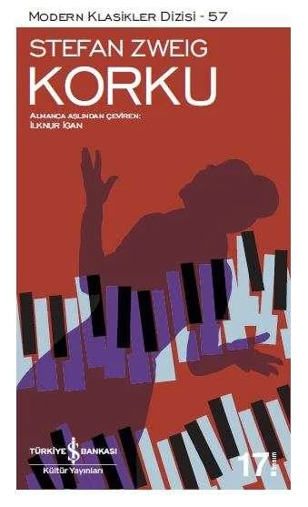

  
# Korku - Stefan Zweig
##  80 Sayfa
### 16.08.2021
  
 

  

    
     

 
 

***Karakterler;***
- ***Bayan Irene Wagner:***  Fritz'in karısı.
- ***Fritz:*** Irene'nin kocası. Başkentin en önemli avukatlarından biri.

 

> ***(Tanıtım Bülteninden - Türkiye İş Bankası Yayınları )***

_____

Bayan Irene Wagner, evli ve iki tane çocuğu olan bir hanımefendidir. Irene'nin kocası başkentin en önemli avukatlarından biridir. Fakat Irene bir süredir kocasınını bir tane adam ile aldatmaktadır. Irene bir gün yine bu aşığının evindedir ve tam orada ayrılacağı sırada, kapıda bir tane kadın ile karşılaşır. Yabancı kadın Irene'ye bu adamın sevgilisi olduğunu söyler ve ne kadar yokluk içerisinde olduğundan bahseder.. Irene zaten bu kadını karşısında görünce korkmuştur ve orayı terk edebilmek için cüzdanından ne kadar parası varsa çıkartıp bu yabancı kadına verir..

Irene o günün sonunda eve dönmüştür fakat kendisine gelmesi epey zaman almıştır. Büyük bir korku içerisinde olanlar aklına gelmektedir.. Neyse ki Irene, bir süre sonra rahatlamıştır ve kadının bir daha kendisini bulamayacağını düşünmektedir. Tüm bu olanlardan sonra aynı zamanda Irene, diğer görüştüğü adam ile görüşmeyi bırakmıştır.

Birkaç gün sonrasında Irene, dışarıdan eve döndüğünde bir anda yabancı kadını karşısında görüp büyük bir telaşa kapılmıştır. Kadın şantaj yapmaya devam etmektedir ve bir miktar para istemektedir. Bunun üzerine Irene, bu kadını hemen gönderebilmek için bir miktar para verir. Irene, kadının  kendi adını ve yaşadığı yeri nereden öğrendiğini hayretler içerisinde merak eder.

Irene, artık rahat uyku uyuyamaz, her gece kabuslar görür. Aynı zamanda her kapı çaldığında yüreği ağzına gelir... 

Bu yabancı kadın elbette durmaz. Bu sefer eve bir mektup gönderir ve daha fazla para ister. Irene, mecbur olarak yine para gönderir. Bu bu şekilde birkaç kez daha artarak devam eder. En sonunda yabancı kadın eve gelir ve yüzsüz bir şekilde oturma odasına kadar girer ve oturur..  Yabancı kadın, Irene'den daha fazla para istemektedir. Ama Irene'nin bunu verebilecek miktarda parası yoktur. Bunun üzerine ise kadın Irene'den parmağındaki yüzüğü ister. Her ne kadar Irene vermemek için dirense de. O esnada eve gelen kocasına yakalanmamak için, bir anda yüzüğü çıkarıp yabancı kadına verir. Bu sayede yabancı kadını hemen evden sepetler.

Tüm bunlar yaşanırken Irene, bu olanları kocasına itiraf etmek ister ama bir türlü başaramaz... 

Ertesi gün kahvaltıda Irene'nin parmağında yüzük olmadığı için kocası yüzüğün nerede olduğunu sorar. Bunun üzerine Irene, paniğe kapılarak hemen cevap verir. Yüzüğü temizlemeye verdiğini ve yarın alacağını söyler... Artık kaçınılmaz son yaklaşmakta ve bellidir. Aslında bir bakıma böyle olması Irene'yi biraz olsun rahatlatır..

En sonunda tüm bunların sonucunda Irene artık hayatına son vermeyi düşünür. Ama son kez bir çıkış yolu olarak, görüştüğü diğer adama gider ve yardım ister. Irene olanları anlatınca adam öyle bir kadının olmadığını söyler.. Irene'nin aklı karışmıştır.. Ama artık olan olmuştur, Irene oradan ayrılarak eczaneye gider  ve yüksek dozda ilaç aldığı sırada yanında kocasını görür.. Bir anda bayılma eşiğine gelen Irene'yi kocası eve getirir. Irene çok kötü halde odasındayken kocası yanındadır. Irene, çok kötü durumdadır ve hıçkırıklar içerisinde ağlamaya başlar.

Kocası ise Irene'ye her şeyi bildiğini ve o kadının bir daha gelmeyeceğini söyler.. Kocası tüm bu oyunları, Irene'nin tekrardan ailesine geri dönmesini çocuklarının yanında olması için yaptığını söyler. Kocası aynı zamanda bu olanları direk Irene'nin yüzüne söyleyemeyeceğini, ama hatasını fark etmesi için ve aynı zamanda kendisinin kalbini kırmamak için böyle bir yola başvurduğunu anlatır...

Hemen ardından Irene uykuya dalar. Irene uzun bir zamanın ardından rahatlamış şekilde güzel bir uyku uyur. Irene ertesi sabah uyanıp olanları hatırlar ve parmağında yüzüğünü tekrardan gördüğü için mutlu olmuştur...

***- SON -***

____

***"Bu insanla bir zamanlar ilişkisi olması, Irene'ye birden gerçekdışı ve anlamsız görünmeye başlamıştı. Hiçbir şeyini hatırlamıyordu, ne gözlerinin rengini ne yüzünün şeklini; ne de bedeninde okşamalarından bir iz vardı, sözlerinden de, o köpekçe yalvarmasından, "Ama Irene!" diye çaresizlikle  kekelemesinden başka bir şey gelmiyordu aklına. Başına gelen bu felaketin sebebi o olmasına rağmen bütün bu günler boyunca bir kez olsun, rüyasında bile onu düşünmemişti. Yaşamında hiçbir yeri, hiçbir çekiciliği yoktu, bir anısı bile kalmamıştı. Bir zamanlar bu adamın dudaklarını dudaklarında hissetmiş olduğuna şimdi inanamıyordu. Onunla hiçbir zaman yakınlaşmamış olduğuna yemin edebilirdi. Irene'yi onun kollarına  iten ne olmuştu, hangi dehşet verici çılgınlıkla, şimdi ne yüreğinin kavradığı ne aklının aldığı böyle bir maceraya sürüklenmişti? Artık hiçbir şeyi anlamıyordu, bu olaydaki her şeye yabancıydı, kendisine bile." (s.36)***

____

***"Küçüğe acıyıp acımadığımı sordun, değil mi? Cevabım, artık acımıyorum, olacak. Çünkü bu zor gelse de, cezalandırıldığı andan itibaren içi rahatlamıştır. Asıl dün mutsuzdu, zavallı atı kırıp ocağa attıktan sonra evdeki herkes onu ararken, her an, her dakika bulunacağı korkusuyla yaşıyordu. Korku cezadan çok daha beterdir, çünkü ceza bellidir, ağır da olsa, hafif de, hiçbir zaman belirsizliğin dehşeti kadar, o sonsuz gerilimin ürkünçlüğü kadar kötü değildir. Kızımız da cezası kesinleşir kesinleşmez hafifledi. Ağlaması seni şaşırtmamalı, bu sadece bir boşalmaydı, önceden baskı altında içinde duruyordu. İçte tutulan gözyaşları akıtılanlardan daha acıtır. O eğer çocuk olmasaydı veya içini en gizli noktasına kadar görme olanağımız olsaydı, inanıyorum ki aldığı cezaya ve döktüğü gözyaşlarına rağmen, dün olduğundan çok daha hoşnut olduğunu görürdük. Oysa dün, görünürde kaygısızca ortalıkta dolaşıyordu ve kimse onu suçlamıyordu." (s.45)***

_____

***"Bir zamanlar bu insana ait olduğunu hatırlatan hiçbir şey yoktu, kendi bedenini bile artık pek hissetmiyordu. Şimdi her şey eskisinden de karmaşıktı; tek bildiği, bir yerlerde bir yalan olması gerektiğiydi. Fakat artık düşünemeyecek kadar yorgundu, ne düşünecek ne görecek hali vardı. Bir darağacı mahkumû gibi gözleri kapalı, merdivenlerden indi." (s.64)***
____

 

### Kitaptan Alıntılar ;
- ***"Fakat fırtına veya bunaltıcı sıcak kadar, havanın durgunluğu da insanı rahatsız edebilir, aynı şekilde ılımlı bir mutluluk da talihsizlik kadar kışkırtıcı olabilir ve isteksizlik çeken pek çok kadın için, umutsuzluğun getirdiği sürekli bir doyumsuzluktan daha tekinsizdir." (s.8)***
- ***"Onun gibi önemsenen, saygın bir kadın tanımadığı birinden korktuğu için sokağa rahatça çıkamayacak mıydı?" (s.12)***
- ***"...hem sonra çocukları, kocası, ancak şimdi kaybetmek üzereyken değerini anladığı onca şey, bu dünyaya aitti, bütün bunların nasıl da varlığının kopmaz birer parçası olduklarını şimdi hissediyordu." (s.17)***
- ***`"Eskiden elinin tersiyle ittiği pek çok şey şimdi gözüne müthiş gerekli görünüyordu."` (s.17)***
- ***"Aniden kocasına bakmaktan hoşlandığını, haz ve gurur duyduğunu hissetti. Bu duygusunu fark ettiğinde bir şeyler göğsünü titretir gibi oldu, kaçırılmış bir şeylerin pişmanlığı gibiydi bu." (s.20)***
- ***"İnsanlara ihtiyacı vardı, birkaç saat olsun kendinden ve korkunun o öldürücü yalnızlığından uzaklaşıp dinlenmeye ihtiyacı vardı." (s.22)***
- ***"Sana sadece bana mektuplarını göstermek zorunda olmadığını hatırlatmak istiyorum. Benden saklamak istediğin bazı şeyler varsa bunda tümüyle özgürsün!" (s.33)***
- ***"Öte yandan bir zamanlar önem verdiği pek çok şey de, bir sis gibi dağılıp hayatından uzaklaşmıştı." (s.37)***
- ***"Kendi geçmişine bir uçuruma bakar gibi bakıyordu." (s.37)***
- ***"Bir anda yaşamın tüm zenginliğini hissetmeye başlamıştı ve artık yaşamında tek bir saati bile anlamsız geçirmeyeceğini biliyordu. Şimdi her şeyin sonuna yaklaştığı sırada ilk kez bir başlangıç hissediyordu." (s.38)***
- ***`"Zamanın çoktan sildiği bir hata için cezalandırılabilir miydi insan?"` (s.39)***
- ***"Bir adamın  üç yıl önce yapmış olduğu bir hırsızlıktan ötürü cezalandırıldığını söylemişti; bunun haksız olduğu kanaatindeydi, çünkü üstünden üç yıl geçtikten sonra o artık aynı insan değil, suç onun suçu değildi. Başka bir insan cezalandırılmıştı, üstelik iki misli, çünkü bu üç yıl boyunca zaten sürekli suçunun ortaya çıkartılacağının tedirginliğiyle kendi korkularının zindanında yaşamıştı." (s.39)***
- ***"Korku cezadan çok daha beterdir, çünkü ceza bellidir, ağır da olsa, hafif de, hiçbir zaman belirsizliğin dehşeti kadar, o sonsuz gerilimin ürkünçlüğü kadar kötü değildir." (s.45)***
- ***"İçte tutulan gözyaşları akıtılanlardan daha acıtır." (s.45)***
- ***"...çünkü itiraf etmemek, itiraf edip de ceza almaktan daha büyük bir  azap onlar için. Aslına bakarsan hâlâ anlayamadığım şey, insanın tehlikesini bilerek bir suçu işledikten sonra itiraf etme cesaretini bulamayışıdır. İtirafı engelleyen bu basit korkuyu her türlü suçtan daha zavallıca buluyorum." (s.46)***
- ***"Kabul ediyorum... İnsanlardan, yabancılardan utanmak... Gazete haberlerinde başkalarının kaderlerini peynir ekmek gibi yiyip yutanlardan utanmak... Olabilir... Fakat işte bu yüzden insan hiç olmazsa yakın hissetiklerine itirafta bulunmalıdır..." (s.47)***
- ***`"Belki de insan... En büyük utancı... Kendine en yakın hissettiklerine karşı duyar."` (s.47)***
- ***"Bir sözcük, çarpan kalbinde bütün dünyanın alevlendiği o sonsuz ateşi söndürebilir mi?"  (sf.55)***
- ***"Çoktan yitirmiş olduğu bir sevinci hatırlayıp niçin kendine eziyet edecekti ki?" (s.57)***
- ***"İnsanın vedalaşmak için ne kadar az zamana ihtiyacı olduğunu ve yanında götüremeyeceğini bilince her şeyin ne kadar değersiz göründüğünü fark edip korktu." (s.60)*** 
- ***"İçinde hâlâ acıyan bir yer vardı, ama iyi şeyler vaat eden bir acıydı bu, tamamen kapanmadan önce kabuk tutarken yanan yaralar gibi sıcak, ama yumuşak bir acı." (s.70)***
- ***"Ilımlı bir mutluluk da talihsizlik kadar kışkırtıcı olabilir, umutsuzluğun getirdiği sürekli bir doyumsuzluktan daha tekinsizdir..."***
- ***`"Ve bir şeyi saklamak, söylemekten daha ağır gelir insana."`***
- ***`"Gece gündüz seni bekliyorum..."`***
- ***`"Daha ne kadar birbirimize işkence etmeye devam edeceğiz?`"***
- ***"Ve bir şeyi saklamak, söylemekten daha ağır gelir insana."***